# Azure Telemetry C2D

## **1 Introduction**

This application demonstrates how to configure SiWx91x as an Azure device endpoint and how to establish a connection with Azure IoT Hub and send telemetry messages to Hub from the device (D2C) and receive the messages from the IoT Hub (C2D).

## **2 Prerequisities**

Before running the application, the user will need the following things to set up.

### **2.1 Hardware Requirements**
- SiWx91x Wi-Fi Evaluation Kit
  - **SoC**: 
      - Silicon Labs [BRD4325A](https://www.silabs.com/)
      - Silicon Labs [BRD4002A](https://www.silabs.com/development-tools/wireless/efr32xg21-bluetooth-starter-kit) baseboard
  - **NCP**:
      - Silicon Labs [BRD8036A](https://www.silabs.com/)
      - Host MCU Eval Kit.
        - Silicon Labs [BRD4002A](https://www.silabs.com/development-tools/wireless/efr32xg21-bluetooth-starter-kit) baseboard
        - Silicon Labs [(BRD4180A, BRD4180B)](https://www.silabs.com/)
- A Windows PC
- Wireless Access point

### **2.2 Software Requirements**

- WiSeConnect SDK
  
- Latest version of [Simplicity Studio](https://www.silabs.com/developers/simplicity-studio)

- Standard Azure Account

## **3 Block Diagram**
- **SoC:**

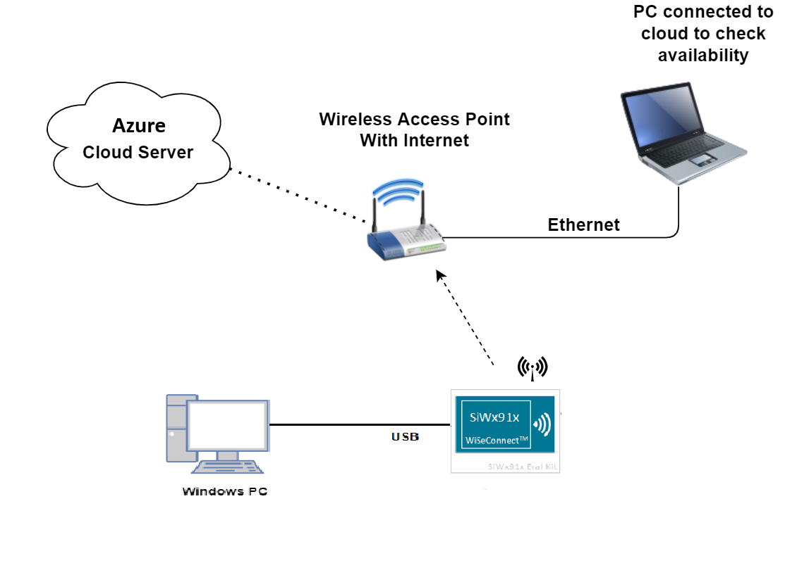

- **NCP:**

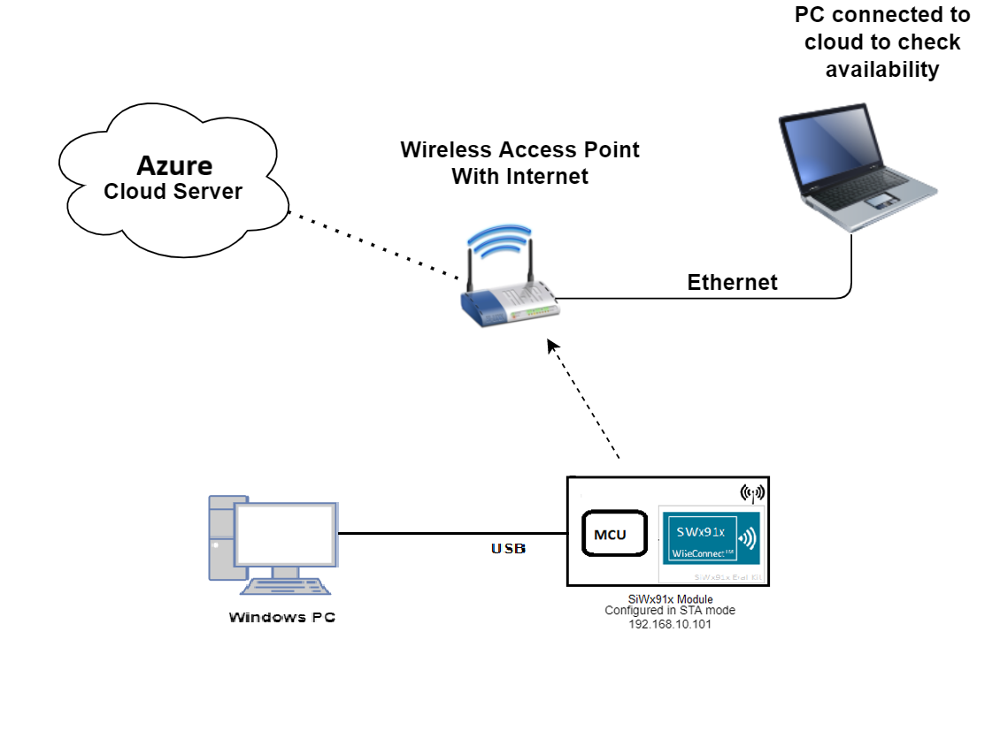

## **4 Set up**
### **4.1 SoC/NCP** 
- Follow the [Hardware connections and Simplicity Studio IDE Set up]()  section in the respective ***Getting Started with SiWx91x*** guides to make the hardware connections and add the Gecko and SiWx91x COMBO SDKs to Simplicity Studio IDE.
### **4.2 SiWx91x module's Firmware Update**
- Ensure the SiWx91x module is loaded with the latest firmware following the [SiWx91x Firmware Update]() section in the respective ***Getting started with SiWx91x*** guides.

## **5 Creation of Project**
  
To create the project in the Simplicity Studio IDE, follow the [Creation of Project]() section in the respective ***Getting started with SiWx91x*** guides. 
   - For SoC, choose the **Wi-Fi - SoC Azure IoT Pub/Sub Client** example.
   - For NCP, choose the **Wi-Fi - NCP Azure IoT Pub/Sub Client** example.

## **6 Application Configuration**
The application can be configured to suit user requirements and development environment. Read through the following sections and make any changes if needed. 

### **6.1 WLAN configuration**
Configure the following parameters in **rsi_azure_telemetry_c2d.c** to enable Silicon Labs WLAN functionality and connect to WLAN network.

- `SSID` refers to the name of the Access point.

  ```c
  #define SSID                           "SILABS_AP"
  ```

- `SECURITY_TYPE` refers to the type of security. In this application, station supports Open, WPA-PSK, and WPA2-PSK securities.

  Valid configuration is:

   - RSI_OPEN - For OPEN security mode

   - RSI_WPA - For WPA security mode

   - RSI_WPA2 - For WPA2 security mode

  ```c
  #define SECURITY_TYPE                   RSI_WPA2
  ```

- `PSK` refers to the secret key if the Access point is configured in WPA-PSK/WPA2-PSK security modes.

    ```c
    #define PSK                             "1234567890"
    ```

#### **6.2 IP address configuration**

  - `DHCP_MODE` refers to whether IP address configured through DHCP or STATIC

    ```c
    #define DHCP_MODE                        1
    ```

  > **Note:**   
  > If user wants to configure STA IP address through DHCP, then set DHCP_MODE to "1" and skip configuring the following DEVICE_IP, GATEWAY and NETMASK macros.   
  > (Or)    
  > If user wants to configure STA IP address through STATIC then set the DHCP_MODE macro to "0" and configure the following DEVICE_IP, GATEWAY and NETMASK macros.

- `DEVICE_IP` refers to the IP address need to be configured to the RS9116W EVk

   Example: To configure "192.168.10.10" as IP address, update the macro DEVICE_IP as 0x0A0AA8C0.

  ```c
  #define DEVICE_IP                        "192.168.10.101"
  ```

- `GATEWAY` refers to the IP address of the gateway 

  ```c
  #define GATEWAY                          "192.168.10.1"
  ```

- `NETMASK` refers to the IP address of the network mask

  ```c
  #define NETMASK                          "255.255.255.0"
  ```

### **6.3 RTOS configuration**
- The following parameters are configured if OS is used. Application task should be of low priority

  ```c
  #define RSI_APPLICATION_TASK_PRIORITY                   1
  ```
   
- Driver task should have the highest priority among all threads

  ```c
  #define RSI_DRIVER_TASK_PRIORITY                 2
  ```

- MQTT Task stack size is configured by this macro
   
  ```c
  #define RSI_APPLICATION_TASK_STACK_SIZE           512 * 4
  ```

- Driver Task stack size is configured by this macro
   
  ```c
  #define RSI_DRIVER_TASK_STACK_SIZE         512 * 2
  ```

- GLOBAL_BUFF_LEN refers to the memory length for the driver

  ```c
  #define GLOBAL_BUFF_LEN                      15000
  ```

### **6.4 Opermode Command Parameters**
Opermode command parameters in the rsi_wlan_config.h file can be modified as needed
  ```c
  #define CONCURRENT_MODE                  RSI_DISABLE
  #define RSI_FEATURE_BIT_MAP              FEAT_SECURITY_OPEN
  #define RSI_TCP_IP_BYPASS                RSI_DISABLE
  #define RSI_TCP_IP_FEATURE_BIT_MAP       (TCP_IP_FEAT_DHCPV4_CLIENT|TCP_IP_FEAT_SSL |TCP_IP_FEAT_DNS_CLIENT)
  #define RSI_CUSTOM_FEATURE_BIT_MAP       FEAT_CUSTOM_FEAT_EXTENTION_VALID
  #define RSI_EXT_CUSTOM_FEATURE_BIT_MAP   (EXT_FEAT_256K_MODE | BIT(1) | BIT(3) | BIT(27))
  #define RSI_BAND                         RSI_BAND_2P4GHZ
  ```

#### **6.5 Power save configuration**

  - Configure below parameter in the rsi_azure_telemetry_c2d.c file to enable/disable power save mode.
    ```c
    #define ENABLE_POWER_SAVE              0
    ```

#### **6.6 Azure connection configuration**
- Configure below parameters in the azure_iot_config.h file

  ```c
  #define MAX_NW_RETRY_COUNT  5      ///< Network retry count value
  #define MAX_NTP_RETRY_COUNT 5      ///< NTP retry count value
  #define RECV_TIMEOUT_VAL    5000   ///< rsi_recv() Time Out in ms
  #define TIMEOUT_VAL_NTP_MS  1000   ///< NTP Time Out in ms
  #define NTP_SERVER_PORT     123    ///< NTP Port
  #define DNS_REQ_COUNT       5      ///< DNS REQUEST retry Count
  #define MQTT_KEEPALIVE_VAL  4 * 60 ///< MQTT Keepalive value
  ```
- `CONNECTION_STRING` is obtained from Azure IoT Hub. 
- Update the connection string in `azure_iot_config.h` with 
   - Primary key of the IoT Device for Symmetric key authentication
    > For example : "HostName=example.azure-devices.net;DeviceId=example_Device_SymKey;SharedAccessKey=TAEw6g7gEJh6zB74ykuiUnA8UbUhsSApuqFIgd/YB6Y="

   - Connection string for IoT Device with X.509 self-signed authentication

  > For example : "HostName=example.azure-devices.net;DeviceId=example_Device_SelfSign;x509=true"

> **Note:** Connection string can be generated as specified in Appendix section **Register a New X.509 Authenticated Device with IoT Hub** for X509 and for Symmetric Key follow  **Register IoT Device with symmetric key authentication in IoT Hub** section.

5. By default, the application tries to connect to Azure Hub using X.509 self-signed authentication mechanism.
  ```c
  #define CONNECTION_STRING \
  "HostName=xxxxxxx.azure-devices.net;DeviceId=xxxxx_Device_SelfSign;x509=true" ///< Connection string
  ```
  ```c
  #define MESSAGE_COUNT \
  5 ///< Number of D2C messages sent to Azure Hub and also minimum number of C2D messages to be received by application
  #define CLIENT_PORT 4002 ///< Client port
  ```

#### **6.7 Certificate loading**

  **rsi\_wlan\_set\_certificate()** API expects the certificate in the form of linear array. Convert the pem certificate into linear array form using the python script provided in the SDK `<SDK>/resources/certificates/certificate_script.py`.

  For example, if the certificate is ca-certificate.pem, enter the command in the following way:
  ```c
  python certificate_script.py ca-certificate.pem 
  ```
  The script will generate ca-certificate.pem in which one linear array named ca-certificate contains the certificate.   
  Root CA certificate, Device private key and Device client certificate needs to be converted as mentioned above.

After the conversion, place the converted files in `<SDK>/resources/certificates/` path and include the certificate files in rsi_azure_telemetry_c2d.c

- Replace the default Device certificate and Private key certificate in the application with the converted pem file name.

   ```c
   // Certificate includes
   #include "azure_client_certificate.pem.crt.h"
   #include "azure_client_private_key.pem.key.h"
   #include "azure_baltimore_ca.pem.h"
   ```

- Replace the default Device certificate and Private key certificate given in `rsi_wlan_set_certificate()` API in the application with the converted pem array.

   ```c
   // Load Security Certificates
   status = rsi_wlan_set_certificate(RSI_SSL_CLIENT, azure_client_certificate, (sizeof(azure_client_certificate) - 1));
  
   status =
   rsi_wlan_set_certificate(RSI_SSL_CLIENT_PRIVATE_KEY, azure_client_private_key, (sizeof(azure_client_private_key) - 1));
   ```

> **NOTE:**     
> The default application is made to support **x.509 Authentication** mechanism, which needs three certificates i.e. `azure_baltimore_ca`, `azure_client_certificate`, `azure_client_private_key`.  
> For **Symmetric Key Authentication**, only CA certificate is to be loaded. Please comment out the lines of code to load `client certificate` and `client private key`

> **NOTE :**    
> For Azure connectivity, Baltimore Root CA certificate has the highest authority being at the top of the signing hierarchy.
> 
> The Baltimore Root CA certificate is an expected/required certificate which usually comes pre-installed in the operating systems and it plays a key part in certificate chain verification when a device is performing TLS authentication with the IoT endpoint.
> 
> On RS9116 device, we do not maintain root CA trust repository due to memory constraints, so it is mandatory to load Baltimore Root CA certificate for successful mutual authentication to Azure server.
> 
> On RS9116 to authenticate the Azure server, firstly Root CA is validated (validate the Root CA received with the Root CA loaded on the device). Once the Root CA validation is successful , other certificates sent from the Azure server are validated.
> RS9116 don't authenticate to Azure server if intermediate CA certificates are loaded instead of Baltimore Root CA certificate and would result in Handshake error.
> Baltimore Root CA certificate is at https://www.digicert.com/kb/digicert-root-certificates.htm

## **7 Setup for Serial Prints**

To Setup the serial prints, follow the [Setup for Serial Prints]() section in the respective ***Getting started with SiWx91x*** guides.
 
## **8 Build, Flash, and Run the Application**

To build, flash, and run the application project refer to the [Build and Flash the Project]() section in the respective ***Getting Started with SiWx91x*** guide.

## **9 Execution Flow**

1. SiWx917 configured as Wi-Fi STA, connects to the access point with Internet connection in OPEN/WPA-PSK/WPA2-PSK mode
2. Required certificates are loaded, and SiWx917 tries to connect to the Azure IoT hub device using the credentials configured in the application.
3. The SiWx917 upon connection, will send 5 telemetry messages to Azure Hub and waits to receive atleast 5 C2D messages.
4. Following logs will be displayed on the console
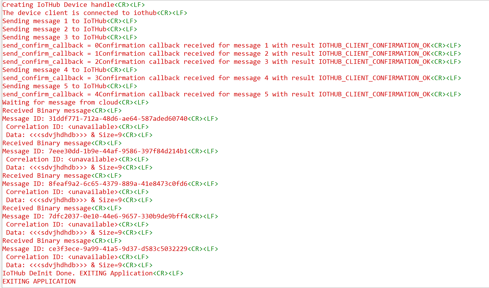
5. Refer to Appendix section **Steps to check Telemetry message on Azure cloud** to check the application sent messages on cloud.
6. Refer to Appendix section **Steps to send c2d message from the cloud** to how to send C2D messages from Azure Hub

### **Note the following :**

   
   **NOTE-1 :**  
   If the requirement is to continue the application flow after SDK De-Init i.e Reconnect to the Azure Hub to send and receive messages, following Steps need to be followed :
  - Change the state variable to RSI_WLAN_IOTHUB_LL_INIT_STATE in state RSI_WLAN_IOTHUB_LL_DEINIT_STATE.
   
  - Add delay of 10 seconds for application to properly terminate the socket connections
      
  - Refer the snippet shared below :
   
   ```c
   case RSI_WLAN_IOTHUB_LL_DEINIT_STATE: {
      IoTHubDeviceClient_LL_Destroy(device_ll_handle);
      IoTHub_Deinit();
      // Reset all the global variables
      messages_sent = 0;
      g_message_count_send_confirmations = 0;
      g_message_recv_count = 0;
      g_continueRunning = true;
      LOG_PRINT("IoTHub DeInit Done. Re-INIT Application\r\n");
      rsi_wlan_app_cb.state = RSI_WLAN_IOTHUB_LL_INIT_STATE ;

      rsi_delay(10000);
      #ifdef RSI_WITH_OS
         rsi_semaphore_post(&rsi_mqtt_sem);
      #endif
      break;
  ```
   **NOTE-2 :**
  - rsi_recv() timeout value is by default configured as 5 seconds (RECV_TIMEOUT_VAL value in azure_iot_config.h)
  - If there is no data from Azure Hub, application thread will be blocked for 5 seconds in rsi_recv()
  - RECV_TIMEOUT_VAL can be modified to value less than 5 seconds to reduce the wait time in rsi_recv()

   **NOTE-3 :**
  - There may be a delay observed in sending MQTT Keepalive packets from the application. 
  - The delay will be observed if application thread is waiting in rsi_recv() (Refer NOTE-2)  when Keepalive timeout expires.
  - The maximum delay obseved will be RECV_TIMEOUT_VAL.
  - Reducing the RECV_TIMEOUT_VAL will reduce the delay seen to send MQTT Keepalive packets.
   

## **Appendix**

***Appendix-1*** : **Azure Account creation and IoT Device Registration**

1.1 ***Azure Account creation***

- Azure offers a free 30-day trail account for all new account holders, later depending on the services you will be charged in [Pay-as-you-go way.](https://azure.microsoft.com/en-in/pricing/)

- You can follow the below steps or refer on [how to create an Azure Account.](https://docs.microsoft.com/en-us/learn/modules/create-an-azure-account/)

  **Step 1:** Navigate to https://azure.microsoft.com/

  **Step 2:** Click on “Free Account” in the top right

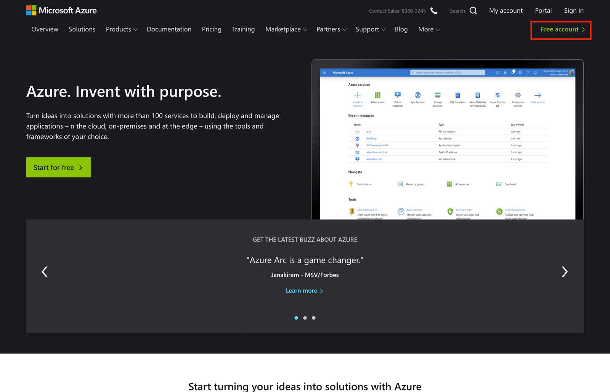

  **Step 3:** Confirm that you wish to "Start for free".


  **Step 4:** Enter the details requested to register to Microsoft Azure account. (Details like email, username, password etc...)

  **Step 5:** Finally, agree to the Microsoft Azure terms and conditions to complete the setup process.


  **Step 6:** At this stage you should be getting an Azure Link for your Azure Account.

You have now successfully created Azure account and you will be able to access all Azure Services.

1.2 ***Azure IoT Hub Creation***

- Follow the steps below or refer [how to create an IoT Hub](https://docs.microsoft.com/en-us/azure/iot-hub/)
- Azure IoT Hub acts as a Gate way between IoT Devices and Azure Cloud Services
- Lets create a new IoT Hub service

  **Step 1:** Login to your Azure account here https://portal.azure.com/#home


  **Step 2:** Search for “IoT Hub” or Click on the “Create a resource icon”


  **Step 3:** Search for “IoT Hub” in the marketplace


  **Step 4:** This will open a page given below, select “Create”

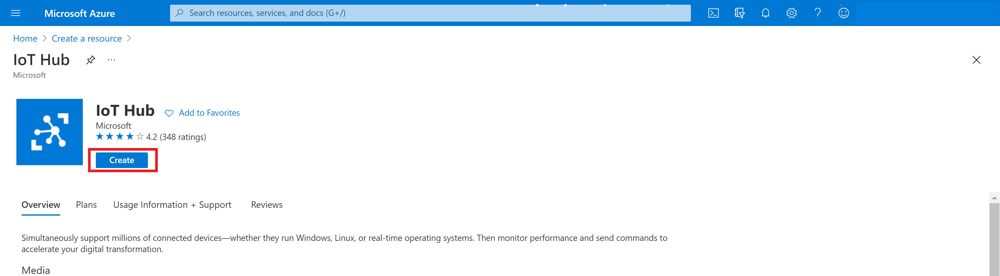

  **Step 5:** Update the Basic details with below information

  - ***Subscription:*** Select the subscription to use for your hub.

  - ***Resource Group:*** Select a resource group or create a new one. To create a new one, select Create new and fill in the name you want to use. To use an existing resource group, select that resource group.

  - ***Region:*** Select the region in which you want your hub to be located. Select the location closest to you.

  - ***IoT Hub Name:*** Enter a name for your hub. This name must be globally unique.

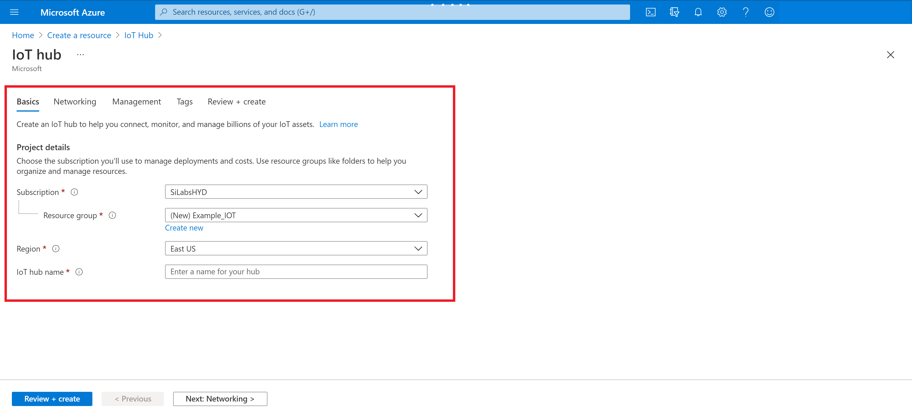

  **Step 6:** Next update the Networking details to continue creating your hub.

  - Choose the endpoints that can connect to your IoT Hub. You can select the default setting **Public endpoint (all networks)**, or choose **Public endpoint (selected IP ranges)**, or **Private endpoint**. Accept the default setting for this example.

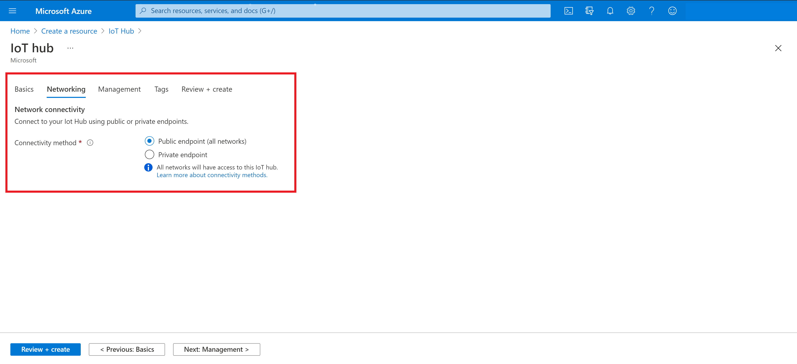

  **Step 7:** Next, update the Management deatils to continue creating your hub.

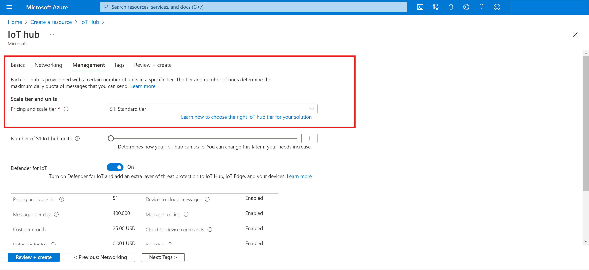

  Select your required Azure IoT Hub tier.

  **Step 8:** Skip “Tags”

  **Step 9:** Next click on Review and Create > Create

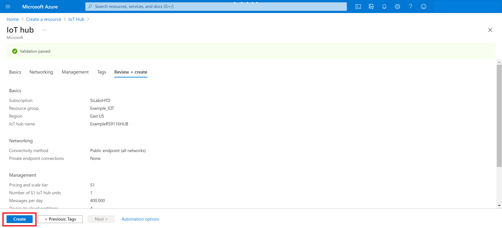

  This should create your IoT Hub.

  **Step 10:**  In the Azure Portal you should see your IoT Hub resource

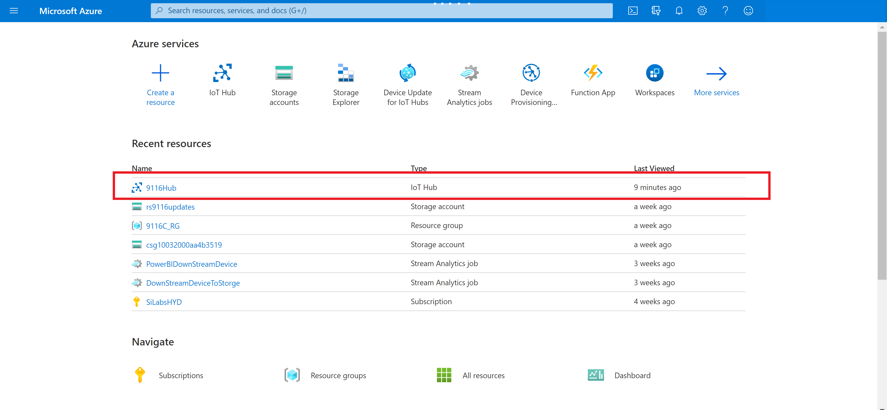

We have IoT Hub ready, Next steps will walk through Device creation and attaching device to IoT Hub.

1.3 ***IoT Device registration***

1.3.1 - ***Register IoT Device with symmetric key authentication in IoT Hub:***

 Create a device identity in the identity registry in your IoT hub. A device cannot connect to a hub unless it has an entry in the identity registry.
 
 Follow the steps below or refer Register a [device with Symmetric Key](https://docs.microsoft.com/en-us/azure/iot-edge/how-to-authenticate-downstream-device?view=iotedge-2021-11#register-device-with-iot-hub)

   **Step 1:**  Navigate to your IoT Hub resource,

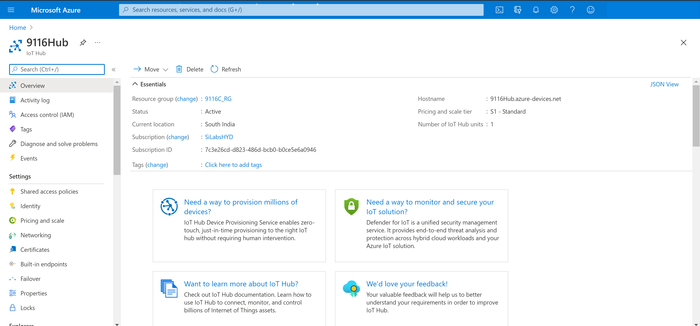

  **Step 2:** Open “IoT Devices” and select “New” to register a device.

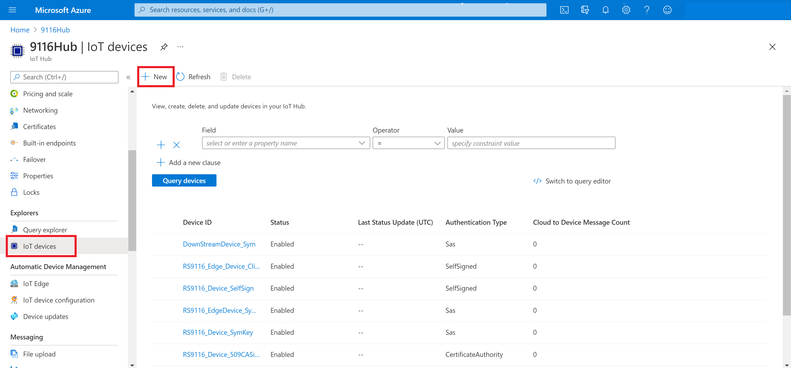

  **Step 3:** In **Create a device,** provide a name for your new device and select authentication type as "Symmetric key" and Save. This action creates a device identity for your IoT hub.

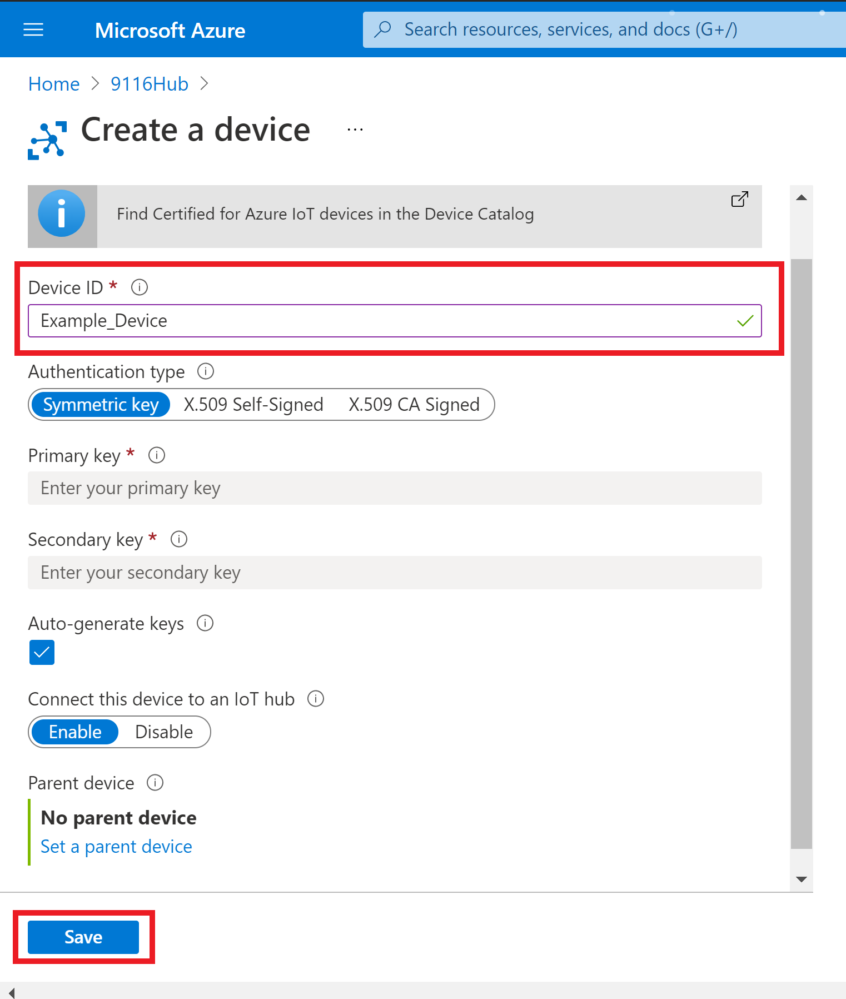

  **Step 4:** After the device is created, open the device from the list in the **IoT devices** pane. Select Device created  and copy the **Primary Connection String** for use later.

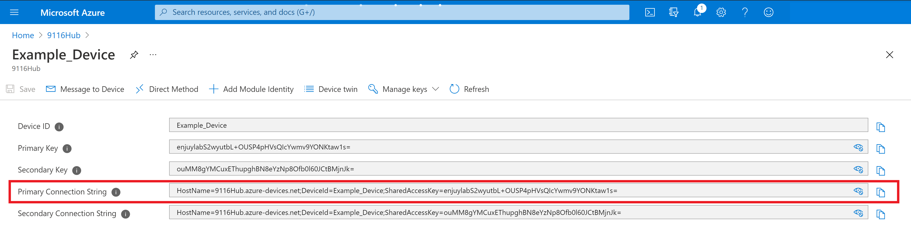

  **Step 5:** The primary connection string is used in application to connect device to IoT Hub.

Device is now successfully registered to IoT Hub with Symmetric key authentication type.

1.3.2 - ***Register a New X.509 Authenticated Device with IoT Hub***

 For X.509 self-signed authentication, sometimes referred to as thumbprint authentication, you need to create certificates to place on your device. These certificates have a thumbprint in them that you share with IoT Hub for authentication.
 
 Follow the steps below or refer to the [Register a X.509 Device](https://docs.microsoft.com/en-us/azure/iot-edge/how-to-authenticate-downstream-device?view=iotedge-2021-11#x509-self-signed-authentication)

  **Step 1:** Generating X509 Self Signed certificates

Generate the IoT device's x509 Certificate and the Private Key Certificate by using the below OpenSSL command from a Powershell window

   `Openssl req -newkey rsa:2048 -nodes -keyout mydevkitkey.pem -x509 -days 365 -out mydevkitcertificate.pem`

  - `mydevkitkey.pem` is the Private Key file
  - `mydevkitcertificate.pem` is the x509 device certificate file
 
 **Step 2:** Capture the x509 certificate's Fingerprint either SHA1 or SHA256 type.[your choice]
 
  command for SHA-1 : openssl x509 -in mydevkitcertificate.pem -fingerprint -noout.
 
  Command for SHA-256 : openssl x509 -in mydevkitcertificate.pem -fingerprint -noout -sha256
 
  Copy the fingerprint hexadecimal number with 40 length [have considered SHA1 type].
 
  Remove the **':'** from the fingerprint and it will look as shown below : 

  `3989467851D9C76811C3B1DF939AE0A103E838CA`

  **Step 3:** Go to Azure Portal-IoTHub to create new device with authentication type as X.509 Self-signed

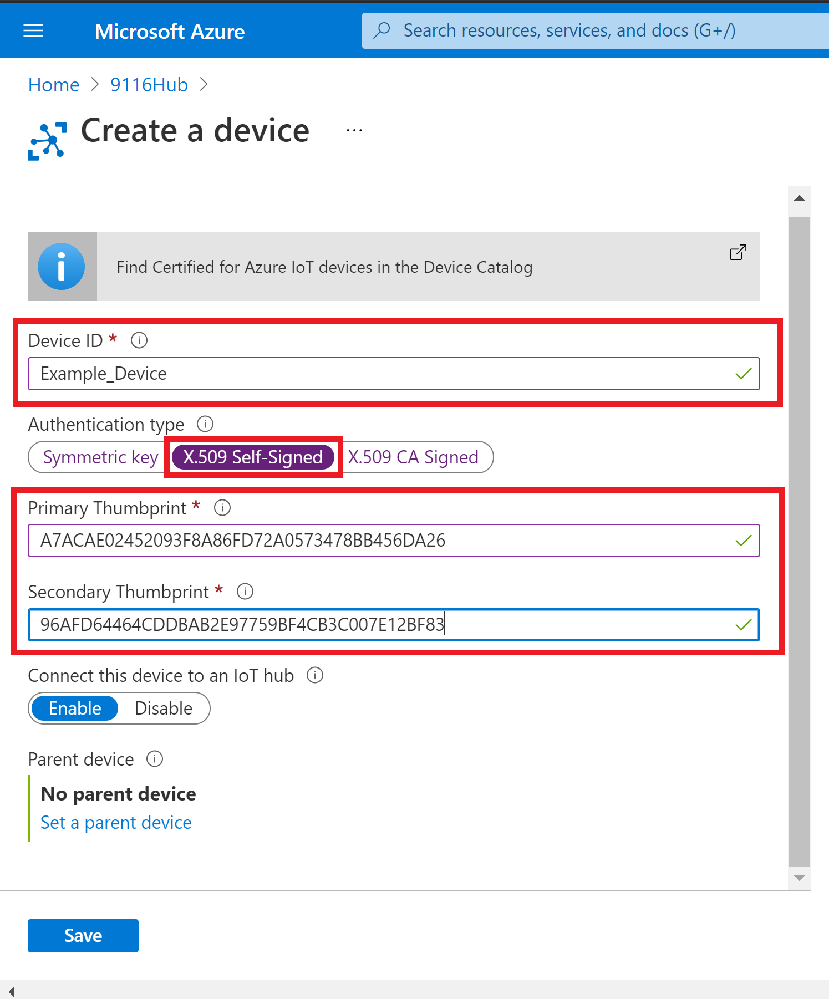

  **Step 4:** Connection string to be given in the application should be as follows

  `HostName=<Hub name>;DeviceId=<Device id(myselfsigned)>;x509=true`

   Device is now successfully registered with the IoT Hub with X.509 self signed authentication type.

***Appendix-2*** : **Steps to check Telemetry message on Azure cloud**

   - Login to Azure portal.

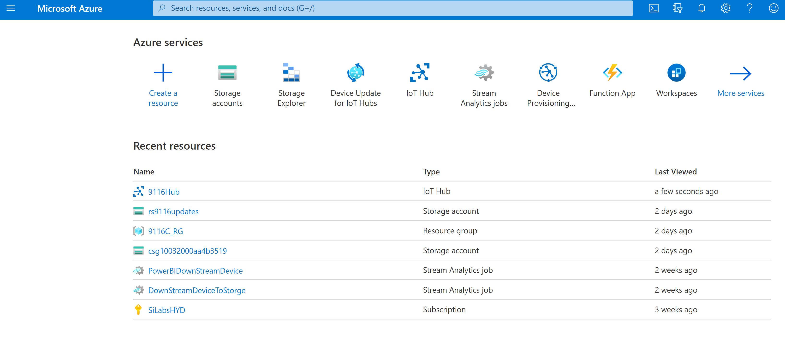
- Click on Cloud shell in the portal.

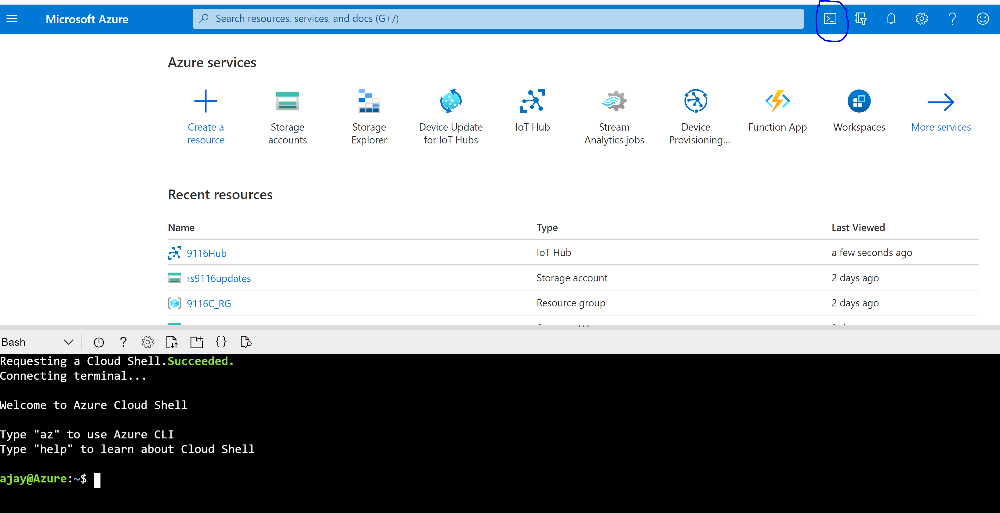

- To check the telemetry message sent from application, type the below command in the shell:

  az iot hub monitor-events --hub-name {YourIoTHubName} --output table
- The received telemetry message will be displayed as follows
  
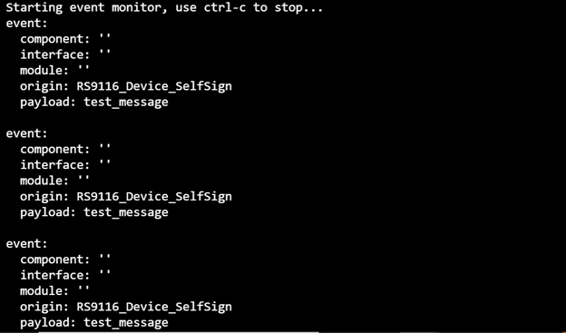

***Appendix-3*** : **Steps to send c2d message from the cloud**

- az iot hub monitor-events --hub-name 9116Hub --output table

- Login to Azure portal.

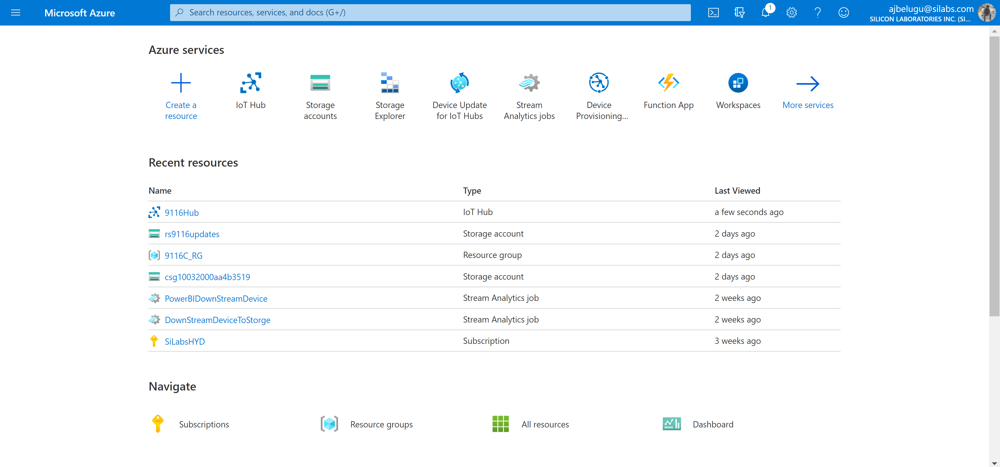
  
- Go to the Hub that the device is created in

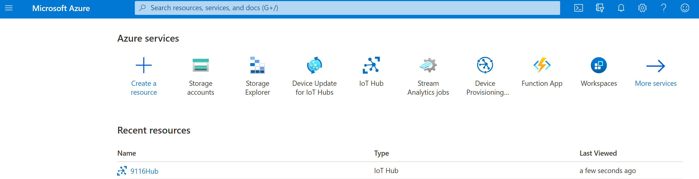

- Click on Cloud shell in the portal.


   
- To send C2D message from the cloud, type the below command in the azure cli:
az iot device c2d-message send -d {YourDeviceName} -n {YourIoTHubName} --data "sdvjhdhdb"

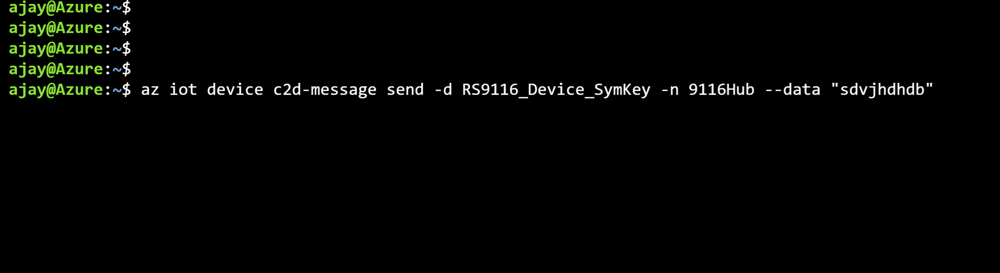

- The device upon receiving the messages will display on the terminal.


