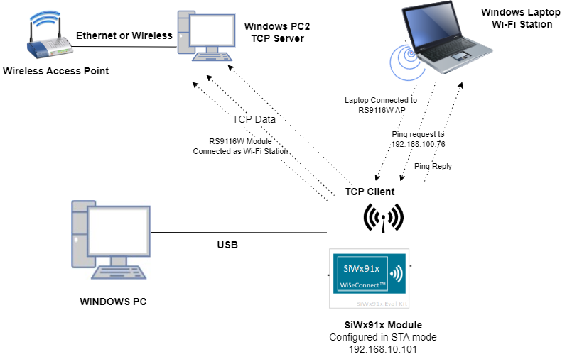
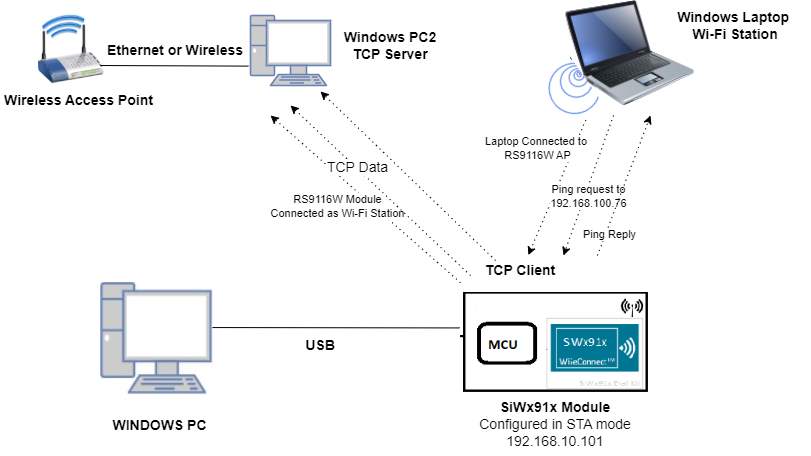
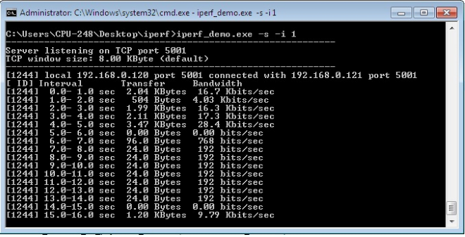

# Concurrent Mode

## 1. Purpose / Scope

This application demonstrates how to configure the SiWx91x EVK in both Wi-Fi Station mode and Access Point mode and how to transfer data in both modes.

## 2. Prerequisites / Setup Requirements

Before running the application, the user will need the following things to setup.

### 2.1 Hardware Requirements

* A Windows PC.
* SiWx91x Wi-Fi Evaluation Kit. The SiWx91x supports multiple operating modes. See [Operating Modes]() for details.
  - **SoC Mode**:
      - Silicon Labs [BRD4325A](https://www.silabs.com/)
  - **NCP Mode**:
      - Silicon Labs [(BRD4180A, BRD4280B)](https://www.silabs.com/); **AND**
      - Host MCU Eval Kit. This example has been tested with:
         - Silicon Labs [WSTK + EFR32MG21](https://www.silabs.com/development-tools/wireless/efr32xg21-bluetooth-starter-kit)
         - Silicon Labs [WSTK + EFM32GG11](https://www.silabs.com/development-tools/mcu/32-bit/efm32gg11-starter-kit)
* Wireless Access Point.
* Windows PC2 (Remote PC) with iperf application.
* Windows PC with Wifi Station.

#### SoC Mode : 


  
#### NCP Mode :  



### 2.2 Software Requirements

- [WiSeConnect SDK](https://github.com/SiliconLabs/wiseconnect-wifi-bt-sdk/) 
- Embedded Development Environment

   - For Silicon Labs EFx32, use the latest version of [Simplicity Studio](https://www.silabs.com/developers/simplicity-studio)

- [Iperf Application](https://iperf.fr/iperf-download.php) in Windows PC (Remote PC)

### 2.3 Project Setup
  - **SoC Mode**:
      - **Silicon Labs SiWx91X SoC** Follow the  [Getting Started with SiWx91x SoC](https://www.silabs.com/) to setup the example to work with SiWx91x SoC and Simplicity studio.
  - **NCP Mode**:
      - **Silicon Labs EFRx32 Host** Follow the [Getting started with EFx32](https://docs.silabs.com/rs9116-wiseconnect/latest/wifibt-wc-getting-started-with-efx32/) to setup the example to work with EFx32 and Simplicity Studio.
## 3. Application Build Environment

### 3.1 Project Setup

The Application can be built and executed on below Host platforms
* [WSTK + EFR32MG21](https://www.silabs.com/development-tools/wireless/efr32xg21-bluetooth-starter-kit) 
* [WSTK + EFM32GG11](https://www.silabs.com/development-tools/mcu/32-bit/efm32gg11-starter-kit)

### 3.2 NCP Mode - Host Interface 

* By default, the application is configured to use the SPI bus for interfacing between Host platforms(EFR32MG21) and the SiWx91x EVK.
* This application is also configured to use the SDIO bus for interfacing between Host platforms(EFM32GG11) and the SiWx91x EVK.


### 3.3 Bare Metal/RTOS Support

This application supports bare metal and RTOS environment. By default, the application project files (Keil and Simplicity studio) are provided with bare metal configuration in the SDK.

## 4. Application Configuration Parameters

The application can be configured to suit user requirements and development environment. Read through the following sections and make any changes needed.

### 4.1 Open rsi_concurrent_mode.c file

#### 4.1.1 User must update the below parameters  

SSID refers to the name of the Access point.

```c
#define SSID                          "SILABS_AP"
```

STA_SECURITY_TYPE refers to the type of security. In concurrent mode STA supports Open, WPA and WPA2 securities.

Valid configurations are:

   - RSI_OPEN - For OPEN security mode

   - RSI_WPA - For WPA security mode

   - RSI_WPA2 - For WPA2 security mode

```c
#define STA_SECURITY_TYPE             RSI_WPA2
```

STA_PSK refers to the STA secret key to connect with the secured Access Point.

```c
#define STA_PSK                       "1234567890"
```

DEVICE_PORT port refers internal TCP client port number

```c
#define DEVICE_PORT                        5001
```

REMOTE_PORT port refers remote TCP server port number which is opened in Windows PC2.

```c
#define REMOTE_PORT                        5001
```

SERVER_IP_ADDRESS refers remote peer (Windows PC2) IP address to connect with TCP server socket.

   IP address should be in long format and in little endian byte order.

   Example: To configure "192.168.0.100" as remote IP address, update the macro **SERVER_IP_ADDRESS** as **0x6400A8C0**.

```c
#define SERVER_IP_ADDRESS                  0x6400A8C0
```

#### 4.1.2 The desired parameters are provided below. User can also modify the parameters as per their needs and requirements.

AP_SSID refers to the name of the WiSeConnect Access point would be created.

```c
#define AP_SSID                       "SILABS_AP"
```

AP_CHANNEL_NO refers to the channel in which AP would be started

```c
#define AP_CHANNEL_NO                 11
```

> Note: 
> 1. Valid values for CHANNEL_NO are 1 to 11 in 2.4GHz band and 36 to 48 & 149 to 165 in 5GHz. In this example default configured band is 2.4GHz. If user wants to use 5GHz band then user has to set RSI_BAND macro to 5GHz band in rsi_wlan_config.h file.
> 2. In concurrent mode, STA and AP should be configured in same channel. Configure the AP_CHANNEL_NO to same channel in which Wireless Access point (to which WiSeConnect STA connects) exist.

AP_SECURITY_TYPE refers to the security type of the WiSeConnect Access Point. Access point supports OPEN, WPA-PSK, WPA2-PSK security modes.

   Valid configurations are:

   - RSI_OPEN - For OPEN security mode

   - RSI_WPA - For WPA security mode

   - RSI_WPA2 - For WPA2 security mode

```c
#define SECURITY_TYPE                   RSI_WPA2
```

AP_ENCRYPTION_TYPE refers to the type of Encryption method .Access point supports OPEN, TKIP and CCMP methods.

Valid configurations are:

   - RSI_CCMP - For CCMP encryption

   - RSI_TKIP - For TKIP encryption

   - RSI_NONE - For open encryption

```c
#define AP_ENCRYPTION_TYPE                RSI_CCMP
```

AP_PSK refers to the secret key if the Access point to be configured in WPA/WPA2-PSK security modes.

```c
#define AP_PSK                           “1234567890”
```

BEACON_INTERVAL refers to the time delay between two consecutive beacons in milliseconds in AP mode. Allowed values are integers from 100 to 1000 which are multiples of 100.

```c
#define BEACON_INTERVAL                    100
```

DTIM_INTERVAL refers DTIM interval of the Access Point. Allowed values are from 1 to 255.

```c
#define DTIM_INTERVAL                       4
```

NUMEBR_OF_PACKETS refers how many packets to send from TCP client to TCP server

```c
#define NUMBER_OF_PACKETS                 1000
```

DHCP_MODE refers whether IP address configured through DHCP or STATIC in STA mode

```c
#define DHCP_MODE                         1
```

> Note:
> If user wants to configure STA IP address through DHCP then set DHCP_MODE to 1 and skip configuring the following DEVICE_IP, GATEWAY and NETMASK macros.
> (Or)
> If user wants to configure STA IP address through STATIC then set DHCP_MODE macro to "0" and configure following DEVICE_IP, GATEWAY and NETMASK macros.

IP address to be configured to the device in STA mode should be in long format and in little endian byte order.

   Example: To configure "192.168.0.10" as IP address, update the macro DEVICE_IP as 0x010AA8C0.

```c
#define DEVICE_IP                       0X0A00A8C0
```

IP address of the gateway should also be in long format and in little endian byte order.

   Example: To configure "192.168.0.1" as Gateway, update the macro GATEWAY as 0x0100A8C0

```c
#define GATEWAY                         0x0100A8C0
```

IP address of the network mask should also be in long format and in little endian byte order

   Example: To configure "255.255.255.0" as network mask, update the macro NETMASK as 0x00FFFFFF

```c
#define NETMASK                         0x00FFFFFF
```

> Note:
> 1. This application is not providing the facility to configure the Access Point’s IP Parameters. Default IP address of the Silicon Labs Access point is “192.168.100.76”
> 2. In concurrent mode, IP networks of Silicon Labs STA and Silicon Labs Access  Point both should be different. Configure Wireless Access Point IP network(Ex: 192.168.0.1) other than Silicon Labs Access point IP network.

### 4.2 Open rsi_wlan_config.h file.User can also modify the below parameters as per their needs and requirements.


```c
#define CONCURRENT_MODE                 RSI_ENABLE
#define RSI_FEATURE_BIT_MAP             FEAT_SECURITY_PSK
#define RSI_TCP_IP_BYPASS               RSI_DISABLE
#define RSI_TCP_IP_FEATURE_BIT_MAP      (TCP_IP_FEAT_DHCPV4_SERVER | TCP_IP_FEAT_DHCPV4_CLIENT)
#define RSI_CUSTOM_FEATURE_BIT_MAP      0
#define RSI_EXT_CUSTOM_FEAT_BIT_MAP     0
#define RSI_BAND                        RSI_BAND_2P4GHZ
```

**Power save configuration**

   - By default, the application is configured without power save.

```c
#define ENABLE_POWER_SAVE 0
```
   - If user wants to run the application in power save, modify the below macro.

```c
#define ENABLE_POWER_SAVE 1
```

## 5. Testing the Application

Follow the steps below for the successful execution of the application.

### 5.1 Loading the SiWx91x Firmware

Refer [Getting started with a PC](https://docs.silabs.com/rs9116/latest/wiseconnect-getting-started) to load the firmware into SiWx91x EVK. The firmware file is located in `<SDK>/firmware/`

### 5.2 Creating the Project and builing the Application


Refer [Getting started with EFX32](https://docs.silabs.com/rs9116-wiseconnect/latest/wifibt-wc-getting-started-with-efx32/), for settin-up EFR & EFM host platforms

#### 5.2.1 Project Creation - SoC Mode : 

- Connect your board. The Si917 compatible SoC board is **BRD4325A**.
- Studio should detect your board. Your board will be shown here.


#### 5.2.2 Project Creation - NCP Mode : 

- Connect your board. The supported NCP boards are: **BRD4180A,BRD4280B**
- Studio should detect your board. Your board will be shown here.


#### 5.2.3 Selecting an example application and generate project

- Go to the 'EXAMPLE PROJECT & DEMOS' tab and select your desired example application

- Click 'Create'. The "New Project Wizard" window appears. Click 'Finish'


#### 5.2.4 Build Project - SoC Mode

- Once the project is created, right click on project and go to properties → C/C++ Build → Settings → Build Steps
- Add post_build_script_SimplicityStudio.bat file path (SI917_COMBO_SDK.X.X.X.XX\utilities\isp_scripts_common_flash) in build steps settings as shown in below image.

- Check for M4 projects macros in preprocessor settings(RSI_M4_INTERFACE=1)
- Check for 9117 macro in preprocessor settings(CHIP_9117=1).
- Click on the build icon (hammer) to build the project

- Successful build output will show as below.


#### 5.2.5 Build Project - NCP Mode :

- Check for 9117 macro in preprocessor settings(CHIP_9117=1).
- Click on the build icon (hammer) to build the project

- Successful build output will show as below.


## 6. Program the device

Once the build was successfull, right click on project and click on Debug As->Silicon Labs ARM Program as shown in below image.
### SoC Mode :

### NCP Mode : 


### 6.1 Running the SiWx91x Application


1. Configure the access point in OPEN/WPA-PSK/WPA2-PSK mode to connect SiWx91x EVK in STA mode.

2. Open iperf application in Windows PC2(Remote PC) command prompt which is connected to the access point
3. Open TCP server using the below command in command prompt.

  `iperf.exe –s -p <SERVER_PORT> -i 1`

4. After the program gets executed, SiWx91x EVK connects to the access point.

5. On other side, SiWx91x EVK acts as an access point with provided configurations in **Section 4.1.2**

6. After successful connection in STA mode, SiWx91x EVK connects to TCP server socket opened on Windows PC2 (Remote PC) using TCP client socket and sends configured NUMBER_OF_PACKETS to remote TCP server. Refer the below image for reception of TCP data on TCP server.



7. Connect Windows PC with Wifi station to SiWx91x EVK access point

8. After successful connection, open command prompt inWindows PC with WiFi station and initiate ping by using below command

  `ping <SiWx91x EVK ip address> -t`

9. The SiWx91x EVK access point gives Ping reply for the received Ping Request. The below image depicts the ping success.


## 7. Observing the output prints on serial terminal

### 7.1 SoC Mode:
> Connect USB to UART connector Tx and GND pins to WSTK radio board.

   - Connect Tx(Pin-6) to P27 on WSTK
   - Connect GND(Pin 8 or 10) to GND on WSTK

> Prints can see as below in any Console terminal


### 7.2 NCP Mode:
Prints can see as below in any Console terminal


## 8. Selecting Bare Metal
The application has been designed to work with FreeRTOS and Bare Metal configurations. By default, the application project files (Simplicity studio) are configured with FreeRTOS enabled. The following steps demonstrate how to configure Simplicity Studio to test the application in a Bare Metal environment.

### 8.1 Bare Metal with Simplicity Studio
> - Open the project in Simplicity Studio
> - Right click on the project and choose 'Properties'
> - Go to 'C/C++ Build' | 'Settings' | 'GNU ARM C Compiler' | 'Symbols' and remove macro 'RSI_WITH_OS=1'
> - Select 'Apply' and 'OK' to save the settings

 

