# Concurrent Mode

## 1 Purpose/Scope

This application demonstrates how to configure the SiWx91x in concurrent mode i.e., in both Wi-Fi Station mode (STA instance) and Access Point mode (SoftAP instance) and how to transfer data in both modes.
In this example application, the SiWx91x's STA instance gets connected to a wireless Access Point and gets an IP address. A TCP client socket is opened on the SiWx91x's STA instance, connected to a remote TCP server and the data is sent to the TCP server. 
An external device gets connected to the SiWx91x SoftAP instance and pings to the SoftAP instance. 

## 2 Prerequisites/Setup Requirements

Before running the application, the user will need the following things to setup.

### 2.1 Hardware Requirements

- **SoC Mode**: [Silicon Labs EFR32xG21 Starter Kit with Wireless Gecko](https://www.silabs.com/) (SLSWSTK6006A Base board: BRD4001A/BRD4002A, Radio board: BRD4325A)

- **NCP Mode**: 
   - [SiWx91x Wi-Fi Expansion Board](https://www.silabs.com/)
   - A Host MCU. This example application has been tested with the following host MCUs.

     - [Silicon Labs EFR32xG21 Starter Kit with Wireless Gecko](https://www.silabs.com/development-tools/wireless/efr32xg21-bluetooth-starter-kit) (SLSWSTK6006A Base board: BRD4001A, Radio board: BRD4180a or BRD4180b)

     - [Silicon Labs EFM32GG11 Starter Kit with Wireless Gecko](https://www.silabs.com/development-tools/mcu/32-bit/efm32gg11-starter-kit) (SLSTK3701A Base board: BRD2204A)

- Wireless Access Point

- Windows PC1 (for running TCP server)

- Windows PC2 (utility station for connecting to SoftAP)

### 2.2 Software Requirements

- Simplicity Studio IDE 

   - Download the [Simplicity Studio IDE](https://www.silabs.com/developers/simplicity-studio).

   - Follow the [Simplicity Studio user guide](https://docs.silabs.com/simplicity-studio-5-users-guide/1.1.0/ss-5-users-guide-getting-started/install-ss-5-and-software#install-ssv5) to install Simplicity Studio IDE.

- [Silicon Labs Gecko SDK](https://github.com/SiliconLabs/gecko_sdk)

- [Si917 COMBO SDK](https://github.com/SiliconLabs/)

**NOTE:**

- This example application supports Bare metal and FreeRTOS configurations.

## 3 Set up

#### 3.1 SoC Mode 

Set up diagram for SoC mode:

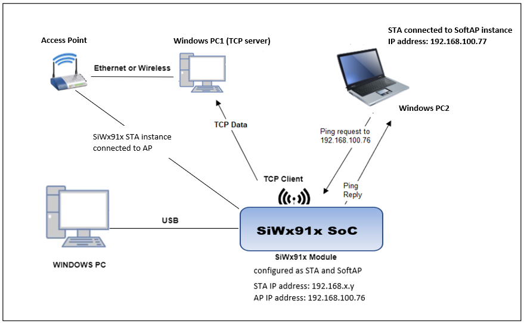

Follow the [Getting Started with SiWx91x SoC](https://docs.silabs.com/) guide to set up the hardware connections and Simplicity Studio IDE.
  
#### 3.2 NCP Mode  

Set up diagram for NCP mode:

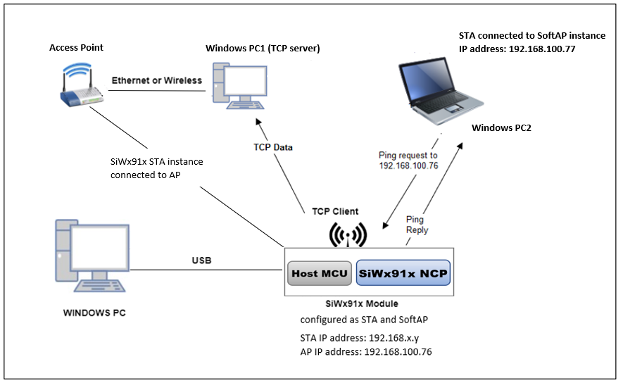

Follow the [Getting Started with EFx32](https://docs.silabs.com/rs9116-wiseconnect/latest/wifibt-wc-getting-started-with-efx32/) guide to setup the hardware connections and Simplicity Studio IDE.

**NOTE**: 
- The Host MCU platform (EFR32MG21) and the SiWx91x interact with each other through the SPI interface. 
- The Host MCU platform (EFM32GG11) and the SiWx91x interact with each other through the SDIO interface.

## 4 Application Build Environment

1. Ensure the SiWx91x is loaded with the latest firmware following the [Getting started with a PC](https://docs.silabs.com/rs9116/latest/wiseconnect-getting-started). The firmware file is located at **< Si917 COMBO SDK > → connectivity_firmware**.

2. Ensure the EFx32 and SiWx91x set up is connected to your PC.

### 4.1 Board detection

### 4.1.1 SoC mode
1. In the Simplicity Studio IDE, 
    - The 917 SoC board will be detected under **Debug Adapters** pane as shown below.

      **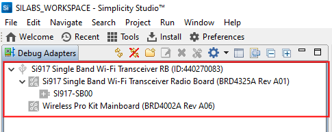**

### 4.1.2 NCP mode

1. In the Simplicity Studio IDE, 
    - The EFR32 board will be detected under **Debug Adapters** pane as shown below.

      ****

    - The EFM32 board will be detected under **Debug Adapters** pane as shown below.

      ****

### 4.2 Creation of project

Ensure the latest Gecko SDK along with the extension Si917 COMBO SDK is added to Simplicity Studio.

1. Click on the board detected and go to **EXAMPLE PROJECTS & DEMOS** section.

   ****

2. Filter for Wi-Fi examples from the Gecko SDK added. For this, check the *Wi-Fi* checkbox under **Wireless Technology** and *Gecko SDK Suite* checkbox under **Provider**. 

3. Under **Device Type**, for SoC based example, check the *SoC* checkbox and for NCP based example, check the *NCP* checkbox.

4. Now choose **Wi-Fi- NCP Concurrent Wi-Fi client and SoftAP** example for NCP mode or choose **Wi-Fi- SoC Concurrent Wi-Fi client and SoftAP** example for SoC mode and click on **Create**.

For NCP mode:

**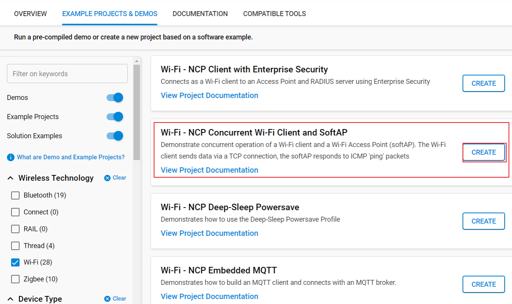**

For SoC mode:
      
**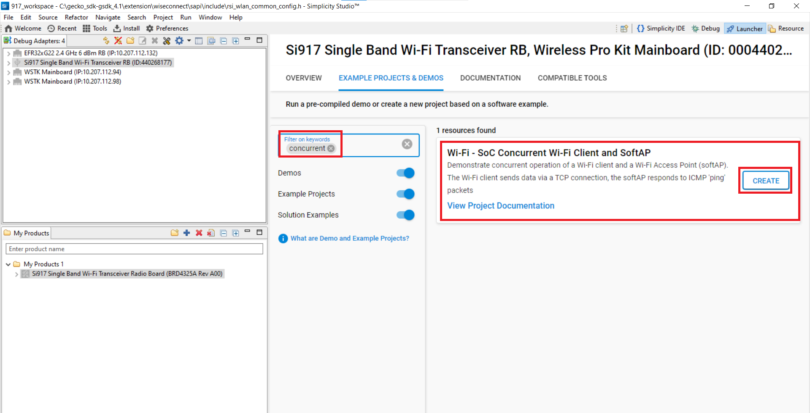**

5. Give the desired name to your project and cick on **Finish**.

**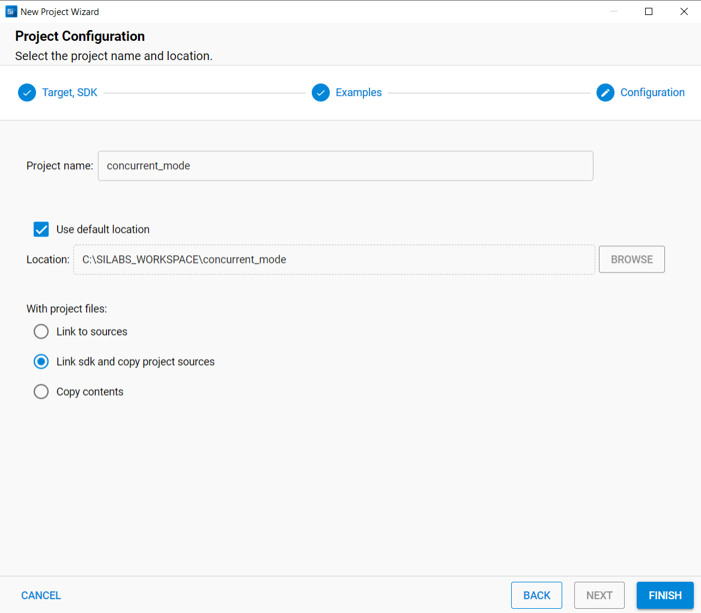**

### 4.3 Application Configurations

The application can be configured to suit user requirements and development environment. Read through the following sections and make any changes needed.

1. In the Project explorer pane, expand the **concurrent_mode** folder and open the **rsi_concurrent_mode.c** file. Configure the following parameters based on your requirements.

   **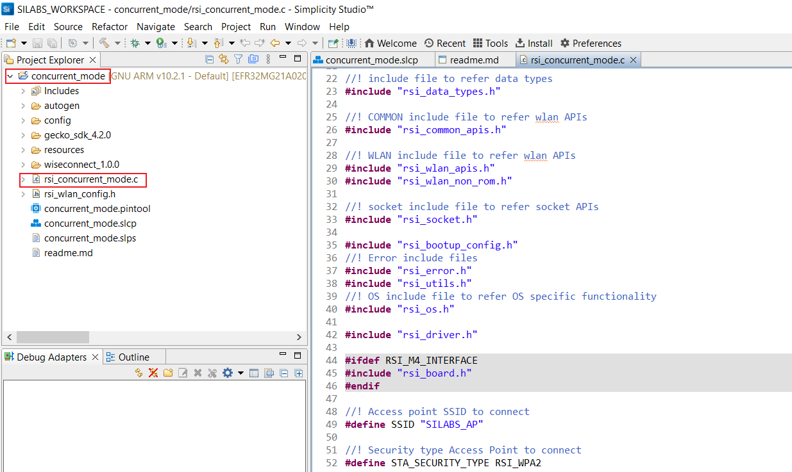**

- **STA instance related parameters**

   - SSID refers to the name with which the SiWx91x SoftAP's Wi-Fi network shall be advertised.

     ```c
     #define SSID                                    "SILABS_AP"      
     ```
   - AP_SECURITY_TYPE refers to the security type of the WiSeConnect Access Point. Access point supports OPEN, WPA-PSK, WPA2-PSK security modes.

     ```c 
     #define SECURITY_TYPE                            RSI_WPA2 
     ```
   - PSK refers to the secret key if the Access point is configured in WPA-PSK/WPA2-PSK security modes.

     ```c 
     #define PSK                                      "12345678" 
     ```

   -  DHCP_MODE refers to whether the IP assignment of SiWx91x is done statically or through DHCP.
      
      1  - DHCP_MODE

      0  - Static IP assignment
   
      ```c
      #define DHCP_MODE                                     1
      ```

   - If you want the IP address to be assigned statically, then set DHCP_MODE macro to **0** and configure DEVICE_IP, GATEWAY and NETMASK macros.
  
      ```c
      #define DEVICE_IP                                 "192.168.10.101"
      ```

      ```c
      #define GATEWAY                                   "192.168.10.1"
      ```
  
      ```c
      #define NETMASK                                   "255.255.255.0"
      ``` 
   - DEVICE_PORT port refers internal TCP client port number

     ```c
     #define DEVICE_PORT                                   5001
     ```

   - REMOTE_PORT port refers remote TCP server port number which is opened in Windows PC2.

     ```c
     #define REMOTE_PORT                                   5001
     ```

   - SERVER_IP_ADDRESS refers to TCP server's IP address (Windows PC1).

     ```c
     #define SERVER_IP_ADDRESS                           "192.168.0.100"
     ```

    - NUMBER_OF_PACKETS refers how many packets to send from TCP client to TCP server

     ```c
     #define NUMBER_OF_PACKETS                              1000
     ```


- **AP instance related parameters**

   - AP_SSID refers to the name of the WiSeConnect Access point would be created.

     ```c
     #define AP_SSID                                       "SILABS_AP"
     ```

**Note**: 
> 1. In concurrent mode, STA and AP should be configured on the same channel. The STA instance shall first scan for the specified external AP, wherein the channel number of AP is fetched and passed as an argument during SoftAP creation.
> 2. Valid values for CHANNEL_NO are 1 to 11 in 2.4GHz band and 36 to 48 & 149 to 165 in 5GHz. In this example, default configured band is 2.4GHz. If user wants to use 5GHz band then user has to set RSI_BAND macro to 5GHz band in **rsi_wlan_config.h** file.

   - ENCRYPTION_TYPE refers to the encryption method of the SoftAP. Supported encryption methods are OPEN, TKIP, CCMP encryption methods.
     
     ```c
      #define AP_ENCRYPTION_TYPE                    RSI_CCMP
     ```

   - BEACON_INTERVAL refers to the time delay between two consecutive beacons in milliseconds in AP mode. Allowed values are integers from 100 to 1000 which are multiples of 100.

     ```c
     #define BEACON_INTERVAL                          100
     ```

   - DTIM_INTERVAL refers DTIM interval of the Access Point. Allowed values are from 1 to 255.

     ```c
     #define DTIM_INTERVAL                       4
     ```
> Note:
> - This application is not providing the facility to configure the Access Point’s IP Parameters. Default IP address of the Silicon Labs Access point is **192.168.100.76**
> - In concurrent mode, the IP networks of Silicon Labs STA and Silicon Labs Access Point both should be different. Configure Wireless Access Point IP network(Ex: 192.168.0.1) other than Silicon Labs Access point IP network.


3. Open rsi_wlan_config.h file.User can also modify the below parameters as per their needs and requirements.

     ```c
     #define CONCURRENT_MODE                 RSI_ENABLE
     #define RSI_FEATURE_BIT_MAP             FEAT_SECURITY_PSK
     #define RSI_TCP_IP_BYPASS               RSI_DISABLE
     #define RSI_TCP_IP_FEATURE_BIT_MAP      (TCP_IP_FEAT_DHCPV4_SERVER | TCP_IP_FEAT_DHCPV4_CLIENT)
     #define RSI_CUSTOM_FEATURE_BIT_MAP      0
     #define RSI_EXT_CUSTOM_FEAT_BIT_MAP     0
     #define RSI_BAND                        RSI_BAND_2P4GHZ
     ```

    - Power save configuration
      - By default, the application is configured without power save.

        ```c
        #define ENABLE_POWER_SAVE 0
        ```
      - If user wants to run the application in power save, modify the below macro.

        ```c
        #define ENABLE_POWER_SAVE 1
        ```

### 4.4 Execution of the Application

Follow the below steps for the successful execution of the application.

#### 4.4.1 Build the Project - SoC Mode

1. Once the project is created, right click on project and go to **Properties → C/C++ Build → Settings → Build Steps**.

2. Add **post_build_script_SimplicityStudio.bat** file path present at **SI917_COMBO_SDK.X.X.X.XX → utilities → isp_scripts_common_flash** in build steps settings as shown in below image.

   **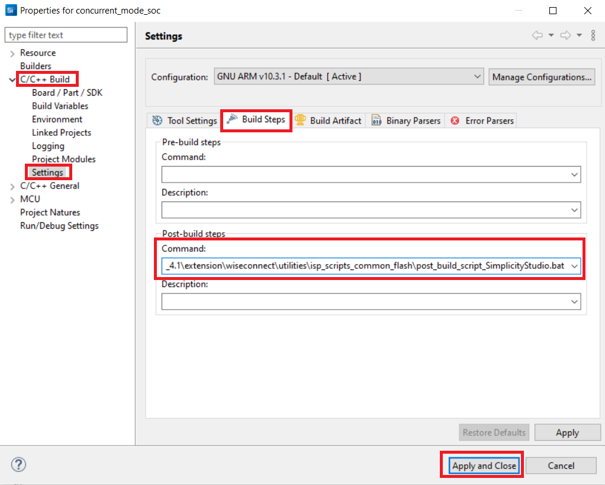**

3. Go to **Properties → C/C++ Build → Settings → Tool Settings → GNU ARM C Compiler → Preprocessor → Defined symbols (-D)** and check for M4 projects macro (RSI_M4_INTERFACE=1) and 9117 macro (CHIP_9117=1). If not present, add the macros by clicking on **ADD** symbol and click **Apply and Close**.
  
   **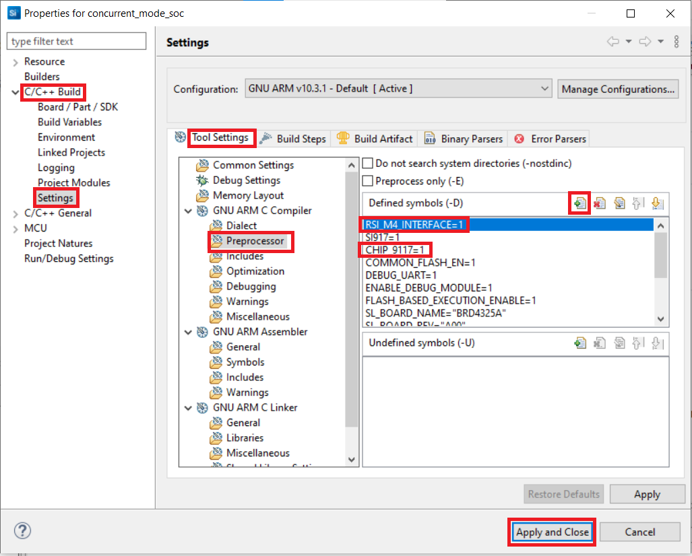**

4. Click on the build icon (hammer) or right click on project name and choose **Build Project** to build the project.

   **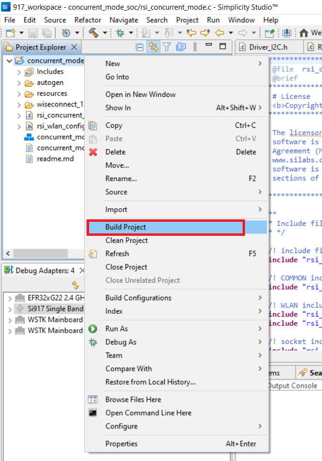**

- Make sure the build returns 0 Errors and 0 Warnings.

#### 4.4.2 Build the Project - NCP Mode

1. Check for **CHIP_9117** and **EXP_BOARD** macros in preprocessor settings as mentioned below.
   - Right click on project name.
   - Go to **Properties → C/C++ Build → Settings → Tool Settings → GNU ARM C Compiler → Preprocessor → Defined Symbols (-D)**.
   - If CHIP_9117 macro is not present, add it by clicking on **ADD** symbol.
   - Click on **Apply and Close**.

     **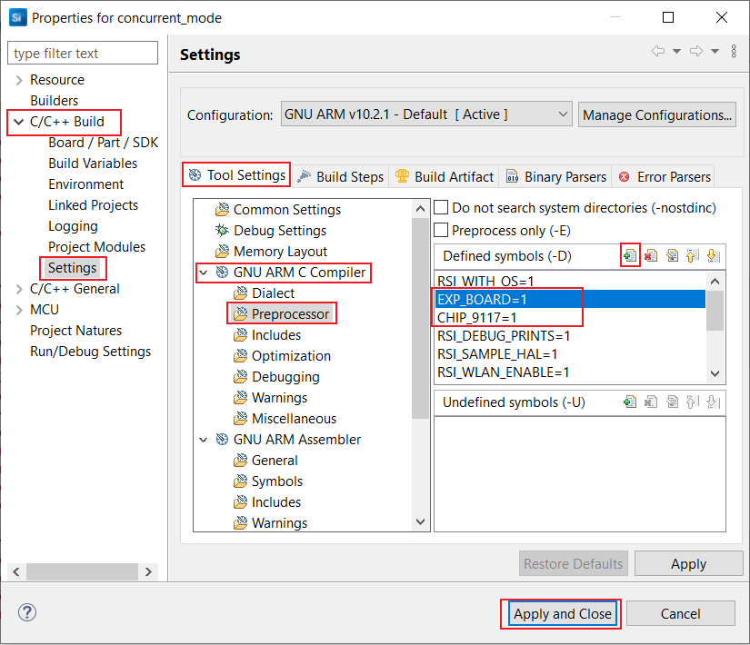**

2. Click on the build icon (hammer) or right click on project name and choose **Build Project** to build the project.

    **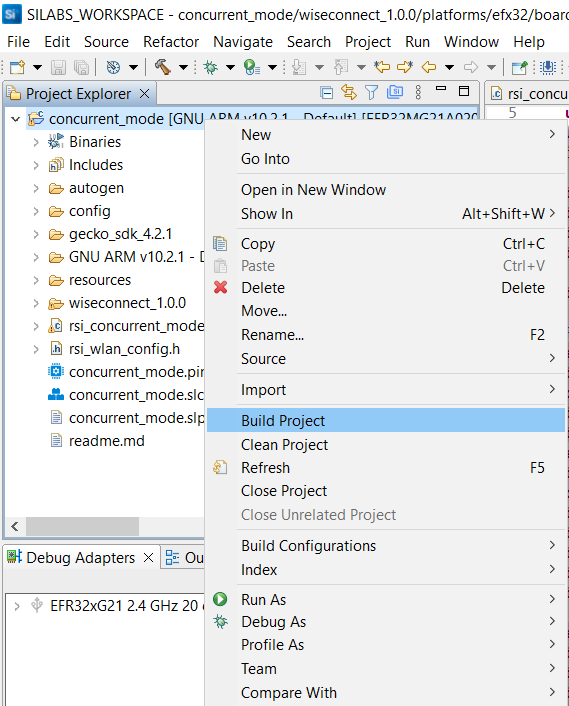**

- Make sure the build returns 0 Errors and 0 Warnings.

### 4.4.3 Set up for application prints

Before setting up Tera Term, do the following for SoC mode.

**SoC mode**: 
You can use either of the below USB to UART converters for application prints.
1. Set up using USB to UART converter board.

  - Connect Tx (Pin-6) to P27 on WSTK
  - Connect GND (Pin 8 or 10) to GND on WSTK

    ****

2. Set up using USB to UART converter cable.

  - Connect RX (Pin 5) of TTL convertor to P27 on WSTK
  - Connect GND (Pin1) of TTL convertor to GND on WSTK

    **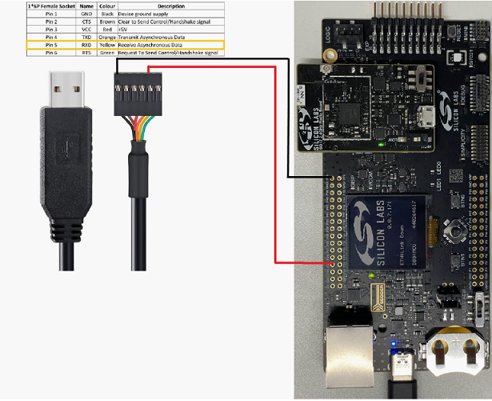**

**Tera Term set up - for NCP and SoC modes**

1. Open the Tera Term tool. 
   - For SoC mode, choose the serial port to which USB to UART converter is connected and click on **OK**. 

     **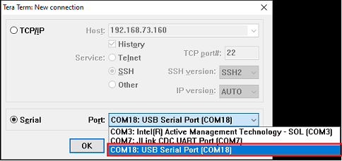**

   - For NCP mode, choose the J-Link port and click on **OK**.

     ****

2. Navigate to the Setup → Serial port and update the baud rate to **115200** and click on **OK**.

    **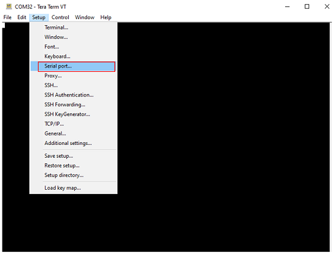**

    ****

### 4.4.4 Execute the application

1. Once the build was successful, right click on project and select **Debug As → Silicon Labs ARM Program** to program the device as shown in below image.

   **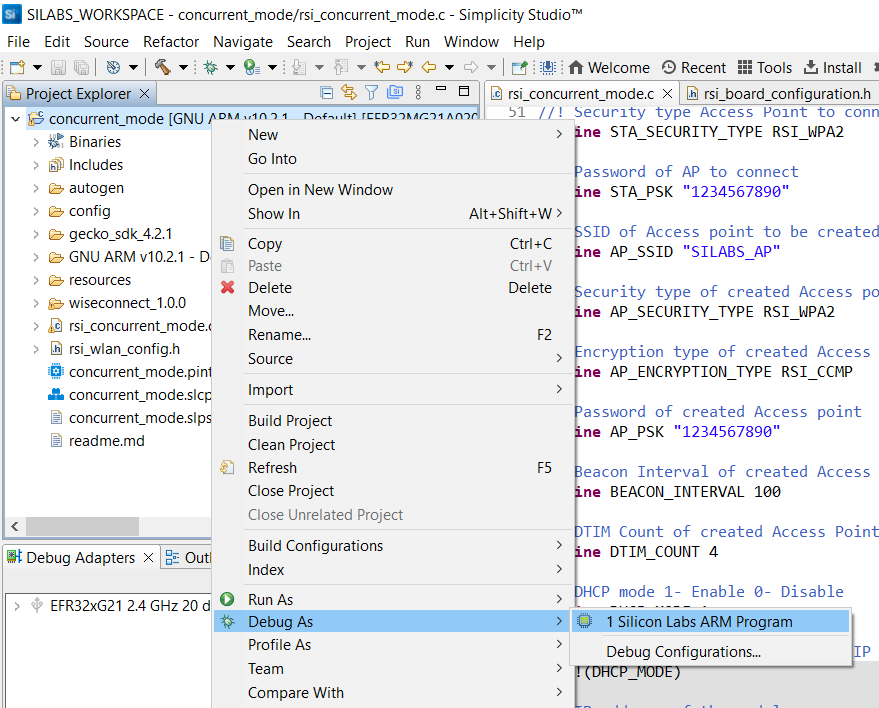**

2. As soon as the debug process is completed, the application control branches to the main().

3. Run iperf application in Windows PC1 (via a command prompt) which is connected to the access point to which the SiWx91x is going to get connected.

4. Open TCP server using the below command in command prompt.

   `iperf.exe –s -p <SERVER_PORT> -i 1`

   **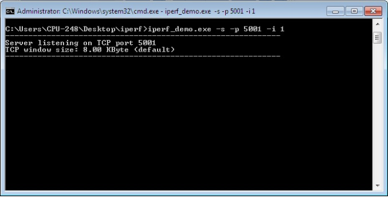**

5. Click on the **Resume** icon in the Simplicity Studio IDE toolbar to run the application.

   ****

6. After the program gets executed, SiWx91x connects to the access point as a Station. On other hand, SiWx91x advertizes itself as an access point with provided configurations mentioned above.

7. After successful connection in Station mode, the application connects to TCP server socket opened on  a Windows PC1 and sends configured NUMBER_OF_PACKETS to remote the TCP server. Refer the below image for reception of TCP data on TCP server.

   ****

8. Connect Windows PC2 to SiWx91x SoftAP that is being advertized (in this example, the SSID of softAP is **SILABS_AP**).

9. After successful connection, open command prompt in Windows PC2 and initiate ping by using below command.

      `ping <SiWx91x IP address> -t`

10. The SiWx91x softAP instance gives ping reply for the received ping request. The below image depicts the ping success.

    **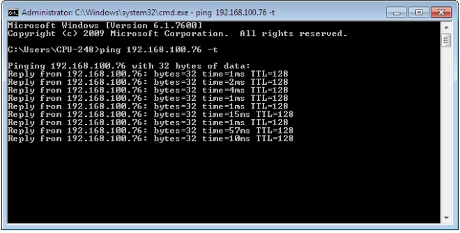**

### 4.4.5 **Application Prints - SoC mode**:

   **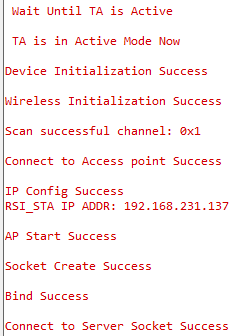**

**Application Prints - NCP mode**:

   **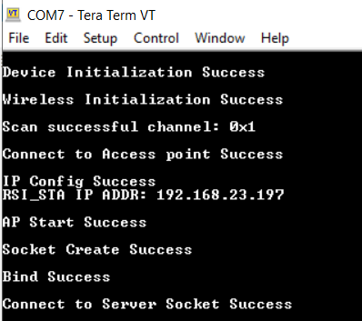**

## 5 Selecting Bare Metal configuration

1. By default, the application runs over FreeRTOS. To run the application with Bare metal configurations, follow the below steps.
   - For Simplicity Studio IDE,
      - Right click on project name
      - Go to **Properties → C/C++ Build → Settings → Tool Settings → GNU ARM C Compiler → Preprocessor → Defined Symbols (-D)**.
      - Select RSI_WITH_OS symbol and click on **Delete** symbol.
      - Click on **Apply and Close**.
      
        **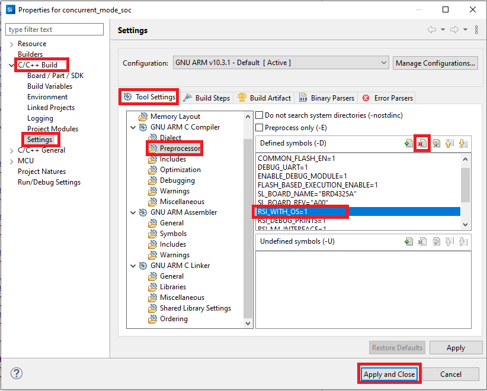**