# Embedded MQTT

## 1 Purpose/Scope

This application demonstrates how to SiWx91x is configured as an MQTT client, connects to an MQTT broker, subscribes to a topic and publishes messages on a particular MQTT topic. 
In this application, SiWx91x is configured as a Wi-Fi station and connects to an Access Point. After successful Wi-Fi connection, application connects to a MQTT broker and subscribes to the topic called **MQTT_DEMO**. Subsequently, the application publishes a message **THIS IS MQTT CLIENT DEMO FROM APPLICATION** on the subscribed topic. Finally, the application waits to receive the data published on the subscribed topic by other clients.
This application demonstrates how to configure the SiWx91x EVK as MQTT client and establish connection with MQTT broker and how to subscribe, publish and receive the MQTT messages from MQTT broker.

This application uses MQTT library present in the SiWx91x firmware.

## 2 Prerequisites/Set up Requirements

For running the application, you will need the following:

### 2.1 Hardware Requirements
  
- **SoC Mode**: [Silicon Labs EFR32xG21 Starter Kit with Wireless Gecko](https://www.silabs.com/) (SLSWSTK6006A Base board: BRD4001A/BRD4002A, Radio board: BRD4325A)

- **NCP Mode**: 
   - [SiWx91x Wi-Fi Expansion Board](https://www.silabs.com/)
   - A Host MCU. This example application has been tested with the following host MCUs.

     - [Silicon Labs EFR32xG21 Starter Kit with Wireless Gecko](https://www.silabs.com/development-tools/wireless/efr32xg21-bluetooth-starter-kit) (SLSWSTK6006A Base board: BRD4001A, Radio board: BRD4180a or BRD4180b)

     - [Silicon Labs EFM32GG11 Starter Kit with Wireless Gecko](https://www.silabs.com/development-tools/mcu/32-bit/efm32gg11-starter-kit) (SLSTK3701A Base board: BRD2204A)

- A Windows PC

- A Wireless Access Point

- Windows PC1 (for running MQTT broker)

- Windows PC2 (for running MQTT client utility - MQTT Explorer)

### 2.2 Software Requirements

- Simplicity Studio IDE 

   - Download the [Simplicity Studio IDE](https://www.silabs.com/developers/simplicity-studio).

   - Follow the [Simplicity Studio user guide](https://docs.silabs.com/simplicity-studio-5-users-guide/1.1.0/ss-5-users-guide-getting-started/install-ss-5-and-software#install-ssv5) to install Simplicity Studio IDE.

- [Silicon Labs Gecko SDK](https://github.com/SiliconLabs/gecko_sdk)

- [Si917 COMBO SDK](https://github.com/SiliconLabs/)

- [Mosquitto broker](https://mosquitto.org/download/)

- [MQTT Explorer](http://mqtt-explorer.com/)

**NOTE:**

- This example application supports Bare metal and FreeRTOS configurations.

## 3 Set up

#### 3.1 SoC Mode 

Set up diagram for SoC mode:

****

Follow the [Getting Started with SiWx91x SoC](https://docs.silabs.com/) guide to set up the hardware connections and Simplicity Studio IDE.
  
#### 3.2 NCP Mode  

Set up diagram for NCP mode:

**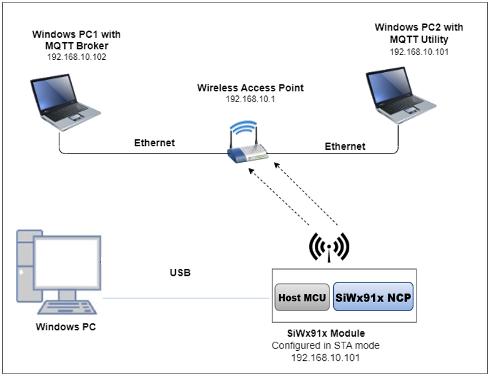**

Follow the [Getting Started with EFx32](https://docs.silabs.com/rs9116-wiseconnect/latest/wifibt-wc-getting-started-with-efx32/) guide to setup the hardware connections and Simplicity Studio IDE.

**NOTE**: 
- The Host MCU platform (EFR32MG21) and the SiWx91x interact with each other through the SPI interface. 
- The Host MCU platform (EFM32GG11) and the SiWx91x interact with each other through the SDIO interface.


## 4 Application Build Environment

1. Ensure the SiWx91x loaded with the latest firmware following the [Getting started with a PC](https://docs.silabs.com/rs9116/latest/wiseconnect-getting-started). The firmware file is located at **<Si917 COMBO SDK> → connectivity_firmware**.

2. Ensure the EFx32 and SiWx91x set up is connected to your PC.

### 4.1 Board detection

### 4.1.1 SoC mode
1. In the Simplicity Studio IDE, 
    - The 917 SoC board will be detected under **Debug Adapters** pane as shown below.

      ****

### 4.1.2 NCP mode

1. In the Simplicity Studio IDE, 
    - The EFR32 board will be detected under **Debug Adapters** pane as shown below.

      ****

    - The EFM32 board will be detected under **Debug Adapters** pane as shown below.

      ****

### 4.2 Creation of project

Ensure the latest Gecko SDK along with the extension Si917 COMBO SDK is added to Simplicity Studio.

1. Click on the board detected and go to **EXAMPLE PROJECTS & DEMOS** section.

   ****

2. Filter for Wi-Fi examples from the Gecko SDK added. For this, check the *Wi-Fi* checkbox under **Wireless Technology** and *Gecko SDK Suite* checkbox under **Provider**. 

3. Under **Device Type**, for SoC based example, check the *SoC* checkbox and for NCP based example, check the *NCP* checkbox.

4. Now choose **Wi-Fi- NCP Embedded MQTT** example for NCP mode or choose Wi-Fi- SoC Access Point example for SoC mode and click on **Create**.

   For NCP mode:

   **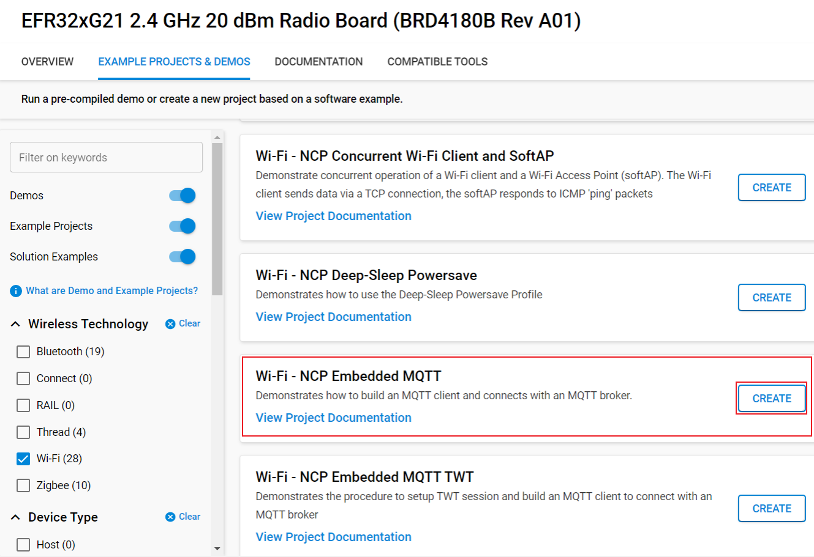**

   For SoC mode:
      
   **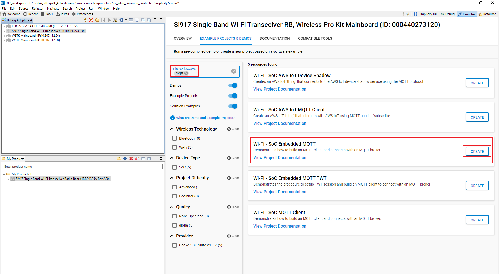**

5. Give the desired name to your project and cick on **Finish**.

   **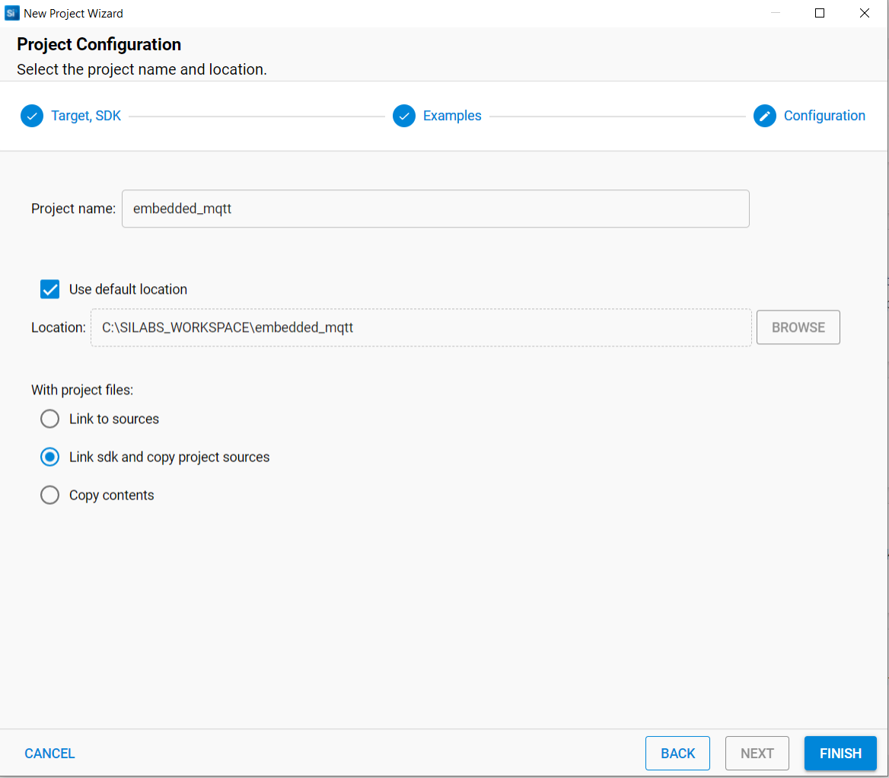**

### 4.3 Application configurations

The application can be configured to suit your requirements and development environment. 

1. In the Project explorer pane, expand the **embedded_mqtt** folder and open the **rsi_emb_mqtt.c** file. Configure the following parameters based on your requirements.

   **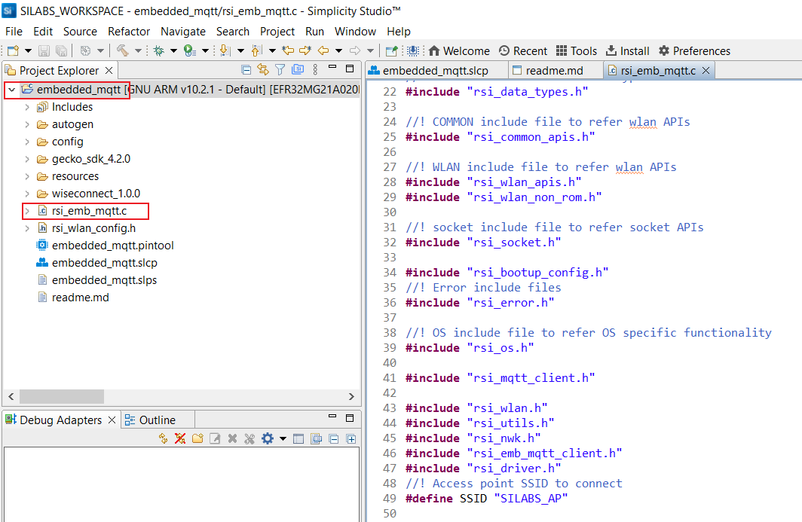**

-  DHCP_MODE refers to whether the IP assignment of SiWx91x is done statically or through DHCP.
      
      1  - DHCP_MODE

      0  - Static IP assignment
   
      ```c
      #define DHCP_MODE                                     1
      ```

   - If you want to assign the IP address Statically, then set DHCP_MODE macro to **0** and configure DEVICE_IP, GATEWAY and NETMASK macros.
  
      ```c
      #define DEVICE_IP                                 "192.168.10.101"
      ```

      ```c
      #define GATEWAY                                   "192.168.10.1"
      ```
  
      ```c
      #define NETMASK                                   "255.255.255.0"
      ```

   - CLIENT_PORT port refers to the device MQTT client (SiWx91x) port number.

      ```c
      #define CLIENT_PORT                                5001
      ```

   - SERVER_PORT port refers to the port number on which the remote MQTT broker/server is running. The default port for MQTT server is 1883.

      ```c
      #define SERVER_PORT                                1883
      ```

   - SERVER_IP_ADDRESS refers remote peer IP address (Windows PC1) on which MQTT server is running.

      ```c
      #define SERVER_IP_ADDRESS                         "192.168.10.1"
      ```

   - MQTT client keep alive period

      ```c
      #define RSI_KEEP_ALIVE_PERIOD                      100
      ```

   - Memory to initialize MQTT client Info structure

      ```c
      #define MQTT_CLIENT_INIT_BUFF_LEN                  3500
      ```

   - Global buffer or memory which is used for MQTT client initialization. This buffer is used for the MQTT client information storage.

      ```c
      uint8_t mqqt_client_buffer[MQTT_CLIENT_INIT_BUFF_LEN]
      ```

   - QOS indicates the level of assurance for delivery of an application Message.

      QoS levels are:

      0 - At most once delivery

      1 - At least once delivery

      2 - Exactly once delivery

      ```c
      #define QOS                                        0
      ```

   - RSI_MQTT_TOPIC refers to the topic to which MQTT client (SiWx91x) is supposed to subscribe.

      ```c
      #define RSI_MQTT_TOPIC                             "MQTT_DEMO"
      ```
   
   - MQTT Message to publish on the topic subscribed.

      ```c
      uint8_t publish_message[] ="THIS IS MQTT CLIENT DEMO FROM APPLICATION"
      ```

   - MQTT Client ID refers to the unique ID with which the MQTT client connects to MQTT broker/server.

      ```c
      uint8_t clientID[] = "MQTTCLIENT"
      ```

   - User name for login credentials

      ```c
      int8_t username[] = "username"
      ```

   - Password for login credentials

      ```c
      int8_t password[] = "password"
      ```
   - Application memory length which is required by the driver

      ```c
      #define GLOBAL_BUFF_LEN                            15000
      ```

2. Open **rsi\_wlan\_config.h** file and configure the following features as per your requirements. Make sure the embedded MQTT feature is enabled in extended TCP/IP features.

   **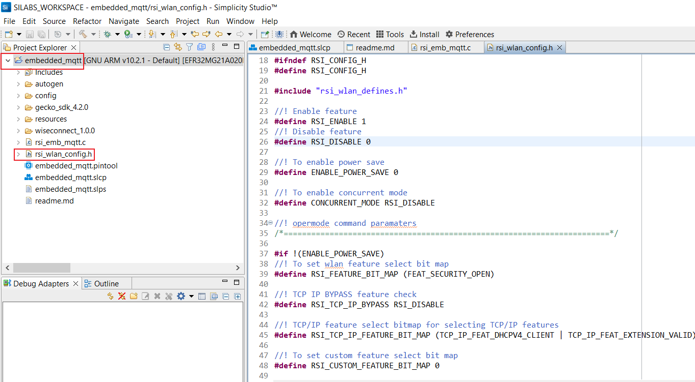**

   - Opermode parameters.
   ```c
      #define CONCURRENT_MODE                            RSI_DISABLE

      #define RSI_FEATURE_BIT_MAP                        FEAT_SECURITY_OPEN

      #define RSI_TCP_IP_BYPASS                          RSI_DISABLE

      #define RSI_TCP_IP_FEATURE_BIT_MAP                 (TCP_IP_FEAT_DHCPV4_CLIENT)

      #define RSI_CUSTOM_FEATURE_BIT_MAP 0

      #define RSI_EXT_CUSTOM_FEATURE_BIT_MAP 0

      #define RSI_EXT_TCPIP_FEATURE_BITMAP               EXT_EMB_MQTT_ENABLE
      ```
    **NOTE**:  For running **MQTT** with **SSL**, please enable **TCP_IP_FEAT_SSL** in TCP/IP features as shown below. Also load the related **SSL Certificates** in the module using rsi_wlan_set_certificate() API. Enable **SSL** flag **RSI_SSL_ENABLE** in rsi_mqtt_connect() API. 

      ```c
      #define CONCURRENT_MODE                            RSI_DISABLE

      #define RSI_FEATURE_BIT_MAP                        FEAT_SECURITY_OPEN

      #define RSI_TCP_IP_BYPASS                          RSI_DISABLE

      #define RSI_TCP_IP_FEATURE_BIT_MAP                 (TCP_IP_FEAT_DHCPV4_CLIENT |  TCP_IP_FEAT_SSL)

      #define RSI_CUSTOM_FEATURE_BIT_MAP 0

      #define RSI_EXT_CUSTOM_FEATURE_BIT_MAP 0

      #define RSI_EXT_TCPIP_FEATURE_BITMAP               EXT_EMB_MQTT_ENABLE
       
      ```

   -  **Power save configuration**

   - By default, the application is configured without power save.

      ```c
      #define ENABLE_POWER_SAVE 0
      ```
   - If user wants to run the application in power save, modify the below macro.

      ```c
      #define ENABLE_POWER_SAVE 1
      ```

**Note**: 
> In rsi_mqtt_client.h change 'MQTT_VERSION' macro to either 3 or 4 based on the MQTT broker support version (Supported versions are 3 and 4).

### 4.4 Execution of the Application

Follow the below steps for the successful execution of the application.

#### 4.4.1 Build the Project - SoC Mode

1. Once the project is created, right click on project and go to **Properties → C/C++ Build → Settings → Build Steps**.

2. Add **post_build_script_SimplicityStudio.bat** file path present at **SI917_COMBO_SDK.X.X.X.XX → utilities → isp_scripts_common_flash** in build steps settings as shown in below image.

   **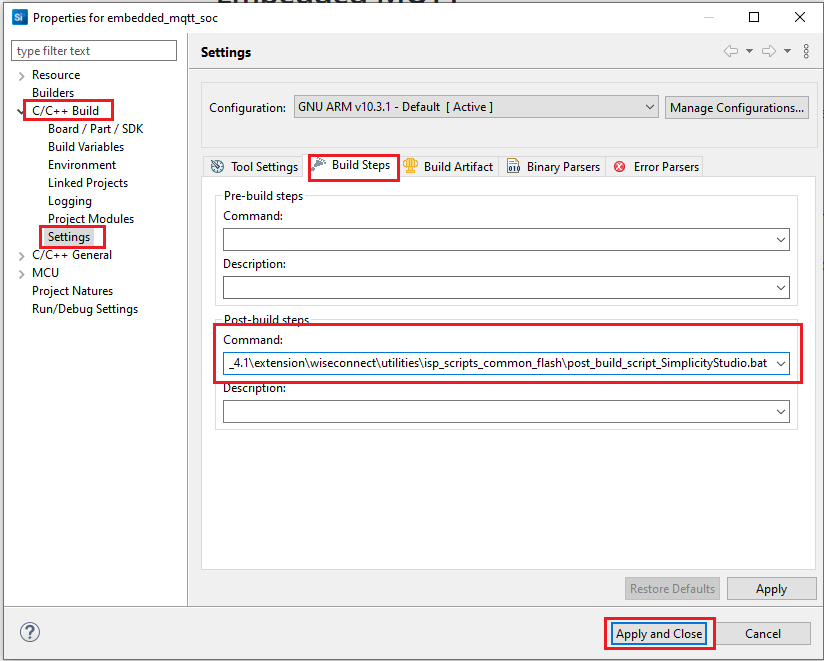**

3. Go to **Properties → C/C++ Build → Settings → Tool Settings → GNU ARM C Compiler → Preprocessor → Defined symbols (-D)** and check for M4 projects macro (RSI_M4_INTERFACE=1) and 9117 macro (CHIP_9117=1). If not present, add the macros by clicking on **ADD** symbol and click **Apply and Close**.
  
   **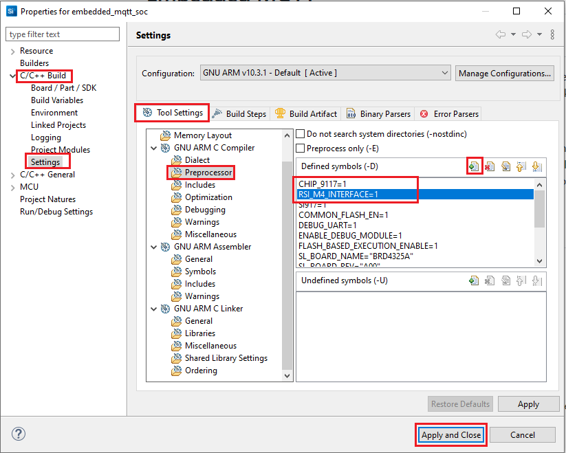**

4. Click on the build icon (hammer) or right click on project name and choose **Build Project** to build the project.

   **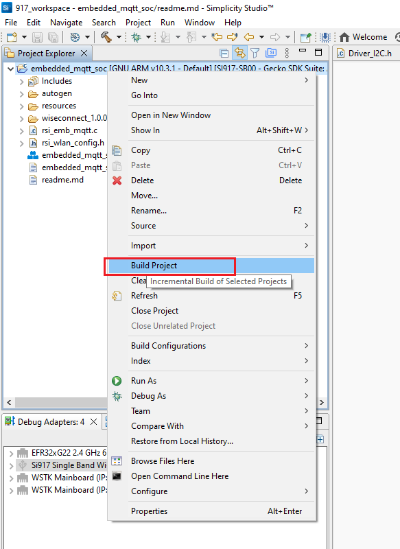**

- Make sure the build returns 0 Errors and 0 Warnings.
  
#### 4.4.2 Build the Project - NCP Mode

1. Check for CHIP_9117 macro in preprocessor settings as mentioned below.
   - Right click on project name.
   - Go to **Properties → C/C++ Build → Settings → Tool Settings → GNU ARM C Compiler → Preprocessor → Defined Symbols (-D)**.
   - If CHIP_9117 macro is not present, add it by clicking on **ADD** symbol.
   - Click on **Apply and Close**.

     **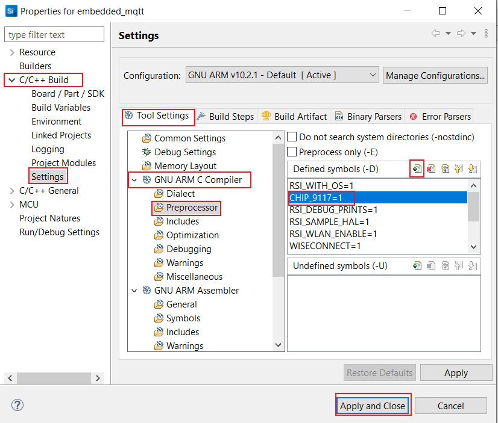**

2. Click on the build icon (hammer) or right click on project name and choose **Build Project** to build the project.

    **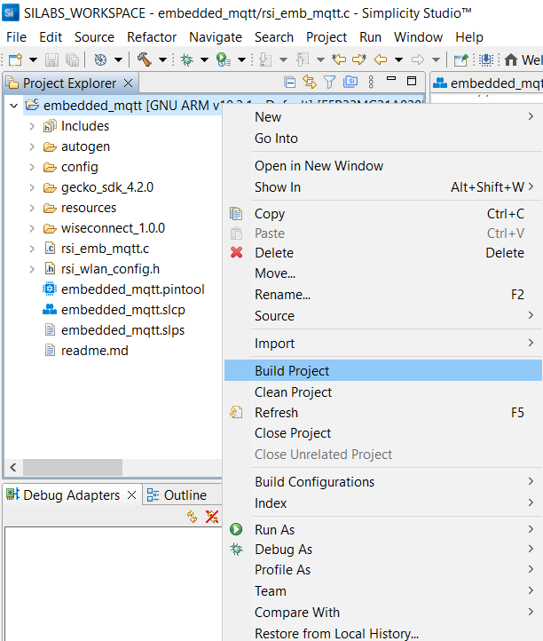**

- Make sure the build returns 0 Errors and 0 Warnings.

### 4.4.3 Set up for application prints

Before setting up Tera Term, do the following for SoC mode.

**SoC mode**: 
You can use either of the below USB to UART converters for application prints.
1. Set up using USB to UART converter board.

  - Connect Tx (Pin-6) to P27 on WSTK
  - Connect GND (Pin 8 or 10) to GND on WSTK

    ****

2. Set up using USB to UART converter cable.

  - Connect RX (Pin 5) of TTL convertor to P27 on WSTK
  - Connect GND (Pin1) of TTL convertor to GND on WSTK

    ****

**Tera Term set up - for NCP and SoC modes**

1. Open the Tera Term tool. 
   - For SoC mode, choose the serial port to which USB to UART converter is connected and click on **OK**. 

     ****

   - For NCP mode, choose the J-Link port and click on **OK**.

     ****

2. Navigate to the Setup → Serial port and update the baud rate to **115200** and click on **OK**.

    ****

    ****

### 4.4.4 Execute the application

1. Once the build was successful, right click on project and select **Debug As → Silicon Labs ARM Program** to program the device as shown in below image.

   **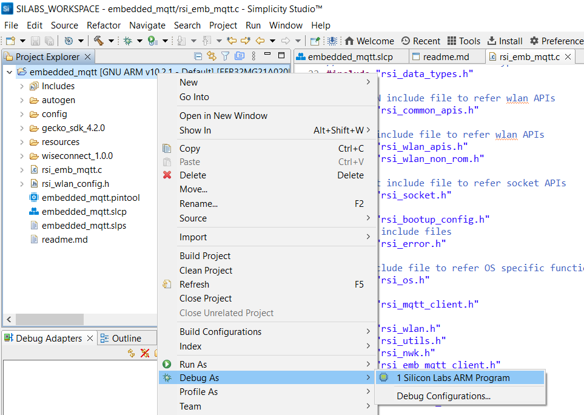**

2. As soon as the debug process is completed, the application control branches to the main().

3. Before running the application, set up the MQTT server on a remote PC. For details, refer to [Appendix](#appendix) section.

4. Click on the **Resume** icon in the Simplicity Studio IDE toolbar to run the application.

   ****

5. After the program gets executed, the SiWx91x EVK will be connected to the same access point having the configuration same as that of in the application and get an IP address.

6. Once the SiWx91x gets connected to the MQTT broker, it will subscribe to the topic **RSI_MQTT_TOPIC (Ex: "MQTT_DEMO")**. The user can see the client connected and subscription success information in the MQTT broker.

   **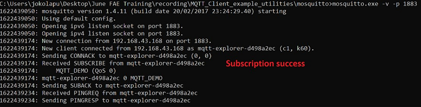**

7. After successful subscription to the topic **RSI_MQTT_TOPIC (Ex: "MQTT_DEMO")**, the SiWx91x EVK publishes a message which is given in **publish_message** array
  (Ex: "THIS IS MQTT CLIENT DEMO FROM APPLICATION") on the subscribed topic.

8. MQTT Explorer which is running on Windows PC2 will receive the message published by the SiWx91x EVK as it subscribed to the same topic.

   **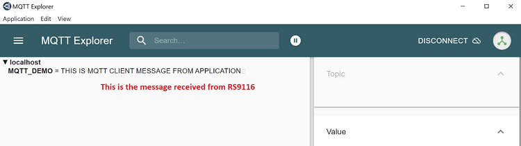**

9. In the MQTT broker, user can observe the published message as the MQTT client is subscribed to that topic. 

   ****

10. Now to publish a message using MQTT Explorer, enter the topic name under **Publish** tab, select **raw** data format, type the data that user wishes to send and then click on **publish**. This message will be received by the SiWx91x.

    ****

**Procedure for executing the application when enabled with SSL**

1. Install MQTT broker in Windows PC1 which is connected to Access Point through LAN.

2. Update the **mosquitto.conf** file with the proper file paths, in which the certificates are available in the mosquitto.conf file.

4. Also, add **certs** folder to the mosquitto broker folder.

5. Execute the following command in MQTT server installed folder. (Ex:  C:\Program Files\mosquitto>mosquitto.exe -c mosquitto.conf -v) (Port should be 8883)
   
   `mosquitto.exe -c mosquitto.conf -v`  
  
   **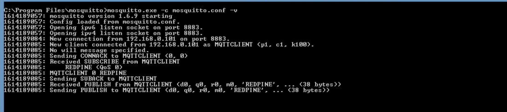**

6. If you see any error - Unsupported tls_version **tlsv1**, just comment the **tls_version tlsv1** in **mosquitto.conf** file.

**Note**:
> Multiple MQTT client instances can be created.
> If mosquitto isn't allowing external connections to broker, add the below lines in **mosquitto.conf** file:
  ```c
  listener 1883
  allow_anonymous true
  ```
> For using a different config file for mosquitto broker, use command:
  `mosquitto -v -p 1883 -c config/mosquitto.conf`
  where **config** is the sub folder and **mosquitto.conf** is the different config file than default.

### 4.4.5 **Application Prints - SoC mode**:

   **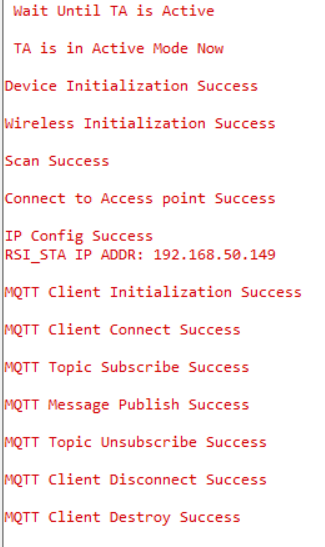**

**Application Prints - NCP mode**:

   **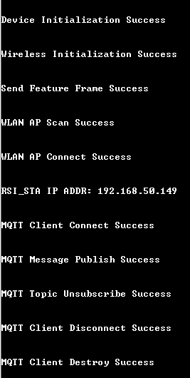**

## 5 Selecting Bare Metal configuration

1. By default, the application runs over FreeRTOS. To run the application with Bare metal configurations, follow the below steps.
   - For Simplicity Studio IDE,
      - Right click on project name
      - Go to **Properties → C/C++ Build → Settings → Tool Settings → GNU ARM C Compiler → Preprocessor → Defined Symbols (-D)**.
      - Select RSI_WITH_OS symbol and click on **Delete** symbol.
      - Click on **Apply and Close**.
      
        **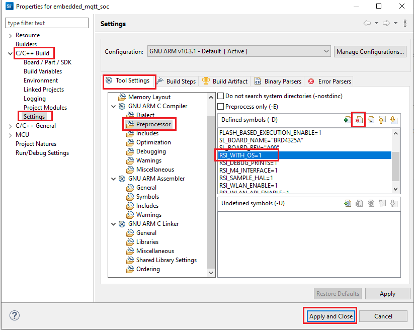**

## Appendix

### Steps to set up MQTT server

1. To run MQTT broker on port 1883 in Windows PC1, open command prompt and go to MQTT installed folder (Ex: C:\Program Files\mosquitto) and run the following command: 
   ```c
   mosquitto.exe –p 1883 –v
   ```
   **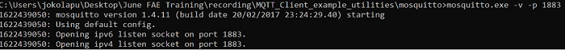**

2. Open MQTT Explorer in Windows PC2 and delete the existing connections if any and click on **Advanced** as shown in the below image.

   ****

3. Delete the existing topic names if any. Enter the desired **TOPIC_NAME** in topic field and click on **ADD**. Then the desired topic name can be observed in the topic list and click on **BACK** as shown in below image.

   ****

4. Connect to MQTT broker by giving IP address and port number of Windows PC1 in HOST and PORT fields in MQTT Explorer respectively and click on **CONNECT** to connect to the MQTT broker. If you are running your MQTT broker on the same PC then the following configuration is made as shown in the below image. 

   ****