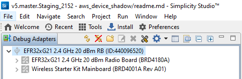

# Embedded MQTT

## 1. Purpose / Scope

This application demonstrates how to configure the SiWx91x EVK as MQTT client and establish connection with MQTT broker and how to subscribe, publish and receive the MQTT messages from MQTT broker.

This application uses MQTT library present in our Firmware.

In this application, SiWx91x configured as WiFi station and connects to the Access Point. After successful WiFi connection, SiWx91x connects to MQTT broker and subscribes to the topic "SILABS_TEST" and publishes a message "THIS IS MQTT CLIENT DEMO FROM SILABS" on that subscribed topic. After publishing the message on the subscribed topic, the MQTT client un-subscribes and disconnects with the MQTT broker.

## 2. Prerequisites / Setup Requirements

Before running the application, the user will need the following things to setup.

### 2.1 Hardware Requirements
  
* Windows PC
* Wireless Access point
* Windows PC1 with MQTT broker installed in it
* Windows PC2 with MQTT client utility installed in it
* SiWx91x Wi-Fi Evaluation Kit. The SiWx91x supports multiple operating modes. See [Operating Modes]() for details.
  - **SoC Mode**:
      - Silicon Labs [BRD4325A](https://www.silabs.com/)
  - **NCP Mode**:
      - Silicon Labs [(BRD4180A, BRD4280B)](https://www.silabs.com/); **AND**
      - Host MCU Eval Kit. This example has been tested with:
        - Silicon Labs [WSTK + EFR32MG21](https://www.silabs.com/development-tools/wireless/efr32xg21-bluetooth-starter-kit)
        - Silicon Labs [WSTK + EFM32GG11](https://www.silabs.com/development-tools/mcu/32-bit/efm32gg11-starter-kit)

### 2.2 Software Requirements
- Install MQTT Broker
	  - Access the link http://mosquitto.org/download/ to install MQTT broker for different OS platforms in Windows PC1.
- Install MQTT Utility
	  - Access the link http://mqtt-explorer.com/ to install MQTT Explorer in Windows PC2.
	
#### SoC Mode : 


  
#### NCP Mode :  


## 3. Application Build Environment

### 3.1 Project Setup
- **SoC Mode**
  - **Silicon Labs SiWx91x SoC**. Follow the [Getting Started with SiWx91x SoC](https://docs.silabs.com/) to setup the example to work with SiWx91x SoC and Simplicity Studio.
- **NCP Mode**
  - **Silicon Labs EFx32 Host**. Follow the [Getting Started with EFx32](https://docs.silabs.com/rs9116-wiseconnect/latest/wifibt-wc-getting-started-with-efx32/) to setup the example to work with EFx32 and Simplicity Studio.

## Configuring the Application
The application can be configured to suit user requirements and development environment.
Read through the following sections and make any changes needed. 

### 3.2 NCP Mode - Host Interface 

* By default, the application is configured to use the SPI bus for interfacing between Host platforms(EFR32MG21) and the SiWx91x EVK.


### 3.3 Bare Metal/RTOS Support

To select a bare metal configuration, see [Selecting bare metal](#selecting-bare-metal). 

## 4. Application Configuration Parameters
The application can be configured to suit your requirements and development environment. Read through the following sections and make any changes needed.

**4.1** Configure the following parameters in **rsi_emb_mqtt.c** to enable your Silicon Labs Wi-Fi device to connect to your Wi-Fi network.
    
SSID refers to the name of the Access point.

```c
#define SSID                                       "SILABS_AP"
```

SECURITY_TYPE refers to the type of security. In this application, STA supports Open, WPA-PSK, WPA2-PSK securities.

   The valid configuration is:

   - RSI_OPEN - For OPEN security mode

   - RSI_WPA  - For WPA security mode

   - RSI_WPA2 - For WPA2 security mode

```c
#define SECURITY_TYPE                              RSI_OPEN
```

PSK refers to the secret key if the Access point configured in WPA-PSK/WPA2-PSK security modes.

```c
#define PSK                                        "<psk>"
```

CLIENT_PORT port refers to device MQTT client port number

```c
#define CLIENT_PORT                                5001
```

SERVER_PORT port refers remote MQTT broker/server port number

```c
#define SERVER_PORT                                1883
```

SERVER_IP_ADDRESS refers remote peer IP address (Windows PC2) to connect with MQTT broker/server socket.

```c
#define SERVER_IP_ADDRESS                          192.168.10.1
```

MQTT client keep alive period

```c
#define RSI_KEEP_ALIVE_PERIOD                      0
```

QOS indicates the level of assurance for delivery of an Application Message.

   QoS levels are:

   0 - At most once delivery

   1 - At least once delivery

   2 - Exactly once delivery

```c
#define QOS                                        0
```

RSI_MQTT_TOPIC refers to which topic WiSeConnect MQTT client is supposed to subscribe.

```c
#define RSI_MQTT_TOPIC                             "SILABS_TEST"
```
   
MQTT Message to publish on the topic subscribed

```c
uint8_t publish_message[] ="THIS IS MQTT CLIENT DEMO FROM SILABS"
```
MQTT Client ID with which MQTT client connects to MQTT broker/server

```c
uint8_t clientID[] = "MQTTCLIENT"
```

User name for login credentials

```c
int8_t username[] = "username"
```

Password for login credentials

```c
int8_t password[] = "password"
```

#### The desired parameters are provided below. User can also modify the parameters as per their needs and requirements.

Application memory length which is required by the driver

```c
#define GLOBAL_BUFF_LEN                            15000
```

To configure IP address
   DHCP_MODE refers whether IP address configured through DHCP or STATIC

```c
#define DHCP_MODE                                  1
```
   
> Note:
> If user wants to configure STA IP address through DHCP then set DHCP_MODE to "1" and skip configuring the following DEVICE_IP, GATEWAY and NETMASK macros.
> (Or)
> If user wants to configure STA IP address through STATIC then set DHCP_MODE macro to "0" and configure following DEVICE_IP, GATEWAY and NETMASK macros.

IP address to be configured to the device in STA mode should be in long format and in little endian byte order.
  
   Example: To configure "192.168.10.10" as IP address, update the macro DEVICE_IP as 0x0A0AA8C0.

```c
#define DEVICE_IP                                  0X0A0AA8C0
```

IP address of the gateway should also be in long format and in little endian byte order

   Example: To configure "192.168.10.1" as Gateway, update the macro GATEWAY as 0x010AA8C0.

```c
#define GATEWAY                                    0x010AA8C0
```

IP address of the network mask should also be in long format and in little endian byte order.

   Example: To configure "255.255.255.0" as network mask, update the macro NETMASK as 0x00FFFFFF.

```c
#define NETMASK                                    0x00FFFFFF
```

 For running **EMB_MQTT** with **SSL**, please enable **TCP_IP_FEAT_SSL** in **rsi_wlan_config.h** file, as shown below. Also load the related **SSL Certificates** in the module using rsi_wlan_set_certificate() API and and Need to enable **SSL** flag **RSI_EMB_MQTT_SSL_ENABLE** in rsi_emb_mqtt_client_init() API. 


```c
#define CONCURRENT_MODE                            RSI_DISABLE
#define RSI_FEATURE_BIT_MAP                        FEAT_SECURITY_OPEN
#define RSI_TCP_IP_BYPASS                          RSI_DISABLE
#define RSI_TCP_IP_FEATURE_BIT_MAP                 (TCP_IP_FEAT_DHCPV4_CLIENT | TCP_IP_FEAT_SSLTCP_IP_FEAT_DNS_CLIENT | TCP_IP_FEAT_EXTENSION_VALID)
#define RSI_CUSTOM_FEATURE_BIT_MAP                 EXT_FEAT_CUSTOM_FEAT_EXTENTION_VALID
#define RSI_EXT_CUSTOM_FEATURE_BIT_MAP             EXT_FEAT_256k_MODE
#define RSI_EXT_TCPIP_FEATURE_BITMAP               EXT_EMB_MQTT_ENABLE
#define RSI_BAND                                   RSI_BAND_2P4GHZ
```

**Power save configuration**

   - By default, the application is configured without power save.

```c
#define ENABLE_POWER_SAVE 0
```
   - If user wants to run the application in power save, modify the below macro.

```c
#define ENABLE_POWER_SAVE 1
```

> Note: 
> In rsi_mqtt_client.h change 'MQTT_VERSION' macro to either 3 or 4 based on the MQTT broker support version (Supported versions are 3 and 4).

## 5. Testing the Application

Follow the steps below for the successful execution of the application.

### 5.1 Loading the SiWx91x Firmware

Refer [Getting started with a PC](https://docs.silabs.com/rs9116/latest/wiseconnect-getting-started) to load the firmware into SiWx91x EVK.

#### 5.2.1 Project Creation - SoC Mode : 

- Connect your board. The Si917 compatible SoC board is **BRD4325A**.
- Studio should detect your board. Your board will be shown here.


#### 5.2.2 Project Creation - NCP Mode : 

- Connect your board. The supported NCP boards are: **BRD4180A,BRD4280B**
- Studio should detect your board. Your board will be shown here.


#### 5.2.3 Selecting an example application and generate project

- Go to the 'EXAMPLE PROJECT & DEMOS' tab and select your desired example application

- Click 'Create'. The "New Project Wizard" window appears. Click 'Finish'


#### 5.2.4 Build Project - SoC Mode

- Once the project is created, right click on project and go to properties → C/C++ Build → Settings → Build Steps
- Add post_build_script_SimplicityStudio.bat file path (SI917_COMBO_SDK.X.X.X.XX\utilities\isp_scripts_common_flash) in build steps settings as shown in below image.

- Check for M4 projects macros in preprocessor settings(RSI_M4_INTERFACE=1)
- Check for 9117 macro in preprocessor settings(CHIP_9117=1).
- Click on the build icon (hammer) to build the project

- Successful build output will show as below.


#### 5.2.5 Build Project - NCP Mode :

- Check for 9117 macro in preprocessor settings(CHIP_9117=1).
- Click on the build icon (hammer) to build the project

- Successful build output will show as below.


## 6. Program the device

Once the build was successfull, right click on project and click on Debug As->Silicon Labs ARM Program as shown in below image.
### SoC Mode :

### NCP Mode : 


### 6.1 Running the SiWx91x Application

1. Configure the Access point in OPEN/WPA-PSK/WPA2-PSK mode to connect SiWx91x device in STA mode.

2. Install MQTT broker in Windows PC1 which is connected to Access Point.

3. Run MQTT broker in Windows PC1 using following command. Open Command prompt and go to MQTT installed folder (Ex: C:\Program Files\mosquitto) and run the following command:

`mosquitto.exe -p 1883 -v`
[Run MQTT broker in Windows PC1](resources/readme/image148.png)

4. Open MQTT Explorer in Windows PC2 and delete the existing connections if any and click on "Advanced" as shown in the below image.

	
5. Delete the existing topic names if any. Enter the desired "TOPIC_NAME" in topic field and click on "ADD". Then the desired topic name can be observed in the topic list and click on "BACK" as shown  in below image.


6. Connect to MQTT broker by giving IP address and port number of Windows PC1 in HOST and PORT fields in MQTT Explorer respectively and click on "CONNECT" to connect to the MQTT broker. If you are running your MQTT broker on the same PC then the following configuration is made as shown in the below image. 


> Note: Try giving IP address of the PC if you're unable to conect using localhost.
   
7. After the program gets executed, SiWx91x EVK will get connected to the same access point having the configuration same as that of in the application and get IP.

8. Once the SiWx91x EVK gets connected to the MQTT broker, it will subscribe to the topic RSI_MQTT_TOPIC (Ex: "SILABS_TEST"). The user can see the client connected and subscribe information in the MQTT broker.


9. After successful subscription to the topic RSI_MQTT_TOPIC (Ex: "SILABS_TEST"), the device publishes a message which is given in publish_message array (Ex: "THIS IS MQTT CLIENT DEMO FROM APPLICATION") on the subscribed topic.

10. MQTT Explorer which is running on Windows PC2 will receive the message published by the SiWx91x as it subscribed to the same topic.

11. In the MQTT broker, user can observe the published message as the MQTT client is subscribed topic to that topic.


12. Now to publish a message using MQTT Explorer, enter the topic name under "Publish" tab, select "raw" data format, type the data that user wishes to send and then click on "publish". This message will be received by the SiWx91x.

 
  
   **Note:**
   Multiple MQTT client instances can be created
### Procedure For exexcuting the Application when enabled with SSL

1. Configure the Access point in OPEN/WPA-PSK/WPA2-PSK mode to connect Silicon Labs device in STA mode.

2. Install MQTT broker in Windows PC2 which is connected to Access Point through LAN.

3. User needs to update the mosquitto.conf file with the proper file paths, in which the certificates are available in the mosquitto.conf file.

4. Also, add "certs" folder to the mosquitto broker folder.

5. Execute the following command in MQTT server installed folder. (Ex:  C:\Program Files\mosquitto>mosquitto.exe -c mosquitto.conf -v) (Port can be 1883/8883)
   
   `mosquitto.exe -c mosquitto.conf -v`  
  
    

6. If you see any error - Unsupported tls_version "tlsv1", just comment the "tls_version tlsv1" in mosquitto.conf file.
  
## 7. Observing the output prints on serial terminal

### 7.1 SoC Mode:
> Connect USB to UART connector Tx and GND pins to WSTK radio board.

   - Connect Tx(Pin-6) to P27 on WSTK
   - Connect GND(Pin 8 or 10) to GND on WSTK


> Prints can see as below in any Console terminal


### 7.2 NCP Mode:
Prints can see as below in any Console terminal


## 8. Selecting Bare Metal
The application has been designed to work with FreeRTOS and Bare Metal configurations. By default, the application project files (Simplicity studio) are configured with FreeRTOS enabled. The following steps demonstrate how to configure Simplicity Studio to test the application in a Bare Metal environment.

### 8.1 Bare Metal with Simplicity Studio
> - Open the project in Simplicity Studio
> - Right click on the project and choose 'Properties'
> - Go to 'C/C++ Build' | 'Settings' | 'GNU ARM C Compiler' | 'Symbols' and remove macro 'RSI_WITH_OS=1'
> - Select 'Apply' and 'OK' to save the settings

 


