# HTTP Client 

## 1 Purpose/Scope

This application demonstrates how to configure SiWx91x device as an HTTP client and do HTTP PUT, GET and POST operations with the HTTP server opened 
on remote peer. In this application, the SiWx91x is configured as a Wi-Fi station and connects to an Access point. The application then performs HTTP PUT, GET and POST operations with 
HTTP server opened on remote peer.

## 2 Prerequisites/Set up Requirements

For running the application, you will need the following:

### 2.1 Hardware Requirements

- **SoC Mode**: [Silicon Labs EFR32xG21 Starter Kit with Wireless Gecko](https://www.silabs.com/) (SLSWSTK6006A Base board: BRD4001A, Radio board: BRD4325A)

- **NCP Mode**: 
   - [SiWx91x Wi-Fi Expansion Board](https://www.silabs.com/)
   - A Host MCU. This example application has been tested with the following host MCUs.

     - [Silicon Labs EFR32xG21 Starter Kit with Wireless Gecko](https://www.silabs.com/development-tools/wireless/efr32xg21-bluetooth-starter-kit) (SLSWSTK6006A Base board: BRD4001A, Radio board: BRD4180a or BRD4180b)

     - [Silicon Labs EFM32GG11 Starter Kit with Wireless Gecko](https://www.silabs.com/development-tools/mcu/32-bit/efm32gg11-starter-kit) (SLSTK3701A Base board: BRD2204A)

- A Windows PC

### 2.2 Software Requirements

- Simplicity Studio IDE 

   - Download the [Simplicity Studio IDE](https://www.silabs.com/developers/simplicity-studio).

   - Follow the [Simplicity Studio user guide](https://docs.silabs.com/simplicity-studio-5-users-guide/1.1.0/ss-5-users-guide-getting-started/install-ss-5-and-software#install-ssv5) to install Simplicity Studio IDE.

- [Silicon Labs Gecko SDK](https://github.com/SiliconLabs/gecko_sdk)

- [Si91x COMBO SDK](https://github.com/SiliconLabs/)

- [Python tool](https://www.python.org/downloads/)

**NOTE:**

- This example application supports Bare metal and FreeRTOS configurations.

## 3 Set up

#### 3.1 SoC Mode 

Set up diagram for SoC mode:

****

Follow the [Getting Started with SiWx91x SoC](https://docs.silabs.com/) guide to set up the hardware connections and Simplicity Studio IDE.
  
#### 3.2 NCP Mode  

Set up diagram for NCP mode:

**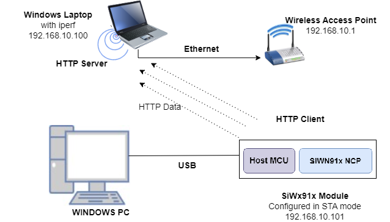**

Follow the [Getting Started with EFx32](https://docs.silabs.com/rs9116-wiseconnect/latest/wifibt-wc-getting-started-with-efx32/) guide to setup the hardware connections and Simplicity Studio IDE.

**NOTE**: 
- The Host MCU platform (EFR32MG21) and the SiWx91x interact with each other through the SPI interface. 
- The Host MCU platform (EFM32GG11) and the SiWx91x interact with each other through the SDIO interface.

## 4 Application Build Environment

1. Ensure the SiWx91x is loaded with the latest firmware following the [Getting started with a PC](https://docs.silabs.com/rs9116/latest/wiseconnect-getting-started). The firmware file is located at **< Si91x COMBO SDK > → connectivity_firmware**.

2. Ensure the EFx32 and SiWx91x set up is connected to your PC.

### 4.1 Board detection

### 4.1.1 SoC mode

1. In the Simplicity Studio IDE, 
    - The SiWx91x SoC board will be detected under **Debug Adapters** pane, as shown below.

      ****

### 4.1.2 NCP mode

1. In the Simplicity Studio IDE, 
    - The EFR32 board will be detected under **Debug Adapters** pane, as shown below.

      ****

    - The EFM32 board will be detected under **Debug Adapters** pane, as shown below.

      ****

### 4.2 Creation of project

Ensure the latest Gecko SDK along with the extension Si91x COMBO SDK is added to Simplicity Studio.

1. Click on the board detected and go to **EXAMPLE PROJECTS & DEMOS** section.

   ****

2. Filter for Wi-Fi examples from the Gecko SDK added. For this, check the *Wi-Fi* checkbox under **Wireless Technology** and *Gecko SDK Suite* checkbox under **Provider**. 

3. Under provider, for SoC based example, check the *SoC* checkbox and for NCP based example, check the *NCP* checkbox.

4. Now choose **Wi-Fi- NCP HTTP Client** example for NCP mode or choose **Wi-Fi- SoC HTTP Client example** for SoC mode and click on **Create**.

   For NCP mode:

   **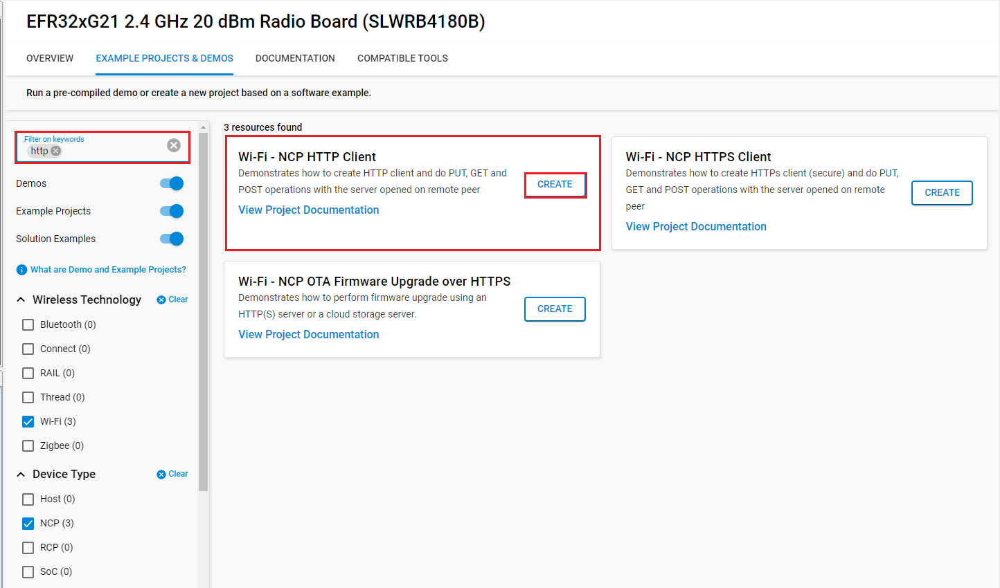**

   For SoC mode:
      
   **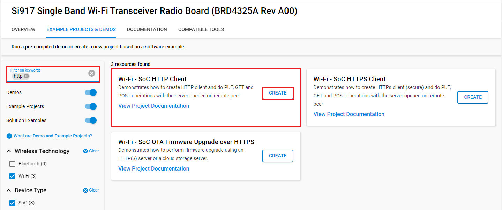**

5. Give the desired name to your project and cick on **Finish**.

   **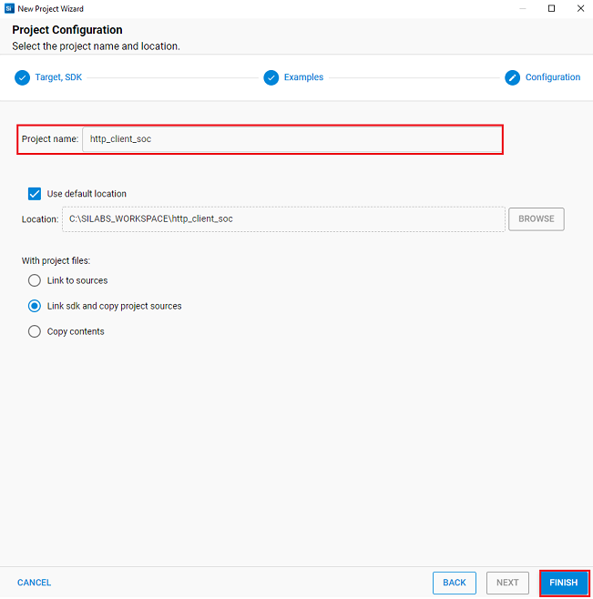**

### 4.3 Application configurations

The application can be configured to suit your requirements and development environment. 

1. In the Project explorer pane, expand the **http_client** folder and open the **rsi_http_client.c** file. Configure the following parameters based on your requirements.

   **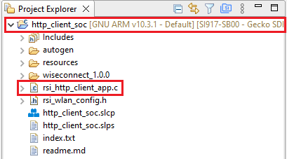**

   - SSID refers to the Wi-Fi network's name to which the SiWx91x is going to get connceted.

     ```c
     #define SSID                                  "SILABS_AP"      
     ```
   - SECURITY_TYPE refers to the mode of the SoftAP. Supported security types are OPEN, WPA, and WPA2.

     ```c 
     #define SECURITY_TYPE                           RSI_WPA2 
     ```
   - PSK refers to the secret key if the Access point is configured in WPA-PSK/WPA2-PSK security modes.

     ```c 
     #define PSK                                    "1234567890" 
     ``` 
   -  DHCP_MODE refers to whether the IP assignment of SiWx91x is done statically or through DHCP.
      
      1  - DHCP_MODE
      0  - Static IP assignment
   
      ```c
      #define DHCP_MODE                                          1
      ```

   - If you want to assign the IP address Statically, then set DHCP_MODE macro to **0** and configure DEVICE_IP, GATEWAY and NETMASK macros.
  
      ```c
      #define DEVICE_IP                                    "192.168.10.101"
      ```

      ```c
      #define GATEWAY                                      "192.168.10.1"
      ```
  
      ```c
      #define NETMASK                                      "255.255.255.0"
      ```

   - HTTP_PORT refers to the port number on which the remote HTTP server is running.

      ```c 
      #define HTTP_PORT                                         80
      ```
   - HTTP_SERVER_IP_ADDRESS refers to the IP address of the remote HTTP server.
   
      ```c 
      #define HTTP_SERVER_IP_ADDRESS                       "192.168.0.111"                               
      ```
   - HTTP_HOSTNAME refers to the host name of the remote HTTP server. This is usually same as the IP address of remote HTTP server.

      ```c 
      #define HTTP_HOSTNAME                                "192.168.0.111"                           
      ``` 
   - For secured HTTP or HTTPS, enable SSL under FLAGS.

      ```c 
      #define FLAGS                                              0                           
      ``` 
   - LOAD_CERTIFICATE value defines whether to load the certificates on to module or not.
   
      ```c
      #define LOAD_CERTIFICATE                                   1
      ```
   - HTTP_DATA refers to the data that is to be posted to the HTTP server

      ```c
      #define HTTP_DATA "employee_name=MR.REDDY&employee_id=RSXYZ123&designation=Engineer&company=SILABS&location=Hyderabad"   
      ```   

**Note**:

If certificates are not there in flash then ssl handshake will fail.

### 4.4 Execution of the Application    

#### 4.4.1 Building the Project - SoC Mode

- Once the project is created, right click on project and go to **Properties → C/C++ Build → Settings → Build Steps**.

- Add **post_build_script_SimplicityStudio.bat** file path present at SI917_COMBO_SDK.X.X.X.XX → utilities → isp_scripts_common_flash in build steps settings as shown in below image.

  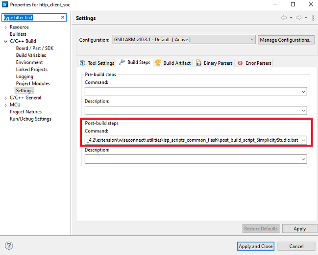

- Go to Properties → C/C++ Build → Settings → Tool Settings → GNU ARM C Compiler → Preprocessor → Defined symbols (-D) and check for M4 projects macro (RSI_M4_INTERFACE=1) and 9117 macro (CHIP_9117=1). If not present, add the macros and click **Apply and Close**.
  
  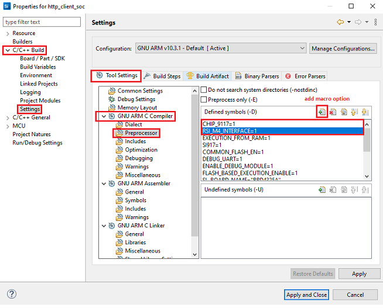

- Click on the build icon (hammer) or right click on project name and choose **Build Project** to build the project.

  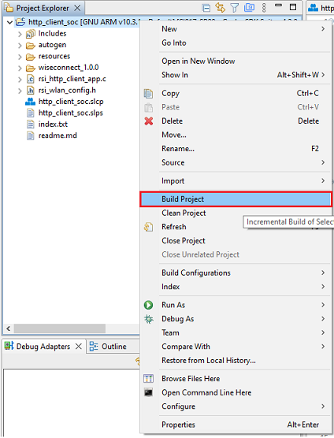

- Make sure the build returns 0 Errors and 0 Warnings.
  

#### 4.4.2 Build the Project - NCP Mode

1. Check for CHIP_9117 macro in preprocessor settings as mentioned below.
   - Right click on project name.
   - Go to **Properties → C/C++ Build → Settings → Tool Settings → GNU ARM C Compiler → Preprocessor → Defined symbols (-D)**.
   - If CHIP_9117 macro is not present, add it by clicking on add macro option.
   - Click on **Apply and Close**.

     **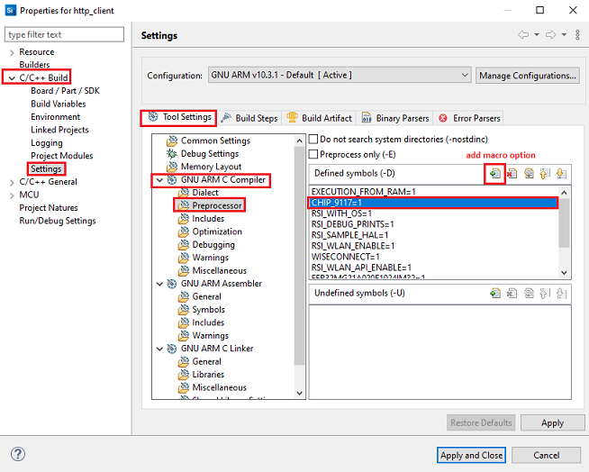**

2. Click on the build icon (hammer) or right click on project name and choose **Build Project** to build the project.

    **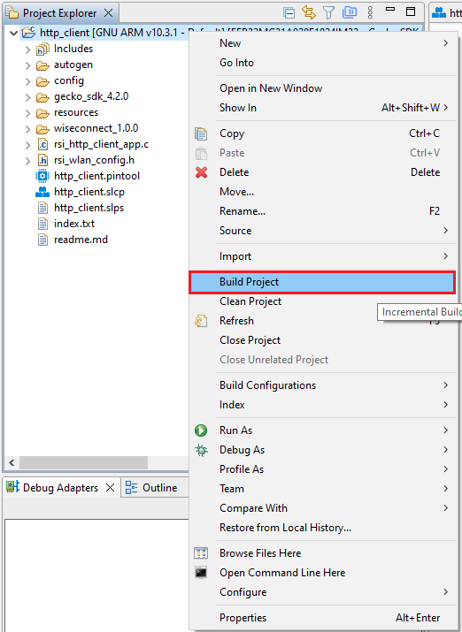**

3. Make sure the build returns 0 Errors and 0 Warnings.

### 4.4.3 Set up for application prints

Before setting up Tera Term, do the following for SoC mode.

**SoC mode**: 
You can use either of the below USB to UART converters for application prints.
1. Set up using USB to UART converter board.

  - Connect Tx (Pin-6) to P27 on WSTK
  - Connect GND (Pin 8 or 10) to GND on WSTK

    ****

2. Set up using USB to UART converter cable.

  - Connect RX (Pin 5) of TTL convertor to P27 on WSTK
  - Connect GND (Pin1) of TTL convertor to GND on WSTK

    **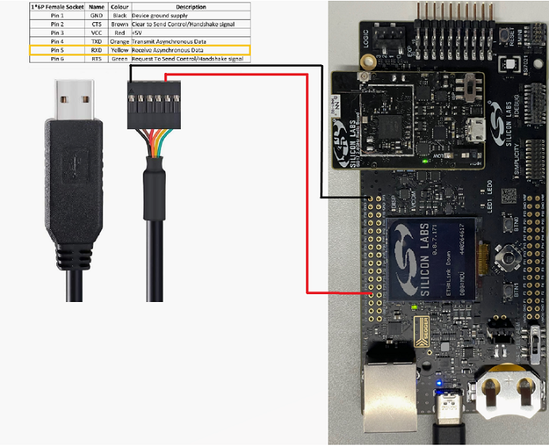**

**Tera term set up - for NCP and SoC modes**

1. Open the Tera Term tool. 
   - For SoC mode, choose the serial port to which USB to UART converter is connected and click on **OK**. 

     ****

   - For NCP mode, choose the J-Link port and click on **OK**.

     ****

2. Navigate to the Setup → Serial port and update the baud rate to **115200** and click on **OK**.

    ****

    ****

The serial port is now connected. 

### 4.4.4 Execute the application

1. Once the build was successful, right click on project and select **Debug As → Silicon Labs ARM Program** to program the device as shown in below image.

   **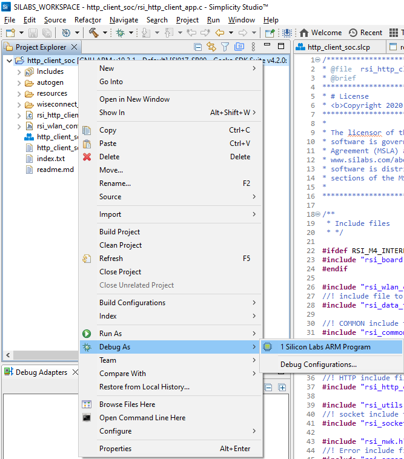**

2. As soon as the debug process is completed, the application control branches to the main().

3. Before running the application, set up the HTTP server on a remote PC. For details, refer to Appendix section. 

4. Once the HTTP server is running successfully, click on the **Resume** icon in the Simplicity Studio IDE toolbar to run the application.

   ****

5. After the program gets executed, the SiWx91x connects to AP and get an IP address.

6. Later, the application requests for HTTP PUT to PUT/Create the file on to the server, which is given in index.txt file and wait until put file completes.

7. The remote HTTP server accepts the PUT request and writes the received data to a file. User can find the created new file **index.html** at path **<Si917 COMBO SDK> → utilities → scripts**.

8. After successful creation of file using HTTP PUT, the application requests for the file **index.html** from the HTTP server using HTTP GET method and waits until complete response is received from the server.

9. After fetching **index.html**, the application posts the given data in **HTTP_DATA** to the HTTP server using HTTP POST method.

10. User can see the log messages at HTTP server. Please find the below image for success responses for HTTP PUT, HTTP GET and HTTP POST.

    ****

### 4.4.5 **Application Prints - SoC mode**:

   **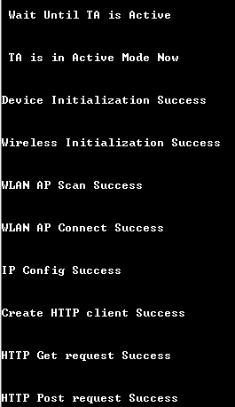**

**Application Prints - NCP mode**:

   **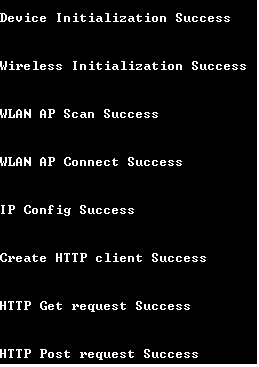**

 
## 5 Selecting Bare Metal configuration

1. By default, the application runs over FreeRTOS. To run the application with Bare metal configurations, follow the below steps.
   - For Simplicity Studio IDE,
      - Right click on project name
      - Go to **Properties → C/C++ Build → Settings → Tool Settings → GNU ARM C Compiler → Preprocessor → Defined Symbols (-D)**.
      - Select RSI_WITH_OS symbol and click on **Delete** symbol.
      - Click on **Apply and Close**.
      
        **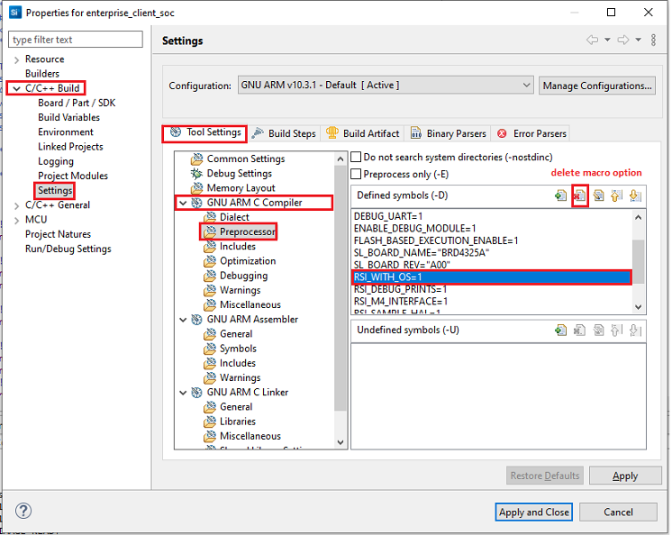**

 ## Appendix

 ### Steps to set up HTTP server

1. In a Windows PC, make sure python is installed.

2. Navigate to **<Si917 COMBO SDK> → utilities → scripts**. Run **simple_http_server.py** acript on port number 80 using the following command.
   
   `python simple_http_server.py 80`
   
   ****

