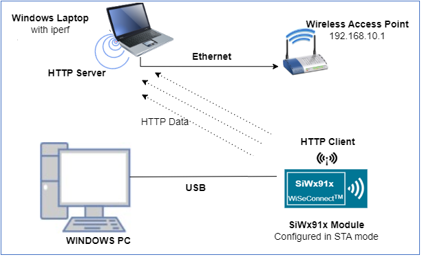
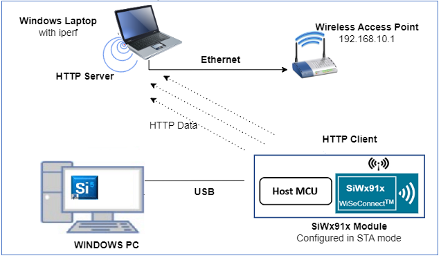
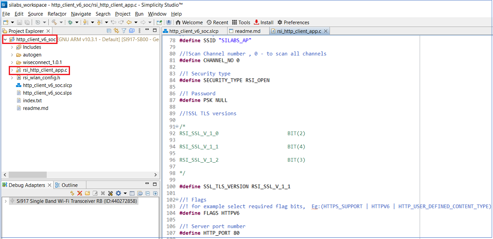
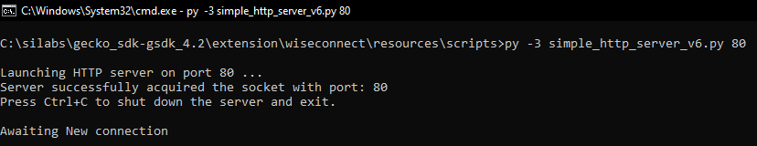
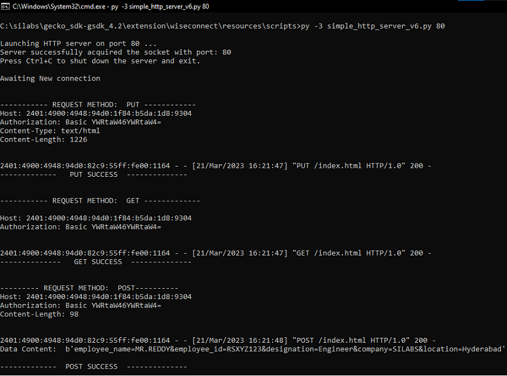
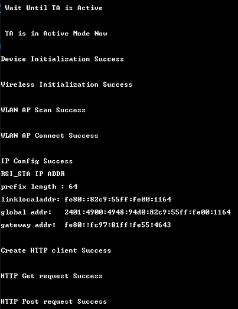
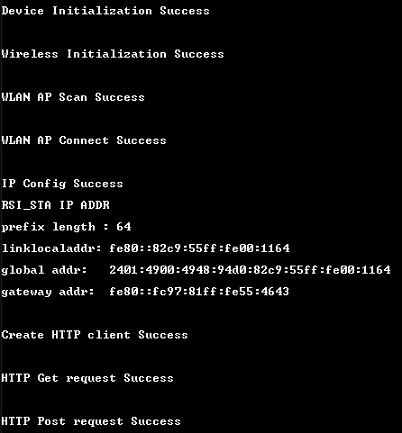

# **HTTP Client (IPv6)** 

## **1 Introduction**
This application demonstrates how to configure SiWx91x device as HTTP client and perform HTTP PUT, GET and POST operations with the HTTP server opened on a remote peer. The data communication happens over IPv6 addressing.

## **2 Prerequisites**
For running the application, you will need the following:
### **2.1 Hardware Requirements**
- A Windows PC
- A Wi-Fi Access Point
#### **2.1.1 SoC** 
   - Silicon Labs SiWx917 PK6030A SoC Kit which includes
      - BRD4001A/BRD4002A Wireless Starter Kit Mainboard
      - BRD4325A Radio Board
   - USB TO UART converter or TTL cable
#### **2.1.2 NCP**
   - Silicon Labs PCB8036A Si917 QMS SB Expansion Board
   - [Silicon Labs SLWSTK6006A EFR32xG21 Wireless Starter Kit](https://www.silabs.com/development-tools/wireless/efr32xg21-wireless-starter-kit) which includes
      - BRD4001A/BRD4002A Wireless Starter Kit Mainboard
      - BRD4180A/BRD4180B Radio Board
### **2.2 Software Requirements**
- Simplicity Studio IDE
   - To download and install the Simplicity Studio IDE, refer to the [Simplicity Studio IDE Set up]() section in ***Getting started with SiWx91x*** guides.
- SiWx917_WiSeConnect_SDK.x.x.x.x
- Python 3.7 ([Python download](https://www.python.org/downloads/)) 

## **3 Set up diagram**
### **3.1 SoC** 


### **3.2 NCP** 



**NOTE**: 
- The Host MCU platform (EFR32xG21) and the SiWx91x interact with each other through the SPI interface. 


## **4 Set up**
### **4.1 SoC/NCP** 
- Follow the [Hardware connections and Simplicity Studio IDE Set up]()  section in the respective ***Getting Started with SiWx91x*** guides to make the hardware connections and add the Gecko and SiWx91x COMBO SDKs to Simplicity Studio IDE.
### **4.2 SiWx91x module's Firmware Update**
- Ensure the SiWx91x module is loaded with the latest firmware following the [SiWx91x Firmware Update]() section in the respective ***Getting started with SiWx91x*** guides.

## **5 Creation of Project**
  
To create the HTTP Client example project in the Simplicity Studio IDE, follow the [Creation of Project]() section in the respective ***Getting started with SiWx91x*** guides. 
   - For SoC, choose the **Wi-Fi - SoC HTTP Client** example.
   - For NCP, choose the **Wi-Fi - NCP HTTP Client** example.


## **6 Application configuration**
Read through the following sections and make any changes needed. 
  
1. In the Project explorer pane of the IDE, expand the **http_client_v6** folder and open the **rsi_http_client_app.c** file. Configure the following parameters based on your requirements.

   

- **Enable the IPv6 macro**

   - Right click on the project and choose 'Properties'
   - Go to 'C/C++ Build' | 'Settings' | 'GNU ARM C Compiler' | 'Preprocessor' and add the macro `RSI_CONFIGURE_IPv6=1`
   - Select 'Apply' and 'OK' to save the settings

- **Wi-Fi Configuration**
    ```c
    //! Wi-Fi Network Name
    #define SSID           "SILABS_AP"   

    //! Wi-Fi Password
    #define PSK            "1234567890"     

    //! Wi-Fi Security Type: RSI_OPEN/RSI_WPA/RSI_WPA2
    #define SECURITY_TYPE  RSI_WPA2        

    //! Wi-Fi channel
    #define CHANNEL_NO     0                 
    ```

- **HTTP server settings**
    ```c
    //! HTTP_PORT refers to the port number on which the remote HTTP server is running
    #define HTTP_PORT               80                                           
    
    //! HTTP_SERVER_IP_ADDRESS refers to the IP address of the remote HTTP server.
    #define HTTP_SERVER_IP_ADDRESS  "2001:0db8:0000:0001:0000:0000:0000:0121"       
    
    //! HTTP_HOSTNAME refers to the host name of the remote HTTP server, usually it is same as the IP address of remote HTTP server
    #define HTTP_HOSTNAME           "2001:0db8:0000:0001:0000:0000:0000:0121"    

    //! HTTP_DATA refers to the data that is to be posted to the HTTP server
    #define HTTP_DATA               "employee_name=MR.REDDY&employee_id=RSXYZ123&designation=Engineer&company=SILABS&location=Hyderabad"  
    ```

- **To configure IP address**
DHCP_MODE refers whether IP address configured through DHCP or STATIC

    ```c   
    //! whether IP address is configured through DHCP or STATIC
    #define DHCP_MODE               1           
    ```
   > If user wants to configure STA IP address through DHCP then set DHCP_MODE to "1" and skip configuring the DEVICE_IP6 and GATEWAY6 macros.
                                          (Or)
   > If user wants to configure STA IP address through STATIC then set DHCP_MODE macro to "0" and configure the DEVICE_IP6 and GATEWAY6 macros.
      ```c   
      #define DEVICE_IP6              "2001:db8:0:1::121"
      #define GATEWAY6                "2001:db8:0:1::121"
      ```

## **7 Setup for Serial Prints**

To Setup the serial prints, follow the [Setup for Serial Prints]() section in the respective ***Getting started with SiWx91x*** guides.
 
## **8 Build, Flash, and Run the Application**

To build, flash, and run the application project refer to the [Build and Flash the Project]() section in the respective ***Getting Started with SiWx91x*** guide.

## **9 Application Execution Flow**

1. Before running the application, set up the HTTP server on a remote PC. Navigate to **<Si917 COMBO SDK> → utilities → scripts**. Run **simple_http_server_v6.py** acript on port number 80 using the following command.
   
   `python simple_http_server_v6.py 80`
   
   ****

2. After the program gets executed, the SiWx91x connects to AP and get an IP address.

3. Later, the application requests for HTTP PUT to PUT/Create the file on to the server, which is given in index.txt file and waits until the PUT file operation is complete.

5. The remote HTTP server accepts the PUT request and writes the received data to a file. User can find the newly created file **index.html** at the following path: **<Si917 COMBO SDK> → utilities → scripts**.

6. After successful creation of the file using HTTP PUT, the application requests for **index.html** file from the HTTP server using HTTP GET method and waits until complete response is received from the server.

7. After fetching **index.html** file, the application posts the given data in **HTTP_DATA** to the HTTP server using HTTP POST method.

8. User can see the log messages at HTTP server as follows

    ****

9. The application prints can be observed as follows:

   **SoC:**
  
   

   **NCP:**

   

## **Appendix**

By default, the application runs over FreeRTOS. To run the application with Bare metal configurations, follow the Bare Metal configuration section in the ***Getting Started with SiWx91x*** guides.
