# HTTP/HTTPS OTA

## 1 Purpose/Scope 

This application demonstrates how to update new firmware to SiWx91x EVK using remote HTTP/s server or cloud storage server.

> Note:
 By enabling HTTPS_SUPPORT Flag in .c file, the same HTTP_OTAF application is used  for HTTPS_OTAF.

In this application, SiWx91x EVK connects to Access Point as HTTP/HTTPS client and establishes connection with HTTP/s server (Apache server) or the cloud storage server (i.e., AWS S3 bucket/Azure Blob storage). After successful HTTP/s connection, SiWx91x EVK sends firmware file request (HTTP GET Request) to remote server and server responds with Firmware file.

The server transferred firmware file gets loaded/updated in the SiWx91x module flash memory. After successful firmware update, HTTP/s OTA API returns success response.

## 2 Prerequisites/Setup Requirements 

Before running the application, set up the following.

### 2.1 Hardware Requirements 

- Windows PC
- Wireless Access point
- SiWx91x Wi-Fi Evaluation Kit. The SiWx91x supports multiple operating modes. See [Operating Modes]() for details.
  - **SoC Mode**:
      - Silicon Labs [BRD4325A](https://www.silabs.com/)
  - **NCP Mode**:
      - Silicon Labs [(BRD4180A, BRD4280B)](https://www.silabs.com/); **AND**
      - Host MCU Eval Kit. This example has been tested with:
        - Silicon Labs [WSTK + EFR32MG21](https://www.silabs.com/development-tools/wireless/efr32xg21-bluetooth-starter-kit)

#### SoC Mode : 

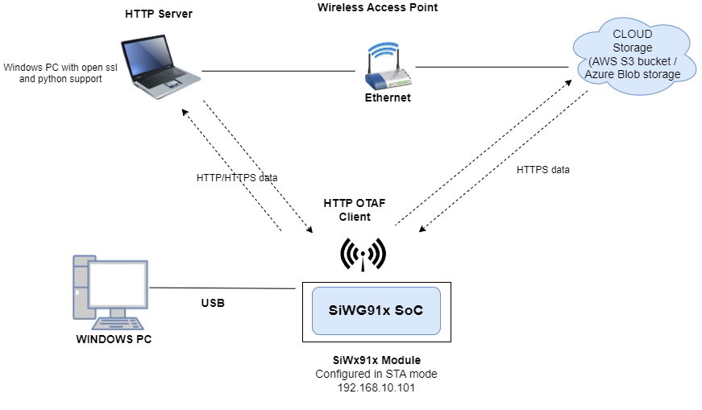
  
#### NCP Mode :  

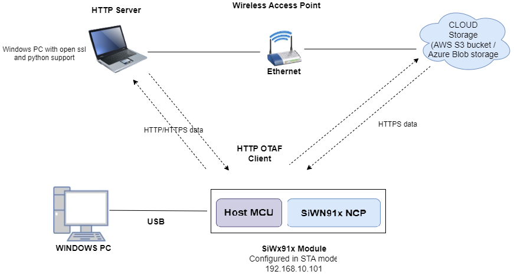


### 2.2 Software Requirements 

- Embedded Development Environment


   - For Silicon Labs EFx32, use the latest version of [Simplicity Studio](https://www.silabs.com/developers/simplicity-studio)

- Install and configure Wamp-Apache HTTP server, refer to Appendix section 6.3 **Configuring and uploading firmware on Apache HTTP**.
- Install and configure Wamp-Apache HTTPs server, refer to Appendix section 6.4 **Configuring and uploading firmware on Apache HTTPs**.
- Configure AWS S3 bucket, refer to Appendix setion 6.1 **Configuring AWS S3 Bucket**.
- Configure Azure Blob storage, refer to Appendix section 6.2 **Configuring Azure Blob Storage**.

## 3 Application Build Environment 
### 3.1 Project Setup
- **SoC Mode**
  - **Silicon Labs SiWx91x SoC**. Follow the [Getting Started with SiWx91x SoC](https://docs.silabs.com/) to setup the example to work with SiWx91x SoC and Simplicity Studio.
- **NCP Mode**
  - **Silicon Labs EFx32 Host**. Follow the [Getting Started with EFx32](https://docs.silabs.com/rs9116-wiseconnect/latest/wifibt-wc-getting-started-with-efx32/) to setup the example to work with EFx32 and Simplicity Studio.


### 3.2 NCP Mode - Host Interface 

* By default, the application is configured to use the SPI bus for interfacing between Host platforms(EFR32MG21) and the SiWx91x EVK.
 	  
### 3.3 Bare Metal/RTOS Support

This application supports bare metal environment. The application project files (Simplicity studio) are provided with bare metal configuration in the SDK. 

## 4 Creating the project

1. Ensure the SiWx91x loaded with the latest firmware following the [Getting started with a PC](https://docs.silabs.com/rs9116/latest/wiseconnect-getting-started). The firmware file is located at `<Si917 COMBO SDK>/connectivity_firmware/`.

2. Ensure the EFx32 and SiWx91x set up is connected to your PC.

### 4.1 Board detection

### 4.1.1 SoC mode
1. In the Simplicity Studio IDE, 
    - The 917 SoC board will be detected under **Debug Adapters** pane as shown below.

      **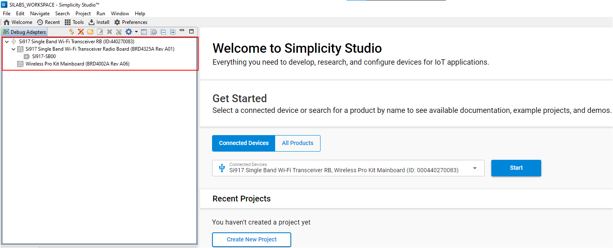**

### 4.1.2 NCP mode

1. In the Simplicity Studio IDE, 
    - The EFR32 board will be detected under **Debug Adapters** pane as shown below.

      ****

    - The EFM32 board will be detected under **Debug Adapters** pane as shown below.

      ****

### 4.2 Creation of project

Ensure the latest Gecko SDK along with the extension Si917 COMBO SDK is added to Simplicity Studio.

1. Click on the board detected and go to **EXAMPLE PROJECTS & DEMOS** section.

   **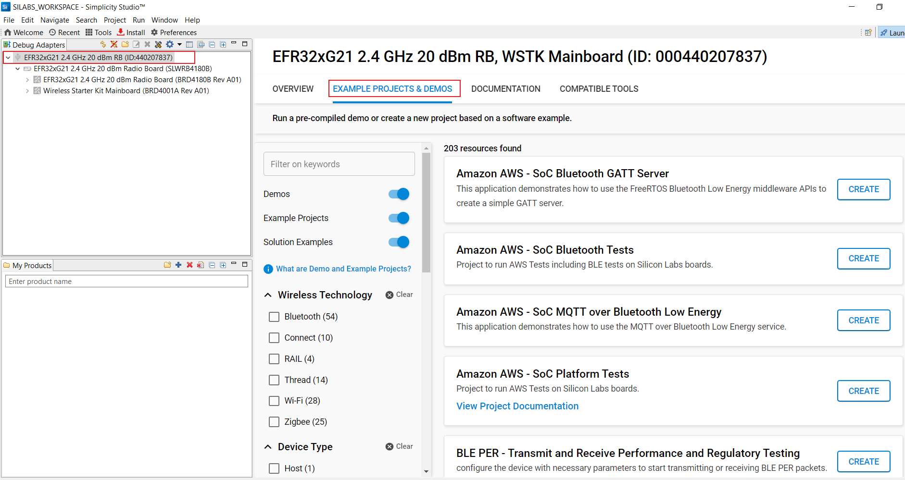**

2. Filter for Wi-Fi examples from the Gecko SDK added. For this, check the *Wi-Fi* checkbox under **Wireless Technology** and *Gecko SDK Suite* checkbox under **Provider**. 

3. Under provider, for SoC based example, check the *SoC* checkbox and for NCP based example, check the *NCP* checkbox.

4. Now choose Wi-Fi- NCP OTA Firmware upgrade over HTTPS example for NCP mode or choose Wi-Fi- SoC  Firmware upgrade over HTTPS example for SoC mode and click on **Create**.
  For NCP mode:

   **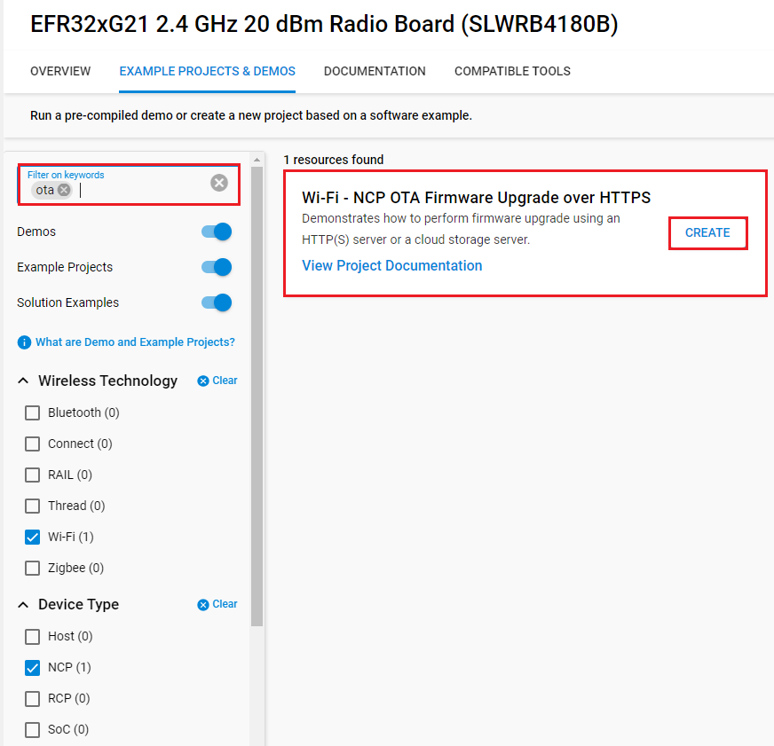**

    For SoC mode:
      
   **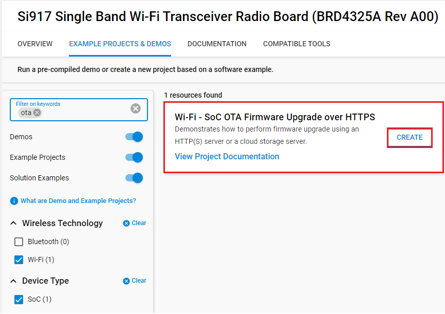**

5. Give the desired name to your project and cick on **Finish**.

   **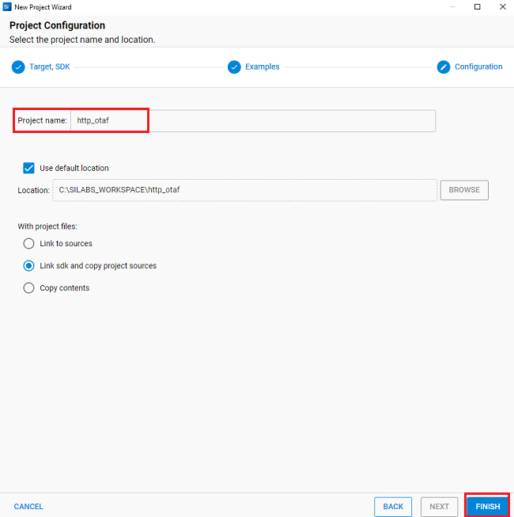**

## 5 Application Configuration Parameters 

The application can be configured to suit user requirements and development environment. Read through the following sections and make any changes needed. 

### 5.1 Open rsi_http_otaf_app.c file

#### 5.1.1 User must update the below common parameters  

SSID refers to the name of the Access point.

```c
#define SSID                         "SILABS_AP"
```
  
CHANNEL_NO refers to the channel in which AP would be started
  
```c
#define CHANNEL_NO                  0
 ```
  
SECURITY_TYPE refers to the type of security. Generally Access point supports Open, WPA, WPA2 securities.
  
   Valid configuration is:

   - RSI_OPEN - For OPEN security mode

   - RSI_WPA  - For WPA security mode

   - RSI_WPA2 - For WPA2 security mode
  
```c
#define SECURITY_TYPE                RSI_WPA2
```

PSK refers to the secret key of the Access point(applies when AP is configured in WPA/WPA2 security modes)
  
```c
#define PSK                          "1234567890"
```

DHCP_MODE refers the way of configuring IP address to Silicon Labs module

   1-Enables DHCP mode (gets the IP from DHCP server)

   0-Disables DHCP mode
  
   Desired configuration : 
   
```c
#define DHCP_MODE                    1
```
  
If DHCP Mode is disabled configure a static IP address using the following macros. These values are in long format and in little endian order. For example an address of "192.168.10.1" is represented by a value of 0x010AA8C0.

```c
#define DEVICE_IP                    0X010AA8C0
```
  
IP address of the gateway should also be in long format and in little endian byte order

   Example: To configure "192.168.10.1" as Gateway, update the macro GATEWAY as 0x010AA8C0
  
```c
#define GATEWAY                      0x010AA8C0
```

IP address of the network mask should also be in long format and in little endian byte order

   Example: To configure "255.255.255.0" as network mask, update the macro NETMASK as 0x00FFFFFF

```c
#define NETMASK                      0x00FFFFFF
```
  
> Note:
> In AP mode, configure same IP address for both DEVICE_IP and GATEWAY macros.

#### 5.1.2 User must update the below server configuration parameters

Based on the type of server (Apache/AWS S3 bucket/Azure Blob Storage) from which firmware files needs to be downloaded, the below mentioned parameters needs to be configured.
Configure FLAGS to choose the version and security type to be enabled

   Valid configurations are :
   
   Enable IPv6 set this bit in FLAGS, Default is IPv4

   ```c
   #define HTTPV6           BIT(0) 
   ```   
   Set HTTPS_SUPPORT to use HTTPS feature

  ```c
   #define HTTPS_SUPPORT    BIT(1) 
   ```
   
   Set HTTP_V_1_1 to use HTTP version 1.1

  ```c
   #define HTTP_V_1_1       BIT(6) 
   ```
   
In code, **AWS_ENABLE** macro is enabled by default in application.<br />
Depending on the requirement user can enable downloading firmware from Azure Blob storage (Enable Macro **AZURE_ENABLE**).<br />
Else if both AWS and Azure macro is disabled, HTTP/s Apache server can be used to download the firmware.

- HTTP_PORT refers to HTTP Server port number
- HTTP_SERVER_IP_ADDRESS refers to HTTP Server IP address
- HTTP_URL refers to HTTP resource name
- HTTP_HOSTNAME refers to HTTP server hostname
- HTTP_EXTENDED_HEADER refers to HTTP extended header. If NULL default extented header is filled
- USERNAME refers to the username to be used to access the HTTP resource
- PASSWORD refers to the password to be used to access the HTTP resource

**For Apache HTTP Server**
   
   ```c
   //Sample configurations
   #define FLAGS                   0
   #define HTTP_PORT               80
   #define HTTP_SERVER_IP_ADDRESS  "192.168.xxx.xxx"
   #define HTTP_URL                "Firmware/firmware.rps" //firwmare file name to download
   #define HTTP_HOSTNAME           "192.168.xxx.xxx"
   #define USERNAME                "admin"
   #define PASSWORD                "admin"
   ```

**For Apache HTTPS Server**
   * Include Root certificate pem file for SSL connection
   * Provide the PC IP where Apache server is running in HTTP_SERVER_IP_ADDRESS 
   * Provide the firmware package name uploaded in Apache server in HTTP_URL
   
   ```c
   //Sample configurations
   #include "cacert.pem"
   #define FLAGS                   HTTPS_SUPPORT
   #define HTTP_PORT               443
   #define HTTP_SERVER_IP_ADDRESS  "192.168.xxx.xxx"
   #define HTTP_URL                "Firmware/firmware.rps" //firwmare file name to download
   #define HTTP_HOSTNAME           "192.168.xxx.xxx"
   #define USERNAME                "admin"
   #define PASSWORD                "admin"
   ```
 
**For AWS S3 Bucket** 
 
   * Include Starfield root certificate file for SSL connection
  
> Note : The certificate authority for Amazon AWS S3 is Starfield, hence we need to include Starfield Root certification for SSL connection to be successful. This certificate is already included in the SDK in linear array format "aws_starfield_ca.pem.h" which can be directly used for SSL connection to AWS S3.

   * Extract the hostname from AWS S3 bucket URL `https://<Your-S3-Bucket-name>.s3.<Your-nearest-S3-location>.amazonaws.com/firmware.rps` and provide it in **hostname**
  
> Example: For S3 bucket URL https://example.s3.ap-south-1.amazonaws.com/firmware.rps", hostname will be "example.s3.ap-south-1.amazonaws.com"

   * Extract the firmware package name from URL `https://<Your-S3-Bucket-name>.s3.<Your-nearest-S3-location>.amazonaws.com/firmware.rps` and provide it in **HTTP_URL**
 
>  Example: For S3 bucket URL "https://example.s3.ap-south-1.amazonaws.com/firmware.rps", HTTP_URL will be "firmware.rps"
 
   ```c
   //Sample configurations
   #include "aws_starfield_ca.pem.h"         //CA certificate
   #define FLAGS                              HTTPS_SUPPORT
   #define HTTP_PORT                          443
   #define HTTP_URL                           "firmware.rps" //firwmare file name to download
   #define USERNAME                           ""
   #define PASSWORD                           ""
   char *hostname                             ="example.s3.ap-south-1.amazonaws.com";
   ```
   
   **Note:** The `USERNAME` and `PASSWORD` is provided as empty string "" since the S3 bucket URL created has public access provided. Refer Appendix section 6.1 on how to upload Firmware in AWS S3 Bucket. 


* **For Azure Blob storage**
   * Include Digicert (Baltimore CyberTrust Root) certificate file for SSL connection
   
> Note : The certificate authority for Azure Blob storage is Digicert, hence we need to include Digicert Root (Baltimore CyberTrust Root) certification for SSL connection to be successful. This certificate is already included in the SDK in linear array format "http_batimore_ca.pem.h" which can be directly used for SSL connection to Azure Blob storage.

   * Extract the hostname from Azure Blob storage URL `https://<Your-Blob-Name>.blob.core.windows.net/rps/firmware.rps` and provide it in hostname
   
> Example: For Azure Blob storage URL "https://example.blob.core.windows.net/example_directory/firmware.rps", hostname will be "example.blob.core.windows.net"

   * Extract the firmware package name from URL `https://<Your-Blob-Name>.blob.core.windows.net/rps/firmware.rps` and provide it in HTTP_URL

> Example: For Azure Blob storage URL "https://example.blob.core.windows.net/example_directory/firmware.rps", HTTP_URL will be "rps/firmware.rps"

   ```c
   //Sample configurations
   #include "http_baltimore_ca.pem.h"        //Baltimore Root CA
   #define FLAGS                             HTTPS_SUPPORT
   #define HTTP_PORT                         443
   #define HTTP_URL                          "rps/firmware.rps" //firwmare file name to download
   #define USERNAME                          ""
   #define PASSWORD                          ""
   char *hostname                            ="example.blob.core.windows.net";
   ```
**Note:** The USERNAME and PASSWORD is provided as empty string "" since the Azure Blob storage URL created has public access provided. Refer to Appendix section 6.2 on how to upload Firmware in Azure Blob storage

### 5.2 Open  rsi_wlan_config.h file. User can also modify the below parameters as per their needs and requirements.

* For Apache HTTP Server

```c
#define RSI_TCP_IP_FEATURE_BIT_MAP (TCP_IP_FEAT_DHCPV4_CLIENT | TCP_IP_FEAT_HTTP_CLIENT | TCP_IP_FEAT_EXTENSION_VALID)
#define RSI_EXT_TCPIP_FEATURE_BITMAP EXT_FEAT_HTTP_OTAF_SUPPORT
```
   
* For Apache HTTPS Server

```c
#define RSI_TCP_IP_FEATURE_BIT_MAP (TCP_IP_FEAT_DHCPV4_CLIENT | TCP_IP_FEAT_HTTP_CLIENT| TCP_IP_FEAT_EXTENSION_VALID | TCP_IP_FEAT_SSL)
#define RSI_EXT_TCPIP_FEATURE_BITMAP EXT_FEAT_HTTP_OTAF_SUPPORT
```

* For AWS S3 Bucket/Azure Blob storage       

```c
#define RSI_TCP_IP_FEATURE_BIT_MAP (TCP_IP_FEAT_DHCPV4_CLIENT | TCP_IP_FEAT_HTTP_CLIENT| TCP_IP_FEAT_EXTENSION_VALID | TCP_IP_FEAT_SSL | TCP_IP_FEAT_DNS_CLIENT)
#define RSI_EXT_TCPIP_FEATURE_BITMAP (EXT_FEAT_HTTP_OTAF_SUPPORT | EXT_TCP_IP_SSL_16K_RECORD)
```
 
### 5.3 To Load Certificate 

**rsi_wlan_set_certificate()** API expects the certificate in the form of linear array. Convert the pem certificate into linear array form using python script provided in the SDK `<SDK>/resources/certificates/certificate_script.py`.

   For example : If the certificate is ca-certificate.pem, enter the command in the following way:
   python certificate_script.py ca-certificate.pem 
   The script will generate ca-certificate.pem in which one linear array named ca-certificate contains the certificate.

Root CA certificate needs to be converted as mentioned above.

After the conversion, place the converted file in `<SDK>/resources/certificates/` path and include the certificate file in rsi_http_otaf_app.c

  
For firmware download using HTTPs Apache server, replace the below certificate include in application

```c 
 // Certificate includes
 #include "cacert.pem"
 Replace the certificate in `rsi_wlan_set_certificate()` API in the application with the converted pem array.
 
 // Load Security Certificates
 status = rsi_wlan_set_certificate(RSI_SSL_CA_CERTIFICATE, cacert, (sizeof(cacert) - 1));
```

**Note:** For AWS S3 use the certificate "aws_starfield_ca.pem.h" and for Azure Blob storage use the certificate "http_baltimore_ca.pem.h" included in release pacakge for SSL connection. The corresponding rsi_wlan_set_certificate function calls would be as follows:

For AWS
```
status = rsi_wlan_set_certificate(RSI_SSL_CA_CERTIFICATE, aws_starfield_ca, (sizeof(aws_starfield_ca) - 1));
```

For Azure
```
status = rsi_wlan_set_certificate(RSI_SSL_CA_CERTIFICATE, http_baltimore_ca, (sizeof(http_baltimore_ca) - 1));
```

## 6 Building and Testing the Application

Follow the below steps for the successful execution of the application.

### 6.1 Loading the SiWx91x Firmware

Refer [Getting started with a PC](https://docs.silabs.com/rs9116/latest/wiseconnect-getting-started) to load the firmware into SiWx91x EVK. The firmware file is located in `<SDK>/firmware/`

### 6.2 Building the Project
#### 6.2.1. Building the Project - SoC Mode

- Once the project is created, right click on project and go to properties → C/C++ Build → Settings → Build Steps.

- Add **post_build_script_SimplicityStudio.bat** file path present at SI917_COMBO_SDK.X.X.X.XX → utilities → isp_scripts_common_flash in build steps settings as shown in below image.

  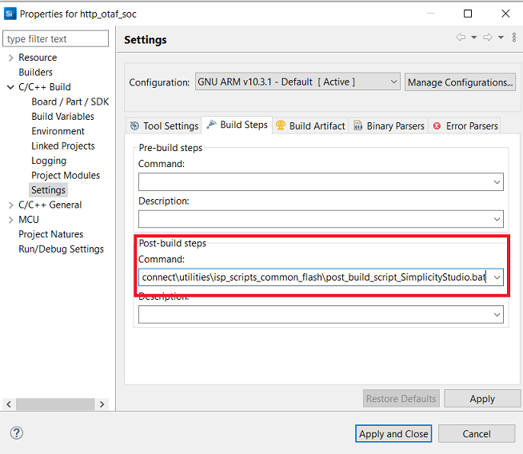

- Go to properties → C/C++ Build → Settings → Tool Settings → GNU ARM C Compiler → Preprocessor → Defined symbols (-D) and check for M4 projects macro (RSI_M4_INTERFACE=1) and 9117 macro (CHIP_9117=1). If not present, add the macros and click **Apply and Close**.
  
  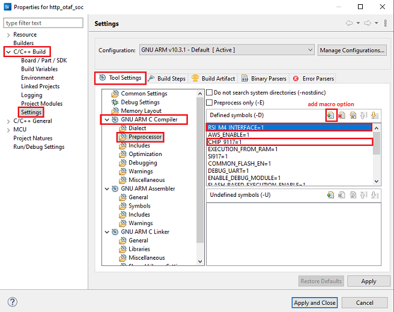

- Click on the build icon (hammer) or right click on project name and choose **Build Project** to build the project.

  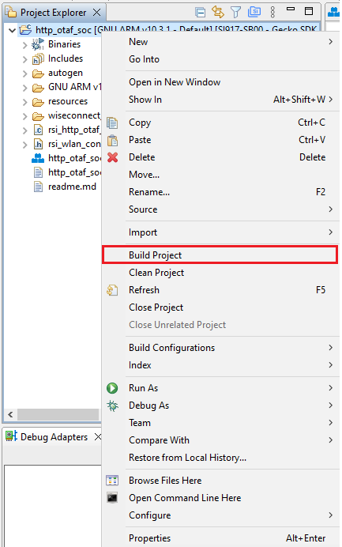

- Make sure the build returns 0 Errors and 0 Warnings.
  

#### 6.2.2. Build the Project - NCP Mode

- Check for CHIP_9117 macro in preprocessor settings as mentioned below.
   - Right click on project name.
   - Go to properties → C/C++ Build → Settings → Tool Settings → GNU ARM C Compiler → Preprocessor → Defined symbols (-D).
   - If CHIP_9117 macro is not present, add it by clicking on add macro option.
   - Click on **Apply and Close**.

     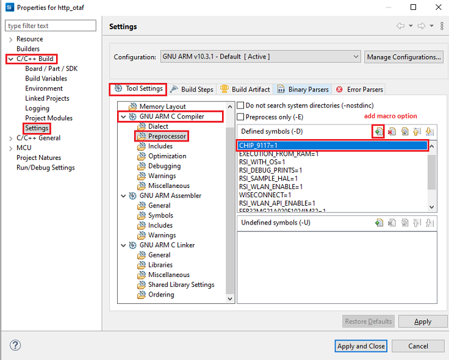

- Click on the build icon (hammer) or right click on project name and choose **Build Project** to build the project.

  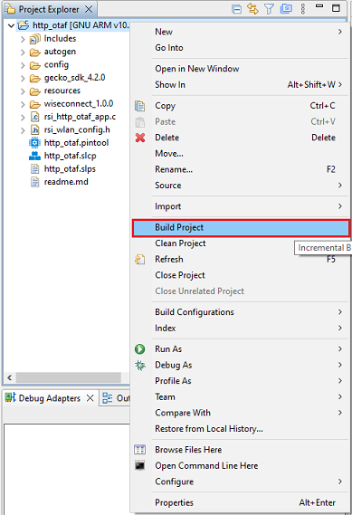

- Make sure the build returns 0 Errors and 0 Warnings.

### 6.3 Set up for application prints

Before setting up Tera Term, do the following for SoC mode.

**SoC mode**: 
You can use either of the below USB to UART converters for application prints.
1. Set up using USB to UART converter board.

  - Connect Tx (Pin-6) to P27 on WSTK
  - Connect GND (Pin 8 or 10) to GND on WSTK

    

2. Set up using USB to UART converter cable.

  - Connect RX (Pin 5) of TTL convertor to P27 on WSTK
  - Connect GND (Pin1) of TTL convertor to GND on WSTK

    

**Tera term set up - for NCP and SoC modes**

1. Open the Tera Term tool. 
   - For SoC mode, choose the serial port to which USB to UART converter is connected and click on **OK**. 

     ****

   - For NCP mode, choose the J-Link port and click on **OK**.

     ****

2. Navigate to the Setup → Serial port and update the baud rate to **115200** and click on **OK**.

    ****

    ****

The serial port is now connected. 

### 6.4 Execute the application

1. Once the build was successful, right click on project and select Debug As → Silicon Labs ARM Program to program the device as shown in below image.

   **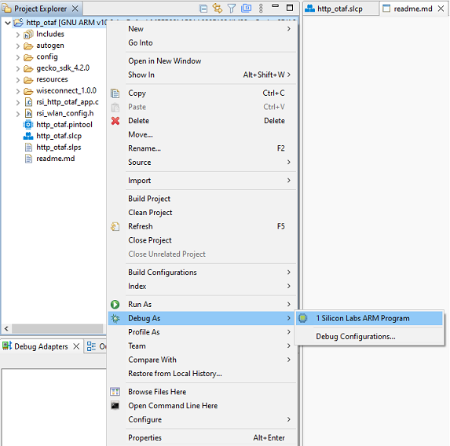**

2. As soon as the debug process is completed, the application control branches to the main().

3. Go to the J-link Silicon Labs console pane to observe the debug prints in the Serial 1 tab.

4. Click on the **Resume** icon in the Simplicity Studio IDE toolbar to run the application.

   ****

### Application prints

SoC mode (with AWS)

   **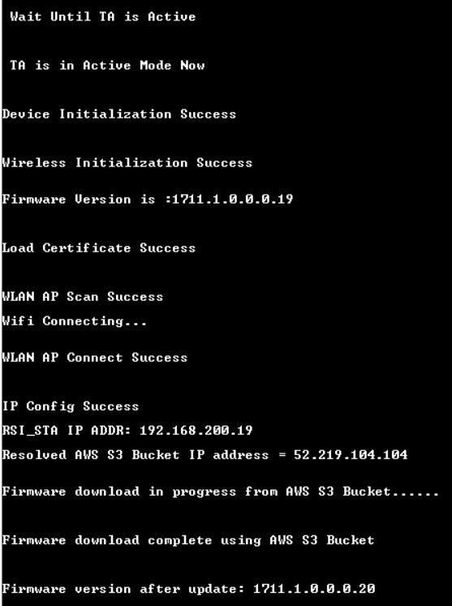**

NCP mode (with AWS)

   **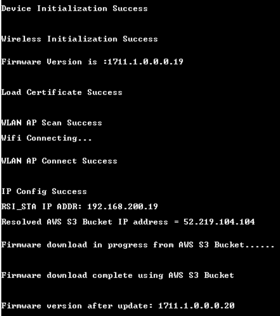**

SoC mode (with Apache)

   **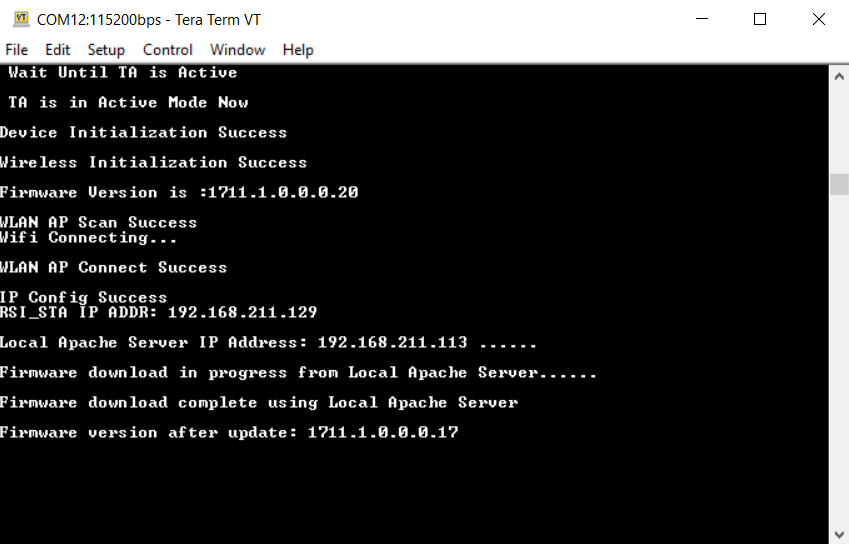**

NCP mode (with Apache)

   **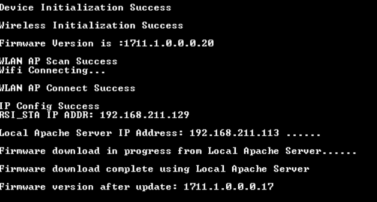**


    
## 7 Appendix

### 7.1 Configuring AWS S3 Bucket

* Sign into the Amazon S3 console at https://console.aws.amazon.com/s3/
* Choose **Create bucket**

   

* Enter a **bucket name**

   

* Enable ACLs

   

* Under **Bucket settings for Block Public Access** uncheck **Block all public access**

   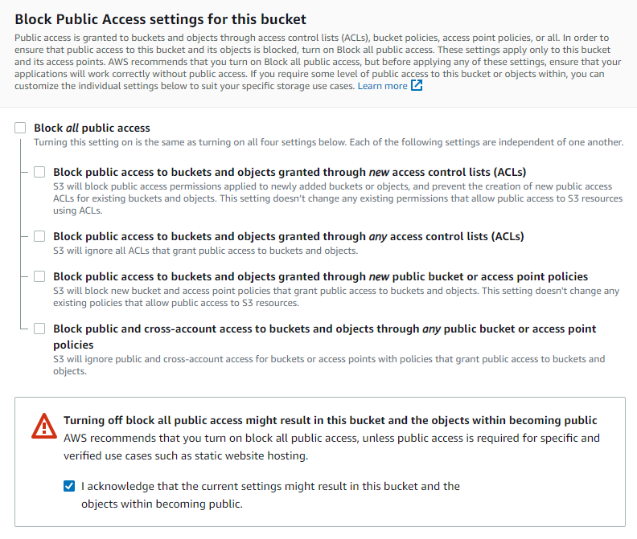

* Under **Bucket Versioning**, select **Enable** to keep all versions in the same bucket

   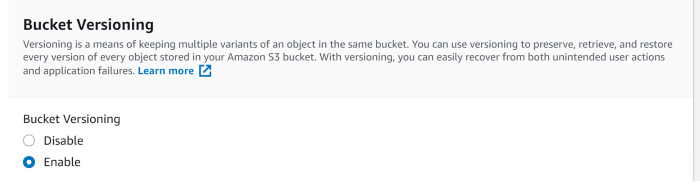

* Choose **Create bucket**

   

* Choose the created bucket from the list of buckets in console

* Upload the file in creating bucket

   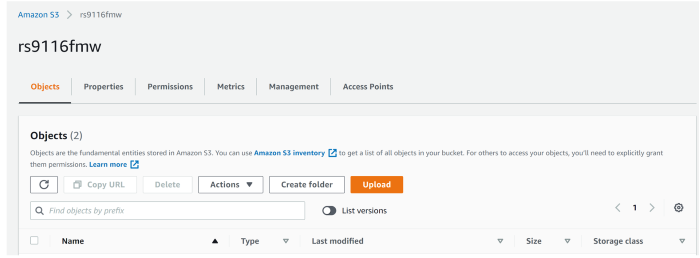

* Add the file to the bucket

   

* Setting permission to public access

   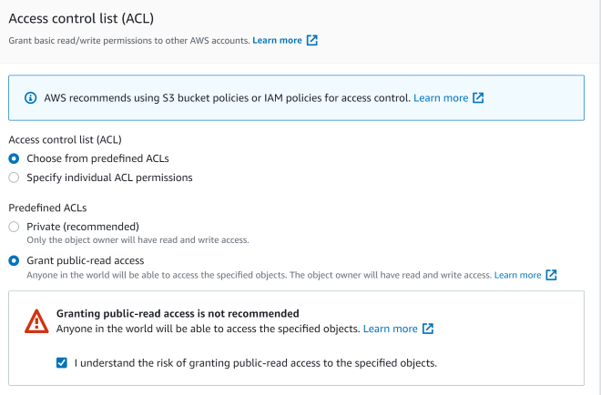

* After uploading the file, click on the file

   

* Get the object URL inside bucket/properties, like below :

   

[https://si917-ta-fmw.s3.us-east-2.amazonaws.com/SiWG917-A.1.0.0.0.17.rps]

### 7.2 Configuring Azure Blob Storage
* Login to your Azure account and go to Storage Account or search for Storage Account

   

* Open storage account and create a new storage

   

* While creating a storage account select your common Resource Group you have already created and provide a storage account name.
* Select preferred location, for the account kind select Blob-Storage and Replication select LRS

   

* Review and create your storage account
* Now download the Windows Storage Explorer here
* After installing the storage explorer, open Azure Storage Explorer in your Windows machine and navigate to Account management and add your Azure account.

   

   

* Click on Open connect dialog, where you need to select a Resource from the list as shown below

   

* Select Storage account or service, then select connection method as Connection String

   

* In the Azure Portal, navigate to your newly created storage account and select Access Keys, copy the connection string for Key1

   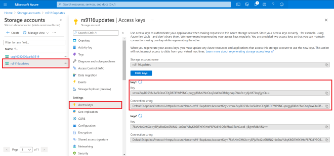

* The connection string has to be given in the local Azure Storage Explorer app
* Up on successfully adding, you should now see the EXPLORER tab on your Azure Storage Explorer display all the storages available in your account

   
* In the Azure Portal search for Storage Explorer and work the same thing there also. But it is in preview so better to use Windows Azure Storage Explorer
* Create a new blob container as shown below

   

* The route folder name you give is quite important as all the further connections happen from here. For this I am choosing a file extension
* The name used here is “rps”
* This should create a new folder, which looks like this

   

* Change the Public Access Level, right click on the new folder and select Set Container Access Level

   

* We can upload the Device Update File

   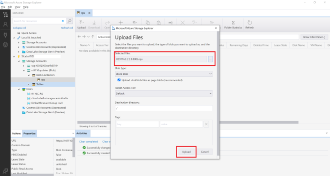

* Once done uploading, we can see the file

   

* Right click on the uploaded file, then select properties. You will find a URL path.

   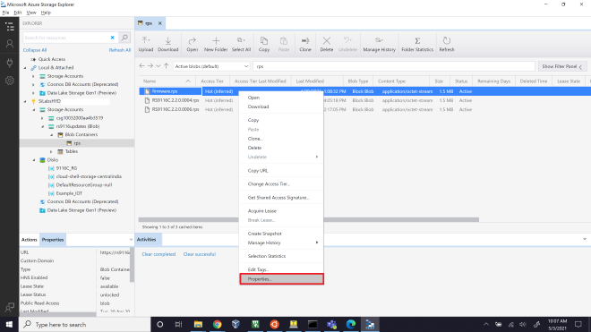

* Copy it this link is used for accessing our device update files

   

* By accessing this URL, you can download the Device Update files in application
 

### 7.3 Configuring and Uploading Firmware on Apache HTTP:
* Download and Install Wamp-Apache Server
    * Open the below link in your system browser.
    Wamp Server - (https://www.wampserver.com/en/)
    * Under Downloads, Download the latest version of WAMP server for 32bit or 64bit machine.
    * Install Wamp-Apache server with all the default settings.
    * Make sure the Wamp-Apache server is present in C:\ directory
* Configure a HTTP server
    * Navigate to C:\wamp64\bin\apache\apache2.4.46\conf
    * Open httpd.conf file with an editor.
    * Change the below lines into system IP address
   
 ```sh
    Listen {System-IP-Address}:80
    ServerName {System-IP-Address}:80
    Eg: Listen 192.168.1.4:80
        ServerName 192.168.1.4:80
 ```
 
* Save the file and Exit.
* Open command prompt and run with Administrator Privilege's.
* Navigate to directory C:\wamp64\bin\apache\apache2.4.46\bin
* Add Apache as a Windows Service:
    
    `httpd.exe -k install`
    
* While the install is in progress, you will be prompted to Windows Network Access page as shown below. Make sure you allow both Private and Public network access.

   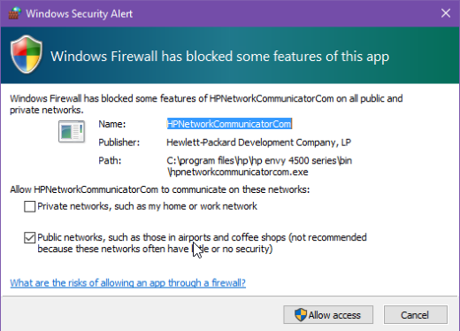

* Start Apache Service in Windows
    * Open RUN in windows using WIN+R button.
    * Input "services.msc" into RUN
    * This will open your Windows System Services
    * In the list of services running you can find Apache2.x present.
    * Start the service as shown below

   

* Now that your Apache has started and running, check it by using your browser. Open a Web browser and type the machine IP in the address bar and hit Enter. You should see the below, if server has started successfully.

   

* As you can see the connection is "Not Secure" means it is running HTTP server.
* Configure HTTP Wamp-Apache Server to Download firmware
    * Goto the Wamp Root directory, in my case it is C:\wamp64 and navigate to "www" folder C:\wamp64\www.
    * Create a new folder in that directory, in my case I created a folder named "Firmware". [Folder Structure: C:\wamp64\www\Firmware]
    * In the "Firmware" folder create an "index.html" file and write below contents to the file.
    
```html
    <!DOCTYPE html>
    <html>
        <body>
            <h2>Using a Relative File Path</h2>
            <a href="firmware.rps" download>Download_Version_6</a><br><br>
            <a href="firmware1.rps" download>Download_Version_4</a>
        </body>
    </html>
```
    
* This code will link your resources to Apache server, so that those files can be downloaded.
* you can edit href values in the index.html to your firmware file names.
* Make sure to copy all the firmware files into the present directory, C:\wamp64\www\Firmware. Save the file and Exit.
   
    ```html
    <a href="<your-firmware-file>-1.rps" download>Download_Version_6</a><br><br>
    <a href="<your-firmware-file>-2.rps" download>Download_Version_4</a>
    ```
* Configure HTTPD.conf file for Wamp-Apache Server
    * Open httpd.conf file in C:\wamp64\bin\apache\apache2.4.46\conf\httpd.conf
    * Search or Find "DocumentRoot" and change it to below configuration. Save the file and Exit
   
   ```sh
    "${INSTALL_DIR}/www/Firmware"
    ```
* Restart Apache Service
    * Open Windows services, "WIN+R" → "services.msc" → ENTER
    * Check for Apache service and Restart the service
    * In the above configuration, we have created a resource for our server in "Firmware" folder.
    * Our access resource URL looks as shown below
    

>    `http://<your-ip-address>/<Sub-Resource-Directory>/<Resources>`
>
>    Eg: http://192.168.1.4/Firmware/firmware.rps
>        http://192.168.1.4/Firmware/firmware1.rps
    
* Giving the `http://<your-ip-address>/<Sub-Resource-Directory>` in browser should load as shown below. Clicking on any link should download the Firmware files.

   

* Get the resource Information and test with Application
  * In the SiWx91x FOTA application, make below changes and test application this should start downloading firmware.
  
  ```c
  #define HTTP_SERVER_IP_ADDRESS "192.168.1.4"              //Replace this values related to your requirements
  #define HTTP_URL               "Firmware/firmware_file.rps"          //HTTP GET request resource name
  #define HTTP_HOSTNAME          "192.168.1.4"//Replace this values related to your requirements
  ```
> **Warning:** Make sure that you are able to Access the WAMP-Apache Server (with its IP Address) is accessible to other systems in the same network, if not follow the Changing PHP Configurations. Else proceed with next steps

* Changing PHP Configuration 
  * The below steps to be done only when you face an issue of not able to access the WAMP-Server from other machines in the network. Issue shown below :

   

  * Give permissions to the newly created resource `"<Sub-Resource-Directory>"`
  * Open "phpmyadmin.conf" file in "C:\wamp64\alias\phpmyadmin.conf"
  * Add the line shown below into the end of file "phpmyadmin.conf" file. Save and exit the file.

    ```sh
    <Directory "c:/wamp64/www/<Sub-Resource-Directory>/">


    For example,
    <Directory "c:/wamp64/www/Firmware/">
    Options +Indexes +FollowSymLinks +MultiViews
    AllowOverride all
    Require all granted
    </Directory>
    ```
  * Restart Apache service and now the resource should be accessible from any systems connected in the same network.

> **Note:**
> Even though if you are not able to access `http://<your-ip-address>/` this page directly, you will be able to access your resources from here `http://<your-ip-address>/<Sub-Resource-Directory>/` as we gave only permissions for this


### 7.4 Configuring and Uploading Firmware on Apache HTTPs:
HTTPs Sever configuration for Apache requires Wamp server, if you have not installed it, follow the **"Step 1: Download and Install Wamp-Apache Server"** step and continue with the HTTPS steps in this document.
* **Download and Install OPENSSL for windows**
    * OpenSSL for windows from here (https://slproweb.com/products/Win32OpenSSL.html).
    * Do default install for OpenSSL.
    * We can only run OpenSSL using command prompt, for that we need to first find the openssl.exe file.
    * Normally it will be in "C:\Program Files\OpenSSL-Win64\bin\openssl.exe"

* **Generate required certs**
   > **Note:** If you already have the reqired certs to run the server then, skip the **Generate required certs** step, copy your certs to `C:\wamp64\bin\apache\apache2.4.46\conf` directory and update the `httpd-ssl.conf` file with these certificate paths shown in **HTTPD Configuration** step. 

   * Open Command Prompt in Administrator privilege's.
   * Change directory to your openssl.exe file "cd C:\Program Files\OpenSSL-Win64\bin\"
   * Execute the below command to generate a private.key file with AES 256 encryption. 

 ```sh
    openssl.exe genrsa -aes256 -out private.key 2048
    openssl.exe rsa -in private.key -out private.key
    openssl.exe req -new -x509 -nodes -sha1 -key private.key -out certificate.crt -days 36500 -config <your-wamp-apache-openssl.conf-file-path>
    openssl.exe req -new -x509 -nodes -sha1 -key private.key -out certificate.crt -days 36500 -config C:\wamp64\bin\apache\apache2.4.46\conf\openssl.conf
 ```
    
   * Now there will be two files created [Private.key and certificate.crt] in "C:\Program Files\OpenSSL-Win64\bin\" directory, copy them to "C:\wamp64\bin\apache\apache2.4.46\conf"

* **HTTPD Configuration**
  * Open "httpd.conf" file in "C:\wamp64\bin\apache\apache2.4.46\conf"
  * Uncomment the below shown lines in that file. Save and Exit.
  ```sh
  LoadModule ssl_module modules/mod_ssl.so
  Include conf/extra/httpd-ssl.conf
  LoadModule socache_shmcb_module modules/mod_socache_shmcb.so
  ```
  * Open "php.ini" file in "C:\wamp64\bin\php\php5.6.40" and uncomment the below line in the file
  
      `extension=php_openssl.dll`
  * Open "httpd-ssl.conf" file in "C:\wamp64\bin\apache\apache2.4.46\conf\extra" and update the below paths with proper information (i.e provide system relative paths)
  ``` sh
  <VirtualHost default:443>
  General setup for the virtual host
  DocumentRoot "C:/wamp64/www"
  ServerName 192.168.43.85:443
  ServerAdmin admin@example.com
  ErrorLog "C:/wamp64/bin/apache/apache2.4.46/logs/error.log"
  TransferLog "C:/wamp64/bin/apache/apache2.4.46/logs/access.log"

  SSLCertificateFile "C:/wamp64/bin/apache/apache2.4.46/conf/certificate.crt"
  SSLCertificateKeyFile "C:/wamp64/bin/apache/apache2.4.46/conf/private.key" 
  ```
  * Run below command to check if the configurations given above are proper or not. If the configurations are proper, it will return "Syntax OK"

      `httpd.exe -t`
* **Configure HTTPS Wamp-Apache Server to Download firmware**
  * Goto the Wamp Root directory "C:\wamp64" and navigate to "www"
  * Create a new folder in that directory "Firmware". [Folder Structure: C:\wamp64\www\Firmware]
  * In the "Firmware" folder create an "index.html" file and write below contents to the file.
```html
    <!DOCTYPE html>
    <html>
        <body>
            <h2>Using a Relative File Path</h2>
            <a href="firmware.rps" download>Download_Version_6</a><br><br>
            <a href="firmware1.rps" download>Download_Version_4</a>
        </body>
    </html>
```
  * This code will link your resources to Apache server, so that those files can be downloaded.

  * Make sure to copy all the firmware files into the present directory, C:\wamp64\www\Firmware

  * you can edit href values in the index.html to your firmware file names.
```html
    <a href="<your-firmware-file>-1.rps" download>Download_Version_6</a><br><br>
    <a href="<your-firmware-file>-2.rps" download>Download_Version_4</a>
```
  * Save the file and Exit.
* **Restart Server**
> * Open RUN, "WIN+R" → "services.msc" → ENTER
> * Restart the Apache service.
> * Open browser and give your Apache server URL

   

> * Here click on "Advanced Settings" and click on "Proceed to 192.168.43.85 (unsafe)"
> * You will be able to access the page and resources in HTTPS.

   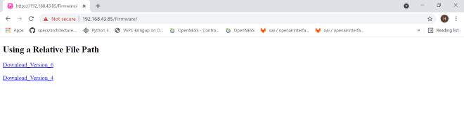


> **Note:** Make sure to check your HTTPS server from other local machines present in the same network. It should be accessible.

## 8 Selecting Bare Metal
The application has been designed to work with FreeRTOS and Bare Metal configurations. By default, the application project files (Simplicity studio) are configured with FreeRTOS enabled. The following steps demonstrate how to configure Simplicity Studio to test the application in a Bare Metal environment.

### 8.1 Bare Metal with Simplicity Studio
> - Open the project in Simplicity Studio
> - Right click on the project and choose 'Properties'
> - Go to 'C/C++ Build' | 'Settings' | 'GNU ARM C Compiler' | 'Symbols' and remove macro 'RSI_WITH_OS=1'
> - Select 'Apply' and 'OK' to save the settings

 

