# Instant Background Scan

## 1 Introduction
This application demonstrates how to enable background scan and get results of available access points after successful connection with an Access Point in station mode.

## 2 Prerequisites/Set up Requirements

For running the application, you will need the following:

### 2.1 Hardware Requirements

- **SoC Mode**: [Silicon Labs EFR32xG21 Starter Kit with Wireless Gecko](https://www.silabs.com/) (SLSWSTK6006A Base board: BRD4001A, Radio board: BRD4325A)

- **NCP Mode**: 
   - [SiWx91x Wi-Fi Expansion Board](https://www.silabs.com/)
   - A Host MCU. This example application has been tested with the following host MCUs.

     - [Silicon Labs EFR32xG21 Starter Kit with Wireless Gecko](https://www.silabs.com/development-tools/wireless/efr32xg21-bluetooth-starter-kit) (SLSWSTK6006A Base board: BRD4001A, Radio board: BRD4180a or BRD4180b)

      - [Silicon Labs EFM32GG11 Starter Kit with Wireless Gecko](https://www.silabs.com/development-tools/mcu/32-bit/efm32gg11-starter-kit) (SLSTK3701A Base board: BRD2204A)

- A Windows PC

### 2.2 Software Requirements

- Simplicity Studio IDE 

   - Download the [Simplicity Studio IDE](https://www.silabs.com/developers/simplicity-studio).

   - Follow the [Simplicity Studio user guide](https://docs.silabs.com/simplicity-studio-5-users-guide/1.1.0/ss-5-users-guide-getting-started/install-ss-5-and-software#install-ssv5) to install Simplicity Studio IDE.

- [Silicon Labs Gecko SDK](https://github.com/SiliconLabs/gecko_sdk)

- [Si917 COMBO SDK](https://github.com/SiliconLabs/)

## 3 Set up

#### 3.1 SoC Mode 

Set up diagram for SoC mode:

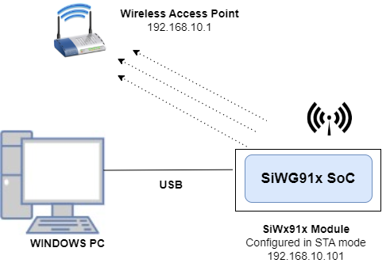

Follow the [Getting Started with SiWx91x SoC](https://docs.silabs.com/) to set up the hardware connections and Simplicity Studio IDE.
  
#### 3.2 NCP Mode  

Set up diagram for NCP mode:

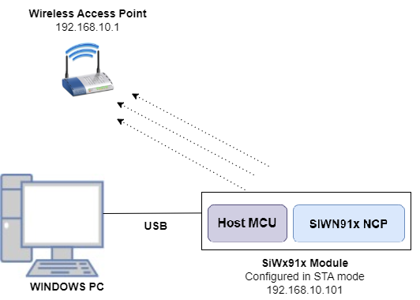

Follow the [Getting Started with EFx32](https://docs.silabs.com/rs9116-wiseconnect/latest/wifibt-wc-getting-started-with-efx32/) to setup the hardware connections and Simplicity Studio IDE.

**NOTE**: 
- The Host MCU platform (EFR32MG21) and the SiWx91x interact with each other through the SPI interface. 
- The Host MCU platform (EFM32MG21) and the SiWx91x interact with each other through the SDIO interface.

## 4 Application Build Environment

1. Ensure the SiWx91x loaded with the latest firmware following the [Getting started with a PC](https://docs.silabs.com/rs9116/latest/wiseconnect-getting-started). The firmware file is located at **<Si917 COMBO SDK> → connectivity_firmware**.

2. Ensure the EFx32 and SiWx91x set up is connected to your PC.

### 4.1 Board detection

### 4.1.1 SoC mode
1. In the Simplicity Studio IDE, 
    - The 917 SoC board will be detected under **Debug Adapters** pane as shown below.

      ****

### 4.1.2 NCP mode

1. In the Simplicity Studio IDE, 
    - The EFR32 board will be detected under **Debug Adapters** pane as shown below.

      ****

    - The EFM32 board will be detected under **Debug Adapters** pane as shown below.

      ****

### 4.2 Creation of project

Ensure the latest Gecko SDK along with the extension Si917 COMBO SDK is added to Simplicity Studio.

1. Click on the board detected and go to **EXAMPLE PROJECTS & DEMOS** section.

   ****

2. Filter for Wi-Fi examples from the Gecko SDK added. For this, check the *Wi-Fi* checkbox under **Wireless Technology** and *Gecko SDK Suite* checkbox under **Provider**. 

3. Under **Device Type**, for SoC based example, check the *SoC* checkbox and for NCP based example, check the *NCP* checkbox.

4. Now choose Wi-Fi- NCP Instant Background Scan example for NCP mode or choose Wi-Fi- SoC Instant Background Scan example for SoC mode and click on **Create**.
  For NCP mode:

   ****

    For SoC mode:
      
   **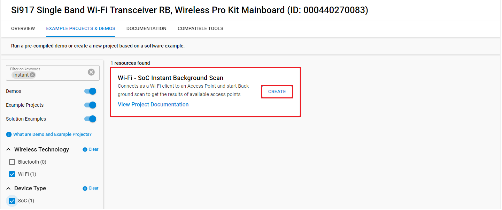**

5. Give the desired name to your project and cick on **Finish**.

   **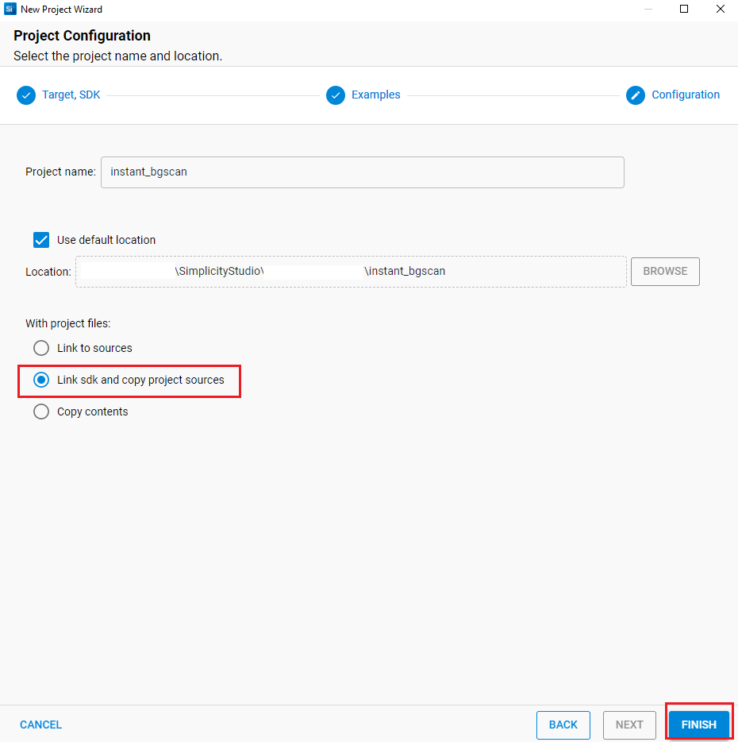**

#### 4.4.2 Build the Project - NCP Mode

1. Check for CHIP_9117 macro in preprocessor settings as mentioned below.
   - Right click on project name.
   - Go to **Properties → C/C++ Build → Settings → Tool Settings → GNU ARM C Compiler → Preprocessor → Defined Symbols (-D)**.
   - If CHIP_9117 macro is not present, add it by clicking on **ADD** symbol.
   - Click on **Apply and Close**.

     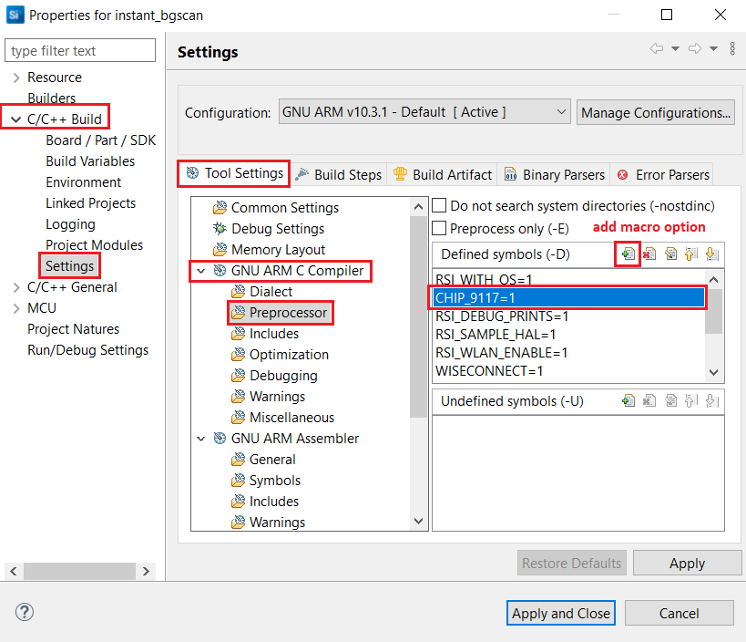

2. Click on the build icon (hammer) or right click on project name and choose **Build Project** to build the project.

  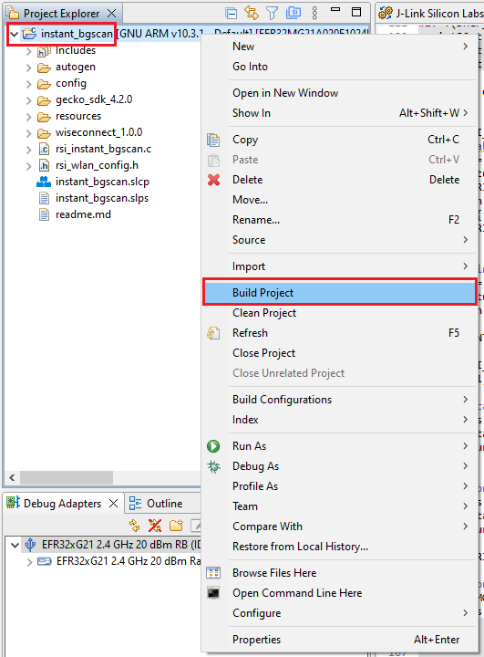

- Make sure the build returns 0 Errors and 0 Warnings.

### 4.4.3 Set up for application prints

Before setting up Tera Term, do the following for SoC mode.

**SoC mode**: 
You can use either of the below USB to UART converters for application prints.
1. Set up using USB to UART converter board.

  - Connect Tx (Pin-6) to P27 on WSTK
  - Connect GND (Pin 8 or 10) to GND on WSTK

    **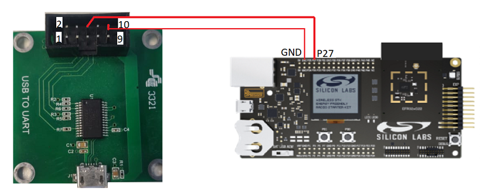**

2. Set up using USB to UART converter cable.

  - Connect RX (Pin 5) of TTL convertor to P27 on WSTK
  - Connect GND (Pin1) of TTL convertor to GND on WSTK

    ****

**Tera Term set up - for NCP and SoC modes**

1. Open the Tera Term tool. 
   - For SoC mode, choose the serial port to which USB to UART converter is connected and click on **OK**. 

     ****

   - For NCP mode, choose the J-Link port and click on **OK**.

     ****

2. Navigate to the Setup → Serial port and update the baud rate to **115200** and click on **OK**.

    ****

    ****

### 4.4.4 Execute the application

1. Once the build was successful, right click on project and select **Debug As → Silicon Labs ARM Program** to program the device as shown in below image.

   **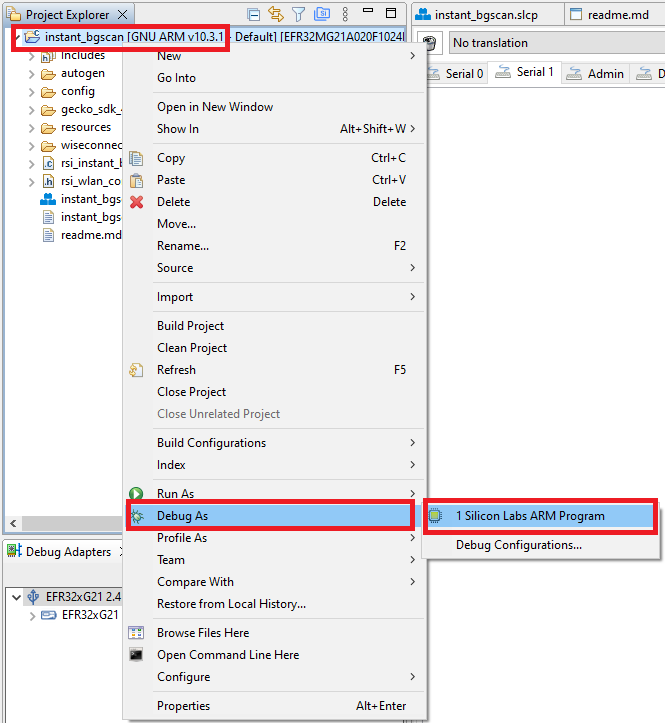**

2. As soon as the debug process is completed, the application control branches to the main().

3. Click on the **Resume** icon in the Simplicity Studio IDE toolbar to run the application.

   ****
   
4. After the application gets executed, SiWx91x connects to the Wi-Fi network with the specified SSID (in this example, **SILABS_AP**) and gets an IP address.

5. Following successful IP configuration, the application then proceeds to perform a background scan while connected to the AP and stores the result in **bgscan_results**.

### 4.4.5 **Application Prints - SoC mode**:

   **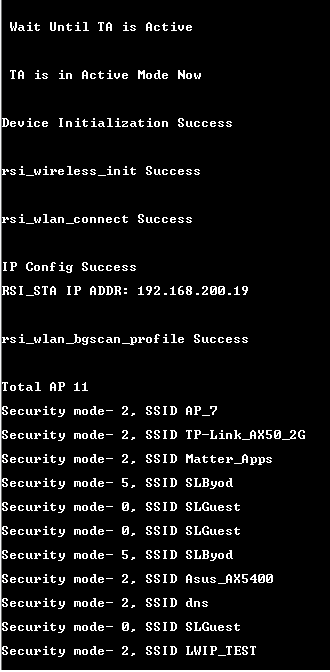**

**Application Prints - NCP mode**:

   **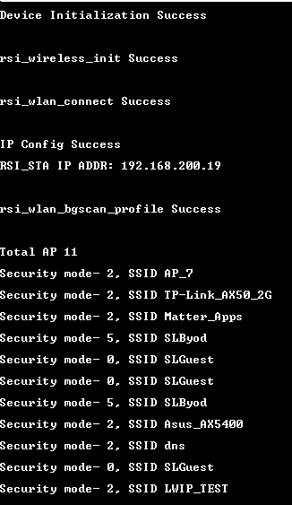**

## 5 Selecting Bare Metal configuration

1. By default, the application runs over FreeRTOS. To run the application with Bare metal configurations, follow the below steps.
   - For Simplicity Studio IDE,
      - Right click on project name
      - Go to **Properties → C/C++ Build → Settings → Tool Settings → GNU ARM C Compiler → Preprocessor → Defined Symbols (-D)**.
      - Select RSI_WITH_OS symbol and click on **Delete** symbol.
      - Click on **Apply and Close**.
      
        **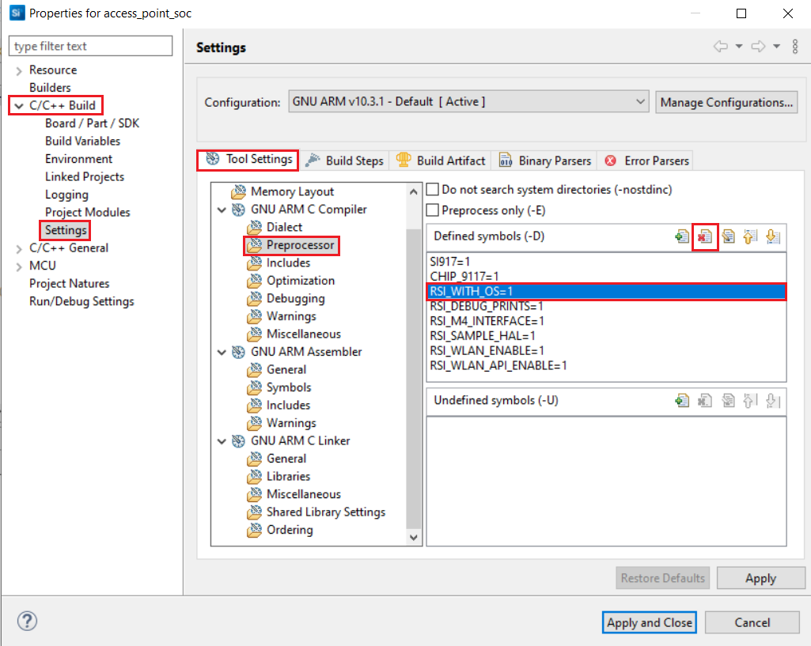**
