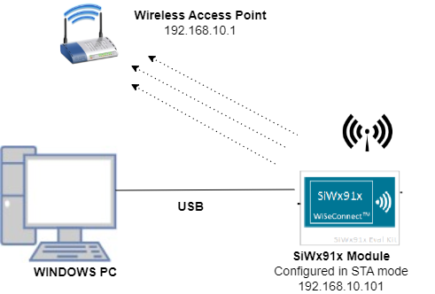
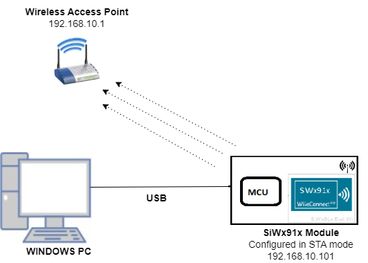

# Instant Background Scan

## Introduction
This application demonstrates how to enable Back ground scan and get results of available access points after successful connection with the Access Point in station mode.

## Setting Up 
To use this application, the following hardware, software and project setup is required.

### Hardware Requirements
- A Windows PC
- A computer running Iperf (may be the same PC or Mac used to program the Host MCU)
- Wi-Fi Access Point
- SiWx91x Wi-Fi Evaluation Kit
  - **SoC Mode**: 
      - Silicon Labs [BRD4325A](https://www.silabs.com/)
  - **NCP Mode**:
      - Silicon Labs [(BRD4180A, BRD4280B)](https://www.silabs.com/); **AND**
      - Host MCU Eval Kit. This example has been tested with:
        - Silicon Labs [WSTK + EFR32MG21](https://www.silabs.com/development-tools/wireless/efr32xg21-bluetooth-starter-kit)

#### SoC Mode : 


  
#### NCP Mode :  



### Project Setup
- **SoC Mode**
  - **Silicon Labs SiWx91x SoC**. Follow the [Getting Started with SiWx91x SoC](https://docs.silabs.com/) to setup the example to work with SiWx91x SoC and Simplicity Studio.
- **NCP Mode**
  - **Silicon Labs EFx32 Host**. Follow the [Getting Started with EFx32](https://docs.silabs.com/rs9116-wiseconnect/latest/wifibt-wc-getting-started-with-efx32/) to setup the example to work with EFx32 and Simplicity Studio.

## Configuring the Application
The application can be configured to suit your requirements and development environment.
Read through the following sections and make any changes needed. 

### NCP Mode - Host Interface

* By default, the application is configured to use the SPI bus for interfacing between Host platforms(EFR32MG21) and the SiWx91x EVK.

### Bare Metal/RTOS Support
To select a bare metal configuration, see [Selecting bare metal](#selecting-bare-metal).

### Wi-Fi Configuration
Configure the following parameters in ** rsi_instant_bgscan.c ** to enable your Silicon Labs Wi-Fi device to connect to your Wi-Fi network.

```c
#define SSID           "SILABS_AP"      // Wi-Fi Network Name
#define PSK            "1234567890"     // Wi-Fi Password
#define SECURITY_TYPE  RSI_WPA2         // Wi-Fi Security Type: RSI_OPEN / RSI_WPA / RSI_WPA2
#define CHANNEL_NO     0                // Wi-Fi channel if the softAP is used (0 = auto select)
```

### Client/Server IP Settings
```c
#define PORT_NUM           <local_port>   // Local port to use
#define SERVER_PORT        <remote_port>  // Remote server port
#define SERVER_IP_ADDRESS  "192.168.0.100"     // Remote server IP address
```
IP address to be configured to the device in STA mode should be in long format and in little endian byte order.
Example: To configure "192.168.10.10" as IP address, update the macro DEVICE_IP as 0x0A0AA8C0.

```
#define DEVICE_IP                               0X0A0AA8C0
```

IP address of the gateway should also be in long format and in little endian byte order
Example: To configure "192.168.10.1" as Gateway, update the macro GATEWAY as 0x010AA8C0
```
#define GATEWAY                                 0x010AA8C0
```

IP address of the network mask should also be in long format and in little endian byte order
Example: To configure "255.255.255.0" as network mask, update the macro NETMASK as 0x00FFFFFF
```
#define NETMASK                                 0x00FFFFFF
```


## Running the SiWx91x Application
After making any custom configuration changes required, build, download and run the application as described in the [EFx32 Getting Started](https://docs.silabs.com/rs9116-wiseconnect/latest/wifibt-wc-getting-started-with-efx32/). 

1. After program gets executed, the device would scan and connect to the access point and get IP.
2. After successful connection, the application initiates Instant Back ground scan. The Silicon Labs device scans for Access Points and gives scanned Access Points information in "rsi_wlan_bgscan_profile" API response. User can parse the response buffer "bgscan_results" for Access Points details.


# Selecting Bare Metal
The application has been designed to work with FreeRTOS and Bare Metal configurations. By default, the application project files (Simplicity studio) are configured with FreeRTOS enabled. The following steps demonstrate how to configure Simplicity Studio to test the application in a Bare Metal environment.

## Bare Metal with Simplicity Studio
> - Open the project in Simplicity Studio
> - Right click on the project and choose 'Properties'
> - Go to 'C/C++ Build' | 'Settings' | 'GNU ARM C Compiler' | 'Symbols' and remove macro 'RSI_WITH_OS=1'
> - Select 'Apply' and 'OK' to save the settings

 


