# **MQTT Client (IPv6)**

## **1 Introduction**

This application demonstrates how to configure SiWx91x as an MQTT client, connect to an MQTT broker, subscribe to a topic and publish messages on a particular MQTT topic. 
SiWx91x acts as an MQTT client and connects to a MQTT broker and subscribes to the topic called **MQTT_DEMO**. Subsequently, SiWx91x publishes a message saying **THIS IS MQTT CLIENT DEMO FROM APPLICATION** on the subscribed topic and waits to receive the data published on the subscribed topic by other clients. The communication happens over IPv6 addressing. 

This application uses open source MQTT library.

## **2 Prerequisites**
For running the application, you will need the following:
### **2.1 Hardware Requirements**
- A Windows PC
- A Wi-Fi Access Point
#### **2.1.1 SoC** 
   - Silicon Labs SiWx917 PK6030A SoC Kit which includes
      - BRD4001A/BRD4002A Wireless Starter Kit Mainboard
      - BRD4325A Radio Board
   - USB TO UART converter
#### **2.1.2 NCP**
   - Silicon Labs BRD8036A Si917 QMS SB Expansion Board
   - [Silicon Labs SLWSTK6006A EFR32xG21 Wireless Starter Kit](https://www.silabs.com/development-tools/wireless/efr32xg21-wireless-starter-kit) which includes
      - BRD4001A/BRD4002A Wireless Starter Kit Mainboard
      - BRD4180A/BRD4180B Radio Board
### **2.2 Software Requirements**
- Simplicity Studio IDE
   - To download and install the Simplicity Studio IDE, refer to the [Simplicity Studio IDE Set up]() section in ***Getting started with SiWx91x*** guides.
- SiWx917_WiSeConnect_SDK.x.x.x.x
- [Mosquitto broker](https://mosquitto.org/files/binary/win64/)
- [MQTT Explorer](http://mqtt-explorer.com/)
- Tera Term software or any other serial terminal software - for viewing application prints

## **3 Set up diagram**
### **3.1 SoC** 

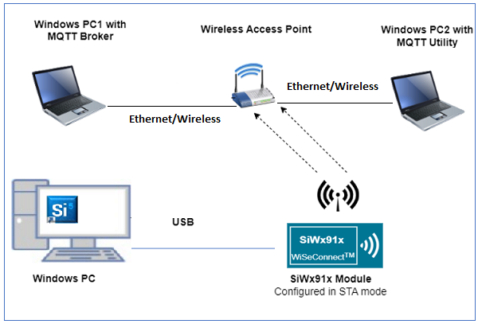
### **3.2 NCP** 

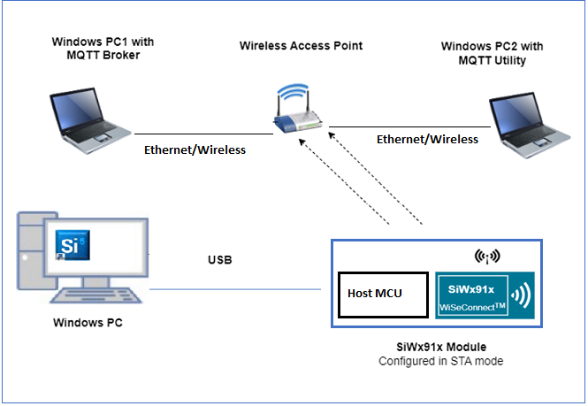

**NOTE**: 
- The Host MCU platform (EFR32xG21) and the SiWx91x interact with each other through the SPI interface. 


## **4 Set up**
### **4.1 SoC/NCP** 
- Follow the [Hardware connections and Simplicity Studio IDE Set up]()  section in the respective ***Getting Started with SiWx91x*** guides to make the hardware connections and add the Gecko and SiWx91x COMBO SDKs to Simplicity Studio IDE.
### **4.2 SiWx91x module's Firmware Update**
- Ensure the SiWx91x module is loaded with the latest firmware following the [SiWx91x Firmware Update]() section in the respective ***Getting started with SiWx91x*** guides.

## **5 Creation of Project**

1. Before creating the MQTT Client v6 example project, ensure the SiWx91x module is loaded with the latest firmware following the [SiWx91x Firmware Update]() section in the respective ***Getting started with SiWx91x*** guides.
  
2. To create the MQTT Client v6 example project in the Simplicity Studio IDE, follow the [Creation of Project]() section in the respective ***Getting started with SiWx91x*** guides. 
   - For SoC, choose the **Wi-Fi - SoC MQTT Client v6** example.
   - For NCP, choose the **Wi-Fi - NCP MQTT Client v6** example.


## **6 Application configuration**The application can be configured to suit user requirements and development environment.
Read through the following sections and make any changes needed. 
  
1. In the Project explorer pane of the IDE, expand the **mqtt_client_v6** folder and open the **rsi_mqtt.c** file. Configure the following parameters based on your requirements.

   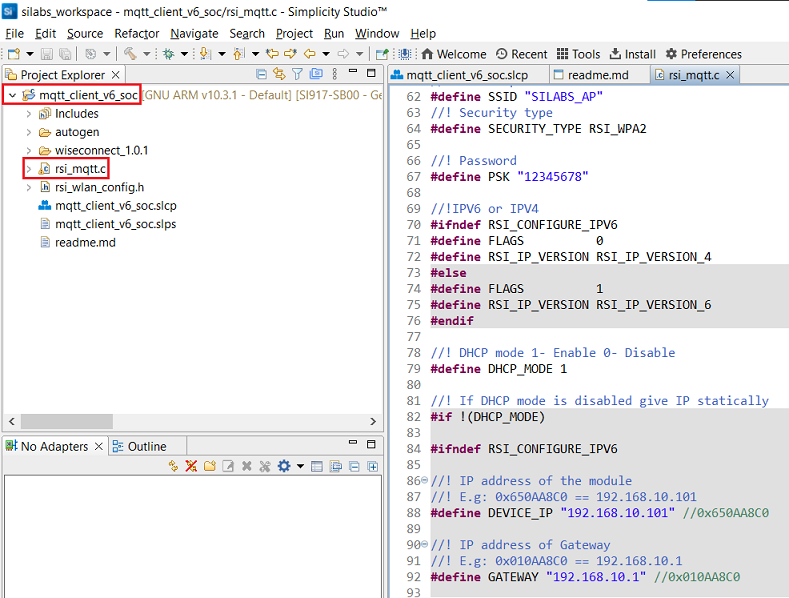

2. Enable the IPv6 macro

   - Right click on the project and choose 'Properties'
   - Go to 'C/C++ Build' | 'Settings' | 'GNU ARM C Compiler' | 'Preprocessor' and add the macro `=1`
   - Select 'Apply' and 'OK' to save the settings


3. Wi-Fi configuration

   ```c
   //! Wi-Fi Network Name
   #define SSID           "SILABS_AP"      
   
   //! Wi-Fi Password
   #define PSK            "1234567890"     
   
   //! Wi-Fi Security Type: RSI_OPEN/RSI_WPA/RSI_WPA2
   #define SECURITY_TYPE  RSI_WPA2         
   
   //! Wi-Fi channel
   #define CHANNEL_NO     0                 
   ```

3. MQTT client and server/broker IP and port settings
   ```c
   //! CLIENT_PORT port refers to the device MQTT client (SiWx91x) port number
   #define CLIENT_PORT              5001

   //! SERVER_PORT port refers to the port number on which the remote MQTT broker/server is running. The default port for MQTT server is 1883
   #define SERVER_PORT              1883                         
   
   //!// SERVER_IP_ADDRESS refers remote peer IP address (Windows PC1) on which MQTT server is running
   #define SERVER_IP_ADDRESS        "2401:4290:1289:10ed::106"   
   ```

4. MQTT client configuration 
   ```c
   //! RSI_MQTT_TOPIC refers to the topic to which MQTT client (SiWx91x) is supposed to subscribe
   #define RSI_MQTT_TOPIC      "MQTT_DEMO"                                 
   
   //! MQTT Message to publish on the topic subscribed
   uint8_t publish_message[] = "THIS IS MQTT CLIENT DEMO FROM APPLICATION" 

   //! MQTT Client ID refers to the unique ID with which the MQTT client connects to MQTT broker/server
   uint8_t clientID[]        = "MQTTCLIENT"                                
   
   //! User name for login credentials
   int8_t username[]         = "username"                                  
   
   //! Password for login credentials
   int8_t password[]         = "password"                                  

   //! QOS indicates level of assurance for delivery of message (0-At most once delivery, 1-At least once delivery, 2-Exactly once delivery)
   #define QOS                  0                  

   //! Keep alive period
   #define RSI_KEEP_ALIVE_PERIOD 100                        
   ```
**Note**: 
> For Mosquitto broker v2.0.12 onwards, client connections with keep alive interval = 0 are rejected by mosquitto broker.

> In rsi_mqtt_client.h change 'MQTT_VERSION' macro can be changed to either 3 or 4 based on the MQTT broker support version (Supported versions are 3 and 4).  

5. MQTT client application level memory configuration
   ```c
      //! Memory to initialize MQTT client Info structure
      #define MQTT_CLIENT_INIT_BUFF_LEN                        3500 

      //! Global buffer or memory which is used for MQTT client initialization. This is used for the MQTT client information storage
      uint8_t mqqt_client_buffer[MQTT_CLIENT_INIT_BUFF_LEN]         
   ```

6. To configure IP address
DHCP_MODE refers whether IP address configured through DHCP or STATIC

   ```c   
   //! whether IP address is configured through DHCP or STATIC
   #define DHCP_MODE               1              
   ```
   > If user wants to configure STA IP address through DHCP then set DHCP_MODE to "1" and skip configuring the DEVICE_IP6 and GATEWAY6 macros.
                                          (Or)
   > If user wants to configure STA IP address through STATIC then set DHCP_MODE macro to "0" and configure the DEVICE_IP6 and GATEWAY6 macros.
      ```c   
      #define DEVICE_IP6              "2401:4290:1289:10ed::106"
      #define GATEWAY6                "2401:4290:1289:10ed::106"
      ```
7. With the asynchronous MQTT feature, the SiWx91x receives the messages asynchronously. To achieve this, enable the **ASYNC_MQTT** macro. By doing so, the below non-blocking API (in which the callback handler is present) is called.

## **7 Setup for Serial Prints**

To Setup the serial prints, follow the [Setup for Serial Prints]() section in the respective ***Getting started with SiWx91x*** guides.
 
## **8 Build, Flash, and Run the Application**

To build, flash, and run the application project refer to the [Build and Flash the Project]() section in the respective ***Getting Started with SiWx91x*** guide.

## **9 Application Execution Flow**

1. Before running the application, run the MQTT broker/server on a remote PC. To run MQTT broker on port 1883 in Windows PC1
   - S - Starting with the release of Mosquitto version 2.0.0, the default config allows local connections only. Therefore, the following lines have to be added in the **mosquitto.conf** file. If an older version of mosquitto broker is used, the following lines need not be added in the **mosquitto.conf** file. However, ` socket_domain ipv6` has to be added to support IPv6 data communication.
   ```c
   allow_anonymous true
   socket_domain ipv6
   listener 1883 0.0.0.0
   ```
   - After editing the configuration file, open command prompt and go to the installation folder of mosquitto (Ex: C:\Program Files\mosquitto) and run the following command: 
   ```c
   mosquitto -v -p 1883 -c mosquitto.conf
   ```
   **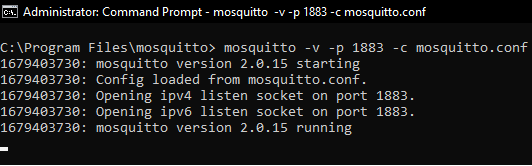**

2. Set up the MQTT client (MQTT explorer) application on windows PC so as to see the messages published by SiWx91x module.
   
   - Open MQTT Explorer in Windows PC and delete the existing connections if any
   
      **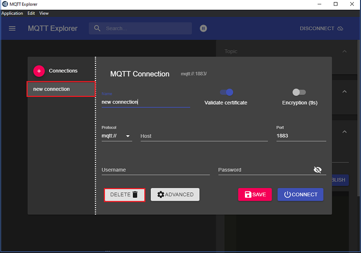**

   - Create a new connection and click on **Advanced** as shown in the below image
   
      **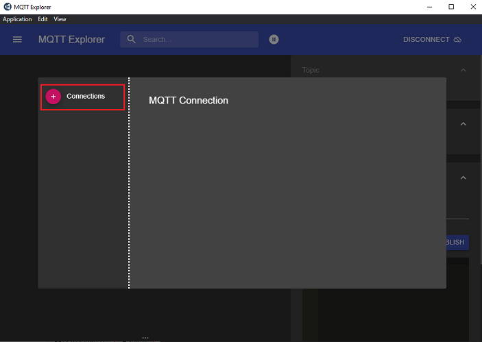**
      **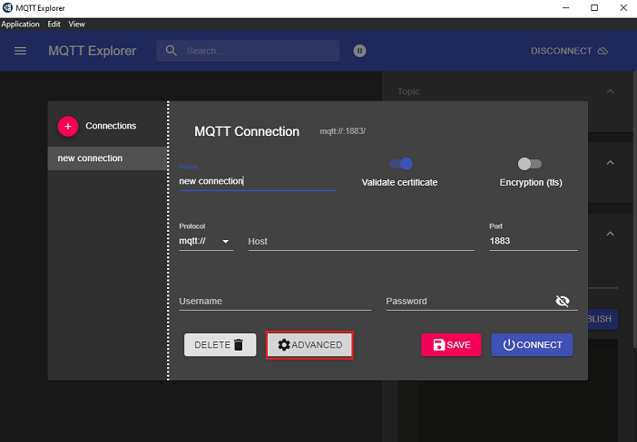**

   - Delete the existing topic names if any. Enter the desired **TOPIC_NAME** in topic field and click on **ADD**. Then the desired topic name can be observed in the topic list and click on **BACK** as shown in below image.
      **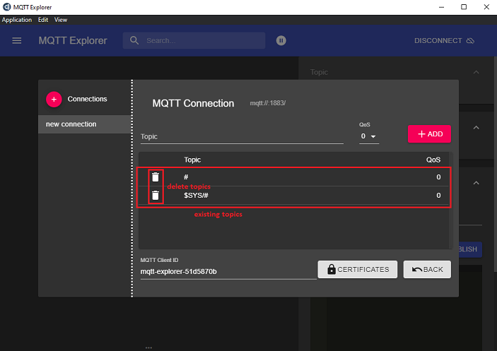**   
      **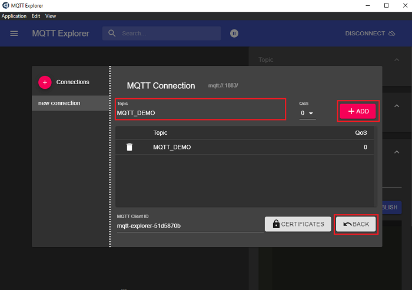**
   
   -  Connect to MQTT broker by giving IP address and port number of Windows PC1 in HOST and PORT fields in MQTT Explorer respectively and click on **CONNECT** to connect to the MQTT broker. If you are running your MQTT broker on the same PC then the following configuration is made as shown in the below image. 

      **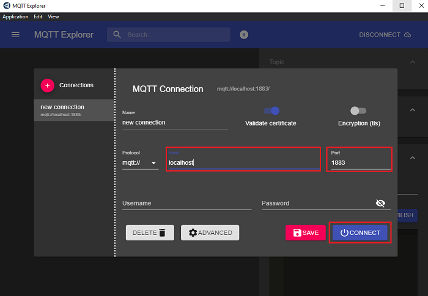**

2. After the program gets executed, the SiWx91x EVK will be connected to the access point having the configuration as specified in the application and gets an IP address.

3. Once the SiWx91x gets connected to the MQTT broker and subscribes to the topic **RSI_MQTT_TOPIC (Ex: "MQTT_DEMO")**. The user can see the client connection and subscription success information in the MQTT broker.

   **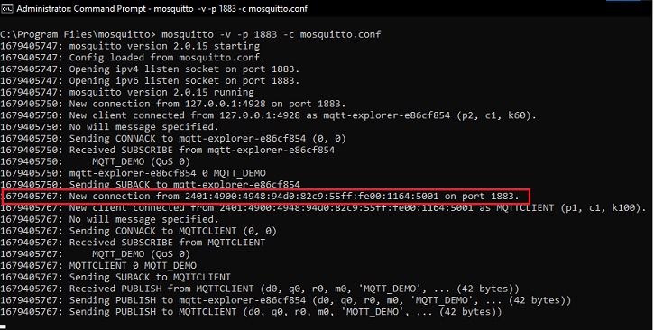**

4. After successful subscription to the topic **RSI_MQTT_TOPIC (Ex: "MQTT_DEMO")**, SiWx91x module publishes a message which is given in **publish_message** array
  (Ex: "THIS IS MQTT CLIENT DEMO FROM APPLICATION") on the subscribed topic.

5. MQTT Explorer which is running on Windows PC2 will receive the message published by SiWx91x module as it subscribed to the same topic.

   **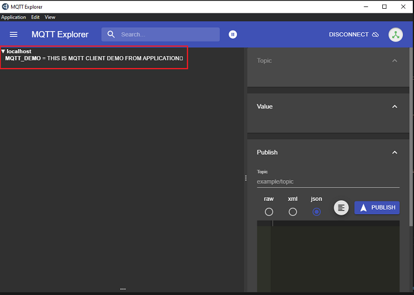**

6. In the MQTT broker, user can observe the published message as the MQTT client is subscribed to that topic. 

   **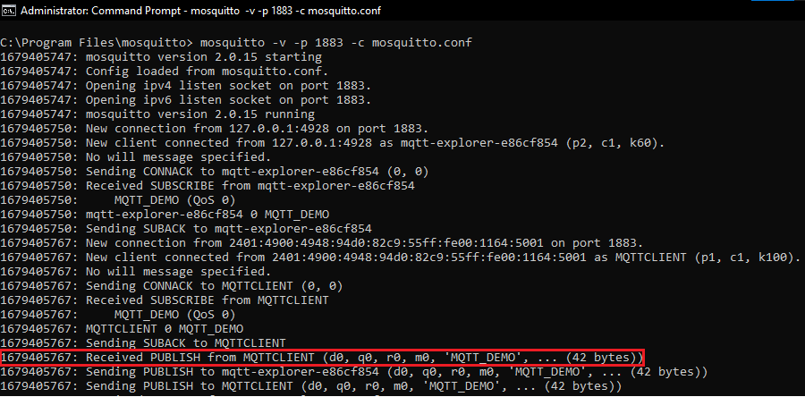**

7. Now to publish a message using MQTT Explorer, enter the topic name under **Publish** tab, select **raw** data format, type the data that user wishes to send and then click on **publish**. This message will be received by the SiWx91x.

8. Application prints can be observed as follows:

- **SoC**
  
   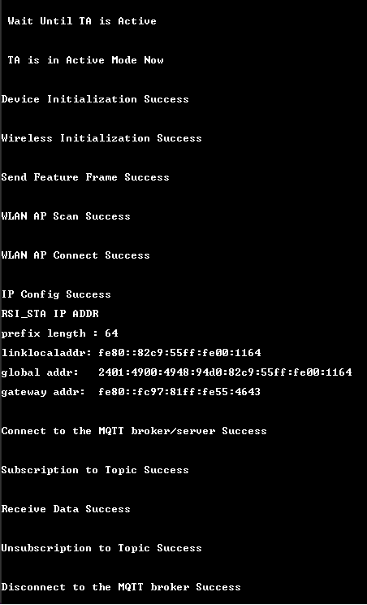

- **NCP**

   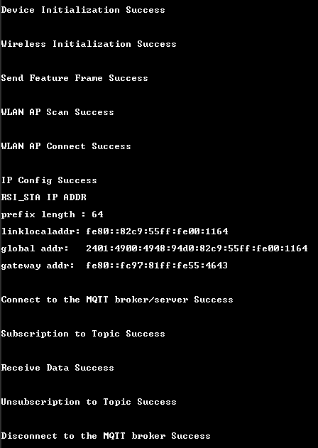

## **Appendix**

By default, the application runs over FreeRTOS. To run the application with Bare metal configurations, follow the Bare Metal configuration section in the ***Getting Started with SiWx91x*** guides.

## **Troubleshooting**

If an error saying "Error: Only one usage of each socket address (protocol/network address/port) is normally permitted." is observed.
Then it generally means that, the port over which we are trying to open mosquitto server/broker is already in use.

To over come the error we can
1) Run the mosquitto broker/server over another port
   
   (or)

2) Kill the process which is using the 1883 port
   ```c
   netstat -ano | findstr 1883
   ```
   above command returns the process ID <pid> of the process using port 1883, then kill the process using
   ```c
   taskkill /F /PID <pid>
   ```
   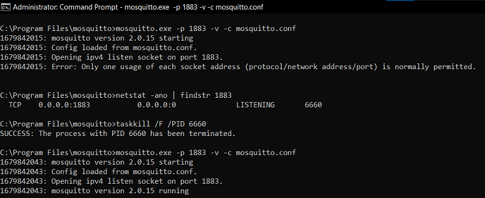