# Power Save Deep Sleep

## 1 Introduction 

This application demonstrates how to enable power save deep sleep profile with SiWx91x EVK. This application enables power save profile mode 8 and then wait in a scheduler for some time. Once it will come out of delay, it will connect to the configured AP and open udp client socket. It sends some packets to the udp server, disconnects from AP and goes back to deep sleep.

## 2 Setting Up

Before running the application, set up the following:

### Hardware Requirements 

- Windows PC
- Wireless Access point
- Windows PC2 (Remote PC) with UDP server application (Iperf Application)
- Agilent power analyzer
- SiWx91x Wi-Fi Evaluation Kit
  - **SoC Mode**: 
      - Silicon Labs [BRD4325A](https://www.silabs.com/)
  - **NCP Mode**:
      - Silicon Labs [(BRD4180A, BRD4280B)](https://www.silabs.com/)
      - Host MCU Eval Kit. This example has been tested with:
        - Silicon Labs [WSTK + EFR32MG21](https://www.silabs.com/development-tools/wireless/efr32xg21-bluetooth-starter-kit)

#### SoC Mode : 

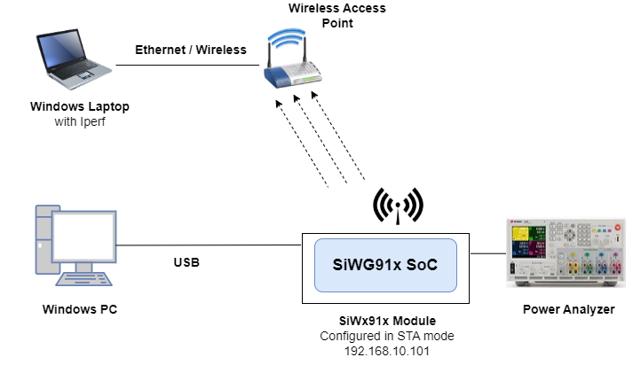

#### NCP Mode :  


## 3 Project Setup
- **SoC Mode**
  - **Silicon Labs SiWx91x SoC**. Follow the [Getting Started with SiWx91x SoC](https://docs.silabs.com/) to setup the example to work with SiWx91x SoC and Simplicity Studio.
- **NCP Mode**
  - **Silicon Labs EFx32 Host**. Follow the [Getting Started with EFx32](https://docs.silabs.com/rs9116-wiseconnect/latest/wifibt-wc-getting-started-with-efx32/) to setup the example to work with EFx32 and Simplicity Studio.

## 4 Creating the project

1. Ensure the SiWx91x loaded with the latest firmware following the [Getting started with a PC](https://docs.silabs.com/rs9116/latest/wiseconnect-getting-started). The firmware file is located at `<Si917 COMBO SDK>/connectivity_firmware/`.

2. Ensure the EFx32 and SiWx91x set up is connected to your PC.

### 4.1 Board detection

### 4.1.1 SoC mode
1. In the Simplicity Studio IDE, 
    - The 917 SoC board will be detected under **Debug Adapters** pane as shown below.

      ****

### 4.1.2 NCP mode

1. In the Simplicity Studio IDE, 
    - The EFR32 board will be detected under **Debug Adapters** pane as shown below.

      ****

    - The EFM32 board will be detected under **Debug Adapters** pane as shown below.

      ****

### 4.2 Creation of project

Ensure the latest Gecko SDK along with the extension Si917 COMBO SDK is added to Simplicity Studio.

1. Click on the board detected and go to **EXAMPLE PROJECTS & DEMOS** section.

   ****

2. Filter for Wi-Fi examples from the Gecko SDK added. For this, check the *Wi-Fi* checkbox under **Wireless Technology** and *Gecko SDK Suite* checkbox under **Provider**. 

3. Under provider, for SoC based example, check the *SoC* checkbox and for NCP based example, check the *NCP* checkbox.

4. Now choose Wi-Fi- NCP Deep-Sleep Powersave example for NCP mode or choose Wi-Fi- SoC Deep-Sleep Powersave example for SoC mode and click on **Create**.
  For NCP mode:

   **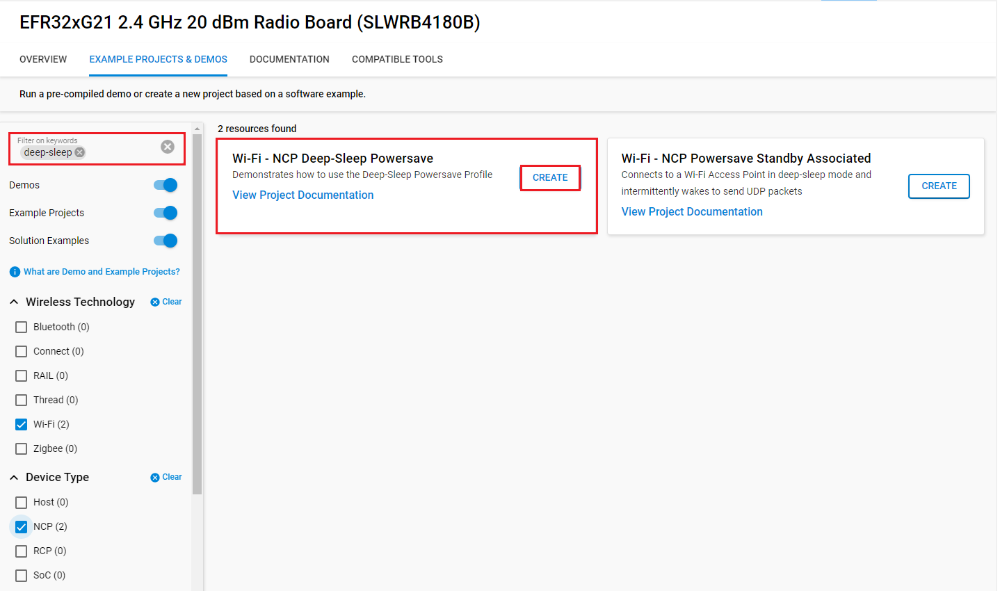**

    For SoC mode:
      
   **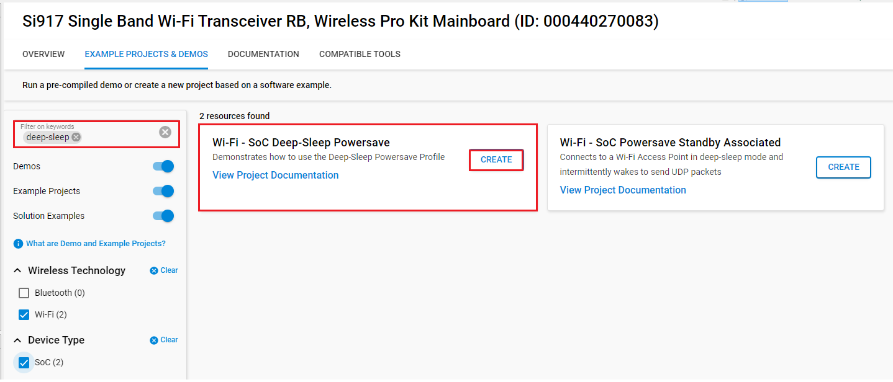**

5. Give the desired name to your project and cick on **Finish**.

   **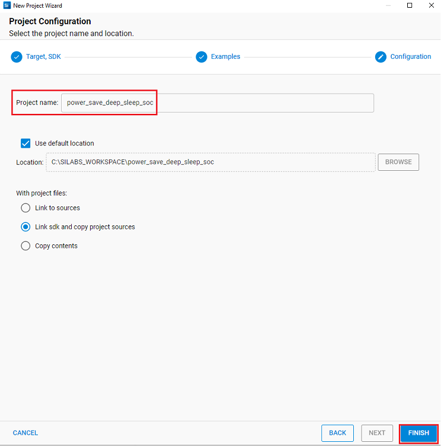**

## 5 Configuring the Application
The application can be configured to suit user requirements and development environment.
Read through the following sections and make any changes needed. 
  
### NCP Mode - Host Interface 

* By default, the application is configured to use the SPI bus for interfacing between Host platforms(EFR32MG21) and the SiWx91x EVK.
* While using the expansion board, the `EXP_BOARD=1` preprocessor symbol should be added to the list of defined symbols from the preprocessor menu of project settings.


### Bare Metal/RTOS Support
To select a bare metal configuration, see [Selecting bare metal](#8-selecting-bare-metal).

### Wi-Fi Configuration
Configure the following parameters in **rsi_wlan_power_save_profile.c** to enable your Silicon Labs Wi-Fi device to connect to your Wi-Fi network.
  
```c                                      
#define SSID           "SILABS_AP"      // Wi-Fi Network Name
#define PSK            "1234567890"     // Wi-Fi Password
#define SECURITY_TYPE  RSI_WPA2         // Wi-Fi Security Type: RSI_OPEN / RSI_WPA / RSI_WPA2
#define CHANNEL_NO     0                // Wi-Fi channel if the softAP is used (0 = auto select)
```

SERVER_PORT port refers remote UDP server port number which is opened in Windows PC2.

```c
#define  SERVER_PORT                       5001
```

SERVER_IP_ADDRESS refers remote peer IP address to connect with TCP server socket. IP address should be in long format and in little endian byte order.

   Example: To configure “192.168.10.100” as IP address, update the macro DEVICE_IP as 0x640AA8C0.

```c
#define  SERVER_IP_ADDRESS                 0x640AA8C0
```

NUMEBR_OF_PACKETS refers how many packets to send from device to remote UDP server.

```c
#define   NUMBER_OF_PACKETS                <no of packets>
```

### The desired parameter are provided below. User can also modify the parameters as per their needs and requirements

Application memory length which is required by the driver.

```c
#define   GLOBAL_BUFF_LEN                  10000
```

To configure IP address DHCP_MODE refers whether IP address configured through DHCP or STATIC

```c
#define   DHCP_MODE                        1 
```
> Note:
> If user wants to configure STA IP address through DHCP then set DHCP_MODE to "1" and skip configuring the following DEVICE_IP, GATEWAY and NETMASK macros.
> (Or)
> If user wants to configure STA IP address through STATIC then set DHCP_MODE macro to “0” and configure following DEVICE_IP, GATEWAY and NETMASK macros.

IP address to be configured to the device in STA mode should be in long format and in little endian byte order.

   Example: To configure “192.168.10.10” as IP address, update the macro DEVICE_IP as 0x0A0AA8C0.

```c
#define   DEVICE_IP                        0X0A0AA8C0
```

IP address of the gateway should also be in long format and in little endian byte order

   Example: To configure “192.168.10.1” as Gateway, update the macro GATEWAY as 0x010AA8C0

```c
#define   GATEWAY                          0x010AA8C0
```

IP address of the network mask should also be in long format and in little endian byte order.

   Example: To configure “255.255.255.0” as network mask, update the macro NETMASK as 0x00FFFFFF

```c
#define   NETMASK                          0x00FFFFFF
```

In this application, default power save mode configuration is set to low power mode 8 (RSI_SLEEP_MODE_8) with maximum power save (RSI_MAX_PSP) with message based hand shake.

```c
#define   PSP_MODE                         RSI_SLEEP_MODE_8
#define   PSP_TYPE                         RSI_MAX_PSP 
```

#### If the user wants different power save modes, update/modify the below macros

PSP_MODE refers to the power save profile mode. SiWx91x EVK supports the following power modes:

   - RSI_ACTIVE (0)   : In this mode, module is active and power save is disabled.

   - RSI_SLEEP_MODE_1 (1): In this power mode, module goes to power save after association with the Access Point. In this sleep mode, SoC will never turn off, therefore no handshake is required before sending data to the module.

   - RSI_SLEEP_MODE_2 (2): In this power mode, module goes to power save after association with the Access Point. In this sleep mode, SoC will go to sleep based on GPIO hand shake or Message exchange, therefore handshake is required before sending data to the module.

   - RSI_SLEEP_MODE_8 (8): In this power mode, module goes to power save when it is in unassociated state with the Access Point. In this sleep mode, SoC will go to sleep based on GPIO hand shake or Message exchange, therefore handshake is required before sending the command to the module.

```c
#define   PSP_MODE                         RSI_SLEEP_MODE_8
```

WiSeConnect device supports following power save modes:

   - RSI_CONNECTED_GPIO_BASED_PS = 2

   - RSI_CONNECTED_MSG_BASED_PS = 3

   - RSI_GPIO_BASED_DEEP_SLEEP = 8

   - RSI_MSG_BASED_DEEP_SLEEP = 9

Among the above mentioned four power save modes, which power save mode must be selected will depend upon the two macros i.e., PSP_MODE and RSI_HAND_SHAKE_TYPE selection.

   | RSI_HAND_SHAKE_TYPE     | PSP_MODE                              |                               |
   | :----                     | :----                                 | :----                         |
   |                           | RSI_SLEEP_MODE_2 (Connected_SLEEP)    | RSI_SLEEP_MODE_8 (Deep_SLEEP) |
   | GPIO_BASED                | RSI_CONNECTED_GPIO_BASED_PS = 2       | RSI_GPIO_BASED_DEEP_SLEEP = 8 |
   | MSG_BASED                 | RSI_CONNECTED_MSG_BASED_PS = 3        | RSI_MSG_BASED_DEEP_SLEEP = 9  |

 
> Note:
> For RSI_SLEEP_MODE_2 and RSI_SLEEP_MODE_8 modes, GPIO or Message based hand shake can be selected using RSI_HAND_SHAKE_TYPE macro which is define in rsi_wlan_config.h
> In this example user can verify RSI_SLEEP_MODE_2 with Message based hand shake. If user wants to verify other power modes, user has to change the application as well as GPIO hand shake signals.

PSP_TYPE refers power save profile type. WiSeConnect device supports following power save profile types :

   - RSI_MAX_PSP (0)  : In this mode, WiSeConnect device will be in Maximum power save mode. i.e Device will wake up for every DTIM beacon and do data Tx and Rx. 
  
   - RSI_FAST_PSP (1): In this mode, WiSeConnect device will disable power save for any Tx/Rx packet for monitor interval of time (monitor interval can be set through macro in release/examples/snippets/wlan/power_save_deep_sleep/rsi_wlan_config.h file, default value is 50 ms).If there is no data for monitor interval of time then module will again enable power save.
  
   - RSI_UAPSD (2)  : This PSP_TYPE is used to enable WMM power save.

```c
#define   PSP_TYPE                         RSI_MAX_PSP
```

> Note: 
> PSP_TYPE is valid only when PSP_MODE set to RSI_SLEEP_MODE_1 or RSI_SLEEP_MODE_2 mode.
> RSI_UAPSD power profile type in PSP_TYPE is valid only when RSI_WMM_PS_ENABLE is enabled in rsi_wlan_config.h file.

#### The application is provided with RSI_SLEEP_MODE_8 configurtion. If the user wants to modify different power save modes, update/modify the below macros

RSI_HAND_SHAKE_TYPE is used to select GPIO or Message based hand shake in RSI_SLEEP_MODE_2 and RSI_SLEEP_MODE_8 modes.

```c
#define   RSI_HAND_SHAKE_TYPE              GPIO_BASED 
```

RSI_SELECT_LP_OR_ULP_MODE is used to select low power mode or ultra low power mode. 

   Valid configurations are:

   - RSI_LP_MODE        : In this module will be in Low power mode.

   - RSI_ULP_WITH_RAM_RET : In this module will be in Ultra low power mode and it will remember the previous state after issuing power save mode command.

   - RSI_ULP_WITHOUT_RAM_RET : In this module will be in Ultra low power mode and it will not remember the previous state after issuing power save mode command. After wakeup, module will give CARD READY indication and user has to issue commands from wireless initialization.  

```c
#define   RSI_SELECT_LP_OR_ULP_MODE        RSI_LP_MODE 
```

RSI_DTIM_ALIGNED_TYPE refers whether module has to wake up at normal beacon or DTIM beacon which is just before listen interval. 

   If RSI_DTIM_ALIGNED_TYPE is set to 0 i.e module will wake up at normal beacon which is just before listen interval

   If RSI_DTIM_ALIGNED_TYPE is set to 1 i.e module will wake up at DTIM beacon which is just before listen interval

```c
#define    RSI_DTIM_ALIGNED_TYPE           0 
```
RSI_MONITOR_INTERVAL refers amount of time (in ms) to wait for Tx or Rx before giving power save indication to connected Access Point.

```c
#define     RSI_MONITOR_INTERVAL           50
```
> Note:
> RSI_MONITOR_INTERVAL is applicable only when PSP_TYPE selected as RSI_FAST_PSP

RSI_WMM_PS_ENABLE is used to enable or disable WMM power save.

```c
#define     RSI_WMM_PS_ENABLE              0 
 ```
  
RSI_WMM_PS_TYPE is used to set Tx based or Periodic based WMM power save.Update RSI_WMM_PS_TYPE macro with 0 for Tx Based or 1 for periodic based WMM power save.

```c
#define     RSI_WMM_PS_TYPE                0 
```
RSI_WMM_PS_WAKE_INTERVAL refers at periodic time (in ms) module has to wake up module when RSI_WMM_PS_TYPE selected as Periodic.

```c
#define     RSI_WMM_PS_WAKE_INTERVAL       20
```

RSI_WMM_PS_UAPSD_BITMAP refers UAPSD bitmap

```c
#define     RSI_WMM_PS_UAPSD_BITMAP        15 
```     
> Note:
> If RSI_WMM_PS_ENABLE is enabled then user has to set PSP_TYPE to RSI_UAPSD in order to work with WMM power save mode. 


## 6 Building and Testing the Application

Follow the below steps for the successful execution of the application.

### 6.1 Loading the SiWx91x Firmware

Refer [Getting started with a PC](https://docs.silabs.com/rs9116/latest/wiseconnect-getting-started) to load the firmware into SiWx91x EVK. The firmware file is located in `<SDK>/firmware/`

### 6.2 Building the Project
#### 6.2.1. Building the Project - SoC Mode

- Once the project is created, right click on project and go to properties → C/C++ Build → Settings → Build Steps.

- Add **post_build_script_SimplicityStudio.bat** file path present at SI917_COMBO_SDK.X.X.X.XX → utilities → isp_scripts_common_flash in build steps settings as shown in below image.

  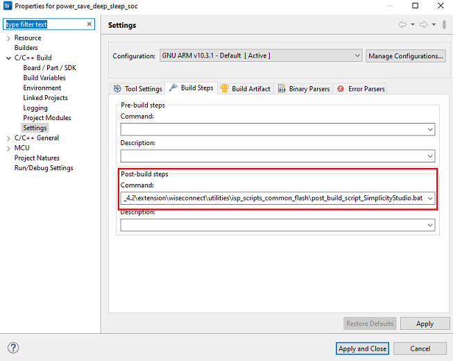

- Go to properties → C/C++ Build → Settings → Tool Settings → GNU ARM C Compiler → Preprocessor → Defined symbols (-D) and check for M4 projects macro (RSI_M4_INTERFACE=1) and 9117 macro (CHIP_9117=1). If not present, add the macros and click **Apply and Close**.
  
  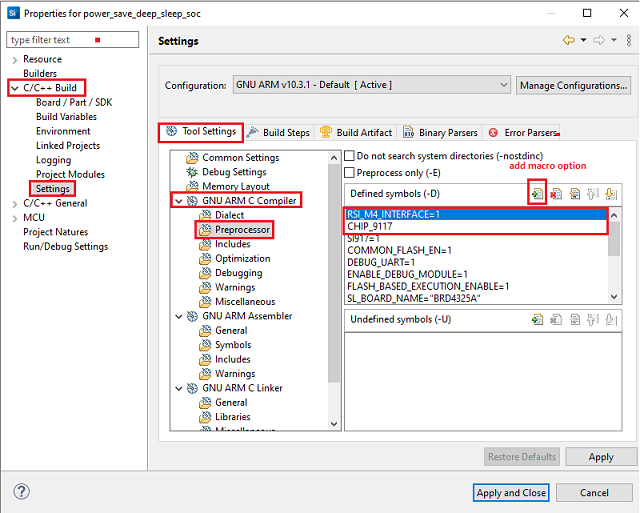

- Click on the build icon (hammer) or right click on project name and choose **Build Project** to build the project.

  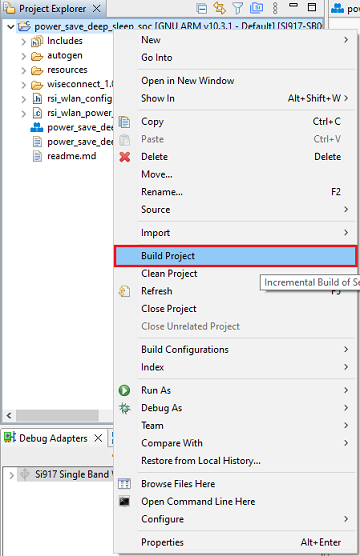

- Make sure the build returns 0 Errors and 0 Warnings.
  

#### 6.2.2. Build the Project - NCP Mode

- Check for CHIP_9117 macro in preprocessor settings as mentioned below.
   - Right click on project name.
   - Go to properties → C/C++ Build → Settings → Tool Settings → GNU ARM C Compiler → Preprocessor → Defined symbols (-D).
   - If CHIP_9117 macro is not present, add it by clicking on add macro option.
   - Click on **Apply and Close**.

     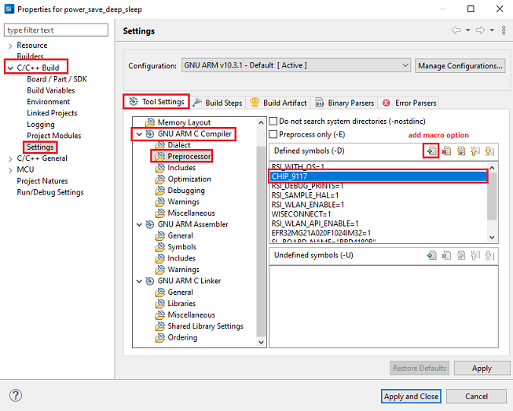

- Click on the build icon (hammer) or right click on project name and choose **Build Project** to build the project.

  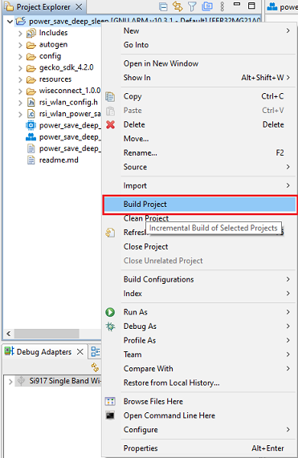

- Make sure the build returns 0 Errors and 0 Warnings.

### 6.3 Set up for application prints

Before setting up Tera Term, do the following for SoC mode.

**SoC mode**: 
You can use either of the below USB to UART converters for application prints.
1. Set up using USB to UART converter board.

  - Connect Tx (Pin-6) to P27 on WSTK
  - Connect GND (Pin 8 or 10) to GND on WSTK

    

2. Set up using USB to UART converter cable.

  - Connect RX (Pin 5) of TTL convertor to P27 on WSTK
  - Connect GND (Pin1) of TTL convertor to GND on WSTK

    

**Tera term set up - for NCP and SoC modes**

1. Open the Tera Term tool. 
   - For SoC mode, choose the serial port to which USB to UART converter is connected and click on **OK**. 

     ****

   - For NCP mode, choose the J-Link port and click on **OK**.

     **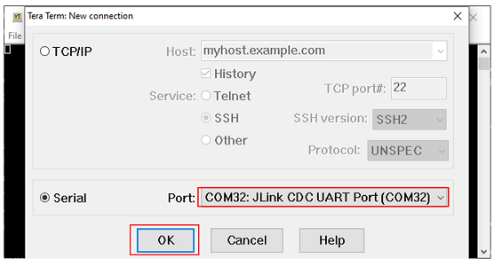**

2. Navigate to the Setup → Serial port and update the baud rate to **115200** and click on **OK**.

    ****

    ****

The serial port is now connected. 

### 6.4 Execute the application

1. Once the build was successful, right click on project and select Debug As → Silicon Labs ARM Program to program the device as shown in below image.

   **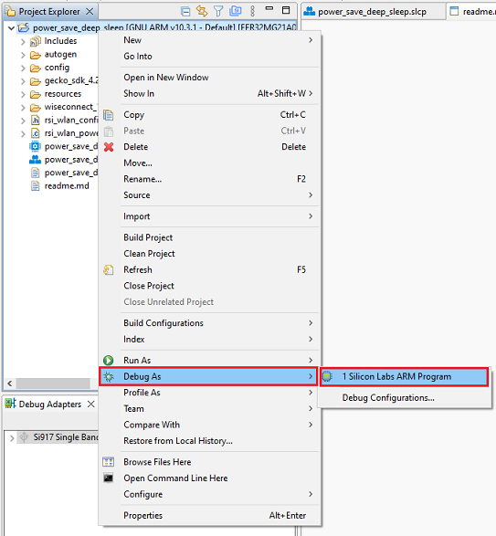**

2. As soon as the debug process is completed, the application control branches to the main().

3. Go to the J-link Silicon Labs console pane to observe the debug prints in the Serial 1 tab.

4. Click on the **Resume** icon in the Simplicity Studio IDE toolbar to run the application.

   ****

## 7 Running the SiWx91x Application

- Configure the Access point in OPEN / WPA-PSK / WPA2-PSK mode to connect SiWx91x EVK in STA mode.

- Open UDP server application using iperf application in Windows PC2 (Remote PC) which is connected to access point.

    `iperf_demo.exe –s -u -p <SERVER_PORT> -i 1`

   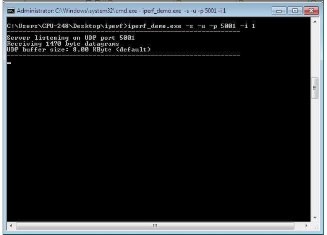

- After program gets executed, SiWx91x EVK will go to sleep based on the selected power mode and wakes up after deep sleep timeout (Default deep sleep time is 3sec in RSI_SLEEP_MODE_8 with message based hand shake). Refer the given below image for power save cycle for default deep sleep time.

   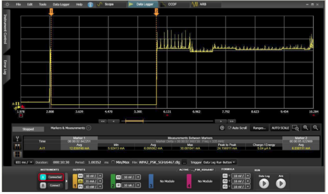

- After successful wake up from deep sleep, SiWx91x EVK connects to AP and sends configured number of (NUMBER_OF_PACKETS) UDP packets to remote peer which is connected to Access point. Refer the given below image for reception of UDP data on UDP server.

   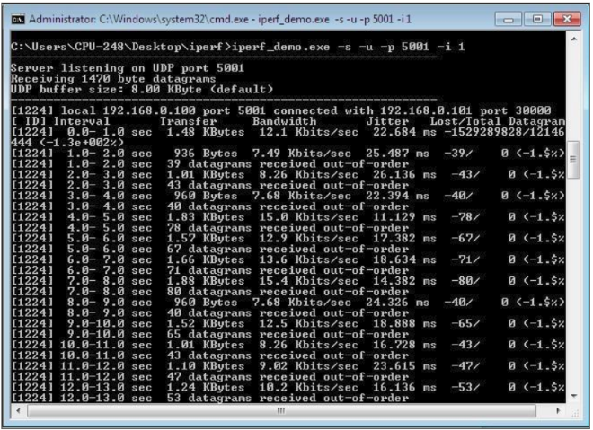

- After sending configured number of packets, SiWx91x EVK disconnects from connected AP and again repeat the above steps (It will again go to sleep and wakes up after time out, connects to AP and sends configured number of packets). Find below image for power save profile cycle.

   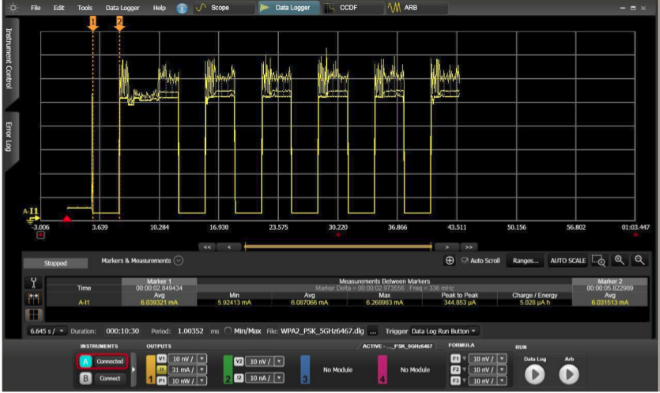

> Note:
> This Application is for TA deep sleep only, M4 will be active.

### Application Prints

#### SoC mode

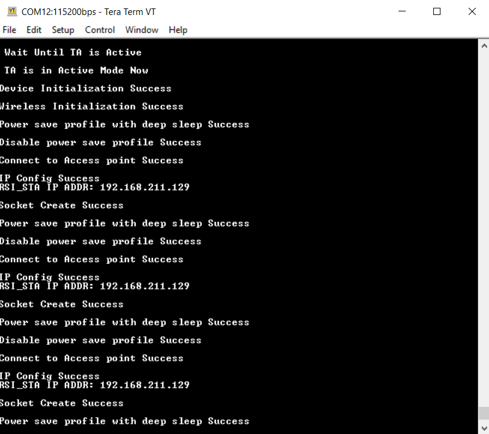

#### NCP mode

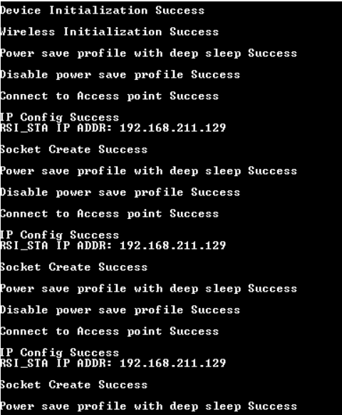

# 8 Selecting Bare Metal
The application has been designed to work with FreeRTOS and Bare Metal configurations. By default, the application project files (Simplicity studio) are configured with FreeRTOS enabled. The following steps demonstrate how to configure Simplicity Studio to test the application in a Bare Metal environment.

## Bare Metal with Simplicity Studio
> - Open the project in Simplicity Studio
> - Right click on the project and choose 'Properties'
> - Go to 'C/C++ Build' | 'Settings' | 'GNU ARM C Compiler' | 'Preprocessor' and remove macro 'RSI_WITH_OS=1'
> - Select 'Apply' and 'OK' to save the settings

 

