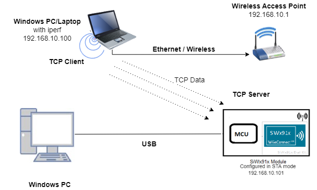
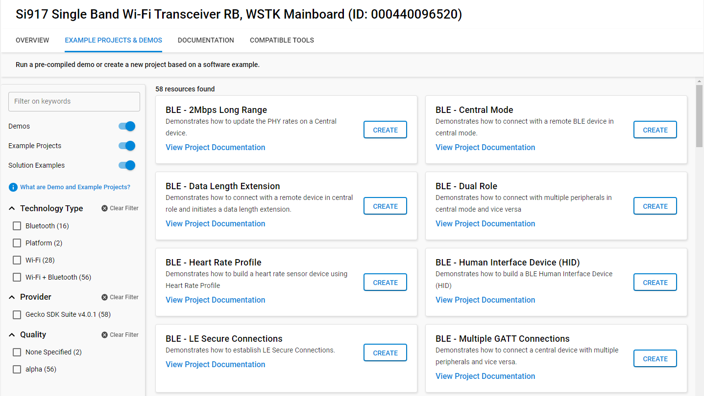
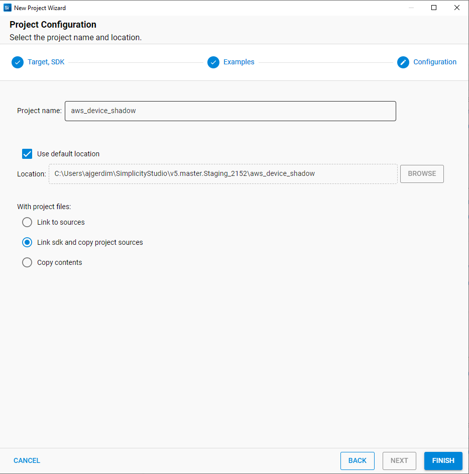
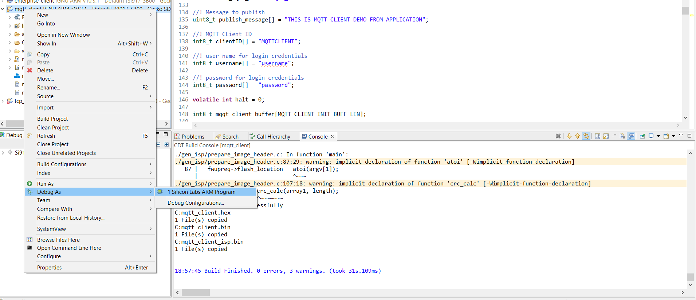

# Socket Select 

## Introduction 

This application demonstrates how to create the multiple sockets in SiWx91x EVK and monitor multiple sockets for a certain activity to occur. If there is some data to be read on one of the sockets, the Select provides the response about the socket whether the data is to be read on the socket or not.

## Setting Up 

Before running the application, set up the following:

### Hardware Requirements 

- Windows PC
- Wireless Access point
- TCP client application running in Windows PC2 (This uses iperf application to open TCP client socket in remote PC)
- SiWx91x Wi-Fi Evaluation Kit. The SiWx91x supports multiple operating modes. See [Operating Modes]() for details.
  - **SoC Mode**:
      - Silicon Labs [BRD4325A](https://www.silabs.com/)
  - **NCP Mode**:
      - Silicon Labs [(BRD4180A, BRD4280B)](https://www.silabs.com/); **AND**
      - Host MCU Eval Kit. This example has been tested with:
        - Silicon Labs [WSTK + EFR32MG21](https://www.silabs.com/development-tools/wireless/efr32xg21-bluetooth-starter-kit)
    
#### SoC Mode : 


  
#### NCP Mode :  



### Project Setup
- **SoC Mode**
  - **Silicon Labs SiWx91x SoC**. Follow the [Getting Started with SiWx91x SoC](https://docs.silabs.com/) to setup the example to work with SiWx91x SoC and Simplicity Studio.
- **NCP Mode**
  - **Silicon Labs EFx32 Host**. Follow the [Getting Started with EFx32](https://docs.silabs.com/rs9116-wiseconnect/latest/wifibt-wc-getting-started-with-efx32/) to setup the example to work with EFx32 and Simplicity Studio.
  

## Configuring the Application
The application can be configured to suit user requirements and development environment.
Read through the following sections and make any changes needed. 

### NCP Mode - Host Interface 

* By default, the application is configured to use the SPI bus for interfacing between Host platforms(EFR32MG21) and the SiWx91x EVK.

### Bare Metal/RTOS Support 

This application supports bare metal and RTOS environment. By default, the application project files (Keil and Simplicity studio) are provided with bare metal configuration in the SDK. 


## Wi-Fi Configuration 
Configure the following parameters in **rsi_socket_select.c** to enable your Silicon Labs Wi-Fi device to connect to your Wi-Fi network.

SSID refers to the name of the Access point.

```c
#define SSID                                    "SILABS_AP"
```
    
CHANNEL_NO refers to the channel in which device should scan. If it is 0 device will scan all channels.

```c
#define CHANNEL_NO                              0
```
  
SECURITY_TYPE refers to the type of security. In this application STA supports Open, WPA-PSK, WPA2-PSK securities.

   Valid configuration is:
   
   - RSI_OPEN - For OPEN security mode
   - RSI_WPA - For WPA security mode
   - RSI_WPA2 - For WPA2 security mode
   
```c
#define SECURITY_TYPE                           RSI_WPA2
```

PSK refers to the secret key if the Access point configured in WPA-PSK/WPA2-PSK security modes.

```c
#define PSK                  "1234567890"
```
  
#### The desired parameters are provided below. User can also modify the parameters as per their needs and requirements.

To configure IP address
  
DHCP_MODE refers whether IP address configured through DHCP or STATIC

```c
#define DHCP_MODE                               1
```

> Note:
> If user wants to configure STA IP address through DHCP then set DHCP_MODE to "1" and skip configuring the following DEVICE_IP, GATEWAY and NETMASK macros.
> (Or)
> If user wants to configure STA IP address through STATIC then set DHCP_MODE macro to "0" and configure following DEVICE_IP, GATEWAY and NETMASK macros.

IP address to be configured to the device in STA mode should be in long format and in little endian byte order.
   
Example: To configure "192.168.10.10" as IP address, update the macro DEVICE_IP as 0x0A0AA8C0.

```c
#define DEVICE_IP                               0X0A0AA8C0
```

IP address of the gateway should also be in long format and in little endian byte order

   Example: To configure "192.168.10.1" as Gateway, update the macro GATEWAY as 0x010AA8C0.

```c
#define GATEWAY                                 0x010AA8C0
 ```
   
IP address of the network mask should also be in long format and in little endian byte order

   Example: To configure "255.255.255.0" as network mask, update the macro NETMASK as 0x00FFFFFF.

```c
#define NETMASK                                 0x00FFFFFF
```

Application memory length which is required by the driver
   
```c
#define GLOBAL_BUFF_LEN                         15000
```

User can connect to access point through PMK

   To Enable keep 1 else 0

```c
#define CONNECT_WITH_PMK                         0
```

> Note:
> If CONNECT_WITH_PMK is enabled, SECURITY_TYPE is set to RSI_WPA2_PMK.


**Power save configuration**

Configure the following parameters in **rsi_wlan_config.h**

   - By default, the application is configured without power save.
  
```c
#define ENABLE_POWER_SAVE          0
```

   - If user wants to run the application in power save, modify the below macro.

```c
#define ENABLE_POWER_SAVE          1
```

For SoC mode use handshake type as shown below:
```c
#define RSI_HAND_SHAKE_TYPE M4_BASED
```

For NCP mode handshake type can be GPIO_BASED or MSG_BASED, as shown below

```c
#define RSI_HAND_SHAKE_TYPE GPIO_BASED
```

## Testing the Application 

Follow the below steps for the successful execution of the application.

### Loading the SiWx91x Firmware

Refer [Getting started with a PC](https://docs.silabs.com/rs9116/latest/wiseconnect-getting-started) to load the firmware into SiWx91x EVK. The firmware file is located in `<SDK>/firmware/`

## Creating the Project and builing the Application
  
Refer [Getting started with EFX32](https://docs.silabs.com/rs9116-wiseconnect/latest/wifibt-wc-getting-started-with-efx32/), for settin-up EFR & EFM host platforms

### Project Creation - SoC Mode : 

- Connect your board. The Si917 compatible SoC board is **BRD4325A**.
- Studio should detect your board. Your board will be shown here.


### Project Creation - NCP Mode : 

- Connect your board. The supported NCP boards are: **BRD4180A,BRD4280B**
- Studio should detect your board. Your board will be shown here.


### Selecting an example application and generate project

- Go to the 'EXAMPLE PROJECT & DEMOS' tab and select your desired example application

- Click 'Create'. The "New Project Wizard" window appears. Click 'Finish'


#### Build Project - SoC Mode

- Once the project is created, right click on project and go to properties → C/C++ Build → Settings → Build Steps
- Add post_build_script_SimplicityStudio.bat file path (SI917_COMBO_SDK.X.X.X.XX\utilities\isp_scripts_common_flash) in build steps settings as shown in below image.

- Check for M4 projects macros in preprocessor settings(RSI_M4_INTERFACE=1)
- Check for 9117 macro in preprocessor settings(CHIP_9117=1).
- Click on the build icon (hammer) to build the project

- Successful build output will show as below.


#### Build Project - NCP Mode :

- Check for 9117 macro in preprocessor settings(CHIP_9117=1).
- Click on the build icon (hammer) to build the project

- Successful build output will show as below.


## Program the device

Once the build was successfull, right click on project and click on Debug As->Silicon Labs ARM Program as shown in below image.



### Running the SiWx91x Application

1. Configure the Access point in OPEN / WPA-PSK / WPA2-PSK mode to connect SiWx91x EVK in STA mode.

2. After the program gets executed, SiWx91x EVK is configured as client and connects to AP and gets IP.

3. After successful connection with the access point, the socket select is issued for the desired socket.

4. Open TCP client from WindowsPC2 and connect to TCP server opened on the device on port number DEVICE_PORT. 
   The Iperf command to start the TCP client is: 

	> `C:\> iperf.exe -c <Module_IP> -p <module_PORT> -i 1 -t <time interval in sec>`
	>
	> For example ...
	>
	> `C:\> iperf.exe -c 192.168.0.100 -p 5001 -i 1 -t 30`  


5. Select provides the response about the socket whether the data is to be read on the socket or not.

6. If data is to be received on the socket, then the receive function is called on the socket.

## Observing the output prints on serial terminal

### SoC Mode:
> Connect USB to UART connector Tx and GND pins to WSTK radio board.

   - Connect Tx(Pin-6) to P27 on WSTK
   - Connect GND(Pin 8 or 10) to GND on WSTK

> Prints can see as below in any Console terminal


### NCP Mode:
Prints can see as below in any Console terminal


# Selecting Bare Metal
The application has been designed to work with FreeRTOS and Bare Metal configurations. By default, the application project files (Simplicity studio) are configured with FreeRTOS enabled. The following steps demonstrate how to configure Simplicity Studio to test the application in a Bare Metal environment.

## Bare Metal with Simplicity Studio
> - Open the project in Simplicity Studio
> - Right click on the project and choose 'Properties'
> - Go to 'C/C++ Build' | 'Settings' | 'GNU ARM C Compiler' | 'Symbols' and remove macro 'RSI_WITH_OS=1'
> - Select 'Apply' and 'OK' to save the settings

 


