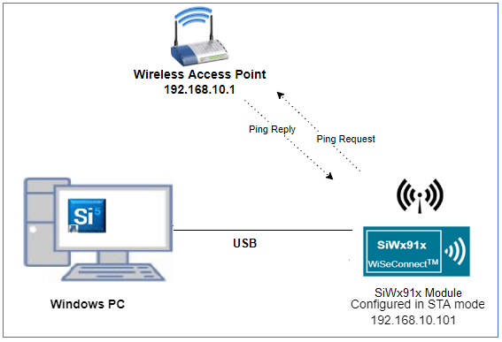
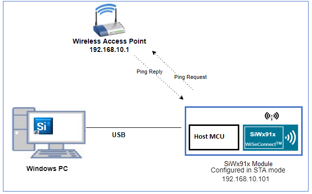
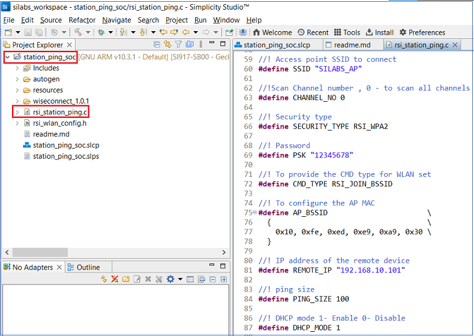
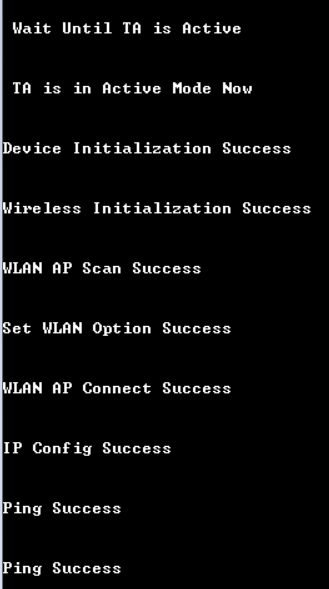
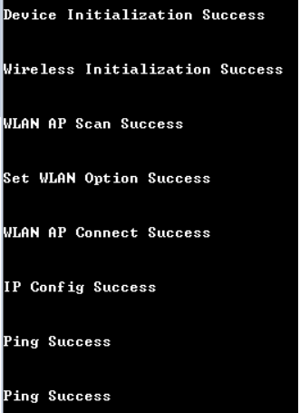

# **Station Ping**

## **1 Introduction**

Ping is used diagnostically to ensure that a host computer the user is trying to reach is actually operating. Ping works by sending an Internet Control Message Protocol (ICMP) Echo Request to a specified interface on the network and waiting for a reply. The application demonstrates how to configure SiWx91x module in client mode to send ping request to target IP address.

## **2 Prerequisites**
For running the application, you will need the following:
### **2.1 Hardware Requirements**
- A Windows PC
- A Wi-Fi Access Point
#### **2.1.1 SoC** 
   - Silicon Labs SiWx917 PK6030A SoC Kit which includes
      - BRD4001A/BRD4002A Wireless Starter Kit Mainboard
      - BRD4325A Radio Board
   - USB TO UART converter or TTL cable
#### **2.1.2 NCP**
   - Silicon Labs BRD8036A Si917 QMS SB Expansion Board
   - [Silicon Labs SLWSTK6006A EFR32xG21 Wireless Starter Kit](https://www.silabs.com/development-tools/wireless/efr32xg21-wireless-starter-kit) which includes
      - BRD4001A/BRD4002A Wireless Starter Kit Mainboard
      - BRD4180A/BRD4180B Radio Board
### **2.2 Software Requirements**
- Simplicity Studio IDE
   - To download and install the Simplicity Studio IDE, refer to the [Simplicity Studio IDE Set up]() section in ***Getting started with SiWx91x*** guides.
- SiWx917_WiSeConnect_SDK.x.x.x.x
- Tera Term software or any other serial terminal software - for viewing application prints

## **3 Set up diagram**
### **3.1 SoC** 


### **3.2 NCP** 



**NOTE**: 
- The Host MCU platform (EFR32xG21) and the SiWx91x interact with each other through the SPI interface. 


## **4 Set up**
### **4.1 SoC/NCP** 
- Follow the [Hardware connections and Simplicity Studio IDE Set up]()  section in the respective ***Getting Started with SiWx91x*** guides to make the hardware connections and add the Gecko and SiWx91x COMBO SDKs to Simplicity Studio IDE.
### **4.2 SiWx91x module's Firmware Update**
- Ensure the SiWx91x module is loaded with the latest firmware following the [SiWx91x Firmware Update]() section in the respective ***Getting started with SiWx91x*** guides.

## **5 Creation of Project**
  
To create the ICMP Ping example project in the Simplicity Studio IDE, follow the [Creation of Project]() section in the respective ***Getting started with SiWx91x*** guides. 
   - For SoC, choose the **Wi-Fi - SoC Client ICMP Ping** example.
   - For NCP, choose the **Wi-Fi - NCP Client ICMP Ping** example.


## **6 Application configuration**The application can be configured to suit user requirements and development environment.
Read through the following sections and make any changes needed. 
  
1. In the Project explorer pane of the IDE, expand the **station_ping** folder and open the **rsi_station_ping.c** file. Configure the following parameters based on your requirements.

   

- ### **Wi-Fi configuration**
   ```c
      //! Wi-Fi Network Name
      #define SSID           "SILABS_AP"      

      //! Wi-Fi Password
      #define PSK            "1234567890"     

      //! Wi-Fi Security Type: RSI_OPEN / RSI_WPA / RSI_WPA2
      #define SECURITY_TYPE  RSI_WPA2         

      //! Wi-Fi channel if the softAP is used (0 = auto select)
      #define CHANNEL_NO     0                

      //! AP_BSSID  refer  to BSSID of AP, join based up on BSSID (Example : If two Access points had same SSID then at the time based on this BSSID,module will join to particular AP). This feature is valid only if  RSI_JOIN_FEAT_BIT_MAP set to RSI_JOIN_FEAT_BSSID_BASED in the rsi_wlan_config.h file.
      #define AP_BSSID                                    { }

      //! User can connect to access point through PMK. To Enable keep 1 else 0. If `CONNECT_WITH_PMK` is enabled, `SECURITY_TYPE` should be set to `RSI_WPA2_PMK`
      #define CONNECT_WITH_PMK                         0
   ```
- ### **Remote peer configurations**
   ```c
      //! IP address of the remote peer (AP IP address)
      #define REMOTE_IP                               "192.168.10.101"
      
      //! PING_SIZE refers the size of ping packet
      #define PING_SIZE                               100

      //! NUMBER_OF_PACKETS refers to number of pings to be sent from device
      #define NUMBER_OF_PACKETS                       1000
   ```  

- ### **To configure IP address**

DHCP_MODE refers whether IP address configured through DHCP or STATIC

```c
#define DHCP_MODE                                  1
```

> Note
> If user wants to configure STA IP address through DHCP then set DHCP_MODE to 1 and skip configuring the following DEVICE_IP, GATEWAY and NETMASK macros.
> (Or)
> If user wants to configure STA IP address through STATIC then set DHCP_MODE macro to "0" and configure following DEVICE_IP, GATEWAY and NETMASK macros.

IP address to be configured to the device in station mode

```c
#define DEVICE_IP                               "192.168.10.101"
#define GATEWAY                                 "192.168.10.1"
#define NETMASK                                 "255.255.255.0"
```

## **7 Setup for Serial Prints**

To Setup the serial prints, follow the [Setup for Serial Prints]() section in the respective ***Getting started with SiWx91x*** guides.
 
## **8 Build, Flash, and Run the Application**

To build, flash, and run the application project refer to the [Build and Flash the Project]() section in the respective ***Getting Started with SiWx91x*** guides.

## **9 Application Execution Flow**

1. Configure the Access point in OPEN/WPA-PSK/WPA2-PSK mode to connect SiWx917 module in station mode.

2. After the program gets executed, SiWx917 module configured as client and connects to AP and gets IP.

3. After successful connection with the Access Point, the device starts sending ping requests to the given **REMOTE_IP** with configured **PING_SIZE** to check availability of target Device.
Device sends the number of ping packets configured in **NUMBER_OF_PACKETS**.

4. In rsi_station_ping.c file, **rsi_wlan_ping_async** API returns success status, which means that the ping request packet is successfully sent in to the medium. When actual ping response
comes from the remote node, it is known from the status parameter of the callback function (**rsi_ping_response_handler**) registered in the Ping API.

5. Application prints can be observed as follows:

- **SoC**
  
   

- **NCP**

   

## **Appendix**

By default, the application runs over FreeRTOS. To run the application with Bare metal configurations, follow the Bare Metal configuration section in the ***Getting Started with SiWx91x*** guides.