# TCP Client Socket

## 1 Purpose/Scope

The TCP client application demonstrates how to open and use a standard TCP client socket and sends data to TCP server socket.

## 2 Prerequisites/Set up Requirements

Before running the application, the user will need the following things to setup.

### 2.1 Hardware Requirements

- Windows PC

- Wireless Access Point

- TCP server over SSL running in Windows PC2 (This application uses OpenSSL to create TCP server over SSL)

- **SoC Mode**: [Silicon Labs EFR32xG21 Starter Kit with Wireless Gecko](https://www.silabs.com/) (SLSWSTK6006A Base board: BRD4001A/BRD4002A, Radio board: BRD4325A)

- **NCP Mode**: 
   - [SiWx91x Wi-Fi Expansion Board](https://www.silabs.com/)
   - This example application has been tested with the following host MCUs.

     - [Silicon Labs EFR32xG21 Starter Kit with Wireless Gecko](https://www.silabs.com/development-tools/wireless/efr32xg21-bluetooth-starter-kit) (SLSWSTK6006A Base board: BRD4001A, Radio board: BRD4180a or BRD4180b)

     - [Silicon Labs EFM32GG11 Starter Kit with Wireless Gecko](https://www.silabs.com/development-tools/mcu/32-bit/efm32gg11-starter-kit) (SLSTK3701A Base board: BRD2204A)

### 2.2 Software Requirements

- Simplicity Studio IDE 

   - Download the [Simplicity Studio IDE](https://www.silabs.com/developers/simplicity-studio).

   - Follow the [Simplicity Studio user guide](https://docs.silabs.com/simplicity-studio-5-users-guide/1.1.0/ss-5-users-guide-getting-started/install-ss-5-and-software#install-ssv5) to install Simplicity Studio IDE.

- [Silicon Labs Gecko SDK](https://github.com/SiliconLabs/gecko_sdk)

- [Si917 COMBO SDK](https://github.com/SiliconLabs/)

**NOTE:**

- This example application supports Bare metal and FreeRTOS configurations.

## 3 Set up

#### 3.1 SoC Mode 

Set up diagram for SoC mode:

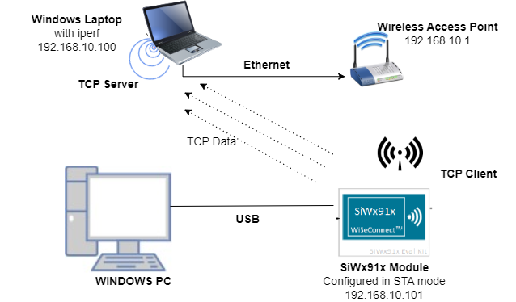

Follow the [Getting Started with SiWx91x SoC](https://docs.silabs.com/) guide to set up the hardware connections and Simplicity Studio IDE.
  
#### 3.2 NCP Mode  

Set up diagram for NCP mode:

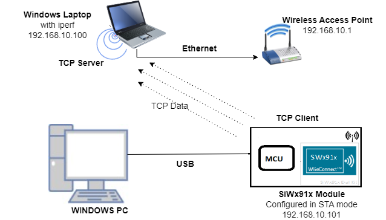

Follow the [Getting Started with EFx32](https://docs.silabs.com/rs9116-wiseconnect/latest/wifibt-wc-getting-started-with-efx32/) guide to setup the hardware connections and Simplicity Studio IDE

**NOTE**: 
- The Host MCU platform (EFR32MG21) and the SiWx91x interact with each other through the SPI interface. 
- The Host MCU platform (EFM32GG11) and the SiWx91x interact with each other through the SDIO interface.


## 4 Application Build Environment

1. Ensure the SiWx91x loaded with the latest firmware following the [Getting started with a PC](https://docs.silabs.com/rs9116/latest/wiseconnect-getting-started). The firmware file is located at **<Si917 COMBO SDK> → connectivity_firmware**.

2. Ensure the EFx32 and SiWx91x set up is connected to your PC.

### 4.1 Board detection

### 4.1.1 SoC mode
1. In the Simplicity Studio IDE, 
    - The 917 SoC board will be detected under **Debug Adapters** pane as shown below.

      ****

### 4.1.2 NCP mode

1. In the Simplicity Studio IDE, 
    - The EFR32 board will be detected under **Debug Adapters** pane as shown below.

      **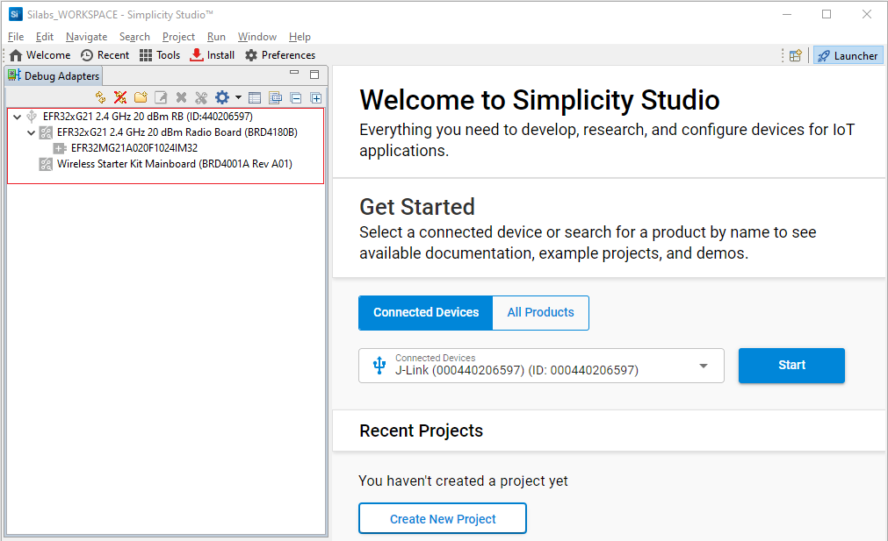**

    - The EFM32 board will be detected under **Debug Adapters** pane as shown below.

      **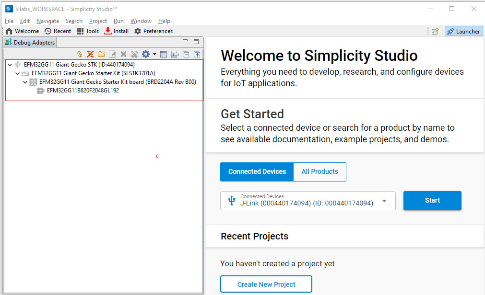**

### 4.2 Creation of project

Ensure the latest Gecko SDK along with the extension Si917 COMBO SDK is added to Simplicity Studio.

1. Click on the board detected and go to **EXAMPLE PROJECTS & DEMOS** section.

   ****

2. Filter for Wi-Fi examples from the Gecko SDK added. For this, check the *Wi-Fi* checkbox under **Wireless Technology** and *Gecko SDK Suite* checkbox under **Provider**.

3. Under provider, for SoC based example, check the *SoC* checkbox and for NCP based example, check the *NCP* checkbox.

4. Now choose Wi-Fi- NCP Access Point example for NCP mode or choose Wi-Fi- SoC Access Point example for SoC mode and click on **Create**.

   For SoC mode:
      
   **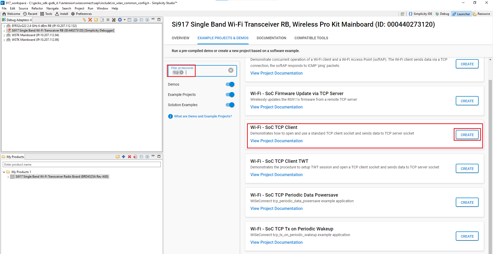**

   For NCP mode:

   **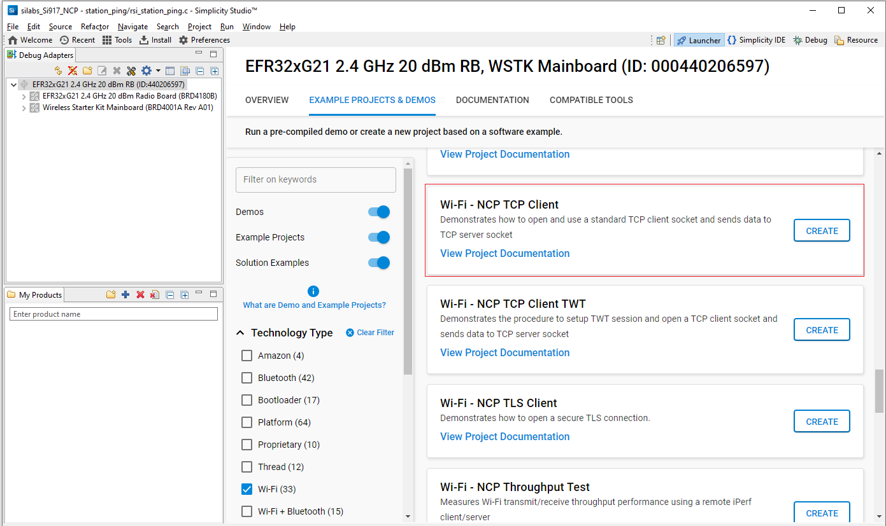**

5. Give the desired name to your project and cick on **Finish**.

   **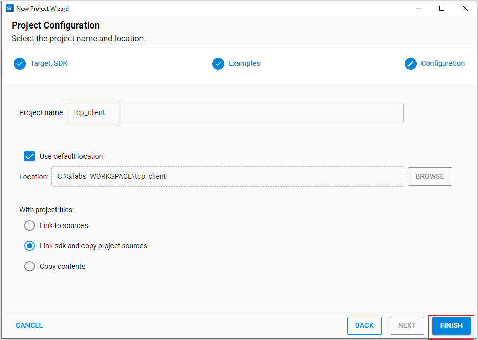**

### 4.3 Application configurations

The application can be configured to suit your requirements and development environment.

1. Wi-Fi Configuration

  - Configure the following parameters in **rsi_tcp_client.c** to enable your Silicon Labs Wi-Fi device to connect to your Wi-Fi network.
  
    ```c
    #define SSID           "SILABS_AP"      // Wi-Fi Network Name
    #define PSK            "1234567890"     // Wi-Fi Password
    #define SECURITY_TYPE  RSI_WPA2         // Wi-Fi Security Type: RSI_OPEN / RSI_WPA / RSI_WPA2
    #define CHANNEL_NO     0                // Wi-Fi channel if the softAP is used (0 = auto select)
    ```

2. Client/Server IP Settings

    ```c
    #define DEVICE_PORT        <local port>     //TCP client port number
    #define SERVER_PORT        <remote port>    //Remote TCP server port number which is opened in Windows PC2.   
    #define SERVER_IP_ADDRESS   "192.168.10.1"       
    #define NUMBER_OF_PACKETS   <no of packets>  //How many packets to receive from TCP client. (Ex: #define NUMBER_OF_PACKETS 10000)
    ```

3. The desired parameters are provided below. User can also modify the parameters as per their needs and requirements.

    ```c   
    #define GLOBAL_BUFF_LEN      15000           //Application memory length which is required by the driver
    ```
4. To configure IP address
DHCP_MODE refers whether IP address configured through DHCP or STATIC

    ```c   
    #define DHCP_MODE               1           //whether IP address is configured through DHCP or STATIC
    ```

**Note!**
> If user wants to configure STA IP address through DHCP then set DHCP_MODE to "1" and skip configuring the following DEVICE_IP, GATEWAY and NETMASK macros.
                                         (Or)
> If user wants to configure STA IP address through STATIC then set DHCP_MODE macro to "0" and configure following DEVICE_IP, GATEWAY and NETMASK macros.

   ```c   
    #define DEVICE_IP              "192.168.10.1"
   ``` 

   ```c   
    #define GATEWAY                "192.168.10.1"
   ``` 

   ```c   
    #define NETMASK                "255.255.255.0"
   ```

**Power save configuration**

   - By default, the application is configured without power save.
  
```c   
  #define ENABLE_POWER_SAVE              0
```

   - If user wants to run the application in power save, modify the below macro.

```c   
  #define ENABLE_POWER_SAVE              1
```

For SoC mode use handshake type as shown below:
```c
#define RSI_HAND_SHAKE_TYPE M4_BASED
```

For NCP mode handshake type can be GPIO_BASED or MSG_BASED, as shown below

```c
#define RSI_HAND_SHAKE_TYPE GPIO_BASED
```      
### 4.4 Execution of the Application

Follow the below steps for the successful execution of the application.

#### 4.4.1 Build the Project - SoC Mode

1. Once the project is created, right click on project and go to **Properties → C/C++ Build → Settings → Build Steps**.

2. Add **post_build_script_SimplicityStudio.bat** file path present at **SI917_COMBO_SDK.X.X.X.XX → utilities → isp_scripts_common_flash** in build steps settings as shown in below image.

   **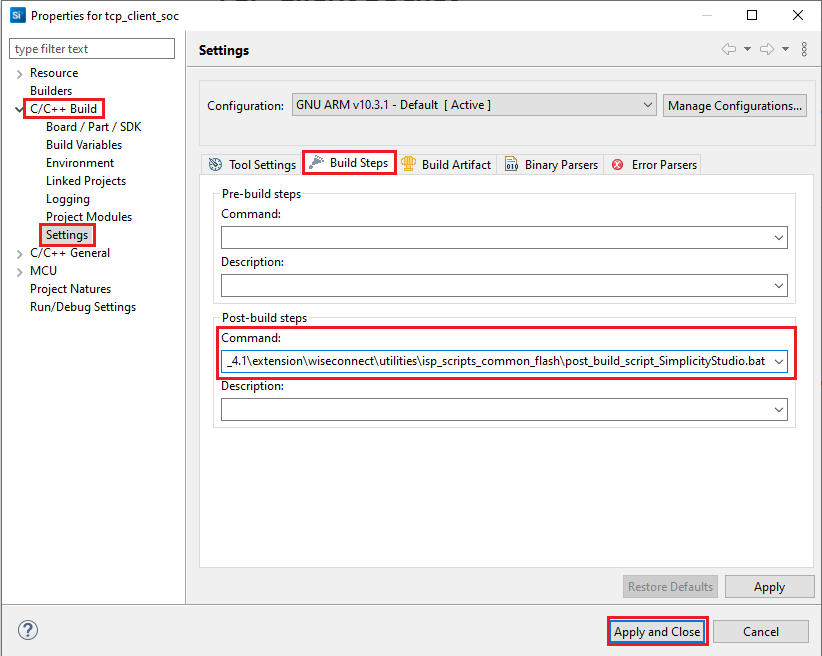**

3. Go to **Properties → C/C++ Build → Settings → Tool Settings → GNU ARM C Compiler → Preprocessor → Defined symbols (-D)** and check for M4 projects macro (RSI_M4_INTERFACE=1) and 9117 macro (CHIP_9117=1). If not present, add the macros by clicking on **ADD** symbol and click **Apply and Close**.
  
   **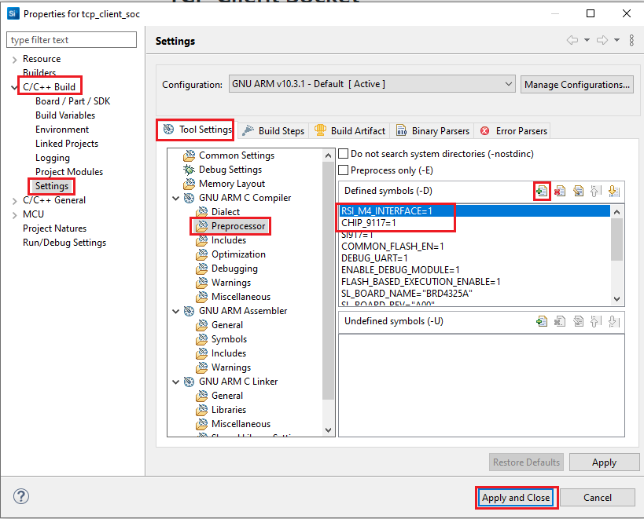**

4. Click on the build icon (hammer) or right click on project name and choose **Build Project** to build the project.

   **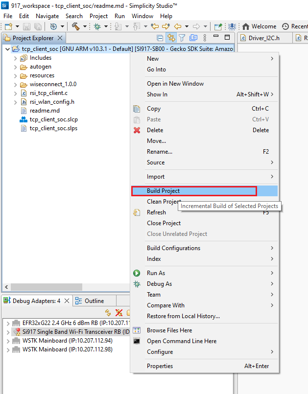**

- Make sure the build returns 0 Errors and 0 Warnings.
  
#### 4.4.2 Build the Project - NCP Mode

1. Check for CHIP_9117 macro in preprocessor settings as mentioned below.
   - Right click on project name.
   - Go to **Properties → C/C++ Build → Settings → Tool Settings → GNU ARM C Compiler → Preprocessor → Defined Symbols (-D)**.
   - If CHIP_9117 macro is not present, add it by clicking on **ADD** symbol.
   - Click on **Apply and Close**.

   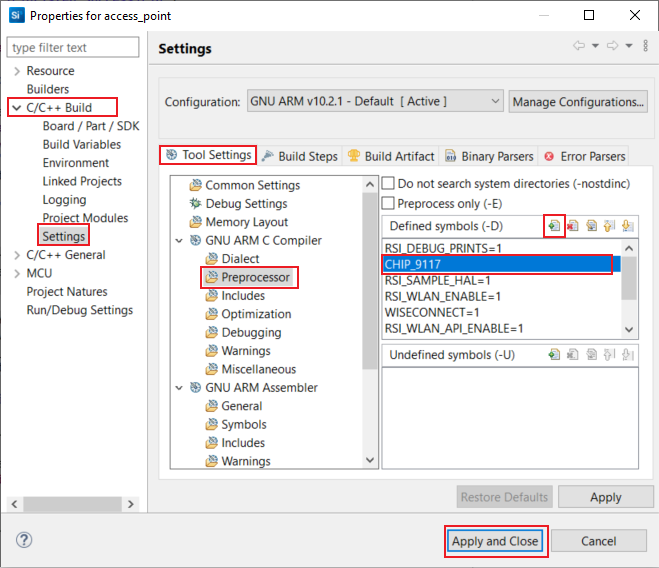

2. Click on the build icon (hammer) or right click on project name and choose **Build Project** to build the project.

   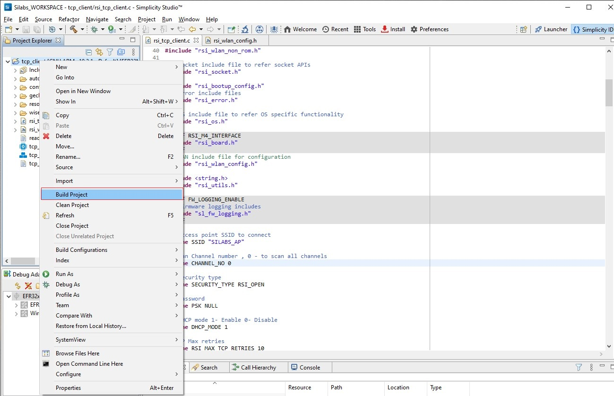

- Make sure the build returns 0 Errors and 0 Warnings.

### 4.4.3 Set up for application prints

Before setting up Tera Term, do the following for SoC mode.

**SoC mode**: 
You can use either of the below USB to UART converters for application prints.
1. Set up using USB to UART converter board.

  - Connect Tx (Pin-6) to P27 on WSTK
  - Connect GND (Pin 8 or 10) to GND on WSTK

    

2. Set up using USB to UART converter cable.

  - Connect RX (Pin 5) of TTL convertor to P27 on WSTK
  - Connect GND (Pin1) of TTL convertor to GND on WSTK

    

**Tera Term set up - for NCP and SoC modes**

1. Open the Tera Term tool. 
   - For SoC mode, choose the serial port to which USB to UART converter is connected and click on **OK**. 

     ****

   - For NCP mode, choose the J-Link port and click on **OK**.

     ****

2. Navigate to the Setup → Serial port and update the baud rate to **115200** and click on **OK**.

    ****

    ****

### 4.4.4 Execute the application

1. Once the build was successful, right click on project and select **Debug As → Silicon Labs ARM Program** to program the device as shown in below image.

   **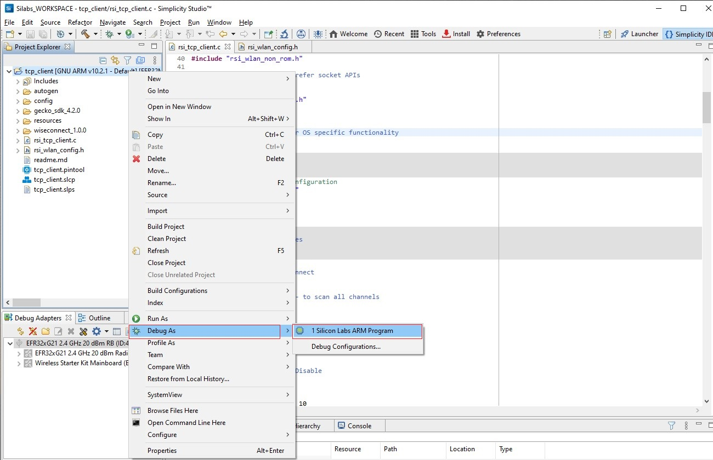**

2. As soon as the debug process is completed, the application control branches to the main().

3. Click on the **Resume** icon in the Simplicity Studio IDE toolbar to run the application.

   **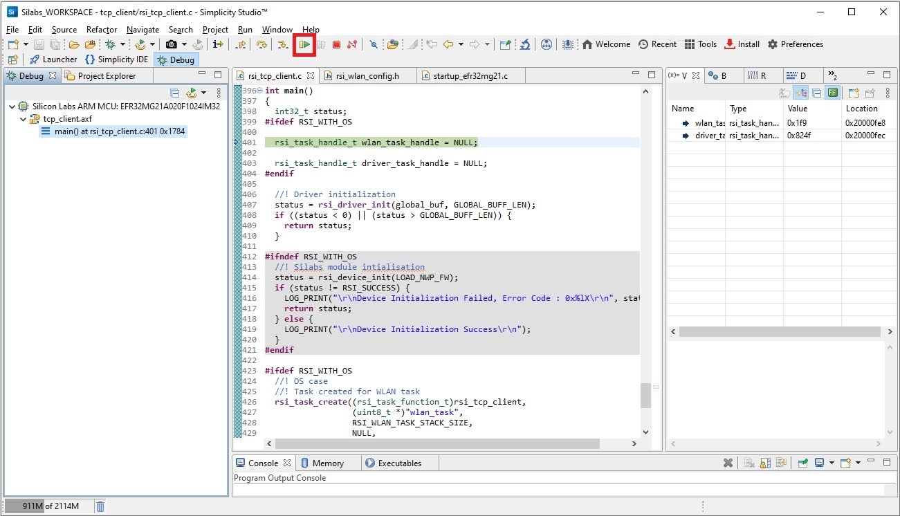**

4. Configure the Access point in OPEN/WPA-PSK/WPA2-PSK mode to connect Silicon Labs device in STA mode.

5. Open TCP server application using iperf application in Windows PC2 which is connected to Access point through LAN.

```c
Note:
Users can download iperf application from the link https://iperf.fr/iperf-download.php#windows
```
6. Connect to TCP client (SiWx91x), first start the TCP server using the below command:

  `iperf_demo.exe -s -p <SERVER_PORT> -i 1`

 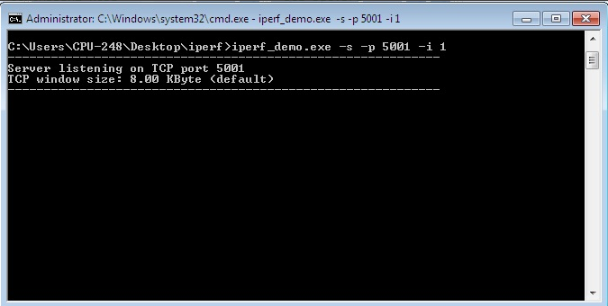

7. After program gets executed, Silicon Labs Device would scan and connect to Access point and get IP.

8. After successful connection, device STA connects to TCP server socket opened on Windows PC2 using TCP client socket and sends configured NUMBER_OF_PACKETS to remote TCP server. Please find below image for reception of TCP data on TCP server.

 

### 4.4.5 **Application Prints - SoC mode**:

   **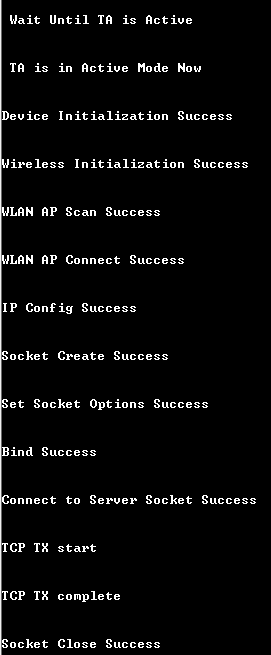**

**Application Prints - NCP mode**:

   **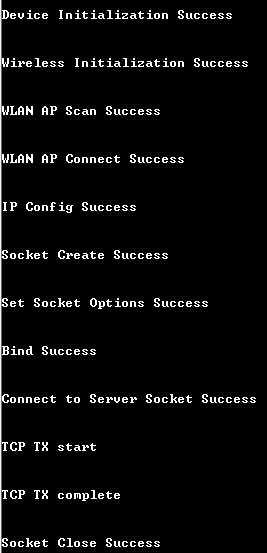**

## 5 Selecting Bare Metal configuration

1. By default, the application runs over FreeRTOS. To run the application with Bare metal configurations, follow the below steps.
   - For Simplicity Studio IDE,
      - Right click on project name
      - Go to **Properties → C/C++ Build → Settings → Tool Settings → GNU ARM C Compiler → Preprocessor → Defined Symbols (-D)**.
      - Select RSI_WITH_OS symbol and click on **Delete** symbol.
      - Click on **Apply and Close**.
      
        **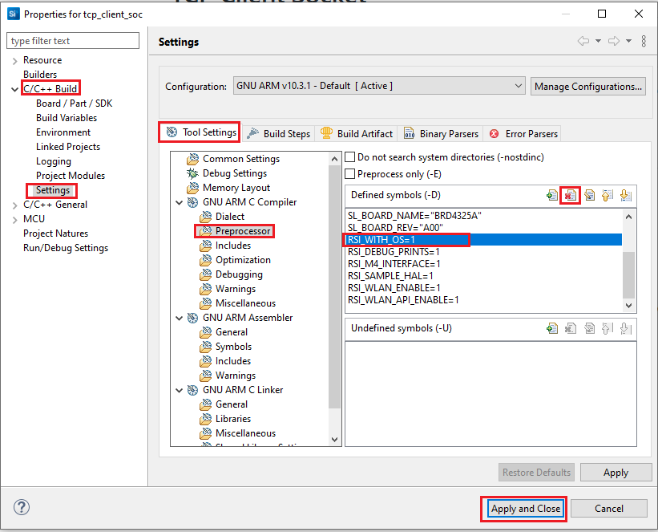**
