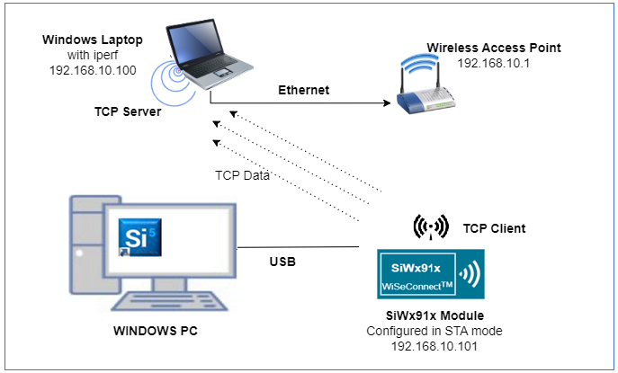
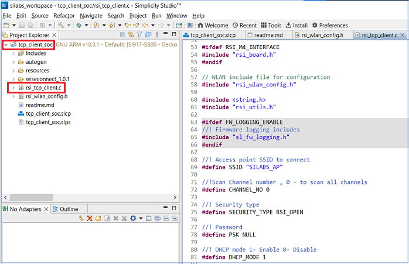
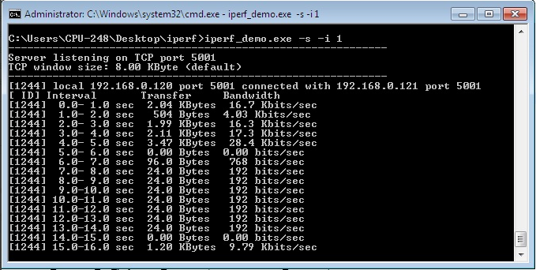
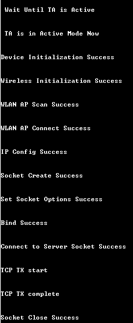
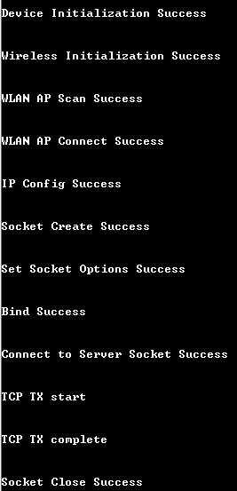

# **TCP Client Socket**

## **1 Introduction**
The TCP client application demonstrates how to open and use a standard TCP client socket to transmit data to a TCP server socket.

## **2 Prerequisites**
For running the application, you will need the following:
### **2.1 Hardware Requirements**
- A Windows PC
- A Wi-Fi Access Point
#### **2.1.1 SoC** 
   - Silicon Labs SiWx917 PK6030A SoC Kit which includes
      - BRD4001A/BRD4002A Wireless Starter Kit Mainboard
      - BRD4325A Radio Board
   - USB TO UART converter
#### **2.1.2 NCP**
   - Silicon Labs PCB8036A Si917 QMS SB Expansion Board
   - [Silicon Labs SLWSTK6006A EFR32xG21 Wireless Starter Kit](https://www.silabs.com/development-tools/wireless/efr32xg21-wireless-starter-kit) which includes
      - BRD4001A/BRD4002A Wireless Starter Kit Mainboard
      - BRD4180A/BRD4180B Radio Board
### **2.2 Software Requirements**
- Simplicity Studio IDE
   - To download and install the Simplicity Studio IDE, refer to the [Simplicity Studio IDE Set up]() section in ***Getting started with SiWx91x*** guides.
- SiWx917_WiSeConnect_SDK.x.x.x.x
- [Iperf application](https://iperf.fr/iperf-download.php) 
- Tera Term software or any other serial terminal software - for viewing application prints

## **3 Set up diagram**
### **3.1 SoC** 


### **3.2 NCP** 


**NOTE**: 
- The Host MCU platform (EFR32xG21) and the SiWx91x interact with each other through the SPI interface. 


## **4 Set up**
### **4.1 SoC/NCP** 
- Follow the [Hardware connections and Simplicity Studio IDE Set up]()  section in the respective ***Getting Started with SiWx91x*** guides to make the hardware connections and add the Gecko and SiWx91x COMBO SDKs to Simplicity Studio IDE.
### **4.2 SiWx91x module's Firmware Update**
- Ensure the SiWx91x module is loaded with the latest firmware following the [SiWx91x Firmware Update]() section in the respective ***Getting started with SiWx91x*** guides.

## **5 Creation of Project**
To create the TCP client example project in the Simplicity Studio IDE, follow the [Creation of Project]() section in the respective ***Getting started with SiWx91x*** guides. 
   - For SoC, choose the **Wi-Fi - SoC TCP Client** example.
   - For NCP, choose the **Wi-Fi - NCP TCP Client** example.


## **6 Application configuration**
Read through the following sections and make any changes needed. 
  
1. In the Project explorer pane of the IDE, expand the **tcp_client** folder and open the **rsi_tcp_client.c** file. Configure the following parameters based on your requirements.

   

- **Wi-Fi configuration**    
    ```c
    //! Wi-Fi Network Name
    #define SSID           "SILABS_AP"      
    
    //! Wi-Fi Password
    #define PSK            "1234567890"     
    
    //! Wi-Fi Security Type: RSI_OPEN/RSI_WPA/RSI_WPA2
    #define SECURITY_TYPE  RSI_WPA2         
    
    //! Wi-Fi channel
    #define CHANNEL_NO     0                 
    ```

-  **Client/Server IP Settings**
    ```c
    //! TCP client port number
    #define DEVICE_PORT         5001             

    //! Remote TCP server port number which is opened in Windows PC
    #define SERVER_PORT         5001                
    
    //! IP address of the server (Windows PC)
    #define SERVER_IP_ADDRESS   "192.168.10.1"

    //! How many packets to receive from TCP client. (Ex: #define NUMBER_OF_PACKETS 10000)
    #define NUMBER_OF_PACKETS   1000             
    ```

-  **To configure IP address**
DHCP_MODE refers whether IP address configured through DHCP or STATIC

    ```c   
    //! Whether IP address is configured through DHCP or STATIC
    #define DHCP_MODE               1           
    ```
   > If user wants to configure STA IP address through DHCP then set DHCP_MODE to "1" and skip configuring the following DEVICE_IP, GATEWAY and NETMASK macros.
                                          (Or)
   > If user wants to configure STA IP address through STATIC then set DHCP_MODE macro to "0" and configure following DEVICE_IP, GATEWAY and NETMASK macros.
      ```c   
      #define DEVICE_IP              "192.168.10.1"
      #define GATEWAY                "192.168.10.1"
      #define NETMASK                "255.255.255.0"
      ```

## **7 Setup for Serial Prints**

To Setup the serial prints, follow the [Setup for Serial Prints]() section in the respective ***Getting started with SiWx91x*** guide.
 
## **8 Build, Flash, and Run the Application**

To build, flash, and run the application project refer to the [Build and Flash the Project]() section in the respective ***Getting Started with SiWx91x*** guide.

## **9 Application Execution Flow**

1. Configure the Access point in OPEN/WPA-PSK/WPA2-PSK mode to connect Silicon Labs device in STA mode.

2. Open TCP server application using iperf application in Windows PC which is connected to Access point through LAN.

3. Connect to TCP client (SiWx91x), first start the TCP server using the below command:
   
   `iperf_demo.exe -s -p <SERVER_PORT> -i 1`
   
   

4. After program gets executed, SiWx917 module would scan and connect to Access point and get IP.

5. After successful connection, SiWx917 module connects to TCP server socket opened on Windows PC using TCP client socket and sends configured NUMBER_OF_PACKETS to remote TCP server. Following image depicts reception of TCP data on TCP server.
   
   

6. Application prints can be observed as follows:

- ### **SoC**
  
   

- ### **NCP**

   

## **Appendix**

By default, the application runs over FreeRTOS. To run the application with Bare metal configurations, follow the Bare Metal configuration section in the ***Getting Started with SiWx91x*** guide.