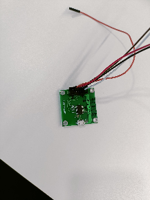

# TCP Client Socket

## Introduction 

The TCP client application demonstrates how to open and use a standard TCP client socket and sends data to TCP server socket.

## Setting Up

Before running the application, the user will need the following things to setup.

### Hardware Requirements 

- Windows PC
- Wireless Access Point
- TCP server over SSL running in Windows PC2 (This application uses OpenSSL to create TCP server over SSL)
- SiWx91x Wi-Fi Evaluation Kit. The SiWx91x supports multiple operating modes. See [Operating Modes]() for details.
  - **SoC Mode**:
      - Silicon Labs [BRD4325A](https://www.silabs.com/)
  - **NCP Mode**:
      - Silicon Labs [(BRD4180A, BRD4280B)](https://www.silabs.com/); **AND**
      - Host MCU Eval Kit. This example has been tested with:
        - Silicon Labs [WSTK + EFR32MG21](https://www.silabs.com/development-tools/wireless/efr32xg21-bluetooth-starter-kit)
        - Silicon Labs [WSTK + EFM32GG11](https://www.silabs.com/development-tools/mcu/32-bit/efm32gg11-starter-kit)
        - [STM32F411 Nucleo](https://st.com/)

#### SoC Mode : 

 
  
#### NCP Mode : 

 

### Project Setup
- **SoC Mode**
  - **Silicon Labs SiWx91x SoC**. Follow the [Getting Started with SiWx91x SoC](https://docs.silabs.com/) to setup the example to work with SiWx91x SoC and Simplicity Studio.
- **NCP Mode**
  - **Silicon Labs EFx32 Host**. Follow the [Getting Started with EFx32](https://docs.silabs.com/rs9116-wiseconnect/latest/wifibt-wc-getting-started-with-efx32/) to setup the example to work with EFx32 and Simplicity Studio.

## Configuring the Application

The application can be configured to suit user requirements and development environment.
Read through the following sections and make any changes needed. 
  
### NCP Mode - Host Interface 

* By default, the application is configured to use the SPI bus for interfacing between Host platforms(EFR32MG21) and the SiWx91x EVK.

### Bare Metal/RTOS Support

To select a bare metal configuration, see [Selecting bare metal](#selecting-bare-metal).

### Wi-Fi Configuration

Configure the following parameters in **rsi_tcp_client.c** to enable your Silicon Labs Wi-Fi device to connect to your Wi-Fi network.
  
```c                                      
#define SSID           "SILABS_AP"      // Wi-Fi Network Name
#define PSK            "1234567890"     // Wi-Fi Password
#define SECURITY_TYPE  RSI_WPA2         // Wi-Fi Security Type: RSI_OPEN / RSI_WPA / RSI_WPA2
#define CHANNEL_NO     0                // Wi-Fi channel if the softAP is used (0 = auto select)
```

### Client/Server IP Settings
```c   
#define DEVICE_PORT        <local port>     //TCP client port number
#define SERVER_PORT        <remote port>    //Remote TCP server port number which is opened in Windows PC2.   
#define SERVER_IP_ADDRESS   0x640AA8C0       //Remote server IP address.It should be in long format and in little endian byte order.
#define NUMBER_OF_PACKETS   <no of packets>  //How many packets to receive from TCP client. (Ex: #define NUMBER_OF_PACKETS 10000)
```

### The desired parameters are provided below. User can also modify the parameters as per their needs and requirements.
```c   
#define GLOBAL_BUFF_LEN      15000           //Application memory length which is required by the driver
```


```c   
#define DHCP_MODE               1           //whether IP address is configured through DHCP or STATIC
```

**Note!**
> If user wants to configure STA IP address through DHCP then set DHCP_MODE to "1" and skip configuring the following DEVICE_IP, GATEWAY and NETMASK macros.
                                         (Or)
> If user wants to configure STA IP address through STATIC then set DHCP_MODE macro to "0" and configure following DEVICE_IP, GATEWAY and NETMASK macros.
    
> IP address to be configured to the device in STA mode should be in long format and in little endian byte order.
  
      - Example: To configure "192.168.10.10" as IP address, update the macro DEVICE_IP as 0x0A0AA8C0.

```c   
#define DEVICE_IP              0X0A0AA8C0
```
> IP address of the gateway should also be in long format and in little endian byte order.

     - Example: To configure "192.168.10.1" as Gateway, update the macro GATEWAY as 0x010AA8C0 

```c   
#define GATEWAY                0x010AA8C0
```

> IP address of the network mask should also be in long format and in little endian byte order
  
        - Example: To configure "255.255.255.0" as network mask, update the macro NETMASK as 0x00FFFFFF 

```c   
#define NETMASK                 0x00FFFFFF
```
                 

# Testing the Application 

Follow the below steps for the successful execution of the application.

## Loading the SiWx91x Firmware

Refer [Getting started with a PC](https://docs.silabs.com/rs9116/latest/wiseconnect-getting-started) to load the firmware into SiWx91x EVK. The firmware file is located in `<SDK>/connectivity_firmware/`


## Creating the Project and builing the Application
  
Refer [Getting started with EFX32](https://docs.silabs.com/rs9116-wiseconnect/latest/wifibt-wc-getting-started-with-efx32/), for settin-up EFR & EFM host platforms

### creation - SoC Mode : 

- Connect your board. The Si917 compatible SoC board is **BRD4325A**.

- Studio should detect your board. Your board will be shown here.

 

### creation - NCP Mode : 

- Connect your board. The supported NCP boards are: **BRD4180A,BRD4280B**

- Studio should detect your board. Your board will be shown here.

 

### Selecting an example application and generate project

- Go to the 'EXAMPLE PROJECT & DEMOS' tab and select your desired example application

 

- Click 'Create'. The "New Project Wizard" window appears. Click 'Finish'

 

### Build Project

#### SoC Mode :

- Once the project is created, right click on project and go to properties → C/C++ Build → Settings → Build Steps

- Add post_build_script_SimplicityStudio.bat file path (SI917_COMBO_SDK.X.X.X.XX\utilities\isp_scripts_common_flash) in build steps settings as shown in below image.

 

- Check for M4 projects macros in preprocessor settings(RSI_M4_INTERFACE=1)

- Check for 9117 macro in preprocessor settings(CHIP_9117=1).

- Click on the build icon (hammer) to build the project

 

- Successful build output will show as below.

 

#### NCP Mode :

- Check for 9117 macro in preprocessor settings(CHIP_9117=1).

- Click on the build icon (hammer) to build the project

 

- Successful build output will show as below.


## Program the device

Once the build was successfull, right click on project and click on Debug As->Silicon Labs ARM Program as shown in below image.

 

  

## Running the SiWx91x Application

After making any custom configuration changes required, build, download and run the application as below.

- Configure the Access point in OPEN/WPA-PSK/WPA2-PSK mode to connect Silicon Labs device in STA mode.

- Open TCP server application using iperf application in Windows PC2 which is connected to Access point through LAN.

- Users can download application from the link below,

https://iperf.fr/iperf-download.php#windows

iperf_demo.exe -s -p <SERVER_PORT> -i 1

 

- After program gets executed, Silicon Labs Device would scan and connect to Access point and get IP.

- After successful connection, device STA connects to TCP server socket opened on Windows PC2 using TCP client socket and sends configured NUMBER_OF_PACKETS to remote TCP server. Please find below image for reception of TCP data on TCP server.

 

## Observing the output prints on serial terminal

### SoC Mode:

> Connect USB to UART connector Tx and GND pins to WSTK radio board.

   - Connect Tx(Pin-6) to P27 on WSTK
   - Connect GND(Pin 8 or 10) to GND on WSTK

 

> Prints can see as below in any Console terminal

 

### NCP Mode:

Prints can see as below in any Console terminal

 

# Selecting Bare Metal

The application has been designed to work with FreeRTOS and Bare Metal configurations. By default, the application project files (Simplicity studio) are configured with FreeRTOS enabled. The following steps demonstrate how to configure Simplicity Studio to test the application in a Bare Metal environment.

## Bare Metal with Simplicity Studio

> - Open the project in Simplicity Studio

> - Right click on the project and choose 'Properties'

> - Go to 'C/C++ Build' | 'Settings' | 'GNU ARM C Compiler' | 'Symbols' and remove macro 'RSI_WITH_OS=1'

> - Select 'Apply' and 'OK' to save the settings

  

 
