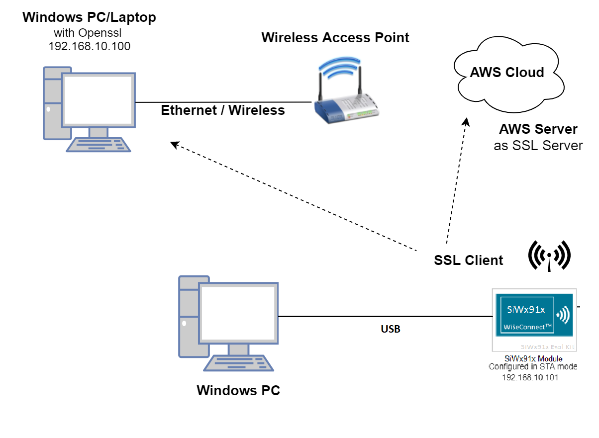
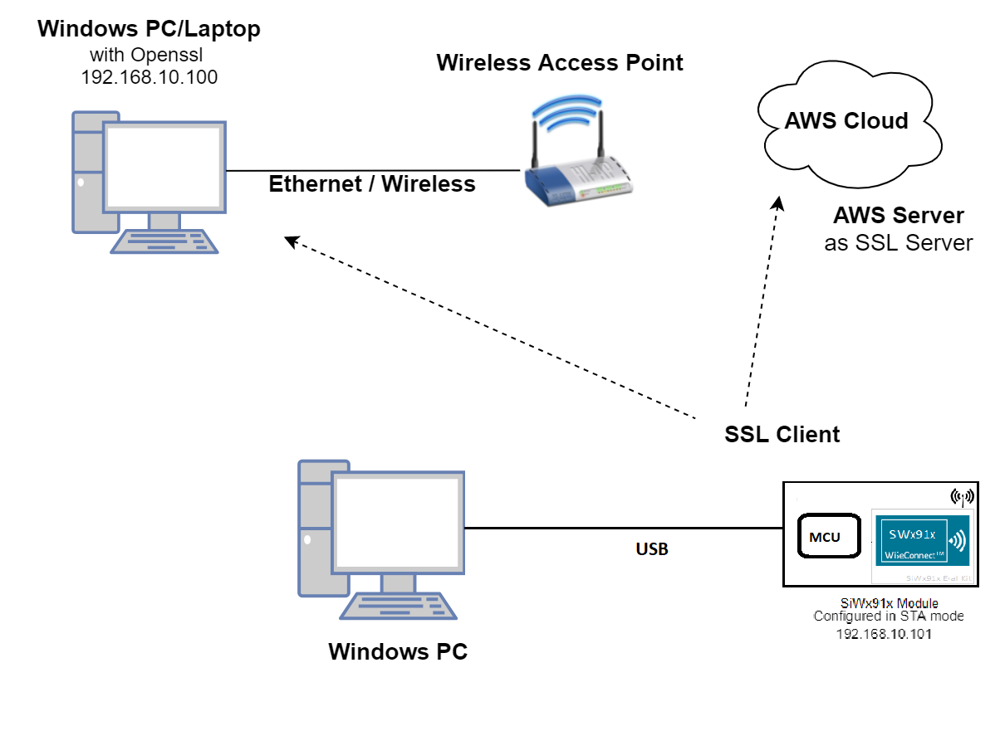
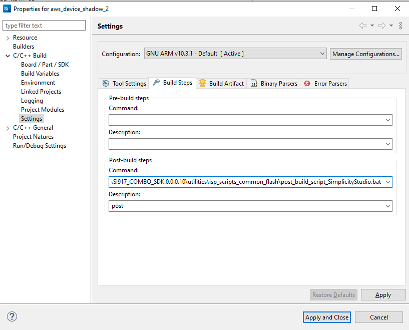
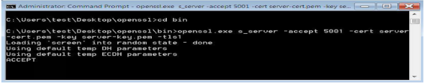

# Three SSL Client Sockets 

## Introduction

This application demonstrates how SiWx91x EVK will connect to three different SSL servers with three different set of SSL certificates and loading certificates into the FLASH.

## Setting Up 

Before running the application, set up the following:

### Hardware Requirements 

- Windows PC
- AWS server information like domain name running in the cloud which supports SSL connection.
- Wireless Access Point
- TCP server over SSL running in Windows PC (This application uses OpenSSL to create TCP server over SSL)
- SiWx91x Wi-Fi Evaluation Kit
  - **SoC Mode**: 
      - Silicon Labs [BRD4325A](https://www.silabs.com/)
  - **NCP Mode**:
      - Silicon Labs [(BRD4180A, BRD4280B)](https://www.silabs.com/); **AND**
      - Host MCU Eval Kit. This example has been tested with:
        - Silicon Labs [WSTK + EFR32MG21](https://www.silabs.com/development-tools/wireless/efr32xg21-bluetooth-starter-kit)

#### SoC Mode : 


  
#### NCP Mode :  



### Project Setup
- **SoC Mode**
  - **Silicon Labs SiWx91x SoC**. Follow the [Getting Started with SiWx91x SoC](https://docs.silabs.com/) to setup the example to work with SiWx91x SoC and Simplicity Studio.
- **NCP Mode**
  - **Silicon Labs EFx32 Host**. Follow the [Getting Started with EFx32](https://docs.silabs.com/rs9116-wiseconnect/latest/wifibt-wc-getting-started-with-efx32/) to setup the example to work with EFx32 and Simplicity Studio.

## Configuring the Application
The application can be configured to suit user requirements and development environment.
Read through the following sections and make any changes needed. 
  
### NCP Mode - Host Interface 

* By default, the application is configured to use the SPI bus for interfacing between Host platforms(EFR32MG21) and the SiWx91x EVK.

### Bare Metal/RTOS Support
To select a bare metal configuration, see [Selecting bare metal](#selecting-bare-metal).

### Wi-Fi Configuration
Configure the following parameters in **rsi_three_ssl_client_sockets.c** to enable your Silicon Labs Wi-Fi device to connect to your Wi-Fi network.
  
```c                                      
#define SSID           "SILABS_AP"      // Wi-Fi Network Name
#define PSK            "1234567890"     // Wi-Fi Password
#define SECURITY_TYPE  RSI_WPA2         // Wi-Fi Security Type: RSI_OPEN / RSI_WPA / RSI_WPA2
#define CHANNEL_NO     0                // Wi-Fi channel if the softAP is used (0 = auto select)
```
    
### Client/Server IP Settings

```c
   #define DEVICE_PORT1   <local port>    // TCP client port 1  
   #define SERVER_PORT1   <remote port>   // TCP server port 1 which is opened in remote peer/ which is running on cloud.
   #define DEVICE_PORT2   <local port>    // TCP client port 2
   #define SERVER_PORT2   <remote port>   // TCP server port 2 which is opened in remote peer/ which is running on cloud.
   #define DEVICE_PORT3   <local port>    // TCP client port 3
   #define SERVER_PORT3   <remote port>   // TCP server port 3 which is opened in remote peer/ which is running on cloud.   
   #define SERVER_ADDR     0x640AA8C0     // Remote server IP address
```
#### The desired parameters are provided below. User can also modify the parameters as per their needs and requirements.

Application memory length which is required by the driver
  
```c   
   #define GLOBAL_BUFF_LEN                            15000
```

RSI_SSL_BIT_ENABLE
   
   0 - Disable SSL bitmap
   1 - Enable SSL bitmap
   This bit should be enabled for SSL connection

```c   
   #define RSI_SSL_BIT_ENABLE                         1
```

**Note!**

If certificates are not there in flash, then ssl handshake will fail.

***
> DHCP_MODE refers whether IP address configured through DHCP or STATIC

```c   
   #define DHCP_MODE                                  1
```

**Note!**
> If user wants to configure STA IP address through DHCP then set DHCP_MODE to "1" and skip configuring the following DEVICE_IP, GATEWAY and NETMASK macros.
                                       (Or)
> If user wants to configure STA IP address through STATIC then set DHCP_MODE macro to "0" and configure following DEVICE_IP, GATEWAY and NETMASK macros.
    
> IP address to be configured to the device in STA mode should be in long format and in little endian byte order.
   
     - Example: To configure "192.168.10.10" as IP address, update the macro DEVICE_IP as 0x0A0AA8C0.

```c   
   #define DEVICE_IP                                  0X0A0AA8C0
```
> IP address of the gateway should also be in long format and in little endian byte order.

    - Example: To configure "192.168.10.1" as Gateway, update the macro GATEWAY as 0x010AA8C0.

```c   
   #define GATEWAY                                    0x010AA8C0
```

IP address of the network mask should also be in long format and in little endian byte order.

   Example: To configure "255.255.255.0" as network mask, update the macro NETMASK as 0x00FFFFFF.

```c   
   #define NETMASK                                    0x00FFFFFF
```

AWS_DOMAIN_NAME refers to domain name of the AWS server

```c   
   #define AWS_DOMAIN_NAME                            "a25jwtlmds8eip-ats.iot.us-east-2.amazonaws.com"
```


**Power save configuration**

   - By default, the application is configured without power save.
  
```c   
  #define ENABLE_POWER_SAVE              0
```

   - If user wants to run the application in power save, modify the below macro.

```c   
  #define ENABLE_POWER_SAVE              1
```

## Testing the Application

Follow the below steps for the successful execution of the application.

### Loading the SiWx91x Firmware

Refer [Getting started with a PC](https://docs.silabs.com/rs9116/latest/wiseconnect-getting-started) to load the firmware into SiWx91x EVK. The firmware file is located in `<SDK>/firmware/`

## Creating the Project and builing the Application
  
Refer [Getting started with EFX32](https://docs.silabs.com/rs9116-wiseconnect/latest/wifibt-wc-getting-started-with-efx32/), for settin-up EFR & EFM host platforms

### Project Creation - SoC Mode : 

- Connect your board. The Si917 compatible SoC board is **BRD4325A**.
- Studio should detect your board. Your board will be shown here.


### Project Creation - NCP Mode : 

- Connect your board. The supported NCP boards are: **BRD4180A,BRD4280B**
- Studio should detect your board. Your board will be shown here.


### Selecting an example application and generate project

- Go to the 'EXAMPLE PROJECT & DEMOS' tab and select your desired example application

- Click 'Create'. The "New Project Wizard" window appears. Click 'Finish'


#### Build Project - SoC Mode

- Once the project is created, right click on project and go to properties → C/C++ Build → Settings → Build Steps
- Add post_build_script_SimplicityStudio.bat file path (SI917_COMBO_SDK.X.X.X.XX\utilities\isp_scripts_common_flash) in build steps settings as shown in below image.

- Check for M4 projects macros in preprocessor settings(RSI_M4_INTERFACE=1)
- Check for 9117 macro in preprocessor settings(CHIP_9117=1).
- Click on the build icon (hammer) to build the project

- Successful build output will show as below.


#### Build Project - NCP Mode :

- Check for 9117 macro in preprocessor settings(CHIP_9117=1).
- Click on the build icon (hammer) to build the project

- Successful build output will show as below.


## Program the device

Once the build was successfull, right click on project and click on Debug As->Silicon Labs ARM Program as shown in below image.


#### Running the SiWx91x Application
After making any custom configuration changes required, build, download and run the application as below.

- Configure the Access point in OPEN / WPA-PSK / WPA2-PSK mode to connect SiWx91x EVK in STA mode.

- Copy the certificates server-cert and server-key into Openssl/bin folder in the Windows PC (Remote PC).

**Note!**
 > All the certificates are given in the SDK. Path: `<SDK>/resources/certificates`
 
- In Windows PC (Remote PC) which is connected to AP, run the Openssl server by giving the following command

   ```sh
   Openssl.exe s_server -accept<SERVER_PORT> -cert <server_certificate_file_path> -key <server_key_file_path> -tls<tls_version>
   Example: openssl.exe s_server -accept 5001 -cert server-cert.pem -key server-key.pem -tls1
   ```

 
- Make sure the SSL server is running in the cloud (check with the domain name)

- After the program gets executed, SiWx91x EVK would be connected to Access point having the configuration same that of in the application and get IP.

- The Device which is configured as SSL client will connect to three different remote SSL servers.

## Observing the output prints on serial terminal

### SoC Mode:
> Connect USB to UART connector Tx and GND pins to WSTK radio board.

   - Connect Tx(Pin-6) to P27 on WSTK
   - Connect GND(Pin 8 or 10) to GND on WSTK

> Prints can see as below in any Console terminal


### NCP Mode:
Prints can see as below in any Console terminal


# Selecting Bare Metal
The application has been designed to work with FreeRTOS and Bare Metal configurations. By default, the application project files (Simplicity studio) are configured with FreeRTOS enabled. The following steps demonstrate how to configure Simplicity Studio to test the application in a Bare Metal environment.

## Bare Metal with Simplicity Studio
> - Open the project in Simplicity Studio
> - Right click on the project and choose 'Properties'
> - Go to 'C/C++ Build' | 'Settings' | 'GNU ARM C Compiler' | 'Symbols' and remove macro 'RSI_WITH_OS=1'
> - Select 'Apply' and 'OK' to save the settings

 


