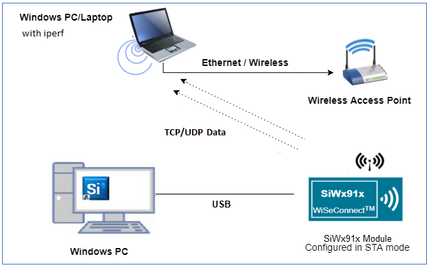
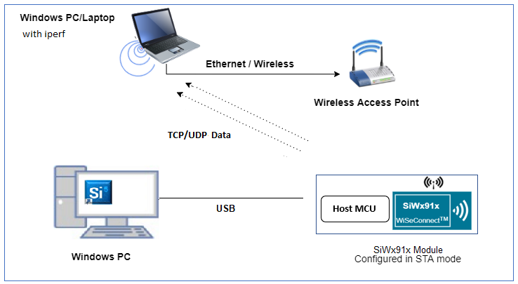
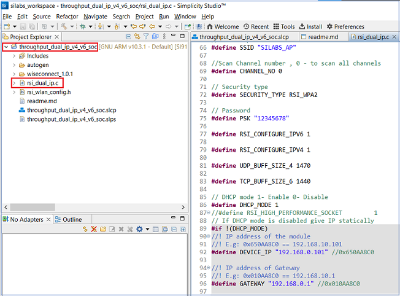
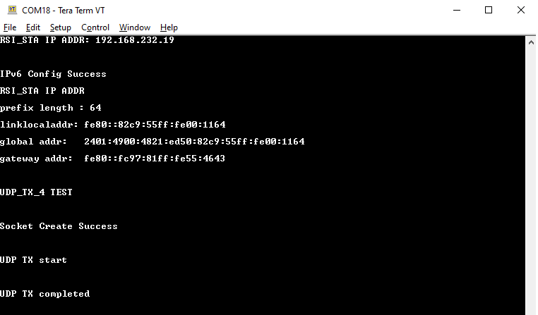
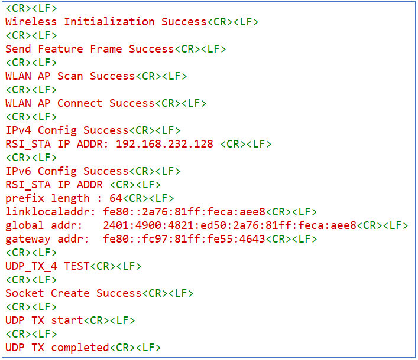

# **Throughput Dual IP (IPv4 and IPv6) Application**

## **1 Introduction**
This application demonstrates the procedure to measure WLAN UDP/TCP throughput in both ipv4 and ipv6 simultaneously by configuring the SiWx91x in client/server role.

## **2 Prerequisites**
For running the application, you will need the following:
### **2.1 Hardware Requirements**
- A Windows PC
- A Wi-Fi Access Point
#### **2.1.1 SoC** 
   - Silicon Labs SiWx917 PK6030A SoC Kit which includes
      - BRD4001A/BRD4002A Wireless Starter Kit Mainboard
      - BRD4325A Radio Board
   - USB TO UART converter
#### **2.1.2 NCP**
   - Silicon Labs PCB8036A Si917 QMS SB Expansion Board
   - [Silicon Labs SLWSTK6006A EFR32xG21 Wireless Starter Kit](https://www.silabs.com/development-tools/wireless/efr32xg21-wireless-starter-kit) which includes
      - BRD4001A/BRD4002A Wireless Starter Kit Mainboard
      - BRD4180A/BRD4180B Radio Board
### **2.2 Software Requirements**
- Simplicity Studio IDE
   - To download and install the Simplicity Studio IDE, refer to the [Simplicity Studio IDE Set up]() section in ***Getting started with SiWx91x*** guides.
- SiWx917_WiSeConnect_SDK.x.x.x.x
- iperf - TCP/UDP peer application ([iperf 2.0.9](https://iperf.fr/iperf-download.php))

## **3 Set up diagram**
### **3.1 SoC** 


### **3.2 NCP** 



**NOTE**: 
- The Host MCU platform (EFR32xG21) and the SiWx91x interact with each other through the SPI interface. 

## **4 Set up**
### **4.1 SoC/NCP** 
- Follow the [Hardware connections and Simplicity Studio IDE Set up]()  section in the respective ***Getting Started with SiWx91x*** guide to make the hardware connections and add the Gecko and SiWx91x COMBO SDKs to Simplicity Studio IDE.
### **4.2 SiWx91x module's Firmware Update**
- Ensure the SiWx91x module is loaded with the latest firmware following the [SiWx91x Firmware Update]() section in the respective ***Getting started with SiWx91x*** guide.

## **5 Creation of Project**
  
To create the Throughput Dual IP example project in the Simplicity Studio IDE, follow the [Creation of Project]() section in the respective ***Getting started with SiWx91x*** guides. 
  - For SoC, choose the **Wi-Fi - SoC Throughput_dual_ip_v4_v6** example.
  - For NCP, choose the **Wi-Fi - NCP Throughput_dual_ip_v4_v6** example.


## **6 Application configuration**
Read through the following sections and make any changes needed. 
  
1. In the Project explorer pane of the IDE, expand the **throughput_dual_ip_v4_v6** folder and open the **rsi_dual_ip.c** file. Configure the following parameters based on your requirements.

   

- ### **Wi-Fi configuration**    
    
    ```c
    //! Wi-Fi Network Name
    #define SSID           "SILABS_AP"      
    
    //! Wi-Fi Password
    #define PSK            "1234567890"     
    
    //! Wi-Fi Security Type: RSI_OPEN / RSI_WPA / RSI_WPA2
    #define SECURITY_TYPE  RSI_WPA2         
    
    //! Wi-Fi channel if the softAP is used (0 = auto select)
    #define CHANNEL_NO     0                
    ```

- ### **Client/Server IP Settings**
    ```c
    //! Local port to use
    #define PORT_NUM            5001   
    
    //! Remote server port
    #define SERVER_PORT         5001  
    
    //! Remote server IPv4 address 
    #define SERVER_IP_ADDRESS   "192.168.0.111"    
    
    //! Remote server IPv6 address
    #define SERVER_IP_ADDRESS_6 "2001:db8:0:1::121"  
    ```

- ### **Throughput Measurement Types**
   The application is configured to measure throughput using UDP, TCP in ipv4 and ipv6 respectively.
    ```c
    #define THROUGHPUT_TYPE_4 UDP_TX_4
    #define THROUGHPUT_TYPE_6 TCP_TX_6
    ```

## **7 Setup for Serial Prints**

To Setup the serial prints, follow the [Setup for Serial Prints]() section in the respective ***Getting started with SiWx91x*** guides.
 
## **8 Build, Flash, and Run the Application**

To build, flash, and run the application project refer to the [Build and Flash the Project]() section in the respective ***Getting Started with SiWx91x*** guide.

## **9 Application Execution Flow**

# Testing Throughput
There are two 'ends' involved when measuring throughput, data is sent between the client end and the server end. By default, the Iperf protocol sends data from the Client to the Server to measure throughput. Depending on the configuration selected, the SiWx91x may be the client or the server. In general, it is advisable to start the server before the client since the client will immediately begin to try to connect to the server to send data. 

The following sections describe how to run the SiWx91x throughput application together with examples for various Iperf configurations that run on the PC.   

## UDP Tx v4 Throughput
To measure UDP Tx throughput, configure the SiWx91x as a UDP client and start a UDP server on the remote PC.
The Iperf command to start the UDP server on the PC is: 

> `C:\> iperf.exe -s -u -p <SERVER_PORT> -i 1`
> 
> For example ...
>
> `C:\> iperf.exe -s -u -p 5001 -i 1`

## TCP Tx v6 Throughput
To measure TCP Tx throughput, configure the RS9116W as a TCP client and start a TCP server on the remote PC.
The Iperf command to start the TCP server is: 
		
> `C:\> iperf.exe -s -V -p <SERVER_PORT> -i 1`
>
> For example ...
>
> `C:\> iperf.exe -s -V -p 5001 -i 1`

The application prints can be observed as follows:

- **SoC:**

   

- **NCP:**

   

## **Appendix**

By default, the application runs over FreeRTOS. To run the application with Bare metal configurations, follow the Bare Metal configuration section in the ***Getting Started with SiWx91x*** guide.