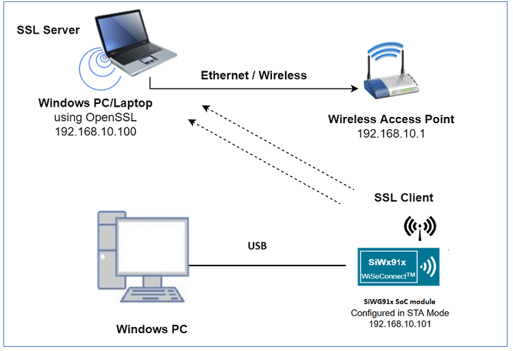
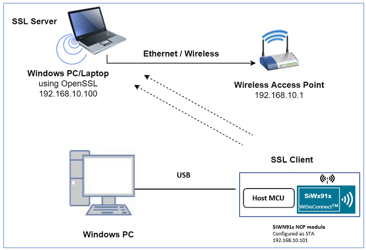
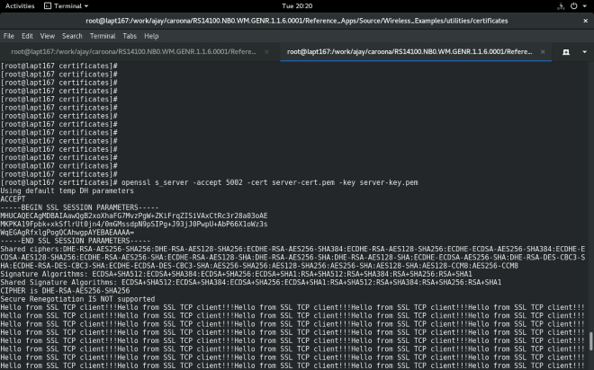
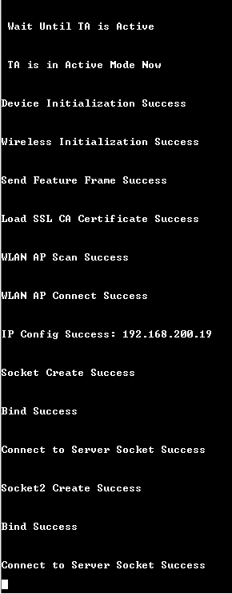
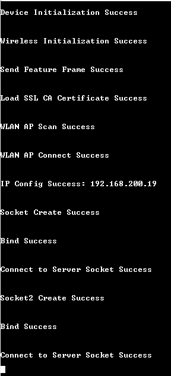
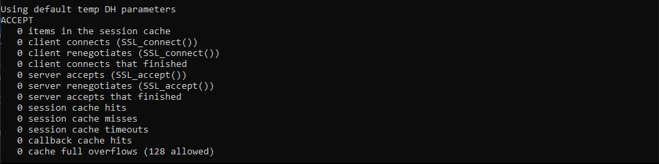

# **SSL Client with Multiple TLS Versions** 

## **1 Introduction**
This application demonstrates how to open a TCP client socket on SiWx917 module and use this TCP client socket with a secure connection using SSL and transmit data over the socket.
- Two TCP sockets are opened over SSL. One socket uses SSL TLS v1.0 protocol and the other socket uses SSL TLS v1.2 protocol
- CA certificate and device certificates are loaded into module flash, as they are necessary for the key exchanges involved while using SSL

## **2 Prerequisites**
For running the application, you will need the following:
### **2.1 Hardware Requirements**
- A Windows PC
- A Wi-Fi Access Point
#### **2.1.1 SoC** 
   - Silicon Labs SiWx917 PK6030A SoC Kit which includes
      - BRD4001A/BRD4002A Wireless Starter Kit Mainboard
      - BRD4325A Radio Board
   - USB TO UART converter
#### **2.1.2 NCP**
   - Silicon Labs BRD8036A Si917 QMS SB Expansion Board
   - [Silicon Labs SLWSTK6006A EFR32xG21 Wireless Starter Kit](https://www.silabs.com/development-tools/wireless/efr32xg21-wireless-starter-kit) which includes
      - BRD4001A/BRD4002A Wireless Starter Kit Mainboard
      - BRD4180A/BRD4180B Radio Board
### **2.2 Software Requirements**
- Simplicity Studio IDE
   - To download and install the Simplicity Studio IDE, refer to the [Simplicity Studio IDE Set up]() section in ***Getting started with SiWx91x*** guides.
- TCP server over SSL running in Windows PC (This application uses OpenSSL to create TCP server over SSL). Please check the "Download OpenSSL Binaries (required for SSL-enabled components)" section in [OpenSSL download link for windows](http://wiki.overbyte.eu/wiki/index.php/ICS_Download) for downloading OpenSSL.
- Tera Term software or any other serial terminal software - for viewing application prints

## **3 Set up diagram**
### **3.1 SoC** 


### **3.2 NCP** 



**NOTE**: 
- The Host MCU platform (EFR32xG21) and the SiWx91x interact with each other through the SPI interface. 


## **4 Set up**
### **4.1 SoC/NCP** 
- Follow the [Hardware connections and Simplicity Studio IDE Set up]()  section in the respective ***Getting Started with SiWx91x*** guides to make the hardware connections and add the Gecko and SiWx91x COMBO SDKs to Simplicity Studio IDE.
### **4.2 SiWx91x module's Firmware Update**
- Ensure the SiWx91x module is loaded with the latest firmware following the [SiWx91x Firmware Update]() section in the respective ***Getting started with SiWx91x*** guides.

## **5 Creation of Project**

To create the TLS client example project in the Simplicity Studio IDE, follow the [Creation of Project]() section in the respective ***Getting started with SiWx91x*** guides. 
   - For SoC, choose the **Wi-Fi - SoC TLS Client** example.
   - For NCP, choose the **Wi-Fi - NCP TLS Client** example.


## **6 Application configuration**
Read through the following sections and make any changes needed. 
  
1. In the Project explorer pane of the IDE, expand the **tls_client** folder and open the **rsi_ssl_client_tls_versions.c** file. Configure the following parameters based on your requirements.

   

- **Wi-Fi configuration**    
  
    ```c                                      
    //! Wi-Fi Network Name
    #define SSID           "SILABS_AP"      

    //! Wi-Fi Password
    #define PSK            "1234567890"     

    //! Wi-Fi Security Type: RSI_OPEN / RSI_WPA / RSI_WPA2
    #define SECURITY_TYPE  RSI_WPA2         

    //! Wi-Fi channel (0 = auto select)
    #define CHANNEL_NO     0                
    ```

- **Client/Server IP Settings**
    ```c   
    //! TCP client port number
    #define DEVICE_PORT1        5001             

    //! Remote TCP server port number which is opened in Windows PC.
    #define SERVER_PORT1        5001             

    //! Another TCP client port number
    #define DEVICE_PORT2        5002             

    //! Another remote TCP server port number which is opened in Windows PC.
    #define SERVER_PORT2        5002      

    //! Remote server IP address
    #define SERVER_IP_ADDRESS   "192.168.10.100" 

    //! How many packets to receive 
    #define NUMBER_OF_PACKETS   1000             
    ```

-  LOAD_CERTIFICATE refers to load certificates into flash
   0 - Already certificates are there in flash so no need to load.
   1 - Certicates will load into flash.
    ```c
    #define LOAD_CERTIFICATE       0 
    ```
    **Note!**
    If certificates are not present in the flash then SSL handshake will fail.

-  **IP configuration**

    ```c   
    //! Whether IP address is configured through DHCP or STATIC
    #define DHCP_MODE               1           
    ```

    **Note!**
    > If user wants to configure STA IP address through DHCP then set DHCP_MODE to "1" and skip configuring the following DEVICE_IP, GATEWAY and NETMASK macros.
                                            (Or)
    > If user wants to configure STA IP address through STATIC then set DHCP_MODE macro to "0" and configure following DEVICE_IP, GATEWAY and NETMASK macros.

    ```c   
    #define DEVICE_IP              "192.168.10.101"
    #define GATEWAY                "192.168.10.1"
    #define NETMASK                "255.255.255.0"
    ```
                  
-  **Power save configuration**

    By default, the application is configured without power save. If user wants to run the application in power save, modify the below macro to 1.
  
    ```c   
    #define ENABLE_POWER_SAVE               0
    ```

    For SoC mode use handshake type as shown below:
    ```c
    #define RSI_HAND_SHAKE_TYPE M4_BASED
    ```

    For NCP mode handshake type can be GPIO_BASED or MSG_BASED, as shown below
    ```c
    #define RSI_HAND_SHAKE_TYPE GPIO_BASED
    ```

- **For Powersave functionality with NCP expansion board**

    > **Note!** For using powersave functionality with NCP expansion board, the following macro has to be enabled:

    While using the NCP expansion board, the `EXP_BOARD=1` preprocessor symbol should be added to the list of defined symbols in the preprocessor menu of project settings.

    > - Open the project in Simplicity Studio
    > - Right click on the project and choose 'Properties'
    > - Go to 'C/C++ Build' | 'Settings' | 'GNU ARM C Compiler' | 'Preprocessor' and add the macro `EXP_BOARD=1`
    > - Select 'Apply' and 'OK' to save the settings


## **7 Setup for Serial Prints**

To Setup the serial prints, follow the [Setup for Serial Prints]() section in the respective ***Getting started with SiWx91x*** guides.
 
## **8 Build, Flash, and Run the Application**

To build, flash, and run the application project refer to the [Build and Flash the Project]() section in the respective ***Getting Started with SiWx91x*** guide.

## **9 Application Execution Flow**

1. Configure the Access point in OPEN / WPA-PSK / WPA2-PSK mode to connect SiWx917 in STA mode.

2. Copy the certificates server-cert.pem and server-key.pem into openssl/bin folder in the Windows PC (Remote PC).

**Note!**
> All the certificates are given in the SDK. Path: `<SDK>/resources/certificates`

3. In Windows PC (Remote PC) which is connected to AP, Run two SSL servers by giving the following command

> `openssl.exe s_server -accept <SERVER_PORT> -cert <server_certificate_file_path> -key <server_key_file_path> -tls<tls_version>`

> Example: `openssl.exe s_server -accept 5001 -cert server-cert.pem -key server-key.pem -tls1`

> Example: `openssl.exe s_server -accept 5002 -cert server-cert.pem -key server-key.pem -tls1_2`

**Note!** 
openssl.exe s_server -accept 5002 -cert server-cert.pem -key server-key.pem -tls1_2 is supported for openssl v1.1.1h, but not for openssl v0.9.8h.
   
4. After the program gets executed, SiWx917 module would be connected to access point having the configuration as specified in the application and gets an IP.

5. The SiWx917 module, which is configured as SSL client, will connect to remote SSL server and sends number of packets configured in **NUMBER_OF_PACKETS**.

    

    
6. Application prints can be observed as follows:
- ### **SoC:**
  
   

- ### **NCP:**

   

## **Appendix**

By default, the application runs over FreeRTOS. To run the application with Bare metal configurations, follow the Bare Metal configuration section in the ***Getting Started with SiWx91x*** guides.

## **Troubleshooting**
If an error as shown below is observed while running the OpenSSL server

 

Change the port number in the command. Update the port number in the application accordingly.

   