# SSL Client with Multiple TLS Versions 

## 1 Introduction 

This application demonstrates how to open a TCP client socket on SiWx91x EVK and use this TCP client socket with secure connection using SSL and send the data on socket.

## 2 Setting Up

Before running the application, the user will need the following things to setup.

### Hardware Requirements 
- Windows PC
- Wireless Access Point
- TCP server over SSL running in Windows PC2 (This application uses OpenSSL to create TCP server over SSL)
- SiWx91x Wi-Fi Evaluation Kit. The SiWx91x supports multiple operating modes. See [Operating Modes]() for details.
  - **SoC Mode**:
      - Silicon Labs [BRD4325A](https://www.silabs.com/)
  - **NCP Mode**:
      - Silicon Labs [(BRD4180A, BRD4280B)](https://www.silabs.com/)
      - Host MCU Eval Kit. This example has been tested with:
        - Silicon Labs [WSTK + EFR32MG21](https://www.silabs.com/development-tools/wireless/efr32xg21-bluetooth-starter-kit)
        - Silicon Labs [WSTK + EFM32GG11](https://www.silabs.com/development-tools/mcu/32-bit/efm32gg11-starter-kit)
        - [STM32F411 Nucleo](https://st.com/)

#### SoC Mode : 

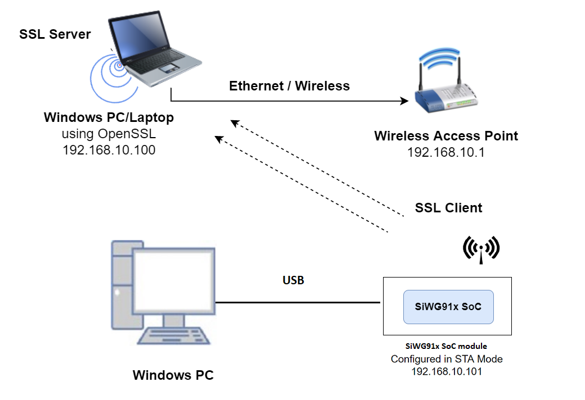
  
#### NCP Mode :  

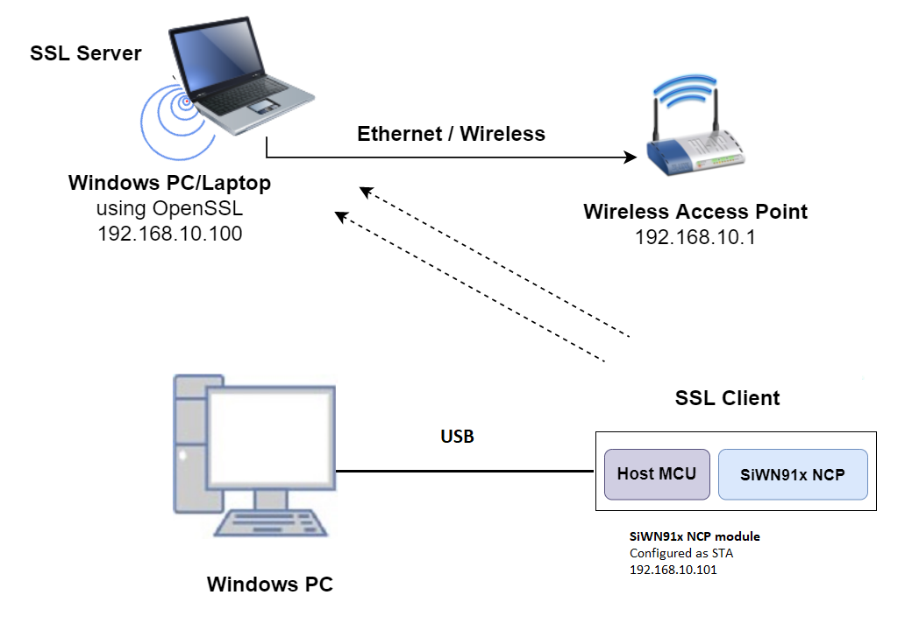

### 3 Project Setup
- **SoC Mode**
  - **Silicon Labs SiWx91x SoC**. Follow the [Getting Started with SiWx91x SoC](https://docs.silabs.com/) to setup the example to work with SiWx91x SoC and Simplicity Studio.
- **NCP Mode**
  - **Silicon Labs EFx32 Host**. Follow the [Getting Started with EFx32](https://docs.silabs.com/rs9116-wiseconnect/latest/wifibt-wc-getting-started-with-efx32/) to setup the example to work with EFx32 and Simplicity Studio.

### 4.1 Board detection

### 4.1.1 SoC mode
1. In the Simplicity Studio IDE, 
    - The 917 SoC board will be detected under **Debug Adapters** pane as shown below.

      ****

### 4.1.2 NCP mode

1. In the Simplicity Studio IDE, 
    - The EFR32 board will be detected under **Debug Adapters** pane as shown below.

      ****

    - The EFM32 board will be detected under **Debug Adapters** pane as shown below.

      ****

### 4.2 Creation of project

Ensure the latest Gecko SDK along with the extension Si917 COMBO SDK is added to Simplicity Studio.

1. Click on the board detected and go to **EXAMPLE PROJECTS & DEMOS** section.

   ****

2. Filter for Wi-Fi examples from the Gecko SDK added. For this, check the *Wi-Fi* checkbox under **Wireless Technology** and *Gecko SDK Suite* checkbox under **Provider**. 

3. Under provider, for SoC based example, check the *SoC* checkbox and for NCP based example, check the *NCP* checkbox.

4. Now choose Wi-Fi- NCP TLS Client example for NCP mode or choose Wi-Fi- SoC TLS Client example for SoC mode and click on **Create**.
  For NCP mode:

   **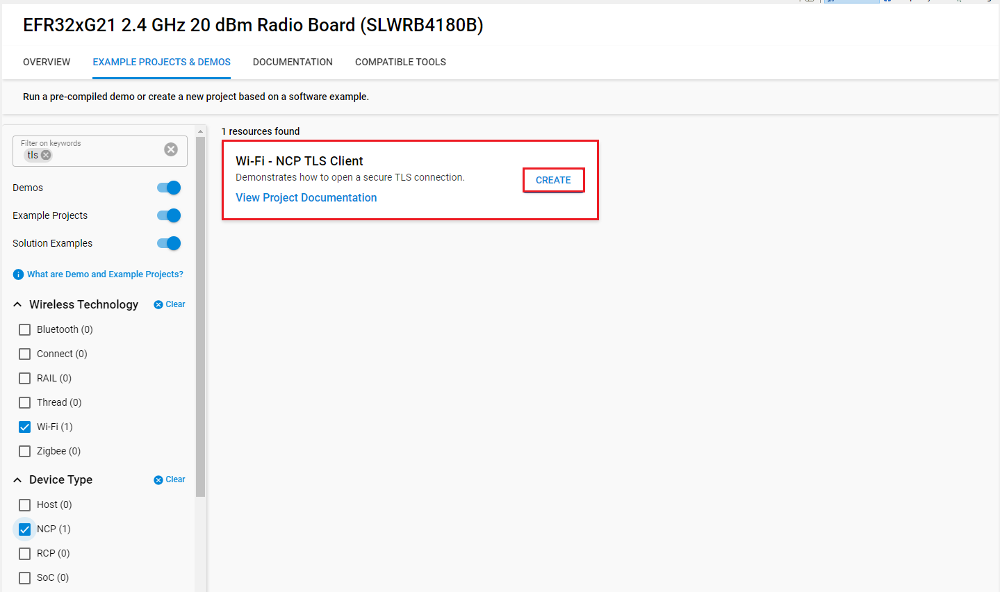**

    For SoC mode:
      
   **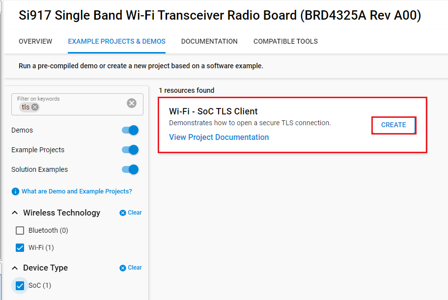**

5. Give the desired name to your project and cick on **Finish**.

   **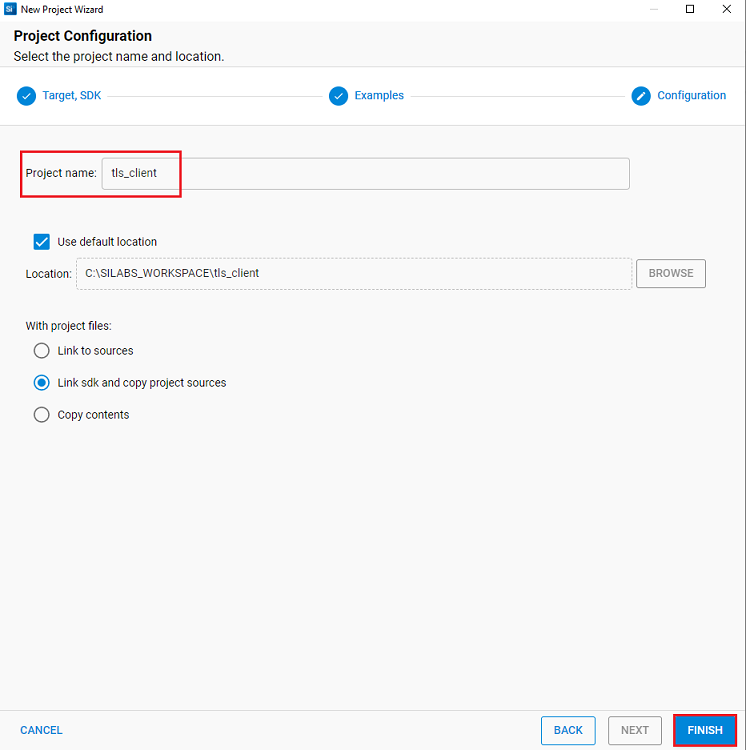**


## 5 Configuring the Application
The application can be configured to suit user requirements and development environment.
Read through the following sections and make any changes needed. 
  
### NCP Mode - Host Interface 

* By default, the application is configured to use the SPI bus for interfacing between Host platforms(EFR32MG21) and the SiWx91x EVK.

### Bare Metal/RTOS Support
To select a bare metal configuration, see [Selecting bare metal](#bare-metal-with-simplicity-studio).

### Wi-Fi Configuration
Configure the following parameters in **rsi_ssl_client_tls_versions.c** to enable your Silicon Labs Wi-Fi device to connect to your Wi-Fi network.
  
```c                                      
#define SSID           "SILABS_AP"      // Wi-Fi Network Name
#define PSK            "1234567890"     // Wi-Fi Password
#define SECURITY_TYPE  RSI_WPA2         // Wi-Fi Security Type: RSI_OPEN / RSI_WPA / RSI_WPA2
#define CHANNEL_NO     0                // Wi-Fi channel if the softAP is used (0 = auto select)
```

### Client/Server IP Settings
```c   
#define DEVICE_PORT1        <local port>     //TCP client port number
#define SERVER_PORT1        <remote port>    //Remote TCP server port number which is opened in Windows PC2.   
#define DEVICE_PORT2        <local port>     //Another TCP client port number
#define SERVER_PORT2        <remote port>    //Another remote TCP server port number which is opened in Windows PC2.  
#define SERVER_IP_ADDRESS   0x640AA8C0       //Remote server IP address.It should be in long format and in little endian byte order.
#define NUMBER_OF_PACKETS   <no of packets>  //How many packets to receive from TCP client.
```

### The desired parameters are provided below. User can also modify the parameters as per their needs and requirements.
```c   
#define GLOBAL_BUFF_LEN      15000           //Application memory length which is required by the driver
```

> LOAD_CERTIFICATE refers to load certificates into flash

  0 - Already certificates are there in flash so no need to laod.

  1 - Certicates will load into flash.

```c   
#define LOAD_CERTIFICATE       0 
```

**Note!**

If certificates are not there in flash then ssl handshake will fail.

***

```c   
#define DHCP_MODE               1           //whether IP address is configured through DHCP or STATIC
```

**Note!**
> If user wants to configure STA IP address through DHCP then set DHCP_MODE to "1" and skip configuring the following DEVICE_IP, GATEWAY and NETMASK macros.
                                         (Or)
> If user wants to configure STA IP address through STATIC then set DHCP_MODE macro to "0" and configure following DEVICE_IP, GATEWAY and NETMASK macros.
    
> IP address to be configured to the device in STA mode should be in long format and in little endian byte order.
  
      - Example: To configure "192.168.10.10" as IP address, update the macro DEVICE_IP as 0x0A0AA8C0.

```c   
#define DEVICE_IP              0X0A0AA8C0
```
> IP address of the gateway should also be in long format and in little endian byte order.

     - Example: To configure "192.168.10.1" as Gateway, update the macro GATEWAY as 0x010AA8C0 

```c   
#define GATEWAY                0x010AA8C0
```

> IP address of the network mask should also be in long format and in little endian byte order
  
        - Example: To configure "255.255.255.0" as network mask, update the macro NETMASK as 0x00FFFFFF 

```c   
#define NETMASK                 0x00FFFFFF
```
                 
**Power save configuration**

   - By default, the application is configured without power save.
  
```c   
#define ENABLE_POWER_SAVE               0
```
   - If user wants to run the application in power save, modify the below macro.

```c   
#define ENABLE_POWER_SAVE               1
```

For SoC mode use handshake type as shown below:
```c
#define RSI_HAND_SHAKE_TYPE M4_BASED
```

For NCP mode handshake type can be GPIO_BASED or MSG_BASED, as shown below

```c
#define RSI_HAND_SHAKE_TYPE GPIO_BASED
```
## 6 Building and Testing the Application

Follow the below steps for the successful execution of the application.

### 6.1 Loading the SiWx91x Firmware

Refer [Getting started with a PC](https://docs.silabs.com/rs9116/latest/wiseconnect-getting-started) to load the firmware into SiWx91x EVK. The firmware file is located in `<SDK>/firmware/`

### 6.2 Building the Project
#### 6.2.1. Building the Project - SoC Mode

- Once the project is created, right click on project and go to properties → C/C++ Build → Settings → Build Steps.

- Add **post_build_script_SimplicityStudio.bat** file path present at SI917_COMBO_SDK.X.X.X.XX → utilities → isp_scripts_common_flash in build steps settings as shown in below image.

  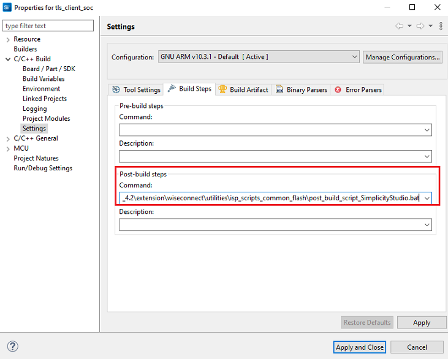

- Go to properties → C/C++ Build → Settings → Tool Settings → GNU ARM C Compiler → Preprocessor → Defined symbols (-D) and check for M4 projects macro (RSI_M4_INTERFACE=1) and 9117 macro (CHIP_9117=1). If not present, add the macros and click **Apply and Close**.
  
  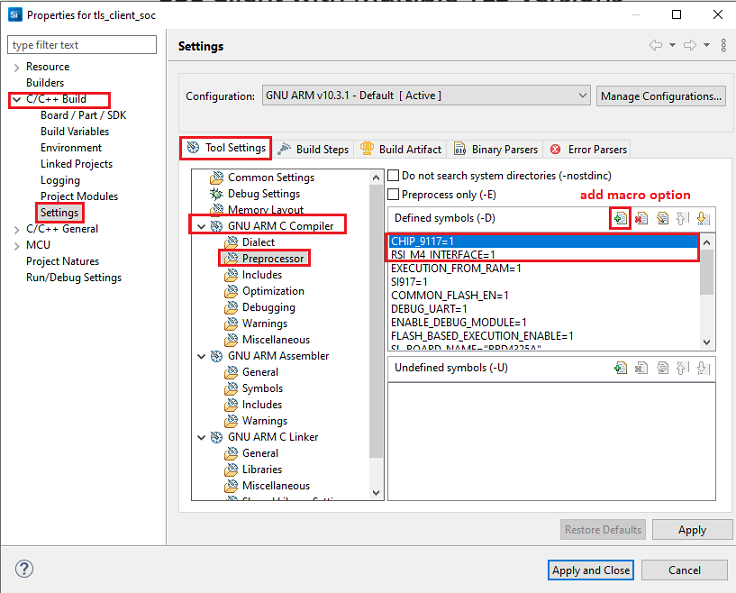

- Click on the build icon (hammer) or right click on project name and choose **Build Project** to build the project.

  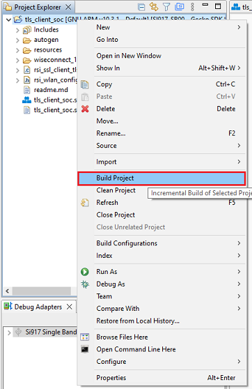

- Make sure the build returns 0 Errors and 0 Warnings.
  

#### 6.2.2. Build the Project - NCP Mode

- Check for CHIP_9117 macro in preprocessor settings as mentioned below.
   - Right click on project name.
   - Go to properties → C/C++ Build → Settings → Tool Settings → GNU ARM C Compiler → Preprocessor → Defined symbols (-D).
   - If CHIP_9117 macro is not present, add it by clicking on add macro option.
   - Click on **Apply and Close**.

     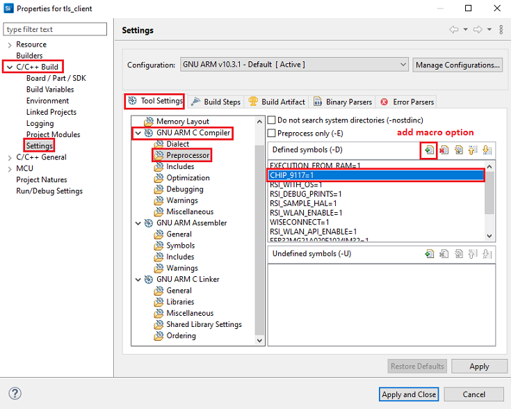

- Click on the build icon (hammer) or right click on project name and choose **Build Project** to build the project.

  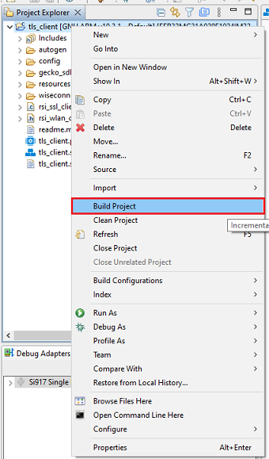

- Make sure the build returns 0 Errors and 0 Warnings.

### 6.3 Set up for application prints

Before setting up Tera Term, do the following for SoC mode.

**SoC mode**: 
You can use either of the below USB to UART converters for application prints.
1. Set up using USB to UART converter board.

  - Connect Tx (Pin-6) to P27 on WSTK
  - Connect GND (Pin 8 or 10) to GND on WSTK

    

2. Set up using USB to UART converter cable.

  - Connect RX (Pin 5) of TTL convertor to P27 on WSTK
  - Connect GND (Pin1) of TTL convertor to GND on WSTK

    

**Tera term set up - for NCP and SoC modes**

1. Open the Tera Term tool. 
   - For SoC mode, choose the serial port to which USB to UART converter is connected and click on **OK**. 

     ****

   - For NCP mode, choose the J-Link port and click on **OK**.

     ****

2. Navigate to the Setup → Serial port and update the baud rate to **115200** and click on **OK**.

    ****

    ****

The serial port is now connected. 

### 6.4 Execute the application

1. Once the build was successful, right click on project and select Debug As → Silicon Labs ARM Program to program the device as shown in below image.

   **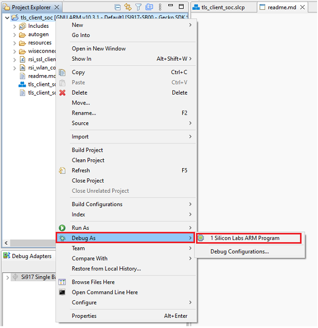**

2. As soon as the debug process is completed, the application control branches to the main().


3. Click on the **Resume** icon in the Simplicity Studio IDE toolbar to run the application.

   ****

## 7 Running the SiWx91x Application
After making any custom configuration changes required, build, download and run the application as below.
1. Configure the Access point in OPEN / WPA-PSK / WPA2-PSK mode to connect SiWx91x EVK in STA mode.

2. Copy the certificates server-cert and server-key into Openssl/bin folder in the Windows PC2 (Remote PC).

**Note!**
> All the certificates are given in the SDK. Path: `<SDK>/resources/certificates`

3. In Windows PC2 (Remote PC) which is connected to AP, run the Openssl and run two SSL servers by giving the following command

> `Openssl.exe s_server -accept<SERVER_PORT> -cert <server_certificate_file_path> -key <server_key_file_path> -tls<tls_version>`
> Example: `openssl.exe s_server -accept 5001 -cert server-cert.pem -key server-key.pem -tls1`
> Example: `openssl.exe s_server -accept 5002 -cert server-cert.pem -key server-key.pem -tls1_2`

**Note!** 
openssl.exe s_server -accept 5002 -cert server-cert.pem -key server-key.pem -tls1_2 is not supporting if the open ssl version is 0.9.8h but supporting if the open ssl version is 1.1.1h.
   
4. After the program gets executed, SiWx91x EVK would be connected to access point having the configuration same as that of in the application and get IP.

5. The SiWx91x EVK which is configured as SSL client will connect to remote SSL server and sends number of packets configured in **NUMBER_OF_PACKETS**.

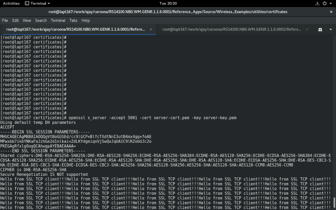
  


### Application Prints

#### SoC mode

  

#### NCP mode

  

## 8 Selecting Bare Metal
The application has been designed to work with FreeRTOS and Bare Metal configurations. By default, the application project files (Simplicity studio) are configured with FreeRTOS enabled. The following steps demonstrate how to configure Simplicity Studio to test the application in a Bare Metal environment.

## Bare Metal with Simplicity Studio
> - Open the project in Simplicity Studio
> - Right click on the project and choose 'Properties'
> - Go to 'C/C++ Build' | 'Settings' | 'GNU ARM C Compiler' | 'Preprocessor' and remove macro 'RSI_WITH_OS=1'
> - Select 'Apply' and 'OK' to save the settings

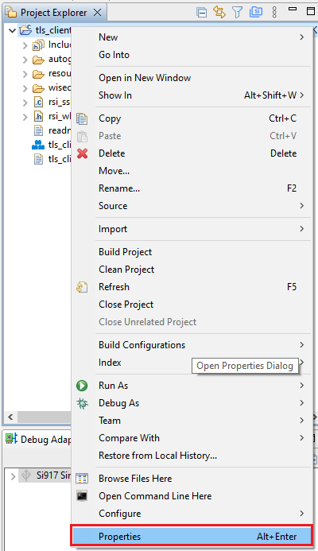 

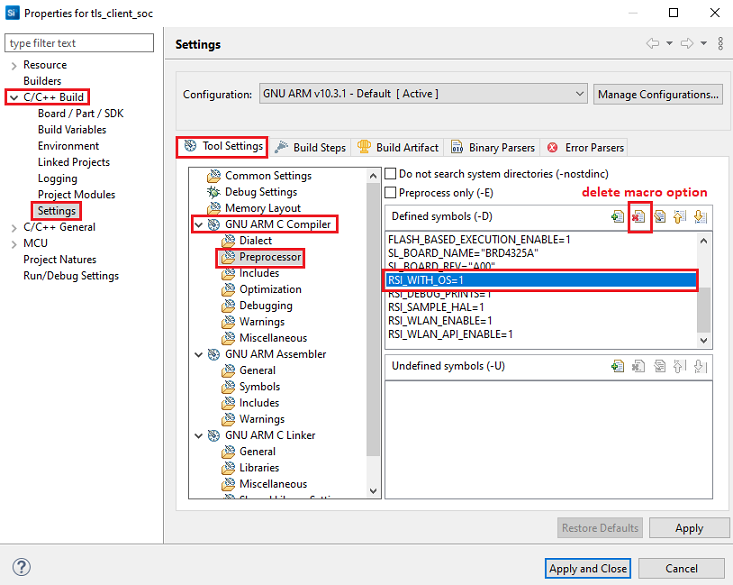


   