# WIFI6 MIMO

## 1. Purpose / Scope
This application demonstrates the procedure to measure WLAN UDP/TCP throughput by configuring the SiWx91x in client/server role.
In this application, the SiWx91x connects to a Wi-Fi access point(802 11ax supported ), obtains an IP address, connects to Iperf server/client running on a remote PC and measures Tx/Rx throughput transmitted/received from remote PC.

## 2. Prerequisites / Setup Requirements
To use this application, the following hardware, software and project setup is required.

### 2.1 Hardware Requirements
- Windows PC with Host interface (UART / SPI/ SDIO).
- A computer running Iperf (may be the same PC or Mac used to program the Host MCU)
- SiWx91x Wi-Fi Evaluation Kit. The SiWx91x supports multiple operating modes. See [Operating Modes]() for details.
  - **SoC Mode**:
      - Silicon Labs [BRD4325A](https://www.silabs.com/)
  - **NCP Mode**:
      - Silicon Labs [(BRD4180A, BRD4280B)](https://www.silabs.com/); **AND**
      - Host MCU Eval Kit. This example has been tested with:
        - Silicon Labs [WSTK + EFR32MG21](https://www.silabs.com/development-tools/wireless/efr32xg21-bluetooth-starter-kit)
        - Silicon Labs [WSTK + EFM32GG11](https://www.silabs.com/development-tools/mcu/32-bit/efm32gg11-starter-kit)
- Wi-Fi Access Point(802 11ax supported -Qualcomm AP from WFA Testbed).
- STA (DUT & BRCM 98).
- Sniffer machine.

#### SoC Mode : 
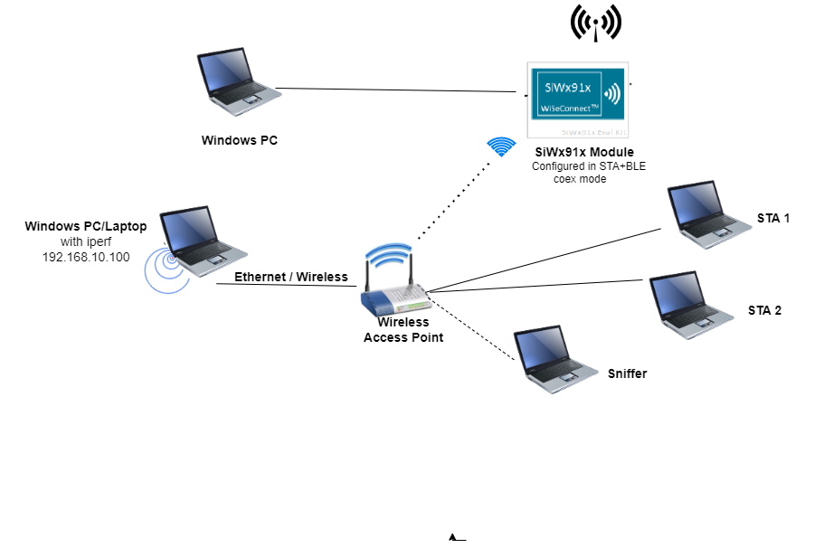

#### NCP Mode :
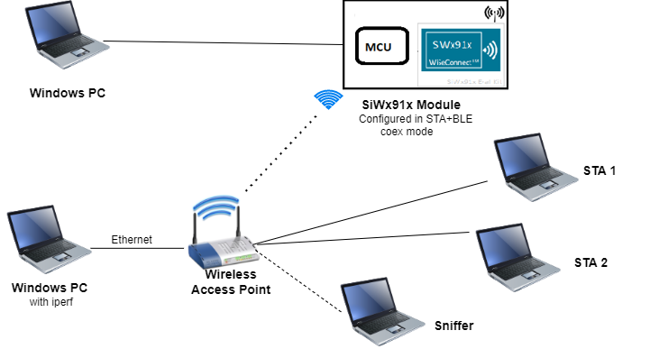

### Software Requirements
- [WiSeConnect SDK](https://github.com/SiliconLabs/wiseconnect-wifi-bt-sdk/)
- Embedded Development Environment
  - For Silicon Labs EFx32, use the latest version of [Simplicity Studio](https://www.silabs.com/developers/simplicity-studio).
- Installation of Build tools for Linux including the gcc compiler (or equivalent on PC or Mac)
  - For Ubuntu, use the following command for installation: `user@ubuntu:~$ sudo apt install build-essential`
- If you don't have Linux, [Cygwin for Windows](https://www.cygwin.com/) may be used instead
- A working installation of [iPerf version 2.0.9](https://iperf.fr/iperf-download.php#windows).  **Note:** iPerf version 2.0.9 is the only version that has been verified to work with this example.
 
## 3. Application Build Environment

### 3.1 Project Setup
- **SoC Mode**
  - **Silicon Labs SiWx91x SoC**. Follow the [Getting Started with SiWx91x SoC](https://docs.silabs.com/) to setup the example to work with SiWx91x SoC and Simplicity Studio.
- **NCP Mode**
  - **Silicon Labs EFx32 Host**. Follow the [Getting Started with EFx32](https://docs.silabs.com/rs9116-wiseconnect/latest/wifibt-wc-getting-started-with-efx32/) to setup the example to work with EFx32 and Simplicity Studio.

## Configuring the Application
The application can be configured to suit your requirements and development environment.
Read through the following sections and make any changes needed. 

### 3.2 NCP Mode - Host Interface 

* By default, the application is configured to use the SPI bus for interfacing between Host platforms(EFR32MG21) and the SiWx91x EVK.

### 3.3 Bare Metal/RTOS Support
To select a bare metal configuration, see [Selecting bare metal](#selecting-bare-metal).

## 4. Application Configuration Parameters
The application can be configured to suit your requirements and development environment. Read through the following sections and make any changes needed.

**4.1** Configure the following parameters in **rsi_wifi6_mimo.c** to enable your Silicon Labs Wi-Fi device to connect to your Wi-Fi network.
```c
#define SSID           "SILABS_AP"      // Wi-Fi Network Name
#define PSK            "1234567890"     // Wi-Fi Password
#define SECURITY_TYPE  RSI_WPA2         // Wi-Fi Security Type: RSI_OPEN / RSI_WPA / RSI_WPA2
#define CHANNEL_NO     0                // Wi-Fi channel if the softAP is used (0 = auto select)
```

### Client/Server IP Settings
```c
#define PORT_NUM           <local_port>   // Local port to use
#define SERVER_PORT        <remote_port>  // Remote server port
#define SERVER_IP_ADDRESS  "192.168.0.100"     // Remote server IP address
```

## Throughput Measurement Types
The application may be configured to measure throughput using UDP, TCP or SSL/TLS packets. Choose the measurement type using the `THROUGHPUT_TYPE` macro.
```c
#define THROUGHPUT_TYPE  TCP_TX     // Selects the throughput option; see the following diagrams. 
#define TCP_TX           0			// SiWx91x transmits packets to remote TCP client
#define TCP_RX           1			// SiWx91x receives packets from remote TCP server
#define UDP_TX           2			// SiWx91x transmits packets to remote UDP client
#define UDP_RX           3			// SiWx91x receives packets from remote UDP server
```

**SiWx91x is a TCP Client (sends TCP packets to a remote server) ...**

  

**SiWx91x is a TCP Server (receives TCP packets from a remote client) ...**

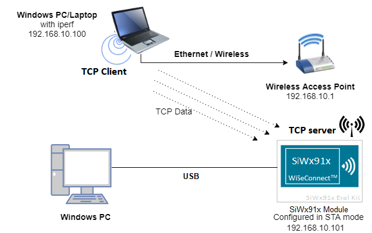

**SiWx91x is a UDP Client (sends UDP packets to a remote server) ...**


**SiWx91x is a UDP Server (receives UDP packets from a remote client) ...**

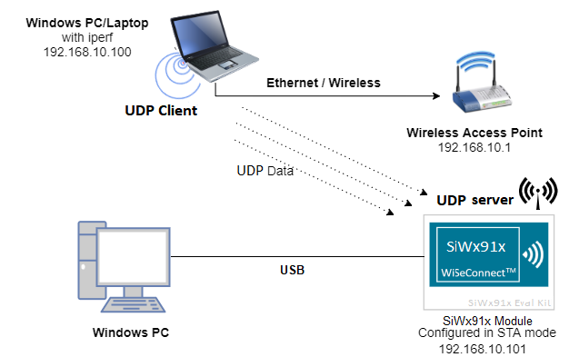

## Throughput Options
Various options are available to customize throughput measurements. Some options only apply for specific throughput types as described in the following sections.

### Discrete Interval Measurements (UDP Rx and SSL Tx)
```c
#define MAX_TX_PKTS 10000
```
The default value of `MAX_TX_PKTS` is 10000. To measure throughput for higher intervals, make the following changes:
- UDP Rx : Increase the value of `MAX_TX_PKTS` and provide a higher interval in the corresponding iperf command

### Discrete Interval Measurements (UDP Tx and TCP Tx)
```c
#define THROUGHPUT_AVG_TIME  30000   // Throughput average time in ms
```
Configure `THROUGHPUT_AVG_TIME` to suit the desired interval.

### Discrete Interval Measurements (TCP Rx and SSL Rx)
- TCP Rx : Configure the interval desired using the corresponding iperf command

### Continous Throughput Measurements
```c
#define CONTINUOUS_THROUGHPUT        0
```

**`CONTINUOUS_THROUGHPUT` = `0`** (default value)
- Throughput is calculated only once for interval of :
  - `THROUGHPUT_AVG_TIME` in case of UDP TX/TCP TX 
  - `MAX_TX_PKTS` in case of UDP RX/SSL TX  
- The time interval is provided by the server in case of TCP RX
- Default packet count is provided in server `SSL_tx_throughput.py` in case of `SSL RX`

**`CONTINUOUS_THROUGHPUT` = `1`**. 
- The application measures throughput continuously for every interval of `THROUGHPUT_AVG_TIME` regardless of `THROUGHPUT_TYPE`, when provided with the following configuration. 
  - UDP Rx/TCP Rx : Configure high interval greater than `THROUGHPUT_AVG_TIME`
  - SSL Rx/SSL Tx : Increase packet count to the maximum in the scripts `SSL_tx_throughput.py` and `SSL_Server_throughput_d.py`

***

**Note!**
If `CONTINUOUS_THROUGHPUT` = `1`, ensure that the SiWx91x client/server runs with an interval greater than `THROUGHPUT_AVG_TIME`.

***


# Testing Throughput
There are two 'ends' involved when measuring throughput, data is sent between the client end and the server end. By default, the Iperf protocol sends data from the Client to the Server to measure throughput. Depending on the configuration selected, the SiWx91x may be the client or the server. In general, it is advisable to start the server before the client since the client will immediately begin to try to connect to the server to send data. 

The following sections describe how to run the SiWx91x application together with examples for various Iperf configurations that run on the PC.   


## Running the SiWx91x Application
After making any custom configuration changes required, build, download and run the application as described in the [EFx32 Getting Started](https://docs.silabs.com/rs9116-wiseconnect/latest/wifibt-wc-getting-started-with-efx32/). 
***

**Note!**
Apart from DUT, connect 2 or more Station to the access point.

***

## UDP Tx Throughput
To measure UDP Tx throughput, configure the SiWx91x as a UDP client and start a UDP server on the remote PC.
The Iperf command to start the UDP server on the PC is: 

> `C:\> iperf.exe -s -u -p <SERVER_PORT> -i 1`
> 
> For example ...
>
> `C:\> iperf.exe -s -u -p 5001 -i 1`


## UDP Rx Throughput
To measure UDP Rx throughput, configure the SiWx91x as a UDP server and start a UDP client on the remote PC.
The Iperf command to start the UDP client is: 
	
> `C:\> iperf.exe -c <Module_IP> -u -p <Module_Port> -i 1 -b <Bandwidth> -t <time interval in seconds>`
>
> For example ...
>
> `C:\> iperf.exe -c 192.168.0.100 -u -p 5001 -i 1 -b 50M -t 30`  


## TCP Tx Throuhgput
To measure TCP Tx throughput, configure the SiWx91x as a TCP client and start a TCP server on the remote PC.
The Iperf command to start the TCP server is: 
		
> `C:\> iperf.exe -s -p <SERVER_PORT> -i 1`
>
> For example ...
>
> `C:\> iperf.exe -s -p 5001 -i 1`


## TCP Rx Throughput
To measure TCP Rx throughput, configure the SiWx91x as TCP server and start a TCP client on the remote PC.
The Iperf command to start the TCP client is: 

> `C:\> iperf.exe -c <Module_IP> -p <module_PORT> -i 1 -t <time interval in sec>`
>
> For example ...
>
> `C:\> iperf.exe -c 192.168.0.100 -p 5001 -i 1 -t 30`  

The SiWx91x, which is configured as a UDP/TCPserver/client, connects to the iperf server/client and sends/receives data for configured intervals. While module is transmitting/receiving the data, application prints the throughput numbers in serial console.

***

**Note!**
In this release, due to a low SPI frequency configured for the EFR32, WLAN throughput is lower than the maximum achievable throughput. This will be addressed in the next release.

***

# Settings for OFDMA+MU-MIMO
To connect with access point, access point should be enabled with below features.

### AP wireless general
go to wireless general setting and enable "80211ax/wifi6 mode"
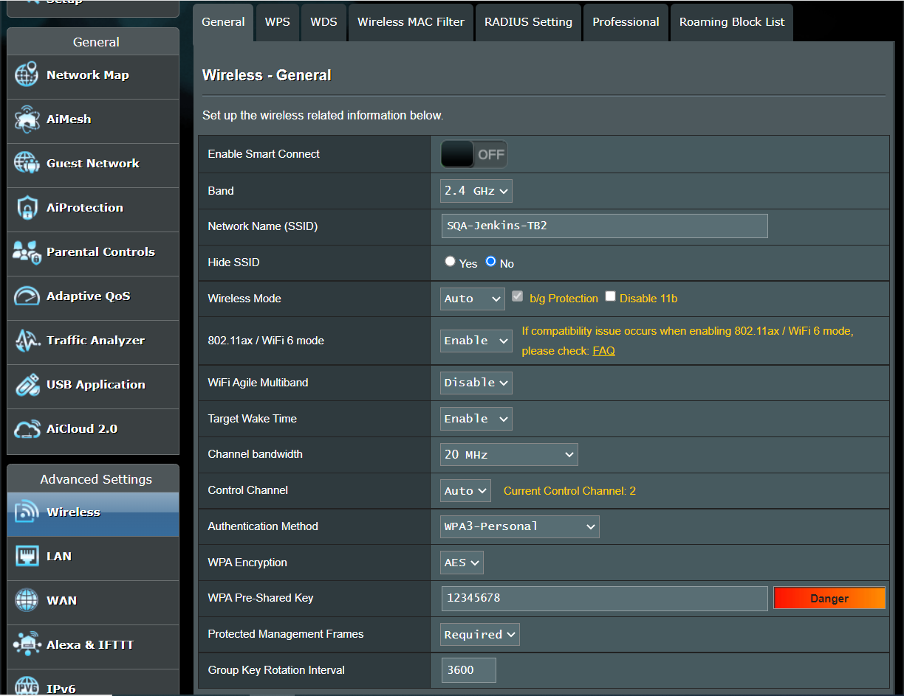


### AP wireless professional
go to wireless professional setting and enable "OFDMA+MU-MIMO"

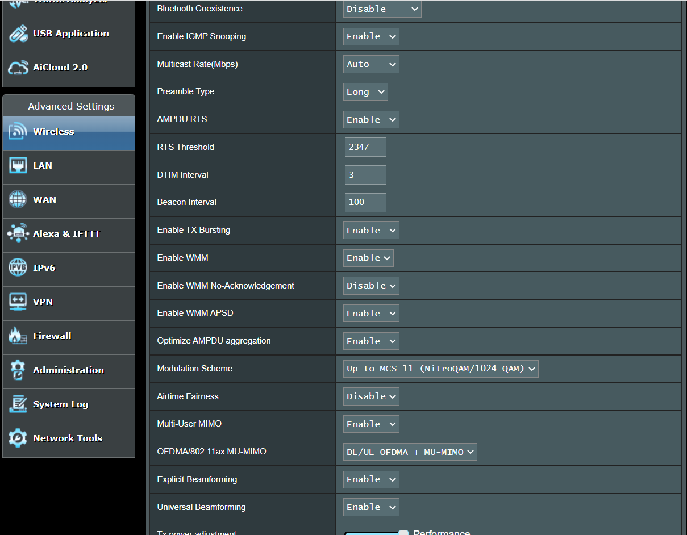

### Sniffer Machine setup
to see MU data, used the below command in a terminal in sniffer machine.

> echo 0 00:00:00:00:00:00 > /sys/kernel/debug/iwlwifi/*/iwlmvm/he_sniffer_params
>
> The first parameter is the value of the AID you want to capture.
> 
> The second parameter is the MAC address of a specific AP/BSS

### Sniffer Machine Output
UL OFDMA - from sniffer we need to make sure that upon receiving trigger basic frame from AP, DUT has to transfer the data in HE_TRIG PPDU format. DUT should be able to resend the frames which are not mentioned in the Block ACK from AP.

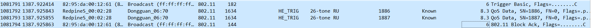
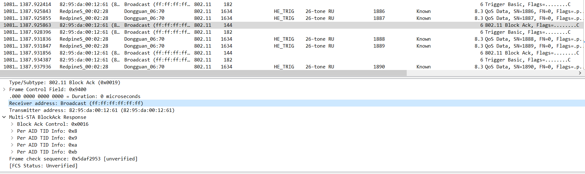

DL OFDMA - First AP will send the MU-BAR trigger basic frame, AP has to send the HE_MU data to DUT, after receiving the data from AP, DUT should respond with HE_TRIG block ACK.

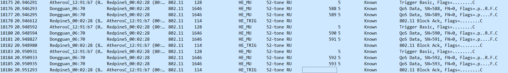


## 5. Testing the Application

Follow the below steps for the successful execution of the application.

### 5.1 Loading the SiWx91x Firmware

Refer [Getting started with a PC](https://docs.silabs.com/rs9116/latest/wiseconnect-getting-started) to load the firmware into SiWx91x EVK. The firmware file is located in `<SDK>/connectivity_firmware/`


### 5.2 Creating the Project and builing the Application
  
Refer [Getting started with EFX32](https://docs.silabs.com/rs9116-wiseconnect/latest/wifibt-wc-getting-started-with-efx32/), for setting up EFR & EFM host platforms

#### 5.2.1 Project Creation - SoC Mode : 
- Connect your board. The Si917 compatible SoC board is **BRD4325A**.
- Studio should detect your board. Your board will be shown here.


#### 5.2.2 Project Creation - NCP Mode : 
- Connect your board. The supported NCP boards are: **BRD4180A,BRD4280B**
- Studio should detect your board. Your board will be shown here.


#### 5.2.3 Selecting an example application and generate project
- Go to the 'EXAMPLE PROJECT & DEMOS' tab and select your desired example application

- Click 'Create'. The "New Project Wizard" window appears. Click 'Finish'


#### 5.2.4 Build Project - SoC Mode

- Once the project is created, right click on project and go to properties → C/C++ Build → Settings → Build Steps
- Add post_build_script_SimplicityStudio.bat file path (SI917_COMBO_SDK.X.X.X.XX\utilities\isp_scripts_common_flash) in build steps settings as shown in below image.

- Check for M4 projects macros in preprocessor settings(RSI_M4_INTERFACE=1)
- Check for 9117 macro in preprocessor settings(CHIP_9117=1).
- Click on the build icon (hammer) to build the project

- Successful build output will show as below. 
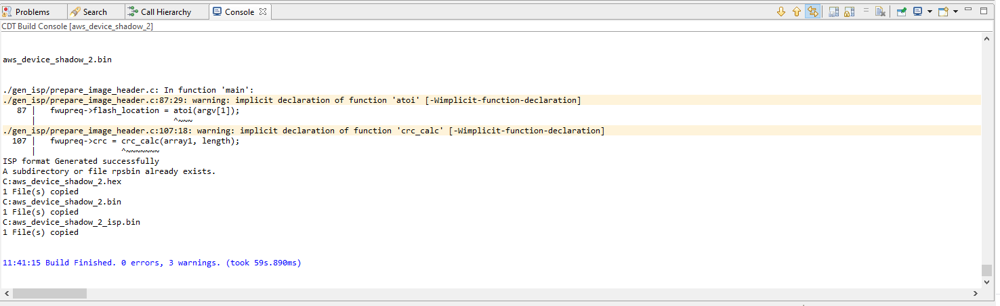

#### 5.2.5 Build Project - NCP Mode :

- Check for 9117 macro in preprocessor settings(CHIP_9117=1).
- Click on the build icon (hammer) to build the project

- Successful build output will show as below.


## 6. Program the device
Once the build was successful, right click on project and click on Debug As->Silicon Labs ARM Program as shown in below image.
### SoC Mode :

### NCP Mode : 
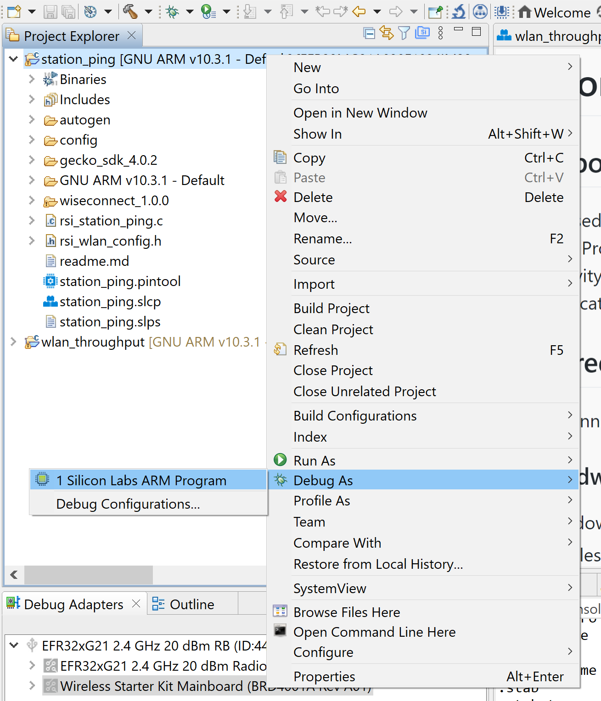

## 7. Observing the output prints on serial terminal

### 7.1 SoC Mode:
> Connect USB to UART connector Tx and GND pins to WSTK radio board.

   - Connect Tx(Pin-6) to P27 on WSTK
   - Connect GND(Pin 8 or 10) to GND on WSTK

> Prints can see as below in any Console terminal

### 7.2 NCP Mode:
Prints can see as below in any Console terminal


## 8. Selecting Bare Metal
The application has been designed to work with FreeRTOS and Bare Metal configurations. By default, the application project files (Simplicity studio) are configured with FreeRTOS enabled. The following steps demonstrate how to configure Simplicity Studio and Keil to test the application in a Bare Metal environment.

### 8.1 Bare Metal with Simplicity Studio
> - Open the project in Simplicity Studio
> - Right click on the project and choose 'Properties'
> - Go to 'C/C++ Build' | 'Settings' | 'GNU ARM C Compiler' | 'Symbols' and remove macro 'RSI_WITH_OS=1'
> - Select 'Apply' and 'OK' to save the settings
 


