# TCP Client with TWT feature

## Introduction
This application demonstrates the procedure to setup TWT session and configure the SiWx91x in TCP client role.
In this application, the SiWx91x connects to a Wi-Fi access point, obtains an IP address, connects to Iperf server running on a remote PC and maintains  TCP Socket connection and periodically wakes up as per the configured TWT wakeup interval in powersave.

## Setting Up 
To use this application, the following hardware, software and project setup is required.

### Hardware Requirements
- A Windows PC
- A computer running Iperf (may be the same PC or Mac used to program the Host MCU)
- Wi-Fi Access Point with 11ax and TWT responder mode support.
- SiWx91x Wi-Fi Evaluation Kit. The SiWx91x supports multiple operating modes. See [Operating Modes]() for details.
  - **SoC Mode**: 
      - Silicon Labs [BRD4325A](https://www.silabs.com/)
  - **NCP Mode**:
      - Silicon Labs [(BRD4180A, BRD4280B)](https://www.silabs.com/); **AND**
      - Host MCU Eval Kit. This example has been tested with:
        - Silicon Labs [WSTK + EFR32MG21](https://www.silabs.com/development-tools/wireless/efr32xg21-bluetooth-starter-kit)
        - Silicon Labs [WSTK + EFM32GG11](https://www.silabs.com/development-tools/mcu/32-bit/efm32gg11-starter-kit)
        - [STM32F411 Nucleo](https://st.com/) 

#### SoC Mode : 

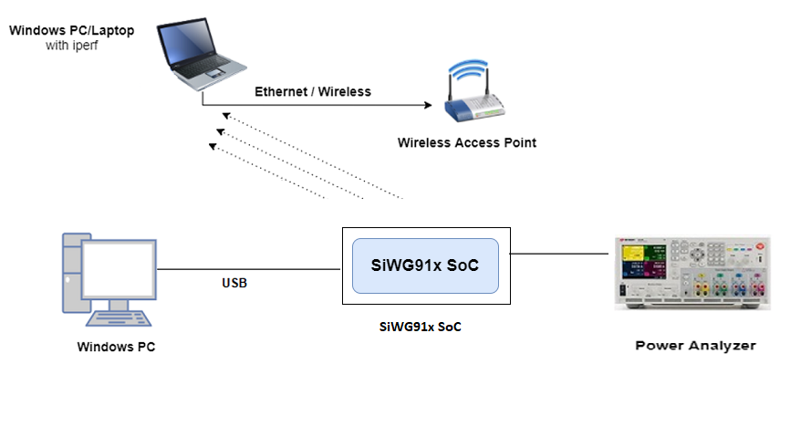
  
#### NCP Mode :  

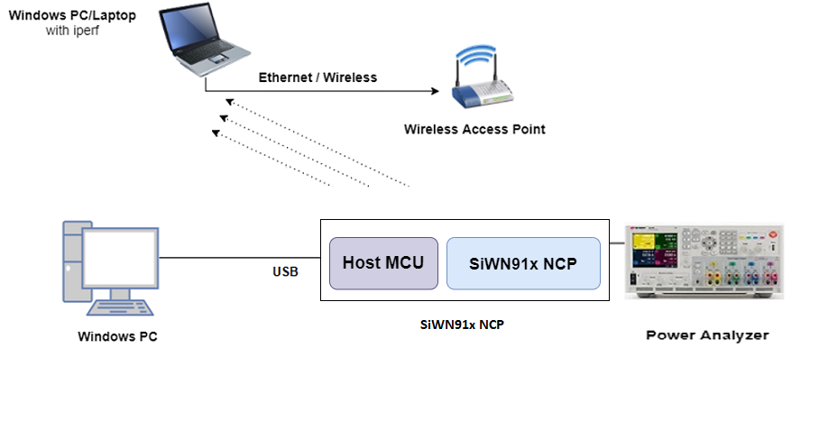

### Project Setup
- **SoC Mode**
  - **Silicon Labs SiWx91x SoC**. Follow the [Getting Started with SiWx91x SoC](https://docs.silabs.com/) to setup the example to work with SiWx91x SoC and Simplicity Studio.
- **NCP Mode**
  - **Silicon Labs EFx32 Host**. Follow the [Getting Started with EFx32](https://docs.silabs.com/rs9116-wiseconnect/latest/wifibt-wc-getting-started-with-efx32/) to setup the example to work with EFx32 and Simplicity Studio.
  - **STM32F411 Host**. Follow the [Getting Started with STM32](https://docs.silabs.com/rs9116-wiseconnect/latest/wifibt-wc-getting-started-with-stm32/) to setup the example to work with STM32 and Keil.

## Creating the project

### Board detection

### SoC mode
1. In the Simplicity Studio IDE, 
    - The 917 SoC board will be detected under **Debug Adapters** pane as shown below.

      ****

### NCP mode

1. In the Simplicity Studio IDE, 
    - The EFR32 board will be detected under **Debug Adapters** pane as shown below.

      ****

    - The EFM32 board will be detected under **Debug Adapters** pane as shown below.

      ****

### Creation of project

Ensure the latest Gecko SDK along with the extension Si917 COMBO SDK is added to Simplicity Studio.

1. Click on the board detected and go to **EXAMPLE PROJECTS & DEMOS** section.

   ****

2. Filter for Wi-Fi examples from the Gecko SDK added. For this, check the *Wi-Fi* checkbox under **Wireless Technology** and *Gecko SDK Suite* checkbox under **Provider**. 

3. Under provider, for SoC based example, check the *SoC* checkbox and for NCP based example, check the *NCP* checkbox.

4. Now choose Wi-Fi- NCP TCP Client TWT example for NCP mode or choose Wi-Fi- SoC TCP Client TWT example for SoC mode and click on **Create**.
  For NCP mode:

   **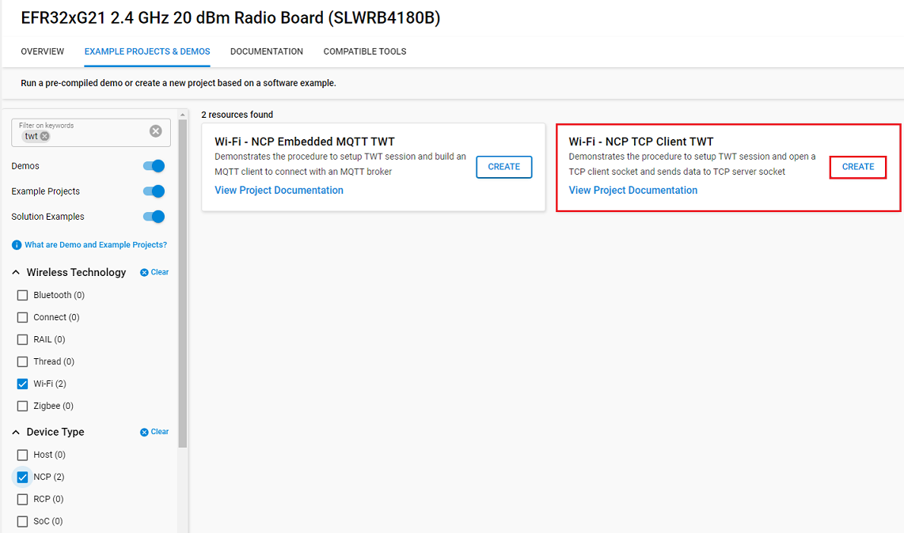**

    For SoC mode:
      
   **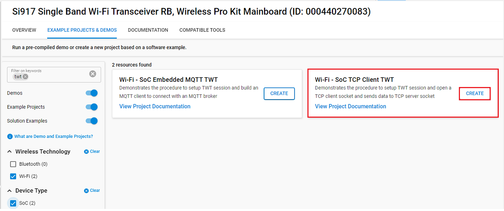**

5. Give the desired name to your project and cick on **Finish**.

   **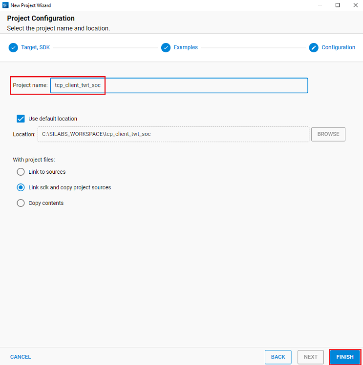**

## Configuring the Application
The application can be configured to suit your requirements and development environment.
Read through the following sections and make any changes needed. 

### NCP Mode - Host Interface

* By default, the application is configured to use the SPI bus for interfacing between Host platforms(STM32F411 Nucleo / EFR32MG21) and the SiWx91x EVK.
* This application is also configured to use the SDIO bus for interfacing between Host platforms(EFM32GG11) and the SiWx91x EVK.

### Bare Metal/RTOS Support
To select a bare metal configuration, see [Selecting bare metal](#selecting-bare-metal).

## Wi-Fi Configuration
Configure the following parameters in **rsi_twt_tcp_client.c** to enable your Silicon Labs Wi-Fi device to connect to your Wi-Fi network.
#### User must update the below parameters.  

SSID refers to the name of the Access point.

```c
#define SSID                                       "SILABS_AP"
```

SECURITY_TYPE refers to the type of security. In this application, STA supports Open, WPA-PSK, WPA2-PSK securities.

   The valid configuration is:

   - RSI_OPEN - For OPEN security mode

   - RSI_WPA  - For WPA security mode

   - RSI_WPA2 - For WPA2 security mode

```c
#define SECURITY_TYPE                              RSI_WPA2
```

PSK refers to the secret key if the Access point configured in WPA-PSK/WPA2-PSK security modes.

```c
#define PSK                                        "<psk>"
```

DEVICE_PORT refers to device TCP client port number

```c
#define DEVICE_PORT                                5001
```

SERVER_PORT port refers remote TCP server port number

```c
#define SERVER_PORT                                5001
```

SERVER_IP_ADDRESS refers remote peer IP address (Windows PC2) to connect with TCP server socket.

```c
#define SERVER_IP_ADDRESS                          192.168.10.1
```

#### The desired parameters are provided below. User can also modify the parameters as per their needs and requirements.

Application memory length which is required by the driver

```c
#define GLOBAL_BUFF_LEN                            15000
```

To configure IP address
   DHCP_MODE refers whether IP address configured through DHCP or STATIC

```c
#define DHCP_MODE                                  1
```
   
> Note:
> - If user wants to configure STA IP address through DHCP then set DHCP_MODE to "1" and skip configuring the following DEVICE_IP, GATEWAY and NETMASK macros.
> **(Or)**
> - If user wants to configure STA IP address through STATIC then set DHCP_MODE macro to "0" and configure DEVICE_IP, GATEWAY and NETMASK macros. 
> - AP and the STA should be in the same network domain. 

Following are the sample configurations. 

```c
#define DEVICE_IP                                  "192.168.10.101"
```
```c
#define GATEWAY                                    "192.168.10.1"
```
```c
#define NETMASK                                    "255.255.255.0"
```

**Power save configuration**

   - By default, the application is configured without power save.

```c
#define ENABLE_POWER_SAVE 0
```
   - If user wants to run the application in power save, modify the below macro.

```c
#define ENABLE_POWER_SAVE 1
```
> Note: 
>  *  Once TWT SP started, beacon sync will happen as described below. This will be applicable till TWT teardown.
>     * Beacon sync will happen every 5 second if TWT interval is less then 5 second. Else it will happen at 600ms before every TWT SP start.
>  * Listen interval/DTIM skip/DTIM based sleep setting will not be applicable once TWT SP started. These setting will be applicable once TWT is teardown.

**Configurations in rsi_wlan_config.h**

Open rsi_wlan_config.h. Given below are the default values configured for listen interval and TCP Keep alive timeout for this application.

Listen interval (in milli seconds) can be configured as shown below.
```c
//! RSI_JOIN_FEAT_STA_BG_ONLY_MODE_ENABLE or RSI_JOIN_FEAT_LISTEN_INTERVAL_VALID
#define RSI_JOIN_FEAT_BIT_MAP RSI_JOIN_FEAT_LISTEN_INTERVAL_VALID

//! Listen interval value in milli seconds
#define RSI_LISTEN_INTERVAL 5000
```
TCP Keep alive timeout (in seconds) can be configured as shown below.
```c
//! Initial timeout for Socket
#define RSI_SOCKET_KEEPALIVE_TIMEOUT 60
```

**SiWx91x is a TCP Client (sends TCP packets to a remote server) ...**

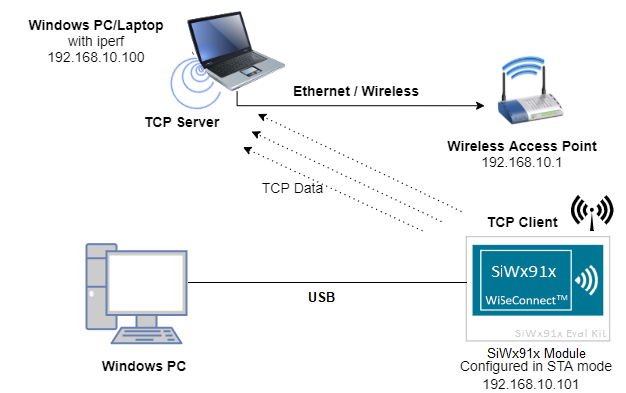 

## iTWT Configuration

TWT (Target Wake Time) setup is only supported in 11ax (HE) connectivity. Please follow below procedure to enable TWT.

- In NCP mode, right click on the project, go to *properties > C/C++ Build > Settings > Tool Settings > GNU ARM C compiler > Preprocessor > Defined Symbols* and add CHIP_9117 = 1 to the list. It is by default enabled in CCP mode.

- In simplicity IDE, upon hovering over TWT_SUPPORT macro in rsi_twt_tcp_client.c file and using ctrl + left click, Simplicity Studio opens rsi_wlan_common_config.h file in which the user can enable the below mentioned parameters. In case, ctrl+left click operation does not open the rsi_wlan_common_config.h file, user can navigate to rsi_wlan_common_config.h in the Project Explorer pane as follows:
*<project_name> > includes > "C:/silabs/gecko_sdk/extension/wiseconnect/sapi/include" > rsi_wlan_common_config.h*
    
    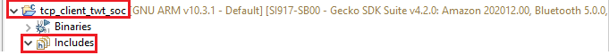
    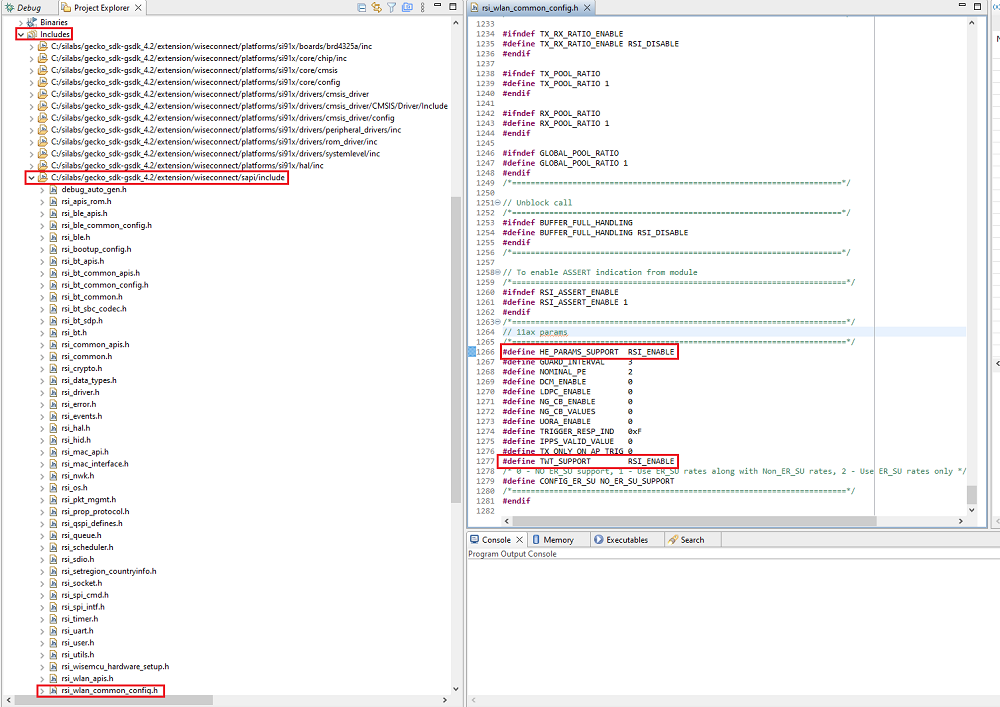

```c
#define HE_PARAMS_SUPPORT  RSI_ENABLE
```
```c
#define TWT_SUPPORT  	   RSI_ENABLE
```
- While editing the above mentioned parameters, Simplicity Studio shows a warning, click on the "Make a Copy" option and edit the above mentioned parameters

   

### iTWT Configuration API:

```c
int32_t rsi_wlan_twt_config(uint8_t twt_enable, uint8_t twt_flow_id, twt_user_params_t *twt_req_params)
```
Parameters of function are explained below :

- twt_enable:  1- Setup ; 0 - teardown

- twt_flow_id: range 0-7 or 0xFF

- twt_req_params: Structure with parameters in case of setup and NULL in case of teardown.

### iTWT Setup Configuration

iTWT parameters should be configured and filled into the structure type *twt_user_params_t*  in rsi_twt_tcp_client.c and passed as a parameter to *rsi_wlan_twt_config()* API.

Given below are sample configurations.

```c
        twt_user_params_t twt_req;
        twt_req.wake_duration           = 0x80;
        twt_req.wake_duration_unit      = 0;  
        twt_req.wake_duration_tol       = 0x80;
        twt_req.wake_int_exp            = 13;
        twt_req.wake_int_exp_tol        = 13;
        twt_req.wake_int_mantissa       = 0x1B00;  
        twt_req.wake_int_mantissa_tol   = 0x1B00;
        twt_req.implicit_twt            = 1;
        twt_req.un_announced_twt        = 1;
        twt_req.triggered_twt           = 0;
        twt_req.twt_channel             = 0; 
        twt_req.twt_protection          = 0;
        twt_req.restrict_tx_outside_tsp = 1;
        twt_req.twt_retry_limit         = 6;
        twt_req.twt_retry_interval      = 10;
        twt_req.req_type                = 1;
```
These parameters with their limits are defined as below.

- **wake_duration**: This is the nominal minimum wake duration of TWT. This is the time for which DUT will be in wake state for Transmission or reception of data. Allowed values range is  0-255.
- **wake_duration_unit**: This parameter defines unit for wake_duration. Allowed values are  0 (256uS) and 1 (1024uS).
- **wake_duration_tol**: This is the tolerance allowed for wake duration in case of suggest TWT. Received TWT wake duration from AP will be validated against tolerance limits and decided if TWT config received is in acceptable range. Allowed values are 0-255.
- **wake_int_exp**: TWT Wake interval exponent. It is exponent to base 2. Allowed values are 0 - 31.
- **wake_int_exp_tol**: This is the allowed tolerance for wake_int_exp in case of suggest TWT request. Received TWT wake interval exponent from AP will be validated against tolerance limits and decided if TWT config received is in acceptable range. Allowed values are 0 - 31.
- **wake_int_mantissa**: This is the TWT wake interval mantissa. Allowed values are 0-65535.
- **wake_int_mantissa_tol**: This is tolerance allowed for wake_int_mantissa in case of suggest TWT. Received TWT wake interval mantissa from AP will be validated against tolerance limits and decided if TWT config received is in acceptable range. Allowed values are 0-65535.
- **implicit_twt**: If enabled (1), the TWT requesting STA calculates the Next TWT by adding a fixed value to the current TWT value. Explicit TWT is currently not allowed.
- **un_announced_twt**: If enabled (1), TWT requesting STA does not announce its wake up to AP through PS-POLLs or UAPSD Trigger frames.
- **triggered_twt**: If enabled(1), atleast one trigger frame is included in the TWT Service Period(TSP).
- **twt_channel**: Currently this configuration is not supported. Allowed values are 0-7.
- **twt_protection**:  If enabled (1), TSP is protected. This is negotiable with AP. Currently not supported. Only zero is allowed.
- **restrict_tx_outside_tsp**: If enabled (1), any Tx outside the TSP is restricted. Else, TX can happen outside the TSP also.
- **twt_retry_limit**: This is the maximum number of retries allowed, if the TWT response frame is not recieved for the sent TWT request frame. Allowed values are 0 - 15.
- **twt_retry_interval**: The interval, in seconds, between two twt request retries. Allowed values are 5 - 255.
- **req_type**: This is the TWT request type.
> * 0 - Request TWT
> * 1 - Suggest TWT
> * 2 - Demand TWT

Below is the sample TWT setup API call with twt_enable = 1 and flow_id = 1.
```c
status = rsi_wlan_twt_config(1,1, &twt_req);
```
> Note:
> * TWT Wake duration depends on the wake duration unit. For example, for the above configuration, wake duration value is  (0xE0 * 256 = 57.3 msec).
> * TWT Wake interval is calculated as mantissa *2 ^ exp.  For example, for the above configuration, wake interval value is (0x1B00 * 2^13  = 55.2 sec).
> * Configuring TWT Wake interval beyond 1 min might lead to disconnections from the AP.
> * There might be disconnections while using TWT with wake interval > 4sec when connected to an AP with non-zero GTK key renewal time.
> * Keep Alive timeout should be non-zero when negotiated TWT setup is **unannounced**, otherwise there might be disconnections.

If TWT session setup is successful, the following notification will be printed with TWT Response parameters from the AP.

   

### iTWT Teardown Configuration

To teardown TWT session, call the API as follows:

```c
status = rsi_wlan_twt_config(0,1, NULL);
```
* 1st parameter: twt_enable: 0 - teardown

* 2nd parameter: twt_flow_id: 
> * Range: 0-7 (should be same as setup ID, other wise error will be triggered)
> * 0xFF - To teardown all active sessions. This value is valid only in case of teardown command.

* 3rd parameter: NULL

### iTWT Command Status Codes
The following are the possible TWT command status codes.

|S.No	|MACRO	|Error code	|Description|	SAPI/WLAN error code|
|:------:|:--------|:--------|:-----------------------------|:--------|
|1.|RSI_ERROR_COMMAND_GIVEN_IN_WRONG_STATE|	0xFFFD|	Occurs when the API is given before opermode is done for this particular API.|SAPI|
|2.|RSI_ERROR_INVALID_PARAM|0xFFFE|Occurs when invalid parameters are passed to this API.|SAPI|
|3.|TWT_SUPPORT_NOT_ENABLED_ERR|0x70|When HE_PARAMS_SUPPORT and TWT_SUPPORT macros are not enabled|FW|
|4.|TWT_SETUP_ERR_SESSION_ACTIVE|0x71|Occurs when user tries to give TWT config command when there is an already active TWT session.|FW|
|5.|TWT_TEARDOWN_ERR_FLOWID_NOT_MATCHED|0x72|Occurs when TWT teardown command is given with a flow ID that does not match existing session flow ID.|FW|
|6.|TWT_TEARDOWN_ERR_NOACTIVE_SESS|0x73|Occurs when teardown command is given while there is no active session.|FW|

### iTWT Session Status Codes

User can get asynchronous TWT session updates if *twt_response_handler* is defined and the callback is registered. A *twt_response_handler* is provided in the example application. The following are the TWT session status codes.

|S.No|	MACRO|	Session status code|	Description|
|:----|:------|:-------------------|:--------------|
|1.|	TWT_SESSION_SUCC|	0|	TWT session setup success. TWT session is active.|
|2.|	TWT_UNSOL_SESSION_SUCC|	1|	Unsolicited TWT setup response from AP accepted. TWT session is active.|
|3.|	TWT_SETUP_AP_REJECTED|	4|	TWT Reject frame recieved in response for the sent TWT setup frame.|
|4.|	TWT_SETUP_RSP_OUTOF_TOL|5|	TWT response parameters from AP for TWT Suggest request is not within tolerance set by User.|
|5.|	TWT_SETUP_RSP_NOT_MATCHED|	6|	TWT response parameters from AP for TWT Demand request does not match parameters given by User.|
|6.|	TWT_SETUP_UNSUPPORTED_RSP|	10|	Unsupported TWT response from AP.|
|7.|	TWT_TEARDOWN_SUCC|	11|	TWT session teardown success|
|8.|	TWT_AP_TEARDOWN_SUCC|	12|	TWT session teardown from AP success|
|9.|	TWT_SETUP_FAIL_MAX_RETRIES_REACHED|	15|	TWT setup request retried maximum number of times as configured by user.|
|10.|	TWT_INACTIVE_DUETO_ROAMING|	16	|TWT session inactive due to roaming|
|11.|	TWT_INACTIVE_DUETO_DISCONNECT|	17|	TWT session inactive due to disconnect|
|12.|	TWT_INACTIVE_NO_AP_SUPPORT|	18|	TWT session inactive as connected AP does not support TWT.|

> Note:
> **twt_session_active** variable is provided in the example application and is updated according to the asychronous TWT session notifications. User can utilise this variable to teardown or configure new session parameters depending upon existing session status. 

Macros to check for and enable (steps to enable the macros included in [building the project](#building-the-project) section): 
For SoC mode - RSI_M4_INTERFACE, CHIP_9117
For NCP mode - CHIP_9117, EXP_BOARD


## Building and Testing the Application

Follow the below steps for the successful execution of the application.

### Loading the SiWx91x Firmware

Refer [Getting started with a PC](https://docs.silabs.com/rs9116/latest/wiseconnect-getting-started) to load the firmware into SiWx91x EVK. The firmware file is located in `<SDK>/connectivity_firmware/`

### Building the Project
#### Building the Project - SoC Mode

- Once the project is created, right click on project and go to properties → C/C++ Build → Settings → Build Steps.

- Add **post_build_script_SimplicityStudio.bat** file path present at SI917_COMBO_SDK.X.X.X.XX → utilities → isp_scripts_common_flash in build steps settings as shown in below image.

  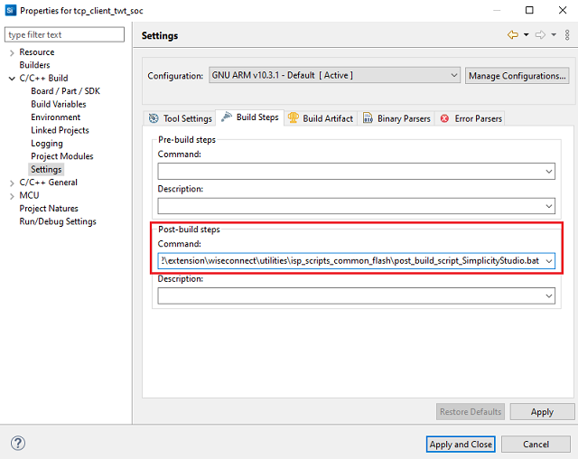

- Go to properties → C/C++ Build → Settings → Tool Settings → GNU ARM C Compiler → Preprocessor → Defined symbols (-D) and check for M4 projects macro (RSI_M4_INTERFACE=1) and 9117 macro (CHIP_9117=1). If not present, add the macros and click **Apply and Close**.
  
  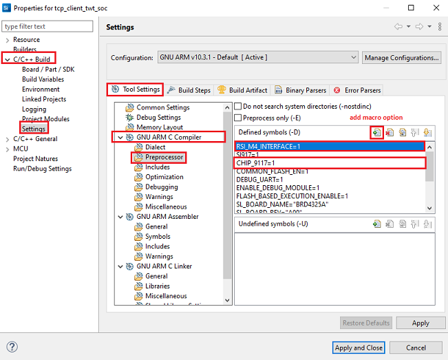

- Click on the build icon (hammer) or right click on project name and choose **Build Project** to build the project.

  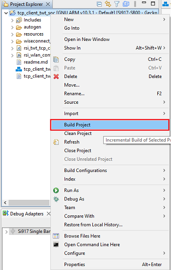

- Make sure the build returns 0 Errors and 0 Warnings.
  

#### Build the Project - NCP Mode

- Check for CHIP_9117 macro in preprocessor settings as mentioned below.
   - Right click on project name.
   - Go to properties → C/C++ Build → Settings → Tool Settings → GNU ARM C Compiler → Preprocessor → Defined symbols (-D).
   - If **CHIP_9117 macro** and **EXP_BOARD** are not present, add them by clicking on add macro option.
    
      **NOTE**: In this example, **EXP_BOARD** macro should also be enabled
   - Click on **Apply and Close**.

     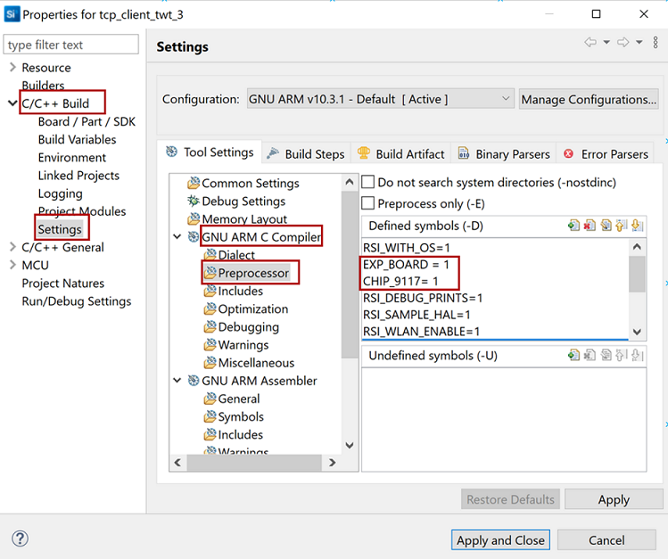

- Click on the build icon (hammer) or right click on project name and choose **Build Project** to build the project.

  

- Make sure the build returns 0 Errors and 0 Warnings.

### Set up for application prints

Before setting up Tera Term, do the following for SoC mode.

**SoC mode**: 
You can use either of the below USB to UART converters for application prints.
1. Set up using USB to UART converter board.

  - Connect Tx (Pin-6) to P27 on WSTK
  - Connect GND (Pin 8 or 10) to GND on WSTK

    

2. Set up using USB to UART converter cable.

  - Connect RX (Pin 5) of TTL convertor to P27 on WSTK
  - Connect GND (Pin1) of TTL convertor to GND on WSTK

    

**Tera term set up - for NCP and SoC modes**

1. Open the Tera Term tool. 
   - For SoC mode, choose the serial port to which USB to UART converter is connected and click on **OK**. 

     ****

   - For NCP mode, choose the J-Link port and click on **OK**.

     ****

2. Navigate to the Setup → Serial port and update the baud rate to **115200** and click on **OK**.

    ****

    ****

The serial port is now connected. 

### Execute the application

1. Once the build was successful, right click on project and select Debug As → Silicon Labs ARM Program to program the device as shown in below image.

   **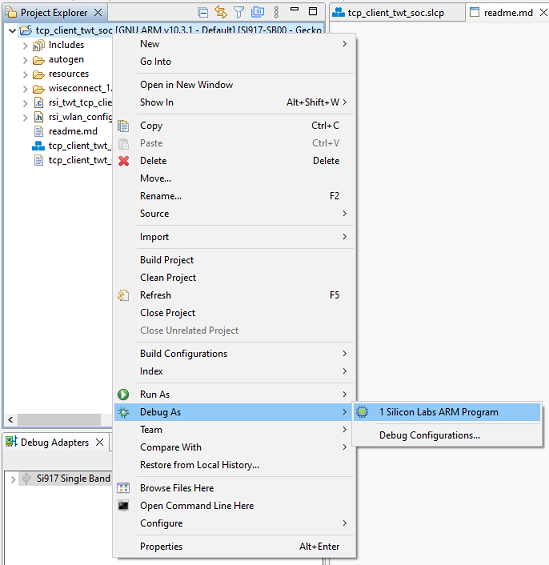**

2. As soon as the debug process is completed, the application control branches to the main().

3. Click on the **Resume** icon in the Simplicity Studio IDE toolbar to run the application.

   ****

## Running the SiWx91x Application

After making any custom configuration changes required, build, download and run the application as described in the [EFx32 Getting Started](https://docs.silabs.com/rs9116-wiseconnect/latest/wifibt-wc-getting-started-with-efx32/) or [STM32 Getting Started](https://docs.silabs.com/rs9116-wiseconnect/latest/wifibt-wc-getting-started-with-stm32/).

Configure the SiWx91x as a TCP client and start a TCP server on the remote PC.
In general, it is advisable to start the server before the client since the client will immediately begin to try to connect to the server. 

The Iperf command to start the TCP server is: 
		
> `C:\> iperf.exe -s -p <SERVER_PORT> -i 1`
>
> For example ...
>
> `C:\> iperf.exe -s -p 5001 -i 1`

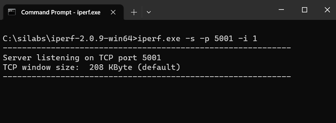

> Note : 
> To avoid loss of TCP connection due to ARP loss while the device is in sleep, it is suggested to add the device IP address to the Remote PC's ARP table. 
> For example, for device IP "192.168.0.101", MAC address "80-C9-55-XX-XX-XX" and ethernet interface 7, following is the command used in a Windows system. The MAC address and IP of SiWx917 can be observed in the serial prints.  

For Ethernet:
```c
netsh interface ipv4 set neighbors interface="Ethernet 7" "192.168.0.101" "80-c9-55-XX-XX-XX"
```
For Wi-Fi:
```c
netsh interface ipv4 set neighbors interface="Wi-Fi" "192.168.0.101" "80-c9-55-XX-XX-XX"
```

Application prints

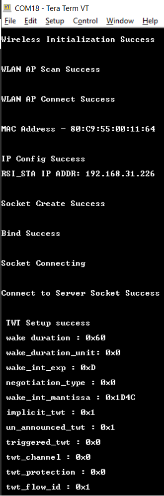

# Using Simplicity Studio Energy Profiler for current measurement:
  
  After flashing the application code to the module. Energy profiler can be used for current consumption measurements.

- Go to launcher → Debug Adapters pane and click on the board name.
  
  

- Click on Device configuration symbol
  
  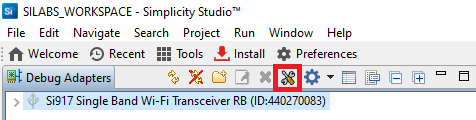

- Open the device configuration tab
  
  

- Change the Target part name to "EFR32MG21A020F1024IM32"

  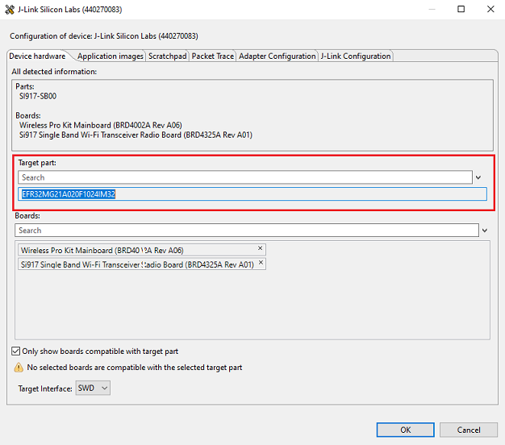

- Change board name to "BRD4180B", click "OK"

  

- From tools, choose Energy Profiler and click "OK"

  

- From Quick Access, choose Start Energy Capture option 

  

**NOTE** : The target part and board name have to be reverted to default to flash application binary. 

  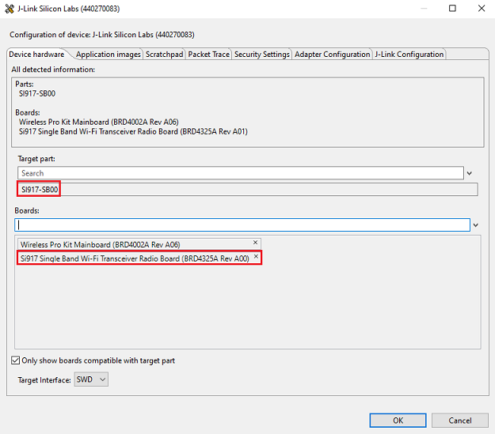

# Expected output in Energy Profiler

  

**NOTE**: The average current consumption may vary based on the environment, the above image is for reference 

# Selecting Bare Metal
The application has been designed to work with FreeRTOS and Bare Metal configurations. By default, the application project files (Keil and Simplicity studio) are configured with FreeRTOS enabled. The following steps demonstrate how to configure Simplicity Studio and Keil to test the application in a Bare Metal environment.

## Bare Metal with Simplicity Studio
> - Open the project in Simplicity Studio
> - Right click on the project and choose 'Properties'
> - Go to *properties > C/C++ Build > Settings > Tool Settings > GNU ARM C compiler > Preprocessor > Defined Symbols* and remove macro 'RSI_WITH_OS=1'
> - Select 'Apply' and 'OK' to save the settings

 


