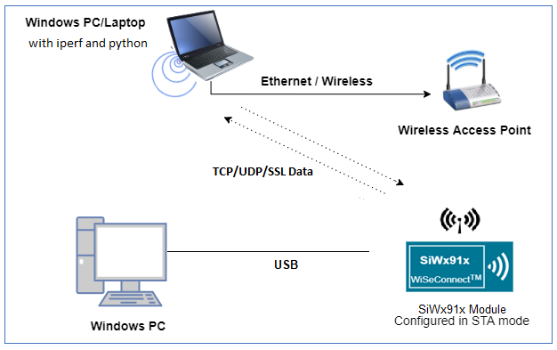
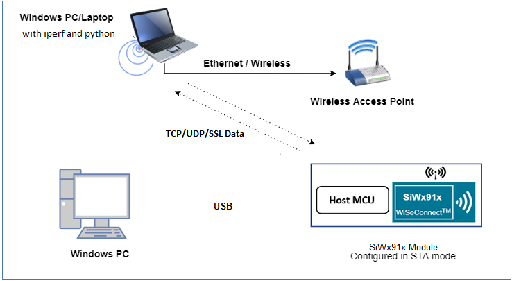
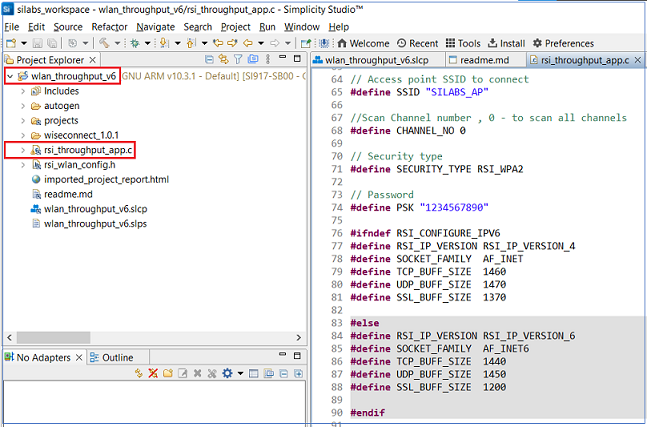
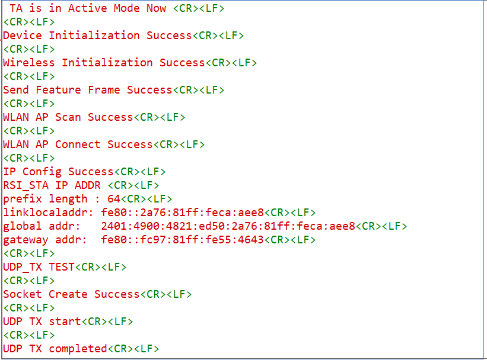
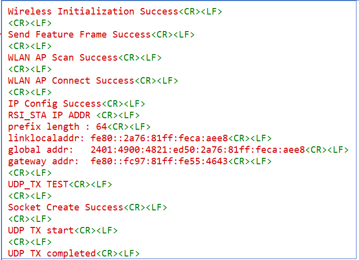

# **WLAN Throughput (IPv6)**

## **1 Introduction**
This application demonstrates the procedure to measure WLAN UDP/TCP/SSL throughput by configuring the SiWx91x in client/server role.
In this application, the SiWx91x connects to a Wi-Fi access point, obtains an IP address, connects to Iperf server/client or python based SSL scripts, running on a remote PC and measures Tx/Rx throughput transmitted/received from remote PC.

## **2 Prerequisites**
For running the application, you will need the following:
### **2.1 Hardware Requirements**
- A Windows PC
- A Wi-Fi Access Point
#### **2.1.1 SoC** 
   - Silicon Labs SiWx917 PK6030A SoC Kit which includes
      - BRD4001A/BRD4002A Wireless Starter Kit Mainboard
      - BRD4325A Radio Board
   - USB TO UART converter
#### **2.1.2 NCP**
   - Silicon Labs BRD8036A Si917 QMS SB Expansion Board
   - [Silicon Labs SLWSTK6006A EFR32xG21 Wireless Starter Kit](https://www.silabs.com/development-tools/wireless/efr32xg21-wireless-starter-kit) which includes
      - BRD4001A/BRD4002A Wireless Starter Kit Mainboard
      - BRD4180A/BRD4180B Radio Board
### **2.2 Software Requirements**
- Simplicity Studio IDE
   - To download and install the Simplicity Studio IDE, refer to the [Simplicity Studio IDE Set up]() section in ***Getting started with SiWx91x*** guides.
- SiWx917_WiSeConnect_SDK.x.x.x.x
- [Iperf application](https://iperf.fr/iperf-download.php) 
- Python 2.7.10 ([Python 2.7.10 download](https://www.python.org/downloads/release/python-2710/))
- Tera Term software or any other serial terminal software - for viewing application prints

## **3 Set up diagram**
### **3.1 SoC** 


### **3.2 NCP** 



**NOTE**: 
- The Host MCU platform (EFR32xG21) and the SiWx91x interact with each other through the SPI interface. 


## **4 Set up**
### **4.1 SoC/NCP** 
- Follow the [Hardware connections and Simplicity Studio IDE Set up]()  section in the respective ***Getting Started with SiWx91x*** guide to make the hardware connections and add the Gecko and SiWx91x COMBO SDKs to Simplicity Studio IDE.
### **4.2 SiWx91x module's Firmware Update**
- Ensure the SiWx91x module is loaded with the latest firmware following the [SiWx91x Firmware Update]() section in the respective ***Getting started with SiWx91x*** guide.

## **5 Creation of Project**
  
To create the WLAN Throughput (IPv6) example project in the Simplicity Studio IDE, follow the [Creation of Project]() section in the respective ***Getting started with SiWx91x*** guides. 
   - For SoC, choose the **Wi-Fi - SoC WLAN throughput v6 Client** example.
   - For NCP, choose the **Wi-Fi - NCP WLAN throughput v6 Client** example.


## **6 Application configuration**
Read through the following sections and make any changes needed. 
  
1. In the Project explorer pane of the IDE, expand the **wlan_throughput_v6** folder and open the **rsi_throughput_app.c** file. Configure the following parameters based on your requirements.

   

- ### **Wi-Fi configuration**    
    ```c
    //! Wi-Fi Network Name
    #define SSID           "SILABS_AP"      
    
    //! Wi-Fi Password
    #define PSK            "1234567890"     
    
    //! Wi-Fi Security Type: RSI_OPEN / RSI_WPA / RSI_WPA2
    #define SECURITY_TYPE  RSI_WPA2         
    
    //! Wi-Fi channel if the softAP is used (0 = auto select)
    #define CHANNEL_NO     0                
    ```

- ### **Client/Server IP Settings**
    ```c
    //! Local port to use
    #define PORT_NUM           5001                         
    
    //! Remote server port
    #define SERVER_PORT        5001                         
    
    //! Remote server IP address
    #define SERVER_IP_ADDRESS  "2401:4290:1289:10ed::106"   
    ```

- ### **Throughput Measurement Types**
   The application may be configured to measure throughput using UDP, TCP or SSL/TLS packets. Choose the measurement type using the `THROUGHPUT_TYPE` macro.

    ```c
    //! Selects the throughput option
    #define THROUGHPUT_TYPE  TCP_TX     

    //! SiWx91x transmits packets to remote TCP client 
    #define TCP_TX           0			    
    
    //! SiWx91x receives packets from remote TCP server
    #define TCP_RX           1			    
    
    //! SiWx91x transmits packets to remote UDP client
    #define UDP_TX           2			    
    
    //! SiWx91x receives packets from remote UDP server
    #define UDP_RX           3			    
    
    //! SiWx91x transmits packets to remote SSL client
    #define SSL_TX           4			    

    //! SiWx91x receives packets from remote SSL server
    #define SSL_RX           5			    
    ```

- ### **Throughput Options**
    Various options are available to customize throughput measurements. Some options only apply for specific throughput types as described in the following sections.

    Discrete Interval Measurements (UDP Rx and SSL Tx)
    ```c
    #define MAX_TX_PKTS 10000
    ```
    The default value of `MAX_TX_PKTS` is 10000. To measure throughput for higher intervals, make the following changes:
    - UDP Rx : Increase the value of `MAX_TX_PKTS` and provide a higher interval in the corresponding iperf command
    - SSL Tx : Increase the value of `MAX_TX_PKTS` and update the equivalent value in `SSL_Server_throughput_d_v6.py` located in the  release directory `resources/scripts/`.

    Discrete Interval Measurements (UDP Tx and TCP Tx)
    ```c
    #define THROUGHPUT_AVG_TIME  30000   // Throughput average time in ms
    ```
    Configure `THROUGHPUT_AVG_TIME` to suit the desired interval.
    Discrete Interval Measurements (TCP Rx and SSL Rx)
    - TCP Rx : Configure the interval desired using the corresponding iperf command
    - SSL Rx : Increase the packet count in `SSL_tx_throughput.py` located in the release directory `/resources/scripts/`.

    Continous Throughput Measurements
    ```c
    #define CONTINUOUS_THROUGHPUT        0
    ```
    **`CONTINUOUS_THROUGHPUT` = `0`** (default value)
    - Throughput is calculated only once for interval of :
      - `THROUGHPUT_AVG_TIME` in case of UDP TX/TCP TX 
      - `MAX_TX_PKTS` in case of UDP RX/SSL TX  
    - The time interval is provided by the server in case of TCP RX
    - Default packet count is provided in server `SSL_tx_throughput.py_v6` in case of `SSL RX`

    **`CONTINUOUS_THROUGHPUT` = `1`**. 
    - The application measures throughput continuously for every interval of `THROUGHPUT_AVG_TIME` regardless of `THROUGHPUT_TYPE`, when provided with the following configuration. 
      - UDP Rx/TCP Rx : Configure high interval greater than `THROUGHPUT_AVG_TIME`
      - SSL Rx/SSL Tx : Increase packet count to the maximum in the scripts `SSL_tx_throughput_v6.py` and `SSL_Server_throughput_d_v6.py`

    **Note!**
    If `CONTINUOUS_THROUGHPUT` = `1`, ensure that the SiWx91x client/server runs with an interval greater than `THROUGHPUT_AVG_TIME`.

## **7 Setup for Serial Prints**

To Setup the serial prints, follow the [Setup for Serial Prints]() section in the respective ***Getting started with SiWx91x*** guides.
 
## **8 Build, Flash, and Run the Application**

To build, flash, and run the application project refer to the [Build and Flash the Project]() section in the respective ***Getting Started with SiWx91x*** guide.

## **9 Application Execution Flow**

There are two ends involved when measuring throughput, data is sent between the client end and the server end. By default, the Iperf protocol sends data from the Client to the Server to measure throughput. Depending on the configuration selected, the SiWx91x may be the client or the server. In general, it is advisable to start the server before the client since the client will immediately begin to try to connect to the server to send data. 

Following are the iperf commands that are to be run on the PC while the throughput application runs on SiWx91x.   

## UDP Tx Throughput
To measure UDP Tx throughput, configure the SiWx91x as a UDP client and start a UDP server on the remote PC.
The Iperf command to start the UDP server on the PC is: 

> `C:\> iperf.exe -s -u -V -p <SERVER_PORT> -i 1`
> 
> For example ...
>
> `C:\> iperf.exe -s -u -V -p 5001 -i 1`

## UDP Rx Throughput
To measure UDP Rx throughput, configure the SiWx91x as a UDP server and start a UDP client on the remote PC.
The Iperf command to start the UDP client is: 
	
> `C:\> iperf.exe -c <Module_IP> -V -u  -p <Module_Port> -i 1 -b <Bandwidth> -t <time interval in seconds>`
>
> For example ...
>
> `C:\> iperf.exe -c 2001:db8:0:1::121 -V -u -p 5001 -i 1 -b 50M -t 30`  

## TCP Tx Throughput
To measure TCP Tx throughput, configure the SiWx91x as a TCP client and start a TCP server on the remote PC.
The Iperf command to start the TCP server is: 
		
> `C:\> iperf.exe -s -V -p <SERVER_PORT> -i 1`
>
> For example ...
>
> `C:\> iperf.exe -s -V -p 5001 -i 1`

## TCP Rx Throughput
To measure TCP Rx throughput, configure the SiWx91x as TCP server and start a TCP client on the remote PC.
The Iperf command to start the TCP client is: 

> `C:\> iperf.exe -c <Module_IP> -V -p <module_PORT> -i 1 -t <time interval in sec>`
>
> For example ...
>
> `C:\> iperf.exe -c 2001:db8:0:1::121 -V -p 5001 -i 1 -t 30`  

## SSL Tx Throughput
To measure SSL Tx throughput, configure the SiWx91x as a SSL client and start a SSL server on the remote PC as described in the following bullets:
- Copy the `SSL_Server_throughput_d_v6.py` script from the release `/resources/scripts/` directory to the `/resources/certificates/` directory
- Open a command prompt and cd to the folder `/resources/certificates/`, then run the following command:
  - `C:\> python SSL_Server_throughput_d_v6.py`

**Note!**
**The SSL_Server_throughput_d_v6.py script works only with Python version 2**  

## SSL Rx Throughput
To measure SSL RX throughput, configure the SiWx91x as a SSL client and open a SSL server on the remote PC as described in the following bullets:
- Copy the `SSL_tx_throughput_v6.py` script from the release `/resources/scripts/` directory to the `/resources/certificates/`
- Open a command prompt and cd to the folder `/resources/certificates/`, then run the following command:
  - `C:\> python SSL_tx_throughput_v6.py`

**Note!**
**The SSL_tx_throughput_v6.py script works only with Python version 2**  

The SiWx91x, which is configured as a UDP/TCP/SSL server/client, connects to the iperf server/client and sends/receives data for configured intervals. While module is transmitting/receiving the data, application prints the throughput numbers in serial console.

Application prints can be observed as follows:

**SoC:**

 

**NCP:**

 

## **Appendix**

By default, the application runs over FreeRTOS. To run the application with Bare metal configurations, follow the Bare Metal configuration section in the ***Getting Started with SiWx91x*** guides.