# WLAN Station BLE Bridge

## 1. Purpose / Scope

This example demonstrates how information can be exchanged seamlessly using coex wireless protocols (WLAN and BLE) running in the SiWx91x EVK. In this coex application, The module connects with remote BLE device (Smart Phone) and WiFi Access Point in station mode and do the data transfer on both protocols.

The Application has WLAN and BLE tasks where as smart phone interacts with BLE task and remote PC interacts with WLAN task. When Smartphone connects and sends message to SiWx91x EVK, BLE task accepts and sends to connected remote PC via WLAN task.
Similarly, when remote PC sends message to SiWx91x EVK, the message will be sent to Smartphone via BLE task.Thus messages can be seamlessly transferred between PC and Smartphone.

## 2. Prerequisites / Setup Requirements

Before running the application, the user will need the following things to setup.

### 2.1 Hardware Requirements

- Windows PC.
- SiWx91x Wi-Fi Evaluation Kit. The SiWx91x supports multiple operating modes. See [Operating Modes]() for details.
  - **SoC Mode**: 
      - Silicon Labs [BRD4325A](https://www.silabs.com/)
  - **NCP Mode**:
      - Silicon Labs [(BRD4180A, BRD4280B)](https://www.silabs.com/); **AND**
      - Host MCU Eval Kit. This example has been tested with:
        - Silicon Labs [WSTK + EFR32MG21](https://www.silabs.com/development-tools/wireless/efr32xg21-bluetooth-starter-kit)
        - Silicon Labs [WSTK + EFM32GG11](https://www.silabs.com/development-tools/mcu/32-bit/efm32gg11-starter-kit)
        - [STM32F411 Nucleo](https://st.com/)
- Wireless Access point
- Windows PC (Remote PC) with SSL server application (Openssl)
- BLE supported Smart phone with GATT client application.
### 2.2 Software Requirements
    
- Embedded Development Environment

   - For Silicon Labs EFx32, use the latest version of [Simplicity Studio](https://www.silabs.com/developers/simplicity-studio)- Download and install the Silicon Labs [EFR Connect App](https://www.silabs.com/developers/efr-connect-mobile-app) in the android smart phones for testing BLE applications. Users can also use their choice of BLE apps available in Android/iOS smart phones.
- Open SSL
### 2.3 Setup Diagram:

- **SoC Mode** : 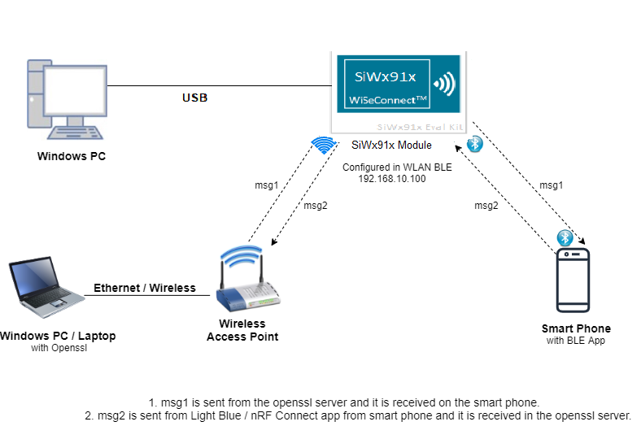
  
- **NCP Mode** :  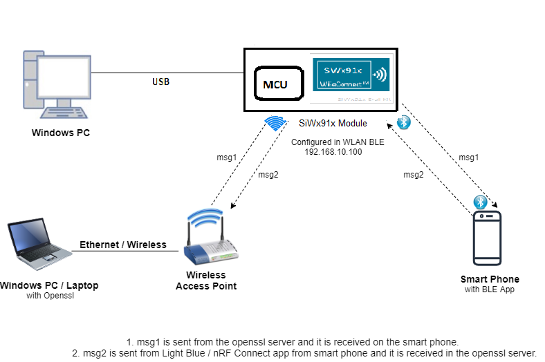
   			
### 3. Application Build Environment

### 3.1 Project Setup

- **SoC Mode**
  - **Silicon Labs SiWx91x SoC**. Follow the [Getting Started with SiWx91x SoC](https://docs.silabs.com/) to setup the example to work with SiWx91x SoC and Simplicity Studio.
- **NCP Mode**
  - **Silicon Labs EFx32 Host**. Follow the [Getting Started with EFx32](https://docs.silabs.com/rs9116-wiseconnect/latest/wifibt-wc-getting-started-with-efx32/) to setup the example to work with EFx32 and Simplicity Studio.
  
### 3.2 NCP Mode -Host Interface

* By default, the application is configured to use the SPI bus for interfacing between Host platforms and the SiWx91x EVK.
* The SAPI driver provides APIs to enable other host interfaces if SPI is not suitable for your needs.

### 3.3 Bare Metal/RTOS Support

This application supports bare metal and RTOS environment. By default, the application project files (Keil and Simplicity Studio) are provided with RTOS configuration. To select a bare metal configuration, see [Selecting bare metal](#selecting-bare-metal).


### 3.4 Bare Metal Support

This application supports only bare metal environment. By default, the application project files (Keil and Simplicity Studio) are provided with bare metal configuration. 

## 4. Application Configuration Parameters

The application can be configured to suit your requirements and development environment. Read through the following sections and make any changes needed.

**4.1** Open `rsi_wlan_app.c` file 

**4.1.1** User must update the below parameters  

- SSID refers to the name of the Access point.
```c
#define SSID                                         "SILABS_AP"
```

- CHANNEL_NO refers to the channel in which device should scan. If it is 0, device will scan all channels. 
```c
#define CHANNEL_NO                                   0
```

- SECURITY_TYPE refers to the type of security. In this application STA supports Open, WPA-PSK, WPA2-PSK securities.

   Valid configuration is: 

   - RSI_OPEN - For OPEN security mode
   - RSI_WPA  - For WPA security mode 
   - RSI_WPA2 - For WPA2 security mode
```c
#define SECURITY_TYPE                                RSI_WPA2
```

- PSK refers to the secret key if the Access point configured in WPA-PSK/WPA2-PSK security modes.
 
```c
#define PSK                                          "1234567890"
```

- DEVICE_PORT port refers SSL client port number
```c
#define DEVICE_PORT                                  5001
```

- SERVER_PORT port refers remote SSL server port number
```c
#define SERVER_PORT                                  5001
```

- SERVER_IP_ADDRESS refers remote peer IP address to connect with SSL server socket.
```c
#define SERVER_IP_ADDRESS                     "192.168.10.100"
```

**4.1.2** The desired parameters are provided below. User can also modify the parameters as per their needs and requirements.

To Load certificate:
```c
#define LOAD_CERTIFICATE                             1
```
   If **LOAD_CERTIFICATE** set to 1, application will load certificate which is included using rsi_wlan_set_certificate API.

   By default, application loading "cacert.pem" certificate if **LOAD_CERTIFICATE** enable. In order to load different certificate, user has to follow the following steps:

rsi_wlan_set_certificate API expects the certificate in the form of linear array. So, convert the pem certificate into linear array form using python script provided in the SDK "certificate_to_array.py"

  Ex: If the certificate is wifi-user.pem. Give the command in the following way
  python certificate_to_array.py ca-cert.pem
  Script will generate wifiuser.pem in which one linear array named cacert contains the certificate.

After conversion of certificate, update `rsi_ssl_client.c` source file by including the certificate file and by providing the required parameters to rsi_wlan_set_certificate API.

> Note:
> Once certificate loads into the device, it will write into the device flash. So, user need not load certificate for every boot up unless certificate change.

So, define LOAD_CERTIFICATE as 0, if certificate is already present in the Device.

> Note:
> All the certificates are given in the path `<SDK>/certificates`

To configure IP address

  - DHCP_MODE refers whether IP address configured through DHCP or STATIC
```c
#define DHCP_MODE                                    1
```
> Note:
> If user wants to configure STA IP address through DHCP then set DHCP_MODE to "1" and skip configuring the following DEVICE_IP, GATEWAY and NETMASK macros.
> (Or)
> If user wants to configure STA IP address through STATIC then set DHCP_MODE macro to "0" and configure following DEVICE_IP, GATEWAY and NETMASK macros. 

- IP address to be configured to the device in STA mode should be in long format and in little endian byte order.

   Example: To configure "192.168.10.10" as IP address, update the macro DEVICE_IP as 0x0A0AA8C0.
```c
#define DEVICE_IP                                    0X0A0AA8C0
```

- IP address of the gateway should also be in long format and in little endian byte order

   Example: To configure "192.168.10.1" as Gateway, update the macro GATEWAY as 0x010AA8C0. 
```c
#define GATEWAY                                      0x010AA8C0
```

- IP address of the network mask should also be in long format and in little endian byte order

   Example: To configure "255.255.255.0" as network mask, update the macro NETMASK as 0x00FFFFFF.
```c
#define NETMASK                                      0x00FFFFFF
```

**4.2** Open `rsi_ble_app.c` file and update/modify following macros

- RSI_BLE\NEW_SERVICE_UUID refers to the attribute value of the newly created service.
```c
#define RSI_BLE_NEW_SERVICE_UUID                     0xAABB
```

- RSI_BLE_ATTRIBUTE_1_UUID refers to the attribute type of the first attribute under this service (RSI_BLE_NEW_SERVICE_UUID).
```c
#define RSI_BLE_ATTRIBUTE_1_UUID                      0x1AA1
```

- RSI_BLE_ATTRIBUTE_2_UUID refers to the attribute type of the second attribute under this service (RSI_BLE_NEW_SERVICE_UUID).
```c
#define RSI_BLE_ATTRIBUTE_2_UUID                      0x1BB1
```

- RSI_BLE_MAX_DATA_LEN refers to the Maximum length of the attribute data.
```c
#define RSI_BLE_MAX_DATA_LEN                          20
```

- RSI_BLE_APP_DEVICE_NAME refers name of the SiWx91x EVK to appear during scanning by remote devices.
```c
#define RSI_BLE_APP_DEVICE_NAME                       "WLAN_BLE_APP"
```   
   
Following are the **non-configurable** macros in the application.

- RSI_BLE_CHAR_SERV_UUID refers to the attribute type of the characteristics to be added in a service.
```c
#define RSI_BLE_CHAR_SERV_UUID                        0x2803
```

- RSI_BLE_CLIENT_CHAR_UUID refers to the attribute type of the client characteristics descriptor to be added in a service.
```c
#define RSI_BLE_CLIENT_CHAR _UUID                     0x2902
```
 
- RSI_BLE_ATT_PROPERTY_READ is used to set the READ property to an attribute value.
```c
#define RSI_BLE_ATT_PROPERTY_READ                     0x02
```

- RSI_BLE_ATT_PROPERTY_WRITE is used to set the WRITE property to an attribute value.
```c
#define RSI_BLE_ATT_PROPERTY_WRITE                    0x08
```

- RSI_BLE_ATT_PROPERTY_NOTIFY is used to set the NOTIFY property to an attribute value.
```c
#define RSI_BLE_ATT_PROPERTY_NOTIFY                   0x10
```

- BT_GLOBAL_BUFF_LEN refers Number of bytes required by the application and the driver.
```c
#define BT_GLOBAL_BUFF_LEN                            15000
```


**4.3** Open `rsi_wlan_config.h` file. User can also modify the below parameters as per their needs and requirements. 

```c
#define CONCURRENT_MODE                              RSI_DISABLE
#define RSI_FEATURE_BIT_MAP                          FEAT_SECURITY_OPEN
#define RSI_TCP_IP_BYPASS                            RSI_DISABLE
#define RSI_TCP_IP_FEATURE_BIT_MAP                   (TCP_IP_FEAT_DHCPV4_CLIENT | TCP_IP_FEAT_SSL | TCP_IP_TOTAL_SOCKETS_1 | TCP_IP_FEAT_EXTENSION_VALID)
#define RSI_CUSTOM_FEATURE_BIT_MAP                   FEAT_CUSTOM_FEAT_EXTENTION_VALID
#define RSI_EXT_CUSTOM_FEATURE_BIT_MAP               0
#define RSI_EXT_TCPIP_FEATURE_BIT_MAP                EXT_DYNAMIC_COEX_MEMORY
#define RSI_BT_FEATURE_BITMAP             (BT_RF_TYPE | ENABLE_BLE_PROTOCOL)
#define RSI_BAND                                     RSI_BAND_2P4GHZ 
```

## 5. Testing the Application

- Follow the below steps for the successful execution of the application.

### 5.1 Loading the SiWx91x Firmware

- Refer [Getting started with PC ](https://docs.silabs.com/rs9116/latest/wiseconnect-getting-started) to load the firmware into SiWx91x EVK. The firmware binary is located in `<SDK>/connectivity_firmware/`

### 5.2 Creating the Project and builing the Application
  
- Refer [Getting started with EFX32](https://docs.silabs.com/rs9116-wiseconnect/latest/wifibt-wc-getting-started-with-efx32/), for settin-up EFR & EFM host platforms

#### 5.2.1 Project Creation - SoC Mode : 

- Connect your board. The Si917 compatible SoC board is **BRD4325A**.
- Studio should detect your board. Your board will be shown here.

#### 5.2.2 Project Creation - NCP Mode : 

- Connect your board. The supported NCP boards are: **BRD4180A,BRD4280B**
- Studio should detect your board. Your board will be shown here.

#### 5.2.3 Selecting an example application and generate project

- Go to the 'EXAMPLE PROJECT & DEMOS' tab and select your desired example application
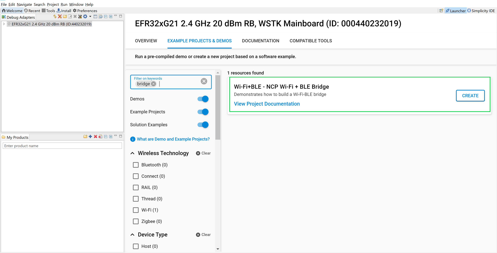
- Click 'Create'. The "New Project Wizard" window appears. Click 'Finish'
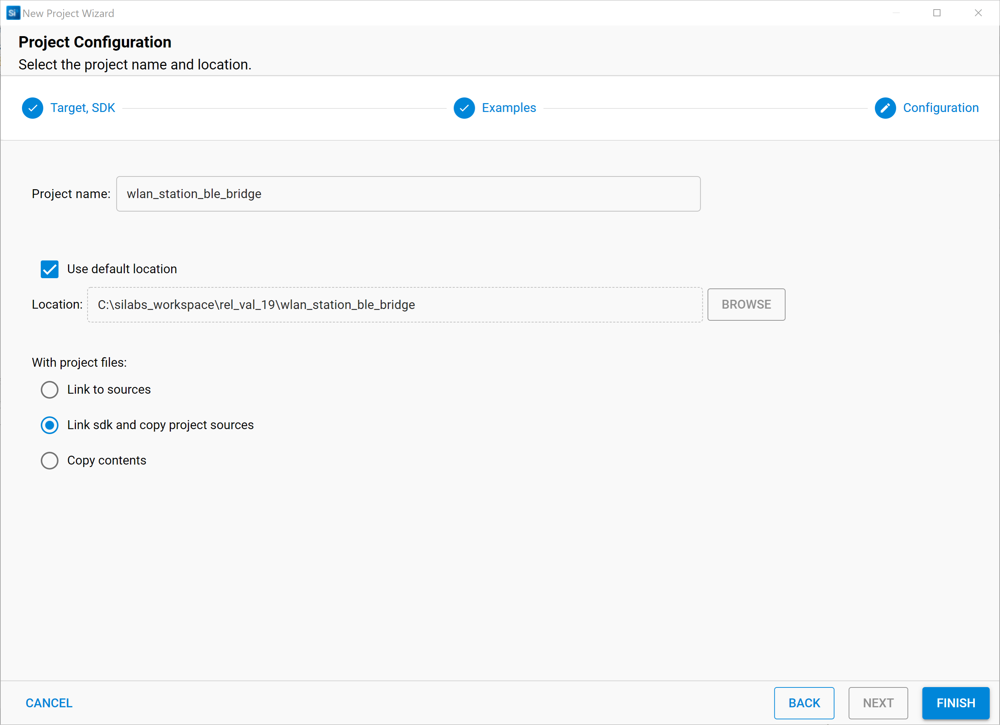
#### NOTE:

- If the user wants to run the application with power_save, then **ENABLE_POWER_SAVE** macro should be enabled in rsi_ble_config.h file and continue with building and executing the application.
- In Power save, please note that only TA will be going into sleep and M4 still be active in in SoC mode.
#### 5.2.4 Build Project - SoC Mode

- Once the project is created, right click on project and go to properties -> C/C++ Build -> Settings -> Build Steps
- Add post_build_script_SimplicityStudio.bat file path (SI917_COMBO_SDK.X.X.X.XX\utilities\isp_scripts_common_flash) in build steps settings as shown in below image.
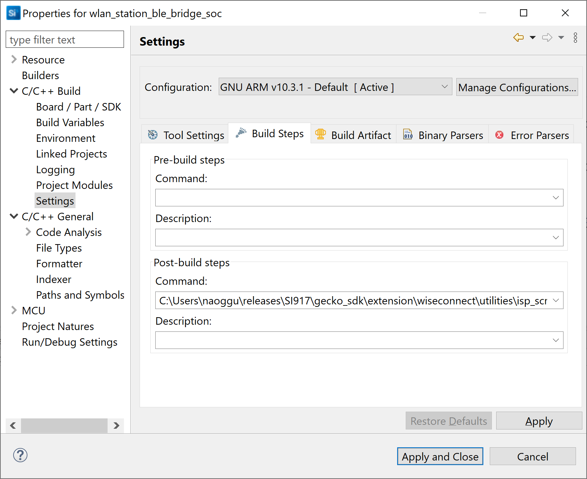
- Check for M4 projects macros in preprocessor settings(RSI_M4_INTERFACE=1)
- Check for 9117 macro in preprocessor settings(CHIP_9117=1).
- Click on the build icon (hammer) to build the project
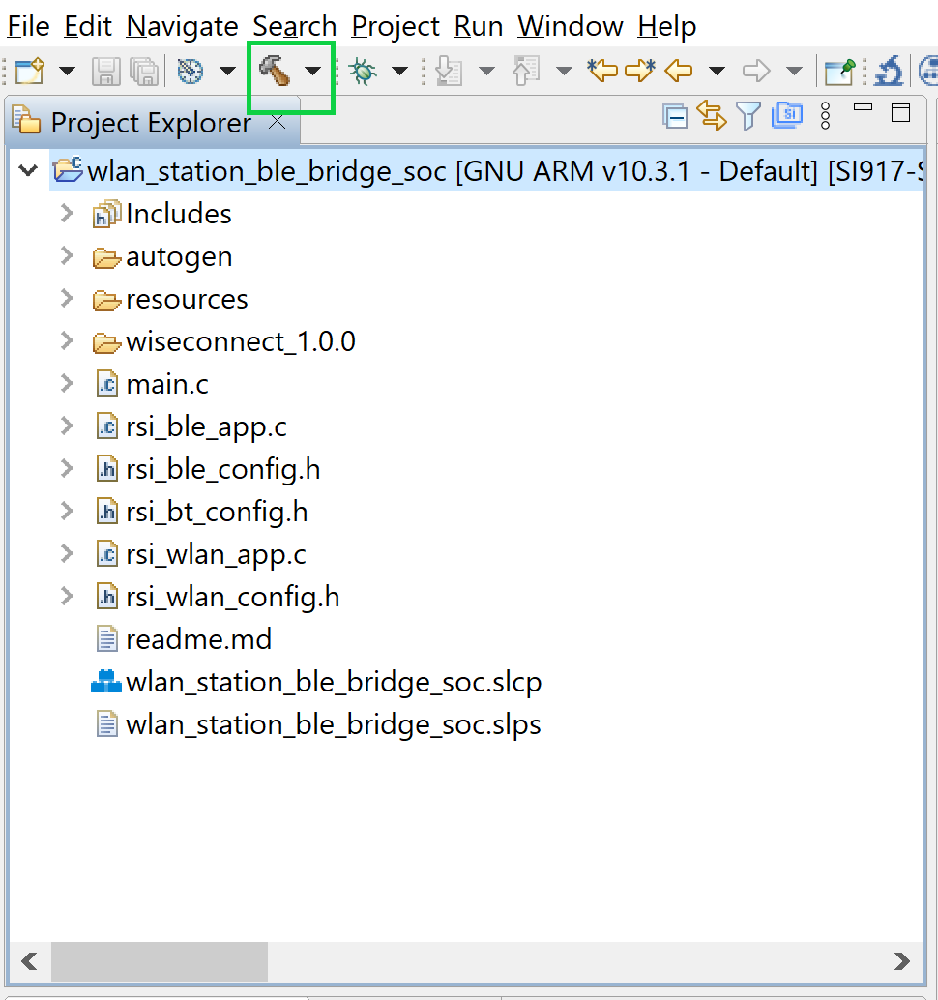
- Successful build output will show as below.
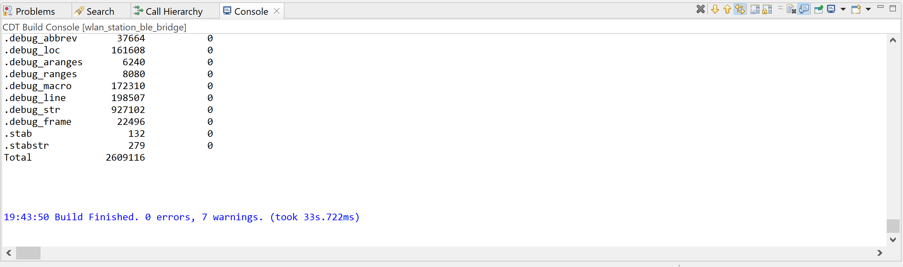
#### 5.2.5 Build Project - NCP Mode :

**Using EFX32:**

- Check for 9117 macro in preprocessor settings(CHIP_9117=1) and (EXP_BOARD = 1).
- Click on the build icon (hammer) to build the project
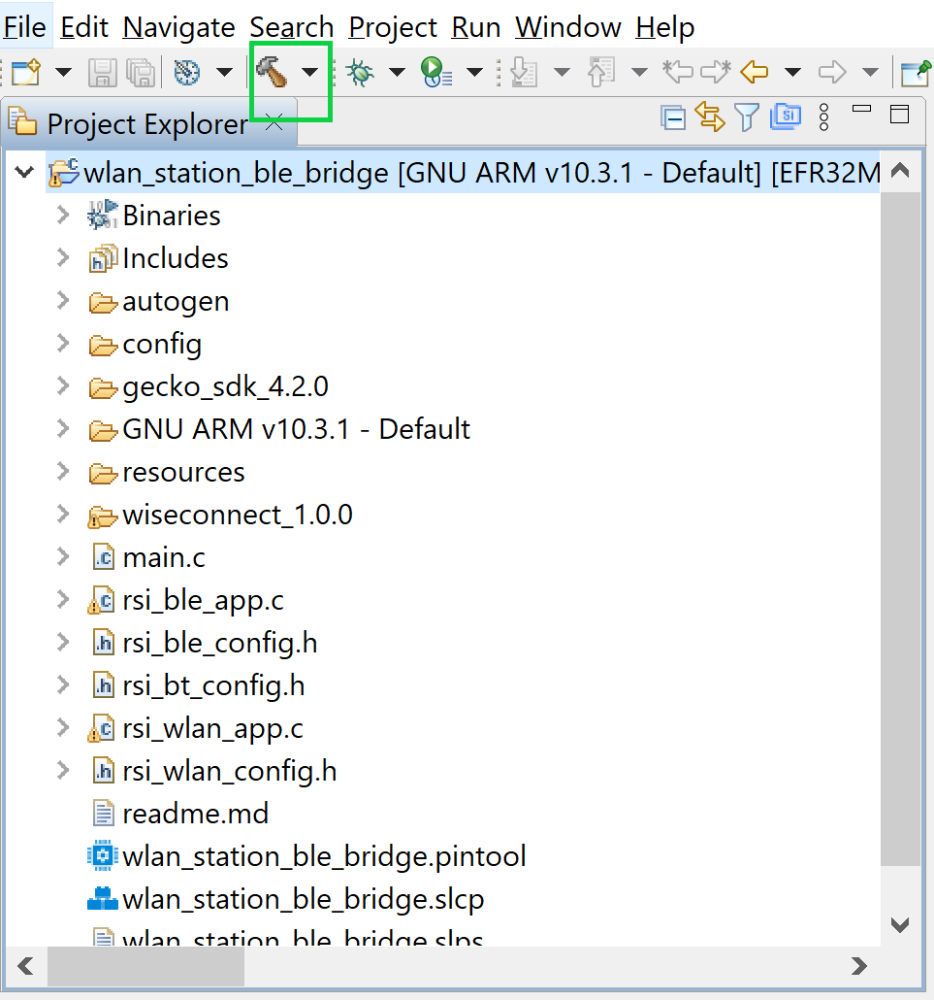
- Successful build output will show as below.

- Compile and flash the project in to Host MCU
- Debug the project
- Free run the project
- Then continue the common steps from **Section 5.3**

**Using STM32:**

Refer [STM32 Getting Started](https://docs.silabs.com/rs9116-wiseconnect/latest/wifibt-wc-getting-started-with-efx32/)  

- Open the project `<SDK>/examples/snippets/wlan_ble/wlan_station_ble_provisioning/projects/wlan_station_ble_provisioning-nucleo-f411re.uvprojx` in Keil IDE.
- Build and Debug the project
- Check for the RESET pin:
  - If RESET pin is connected from STM32 to SiWx91x EVK, then user need not press the RESET button on SiWx91x EVK before free run.
  - If RESET pin is not connected from STM32 to SiWx91x EVK, then user need to press the RESET button on SiWx91x EVK before free run.
- Free run the project
- Then continue the common steps from **Section 5.3**

### 5.3 Steps to verify the WLAN Station BLE Bridge Example

1. Configure the Access point in OPEN/WPA-PSK/WPA2-PSK mode to connect Silicon Labs device in STA mode.

2. Connect any serial console for prints.

3. Connect the Windows PC to AP through Ethernet/Wireless connection.

4. Download the and install the Openssl.

5. After the successful installation, copy the "server-cert.pem" and "server-key.pem" from certificates folder available in the `<SDK>\resources\certificates` path. And paste the files in the `$\OpenSSL\bin` folder as shown below.
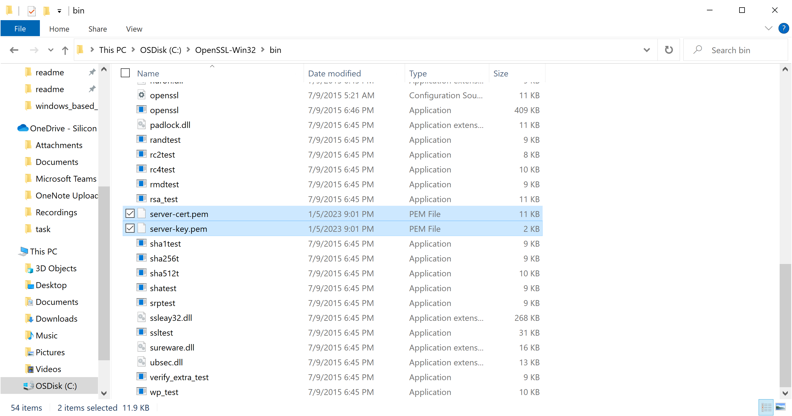
6. Run SSL server by giving following command:
  ```sh
Openssl.exe s_server -accept<SERVER_PORT> –cert <server_certificate_file_path> -key <server_key_file_path> -tls<tls_version>
Example: openssl.exe s_server –accept 5001 –cert server-cert.pem -key server-key.pem –tls1
```
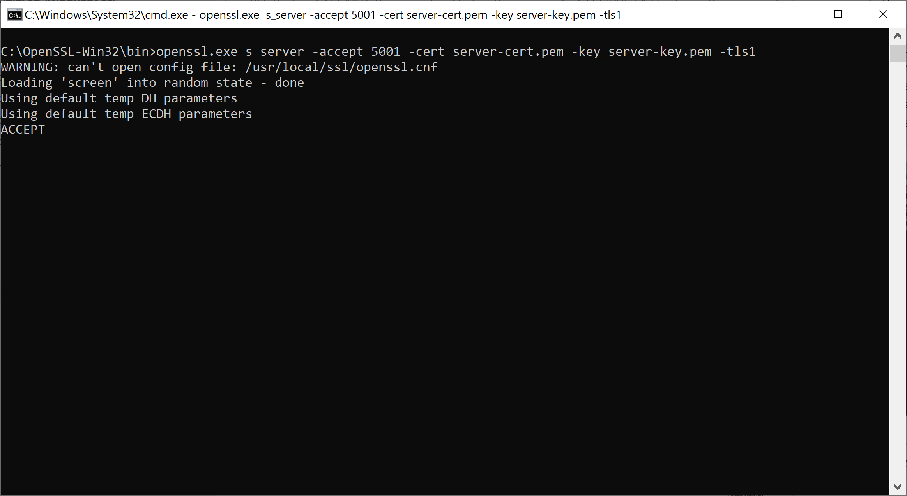
7. After the program gets executed, Silicon Labs BLE is in Advertising state and WLAN connects to Access Point and establishes SSL connectivity with SSL server opened on Windows PC as shown below.
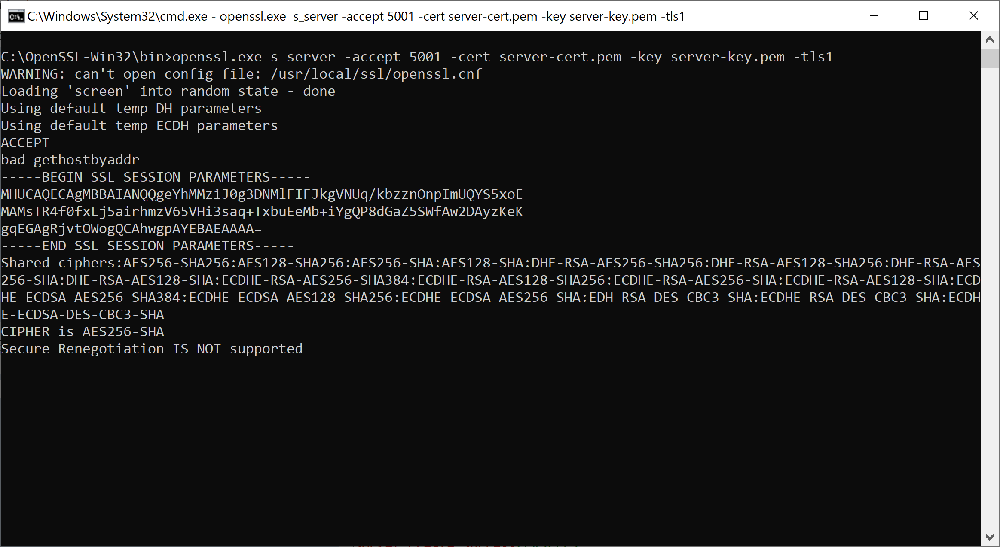
8. Open a EFR Connect App in the Smartphone and click on the 'Browser' option. The app will automatically scan the devices which are under vicinity.
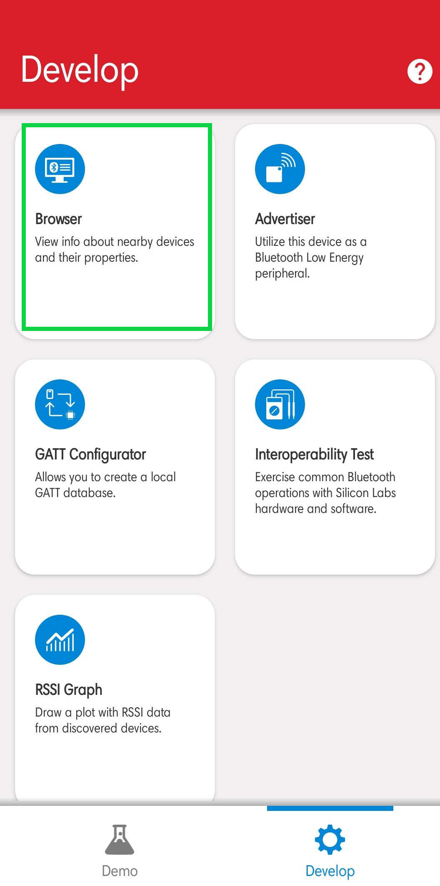
9. In the App, Silicon Labs module device will appear with the name configured in the macro **RSI_BLE_APP_SIMPLE_CHAT (Ex: "WLAN_BLE_APP")** or sometimes observed as SiWx91x EVK as internal name "**SimpleBLEPeripheral**".
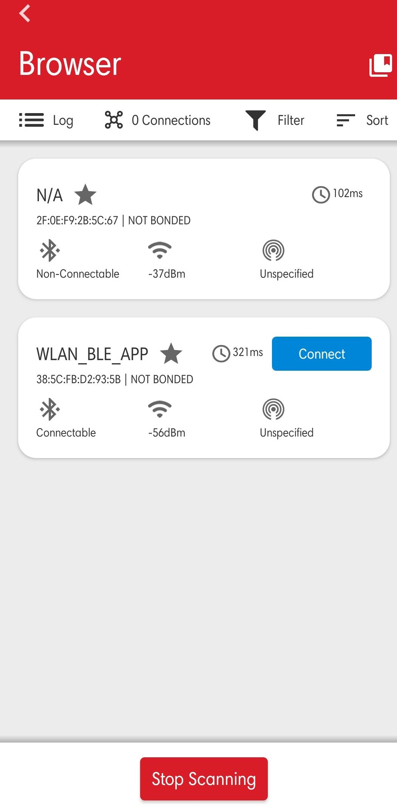
10. Initiate BLE connection from the App by click on the **Connect** option.
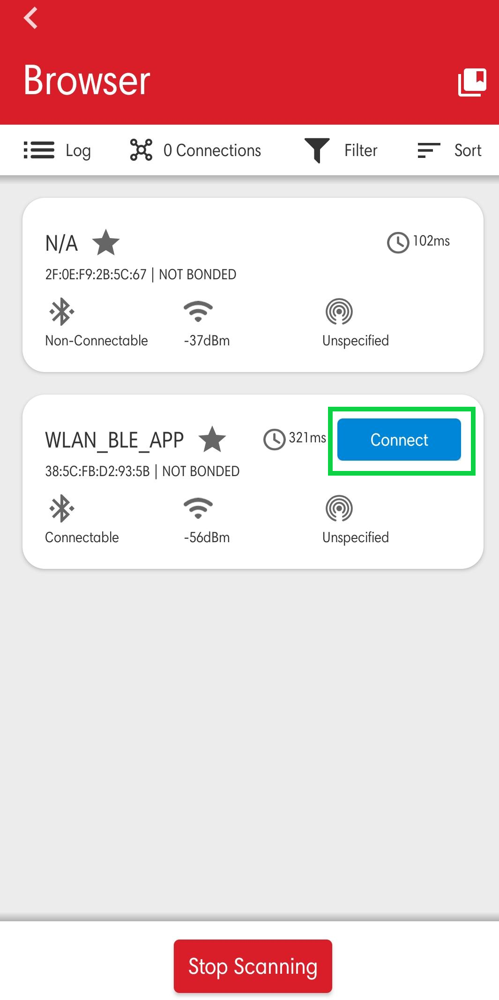
11. After successful connection, the app displays the supported services of Silicon Labs module.
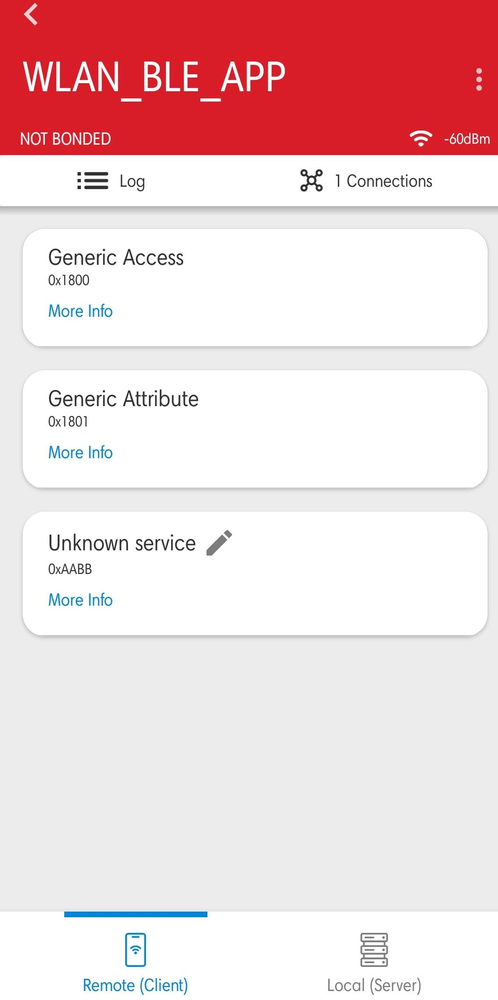
12. Select the attribute service which is added **RSI_BLE_NEW_SERVICE_UUID** (Ex: 0xAABB) and Click on the **Notify** property to enable the Notification for attribute UUID **RSI_BLE_ATTRIBUTE_2_UUID** (Ex: 0x1BB1).
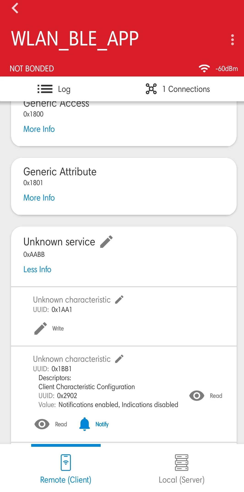
13. Send a message (Ex: "Hello from WiFi STA") from the SSL server (Which is opened in Windows PC).
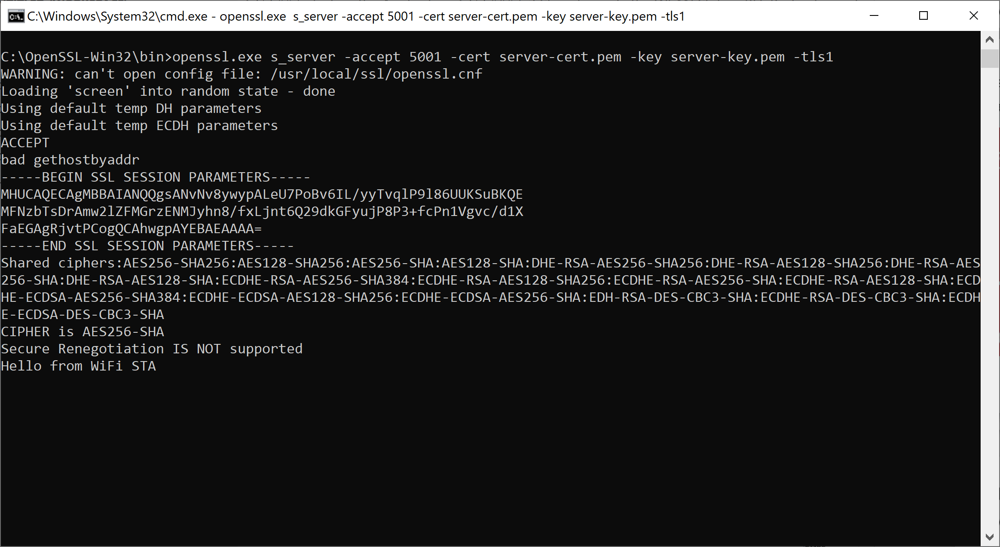
14. SiWx91x EVK forwards the received message from SSL server to remote BLE device which is connected to Silicon Labs BLE device over BLE protocol. User can observe the message notification on attribute UUID **RSI_BLE_ATTRIBUTE_2_UUID** (Ex: 0x1BB1).
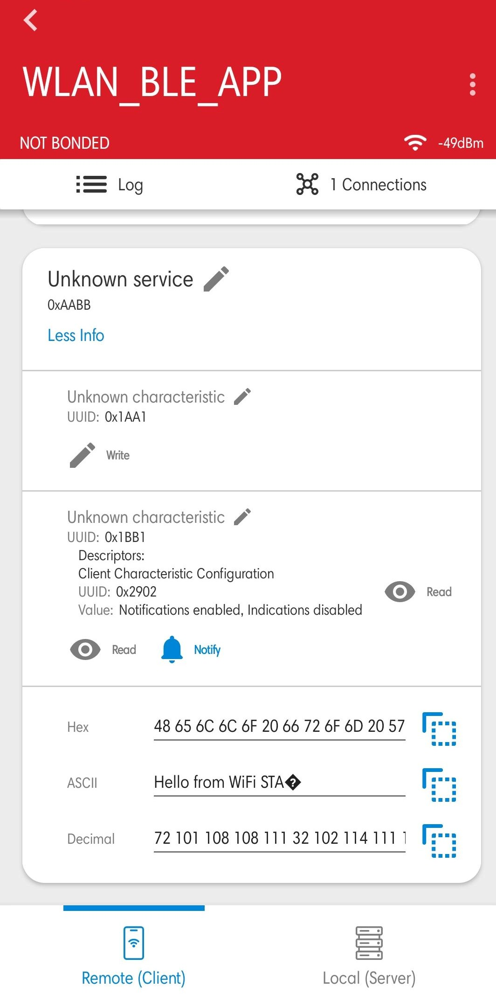
> Note: 
> rsi_wlan_app_send_to_ble() function is defined in rsi_ble_app.c to send message from WLAN task to BLE task. 

14. Send a message (Ex: "Hello from BLE") from GATT client (from smart phone EFR Connect App) using attribute **RSI_BLE_ATTRIBUTE_1_UUID**.
    (Ex: 0x1AA1) to SiWx91x EVK. SiWx91x EVK forwards the received message from BLE remote device to SSL server over WiFi protocol. User can observe the message on SSL socket connection.
    
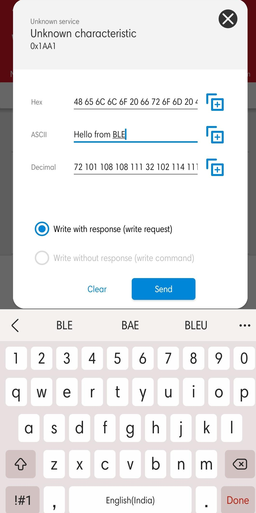

> Note:
> rsi_ble_app_send_to_wlan() function is defined in rsi_wlan_app.c to send message from BLE task to WLAN task.

15. Refer the below figure for console prints
- For SOC the console prints are shown below
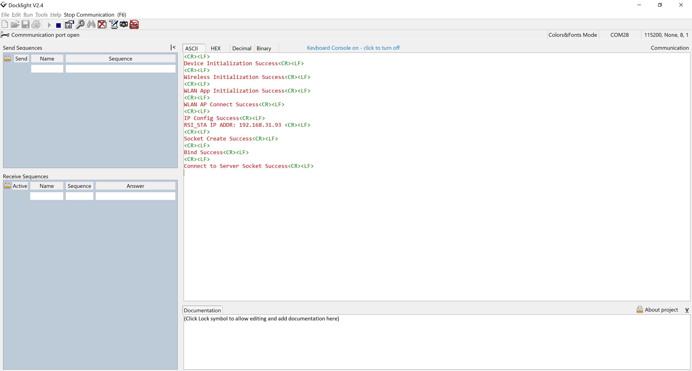
- For NCP the console prints are shown below

 