# WLAN Station BLE Throughput

## 1 Introduction
The coex application demonstrates throughput measurement of Wi-Fi while BLE is in connection.
The coex application has WLAN and BLE tasks and acts as an interface between Smartphone and PC. Smartphone interacts with BLE task, while Both PC and Silicon Labs device would be connected to a Wireless Access Point, thus both are connected together wirelessly. When Smartphone connects and sends message to Silicon Labs device, BLE task accepts. Similarly, data transfer will happen between Station and AP.

## 2 Setting Up 
To use this application, the following hardware, software and project setup is required.

### Hardware Requirements
- A Windows PC
- A computer running Iperf (may be the same PC or Mac used to program the Host MCU)
- Wi-Fi Access Point
- SiWx91x Wi-Fi Evaluation Kit
  - **SoC Mode**: 
      - Silicon Labs [BRD4325A](https://www.silabs.com/)
  - **NCP Mode**:
      - Silicon Labs [(BRD4180A, BRD4280B)](https://www.silabs.com/)
      - Host MCU Eval Kit. This example has been tested with:
        - Silicon Labs [WSTK + EFR32MG21](https://www.silabs.com/development-tools/wireless/efr32xg21-bluetooth-starter-kit)
-  Android Mobile Phone with BLE scanner App.

#### SoC Mode : 
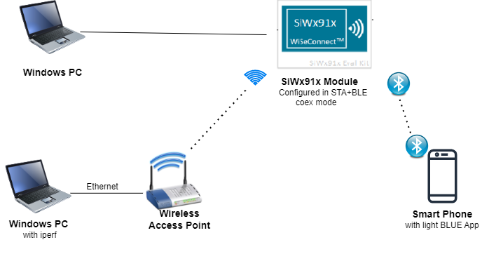

  
#### NCP Mode :  
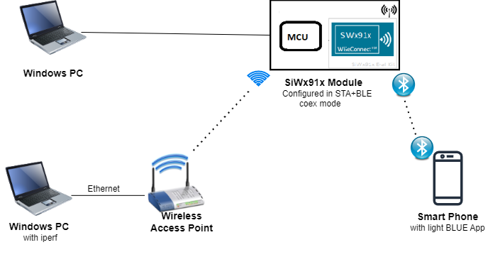

## 3 Project Setup
- **SoC Mode**
  - **Silicon Labs SiWx91x SoC**. Follow the [Getting Started with SiWx91x SoC](https://docs.silabs.com/) to setup the example to work with SiWx91x SoC and Simplicity Studio.
- **NCP Mode**
  - **Silicon Labs EFx32 Host**. Follow the [Getting Started with EFx32](https://docs.silabs.com/rs9116-wiseconnect/latest/wifibt-wc-getting-started-with-efx32/) to setup the example to work with EFx32 and Simplicity Studio.

## Configuring the Application
The application can be configured to suit your requirements and development environment.
Read through the following sections and make any changes needed. 

### NCP Mode - Host Interface

* By default, the application is configured to use the SPI bus for interfacing between Host platforms(EFR32MG21) and the SiWx91x EVK.

### Bare Metal/RTOS Support
To select a bare metal configuration, see [Selecting bare metal](#8-selecting-bare-metal).

## 4 Creating the project

1. Ensure the SiWx91x loaded with the latest firmware following the [Getting started with a PC](https://docs.silabs.com/rs9116/latest/wiseconnect-getting-started). The firmware file is located at `<Si917 COMBO SDK>/connectivity_firmware/`.

2. Ensure the EFx32 and SiWx91x set up is connected to your PC.

### 4.1 Board detection

### 4.1.1 SoC mode
1. In the Simplicity Studio IDE, 
    - The 917 SoC board will be detected under **Debug Adapters** pane as shown below.

      ****

### 4.1.2 NCP mode

1. In the Simplicity Studio IDE, 
    - The EFR32 board will be detected under **Debug Adapters** pane as shown below.

      ****

    - The EFM32 board will be detected under **Debug Adapters** pane as shown below.

      ****

### 4.2 Creation of project

Ensure the latest Gecko SDK along with the extension Si917 COMBO SDK is added to Simplicity Studio.

1. Click on the board detected and go to **EXAMPLE PROJECTS & DEMOS** section.

   ****

2. Filter for Wi-Fi examples from the Gecko SDK added. For this, check the *Wi-Fi* checkbox under **Wireless Technology** and *Gecko SDK Suite* checkbox under **Provider**. 

3. Under provider, for SoC based example, check the *SoC* checkbox and for NCP based example, check the *NCP* checkbox.

4. Now choose Wi-Fi+BLE - NCP WLAN Station BLE Throughput App example for NCP mode or choose Wi-Fi+BLE - SoC WLAN Station BLE Throughput App example for SoC mode and click on **Create**.
  For NCP mode:

   **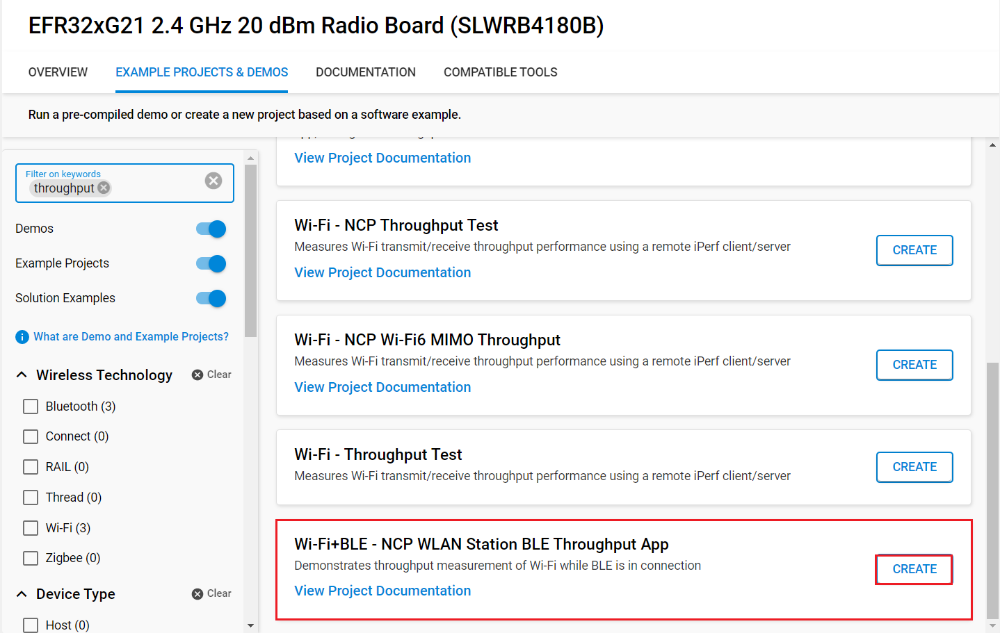**

    For SoC mode:
      
   **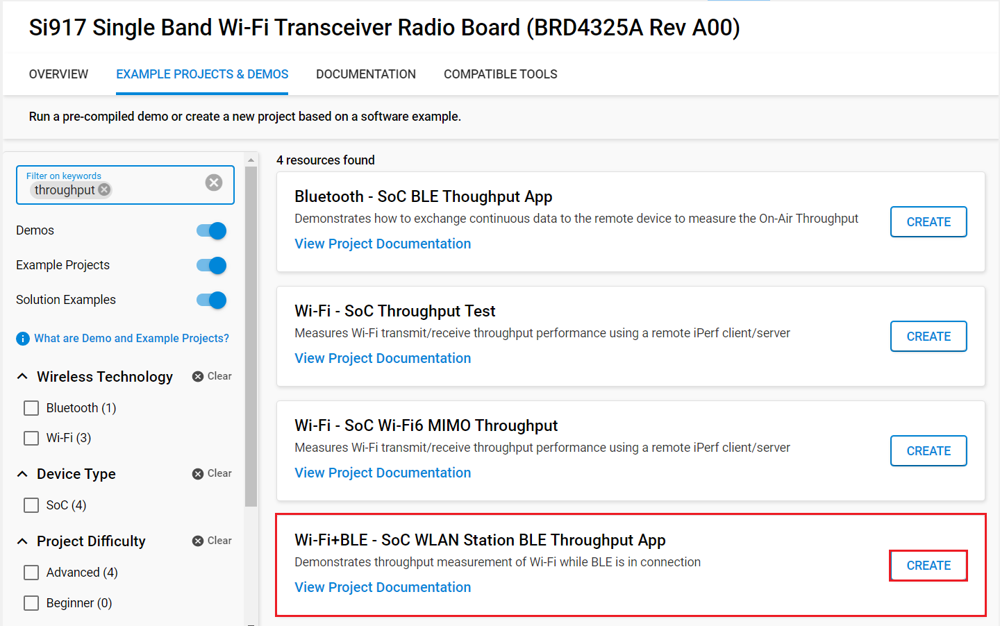**

5. Give the desired name to your project and cick on **Finish**.

   **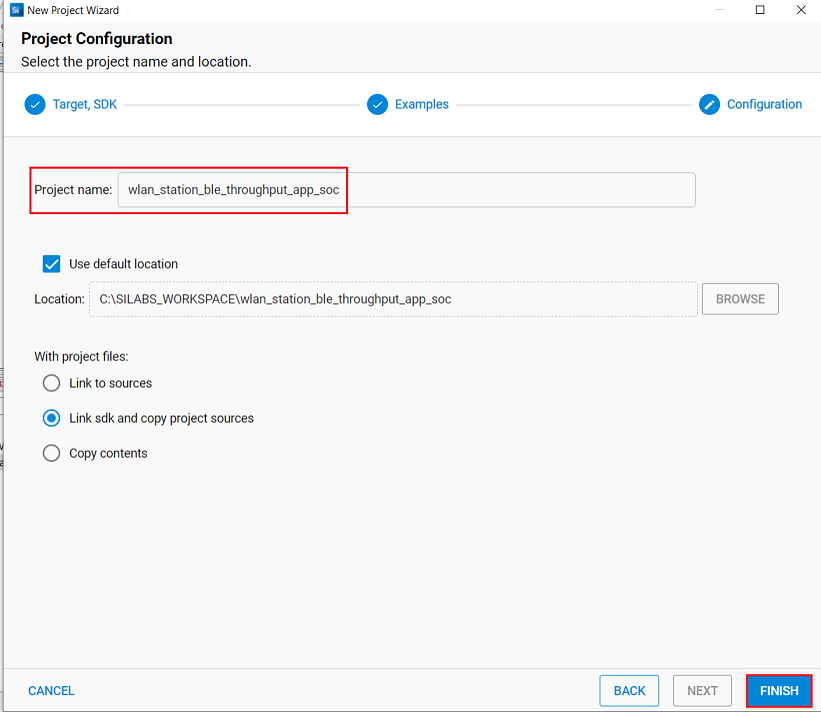**

## 5 Application Configuration Parameters

The application can be configured to suit your requirements and development environment. Read through the following sections and make any changes needed.

**1** Open `main.c` file

Memory length for driver

```c
#define GLOBAL_BUFF_LEN                            15000
```

The following parameters are configured if OS is used. 

Task Priotrities should be given as below. Application task priority should be given as low priority and Driver task priority should be given as highest priority

```c
#define RSI_WLAN_BLE_TASK_PRIORITY		1
#define RSI_WLAN_TASK_PRIORITY			2
#define RSI_BLE_TASK_PRIORITY			3
#define RSI_DRIVER_TASK_PRIORITY 		4
```
   
stack size is configured by these macros

```c
#define RSI_WLAN_BLE_TASK_STACK_SIZE 			1000
#define RSI_WLAN_TASK_STACK_SIZE 				1000
#define RSI_BLE_TASK_STACK_SIZE 				1000
#define RSI_DRIVER_TASK_STACK_SIZE 				3000
```

**2** Open `rsi_wlan_app.c` file

Wi-Fi Configuration
Configure the following parameters to enable your Silicon Labs Wi-Fi device to connect to your Wi-Fi network.
```c
#define SSID           "SILABS_AP"      // Wi-Fi Network Name
#define PSK            "1234567890"     // Wi-Fi Password
#define SECURITY_TYPE  RSI_WPA2         // Wi-Fi Security Type: RSI_OPEN / RSI_WPA / RSI_WPA2
#define CHANNEL_NO     0                // Wi-Fi channel if the softAP is used (0 = auto select)
#define DHCP_MODE      1                // Enable / Disable: DHCP mode 1-Enables DHCP mode (gets the IP from DHCP server),0-Disables DHCP mode
#define CHANNEL_NO     0                // Wi-Fi channel if the softAP is used (0 = auto select)
```

Client/Server IP Settings
```c
#define PORT_NUM           <local_port>   // Local port to use
#define SERVER_PORT        <remote_port>  // Remote server port
#define SERVER_IP_ADDRESS  "192.168.0.100"     // Remote server IP address
#define GLOBAL_BUFF_LEN    15000		  //! Memory length for driver
#define BUF_SIZE 		   1400			  //! Memory length for send buffer
#define RSI_WLAN_TASK_PRIORITY 1		  //! Wlan task priority
#define RSI_DRIVER_TASK_PRIORITY 1		  //! Wireless driver task priority
#define RSI_WLAN_TASK_STACK_SIZE 500	  //! Wlan task stack size
#define RSI_DRIVER_TASK_STACK_SIZE 500	  //! Wireless driver task stack size
```
Throughput Measurement Types
The application may be configured to measure throughput using UDP, TCP, SSL packets. Choose the measurement type using the `THROUGHPUT_TYPE` macro.
```c
#define THROUGHPUT_TYPE  TCP_TX     // Selects the throughput option; see the following diagrams. 
#define TCP_TX           0			// SiWx91x transmits packets to remote TCP client
#define TCP_RX           1			// SiWx91x receives packets from remote TCP server
#define UDP_TX           2			// SiWx91x transmits packets to remote UDP client
#define UDP_RX           3			// SiWx91x receives packets from remote UDP server
#define SSL_TX 			 4          // SiWx91x transmits packets to remote SSL client
#define SSL_RX           5          // SiWx91x receives packets from remote SSL server
```

**3** Open 'rsi_wlan_config.h' file 


```c
##define CONCURRENT_MODE                                      RSI_DISABLE
#define RSI_FEATURE_BIT_MAP                                  (FEAT_SECURITY_OPEN  | FEAT_AGGREGATION)
#define RSI_TCP_IP_BYPASS                                    RSI_DISABLE
#define RSI_TCP_IP_FEATURE_BIT_MAP                           (TCP_IP_FEAT_DHCPV4_CLIENT | TCP_IP_TOTAL_SOCKETS_1 | TCP_IP_FEAT_EXTENSION_VALID)
#define RSI_CUSTOM_FEATURE_BIT_MAP                           FEAT_CUSTOM_FEAT_EXTENTION_VALID
#define RSI_EXT_CUSTOM_FEATURE_BIT_MAP                       EXT_FEAT_384K_MODE
#define RSI_EXT_TCPIP_FEATURE_BIT_MAP                        EXT_DYNAMIC_COEX_MEMORY
#define RSI_BAND                                             RSI_BAND_2P4GHZ
```

> Note: 
> rsi_wlan_config.h, rsi_bt_config.h and rsi_ble_config.h files are already set with the above desired configuration for this example.


**4** Open `rsi_ble_app.c` file and update/modify following macros

RSI\_BLE\_CHAR\_SERV\_UUID refers to the attribute type of the characteristics to be added in a service.
   
```c
#define  RSI_BLE_CHAR_SERV_UUID                         0x2803
```

RSI\_BLE\_CLIENT\_CHAR\_UUID refers to the attribute type of the client characteristics descriptor to be added in a service.
    
```c
#define RSI_BLE_CLIENT_CHAR_UUID                        0x2902
```

RSI\_BLE\_NEW\_SERVICE\_UUID refers to the attribute value of the newly created service.

```c
#define  RSI_BLE_NEW_SERVICE_UUID                       0xAABB
```

RSI\_BLE\_ATTRIBUTE\_1\_UUID refers to the attribute type of the first attribute under this service (RSI_BLE_NEW_SERVICE_UUID).

```c
#define  RSI_BLE_ATTRIBUTE_1_UUID                        0x1AA1
```

RSI\_BLE\_ATTRIBUTE\_2\_UUID refers to the attribute type of the second attribute under this service (RSI_BLE_NEW_SERVICE_UUID).

```c
#define RSI_BLE_ATTRIBUTE_2_UUID                         0x1BB1
```
RSI\_BLE\_MAX\_DATA\_LEN refers to the Maximum length of the attribute data.

```c
#define RSI_BLE_MAX_DATA_LEN                             20
```

RSI\_BLE\_APP\_DEVICE\_NAME refers to the name of the SiWx91x EVK to appear during scanning by remote devices.

```c
#define  RSI_BLE_APP_DEVICE_NAME                         "WLAN_BLE_APP"
```

The following are the **non-configurable** macros in the application.

RSI_BLE_ATT_PROPERTY_READ is used to set the READ property to an attribute value.

```c
#define  RSI_BLE_ATT_PROPERTY_READ                       0x02
```

RSI\_BLE\_ATT\_PROPERTY\_WRITE is used to set the WRITE property to an attribute value.

```c
#define RSI_BLE_ATT_PROPERTY_WRITE                       0x08
```

RSI\_BLE_ATT\_PROPERTY\_NOTIFY is used to set the NOTIFY property to an attribute value.

```c
#define  RSI_BLE_ATT_PROPERTY_NOTIFY                     0x10
```

BT\_GLOBAL\_BUFF\_LEN refers to the number of bytes required by the application and the driver.

```c
#define  BT_GLOBAL_BUFF_LEN                              15000
```

**SiWx91x is a TCP Client (sends TCP packets to a remote server) ...**

  

**SiWx91x is a TCP Server (receives TCP packets from a remote client) ...**

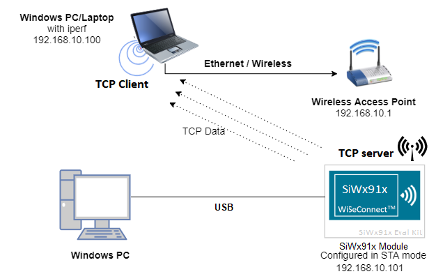

**SiWx91x is a UDP Client (sends UDP packets to a remote server) ...**


**SiWx91x is a UDP Server (receives UDP packets from a remote client) ...**

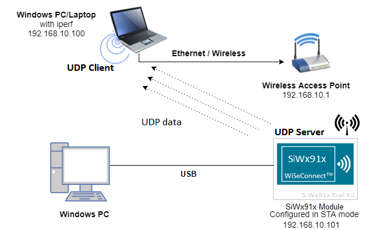

**SiWx91x is a SSL Client (sends SSL packets to a remote server) ...**

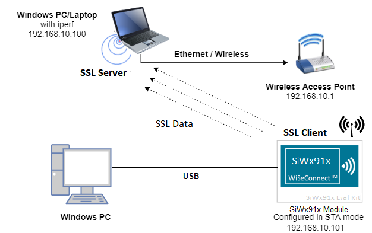

**SiWx91x is a SSL Server (receives SSL packets from a remote client) ...**

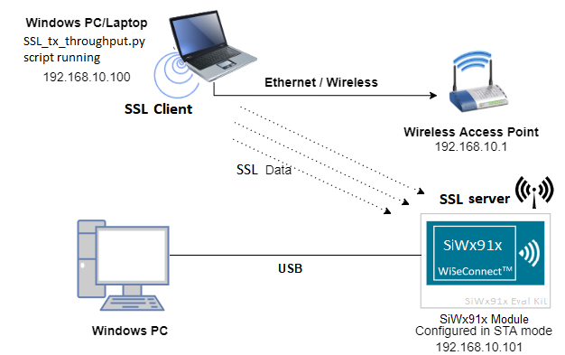


## 6 Building and Testing the Application

Follow the below steps for the successful execution of the application.

### 6.1 Loading the SiWx91x Firmware

Refer [Getting started with a PC](https://docs.silabs.com/rs9116/latest/wiseconnect-getting-started) to load the firmware into SiWx91x EVK. The firmware file is located in `<SDK>/firmware/`

### 6.2 Building the Project
#### 6.2.1. Building the Project - SoC Mode

- Once the project is created, right click on project and go to properties → C/C++ Build → Settings → Build Steps.

- Add **post_build_script_SimplicityStudio.bat** file path present at SI917_COMBO_SDK.X.X.X.XX → utilities → isp_scripts_common_flash in build steps settings as shown in below image.

  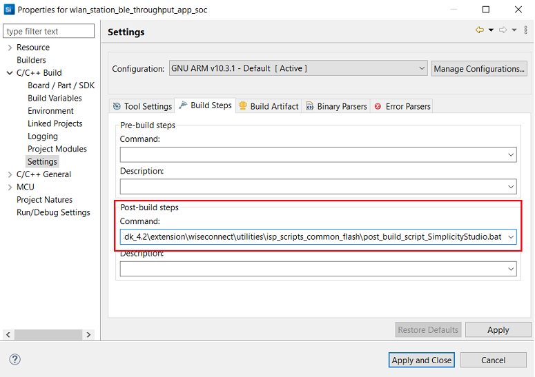

- Go to properties → C/C++ Build → Settings → Tool Settings → GNU ARM C Compiler → Preprocessor → Defined symbols (-D) and check for M4 projects macro (RSI_M4_INTERFACE=1) and 9117 macro (CHIP_9117=1). If not present, add the macros and click **Apply and Close**.
  
  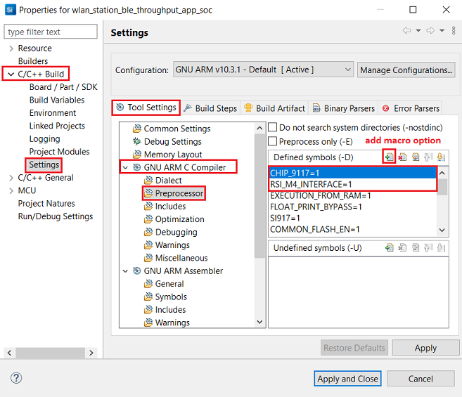

- Click on the build icon (hammer) or right click on project name and choose **Build Project** to build the project.

  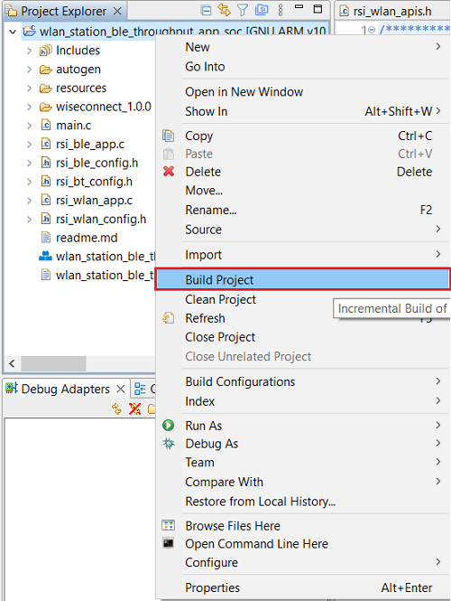

- Make sure the build returns 0 Errors and 0 Warnings.
  

#### 6.2.2. Build the Project - NCP Mode

- Check for CHIP_9117 macro in preprocessor settings as mentioned below.
   - Right click on project name.
   - Go to properties → C/C++ Build → Settings → Tool Settings → GNU ARM C Compiler → Preprocessor → Defined symbols (-D).
   - If CHIP_9117 macro is not present, add it by clicking on add macro option.
   - Click on **Apply and Close**.

     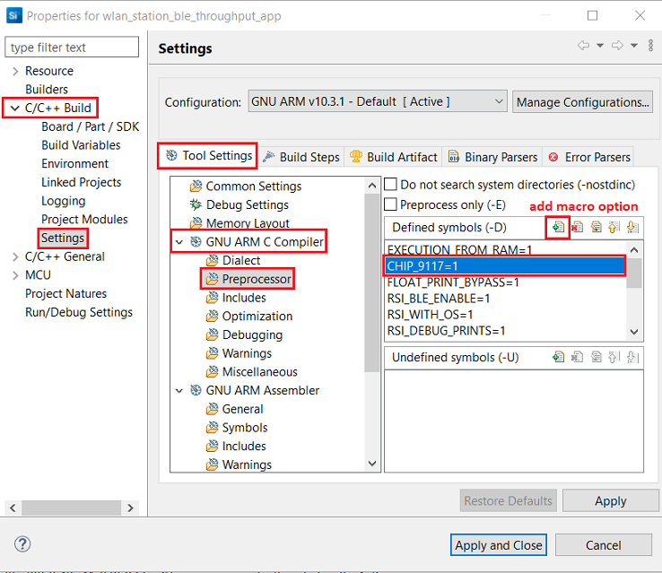

- Click on the build icon (hammer) or right click on project name and choose **Build Project** to build the project.

  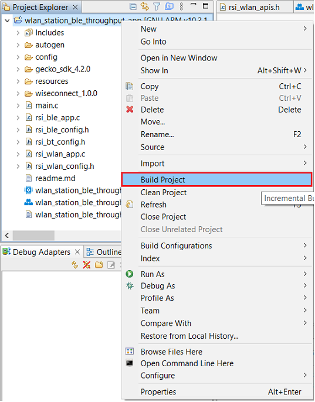

- Make sure the build returns 0 Errors and 0 Warnings.

### 6.3 Set up for application prints

Before setting up Tera Term, do the following for SoC mode.

**SoC mode**: 
You can use either of the below USB to UART converters for application prints.
1. Set up using USB to UART converter board.

  - Connect Tx (Pin-6) to P27 on WSTK
  - Connect GND (Pin 8 or 10) to GND on WSTK

    

2. Set up using USB to UART converter cable.

  - Connect RX (Pin 5) of TTL convertor to P27 on WSTK
  - Connect GND (Pin1) of TTL convertor to GND on WSTK

    

**Tera term set up - for NCP and SoC modes**

1. Open the Tera Term tool. 
   - For SoC mode, choose the serial port to which USB to UART converter is connected and click on **OK**. 

     ****

   - For NCP mode, choose the J-Link port and click on **OK**.

     ****

2. Navigate to the Setup → Serial port and update the baud rate to **115200** and click on **OK**.

    ****

    ****

The serial port is now connected. 

### 6.4 Execute the application

1. Once the build was successful, right click on project and select Debug As → Silicon Labs ARM Program to program the device as shown in below image.

   **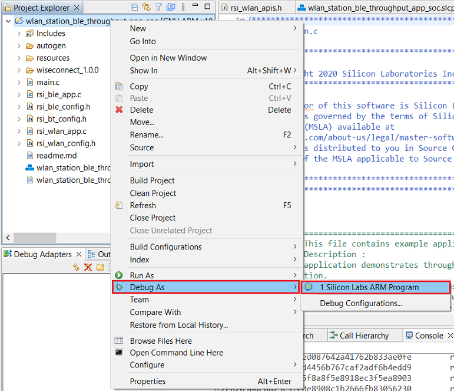**

2. As soon as the debug process is completed, the application control branches to the main().

3. Go to the J-link Silicon Labs console pane to observe the debug prints in the Serial 1 tab.

4. Click on the **Resume** icon in the Simplicity Studio IDE toolbar to run the application.

   ****

## 7 Steps to verify the WLAN Station BLE Throughput Example

1. Configure the Access point with internet connection in OPEN/WPA-PSK/WPA2-PSK mode to connect the SiWx91x EVK in STA mode.
2. Connect any serial console for prints.
3. When SiWx91x EVK enters BLE advertising mode, launch the BLE scanner App.

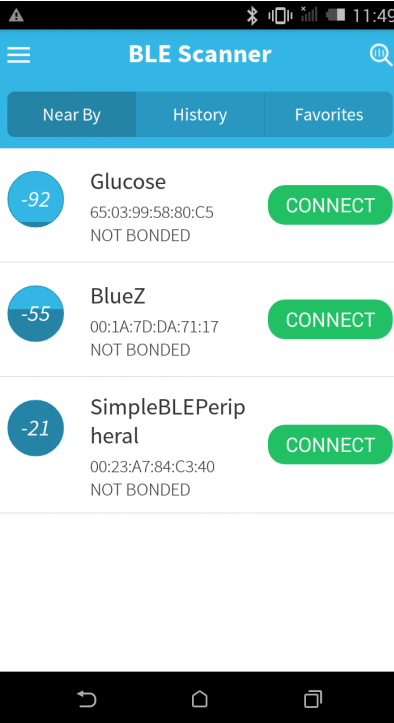

4. In the App, Silicon Labs module device will appear with the name configured in the macro RSI_BLE_APP_DEVICE_NAME (Ex: "WLAN_BLE_APP"),Initiate BLE connection from the App
5. After BT connection is established, send a message from the App to Silicon Labs BLE.
6. Once the BLE got the connected, The Device which is configured as UDP / TCP / SSL server / client will connect to iperf server / client and sends / receives data continuously. It will print the throughput per second.

### Testing Throughput
There are two 'ends' involved when measuring throughput, data is sent between the client end and the server end. By default, the Iperf protocol sends data from the Client to the Server to measure throughput. Depending on the configuration selected, the SiWx91x may be the client or the server. In general, it is advisable to start the server before the client since the client will immediately begin to try to connect to the server to send data. 

The following sections describe how to run the SiWx91x throughput application together with examples for various Iperf configurations that run on the PC.   

#### UDP Tx Throughput
To measure UDP Tx throughput, configure the SiWx91x as a UDP client and start a UDP server on the remote PC.
The Iperf command to start the UDP server on the PC is: 

> `C:\> iperf.exe -s -u -p <SERVER_PORT> -i 1`
> 
> For example ...
>
> `C:\> iperf.exe -s -u -p 5001 -i 1`

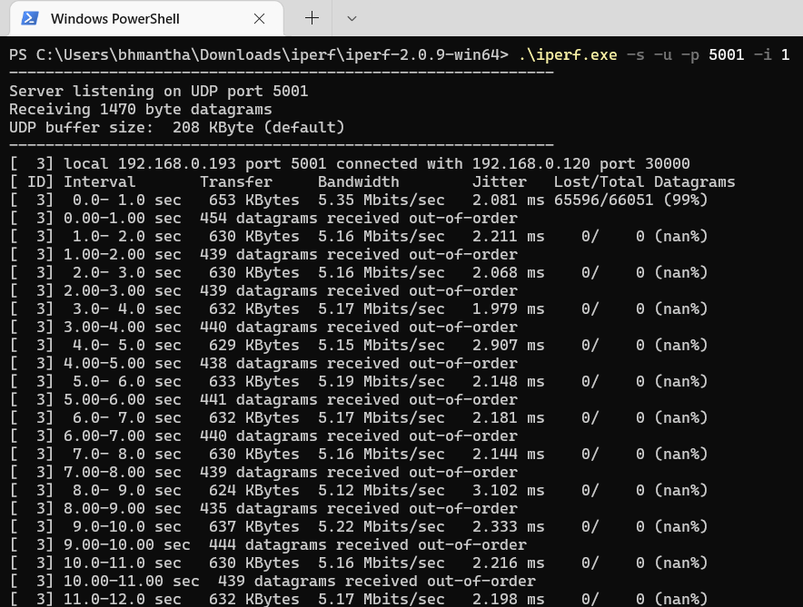

#### UDP Rx Throughput
To measure UDP Rx throughput, configure the SiWx91x as a UDP server and start a UDP client on the remote PC.
The Iperf command to start the UDP client is: 
	
> `C:\> iperf.exe -c <Module_IP> -u -p <Module_Port> -i 1 -b <Bandwidth> -t <time interval in seconds>`
>
> For example ...
>
> `C:\> iperf.exe -c 192.168.0.100 -u -p 5001 -i 1 -b 50M -t 30`  

**Note**: Increase the value of -t parameter, if it appears as if the application is hanging at data transmission stage, it is usually because application is waiting to receive more data. 


#### TCP Tx Throuhgput
To measure TCP Tx throughput, configure the SiWx91x as a TCP client and start a TCP server on the remote PC.
The Iperf command to start the TCP server is: 
		
> `C:\> iperf.exe -s -p <SERVER_PORT> -i 1`
>
> For example ...
>
> `C:\> iperf.exe -s -p 5001 -i 1`


#### TCP Rx Throughput
To measure TCP Rx throughput, configure the SiWx91x as TCP server and start a TCP client on the remote PC.
The Iperf command to start the TCP client is: 

> `C:\> iperf.exe -c <Module_IP> -p <module_PORT> -i 1 -t <time interval in sec>`
>
> For example ...
>
> `C:\> iperf.exe -c 192.168.0.100 -p 5001 -i 1 -t 30`  


#### SSL Tx Throughput
To measure SSL Tx throughput, configure the SiWx91x as a SSL client and start a SSL server on the remote PC as described in the following bullets:
- Copy the `SSL_Server_throughput_d.py` script from the release `/resources/scripts/` directory to the `/resources/certificates/` directory
- Open a command prompt and cd to the folder `/resources/certificates/`, then run the following command:
  - `C:\> python SSL_Server_throughput_d.py`

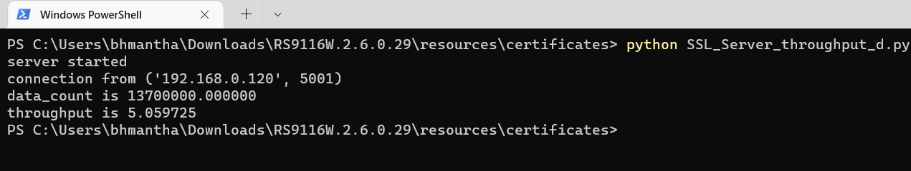
#### SSL Rx Throughput
To measure SSL RX throughput, configure the SiWx91x as a SSL client and open a SSL server on the remote PC as described in the following bullets:
- Copy the `SSL_tx_throughput.py` script from the release `/resources/scripts/` directory to the `/resources/certificates/`
- Open a command prompt and cd to the folder `/resources/certificates/`, then run the following command:
  - `C:\> python SSL_tx_throughput.py`


The SiWx91x, which is configured as a UDP/TCP/SSL server/client, connects to the iperf server/client and sends/receives data for configured intervals. While module is transmitting/receiving the data, application prints the throughput numbers in serial console.

## 8 Selecting Bare Metal
The application has been designed to work with FreeRTOS and Bare Metal configurations. By default, the application project files (Simplicity studio) are configured with FreeRTOS enabled. The following steps demonstrate how to configure Simplicity Studio to test the application in a Bare Metal environment.

### 8.1 Bare Metal with Simplicity Studio
> - Open the project in Simplicity Studio
> - Right click on the project and choose 'Properties'
> - Go to 'C/C++ Build' | 'Settings' | 'GNU ARM C Compiler' | 'Preprocessor' and remove macro 'RSI_WITH_OS=1'
> - Select 'Apply' and 'OK' to save the settings

 

